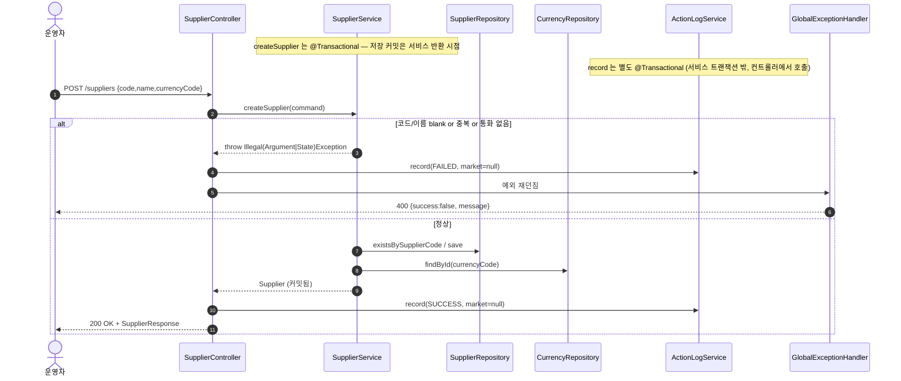
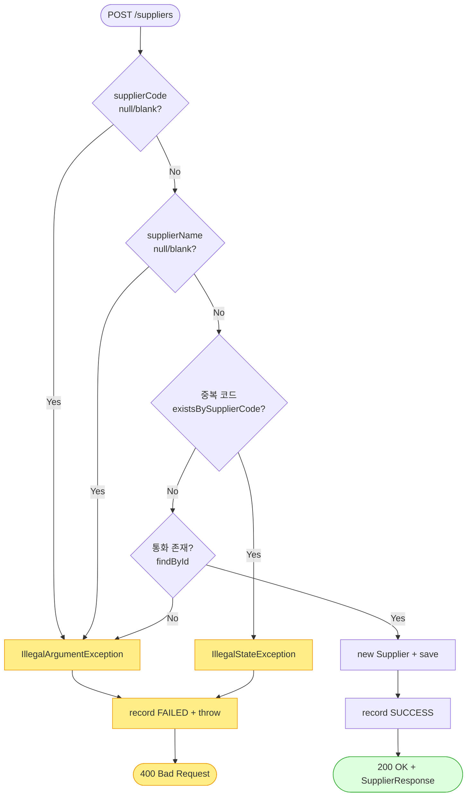

# POST /suppliers — 공급사 신규 등록

## 1. 개요

이 기능은 "새 공급사(물건을 대주는 업체)를 시스템에 등록하는" 기능입니다. 등록하기 전에 코드·이름이 제대로 들어왔는지, 같은 코드가 이미 있는 건 아닌지, 지정한 통화(화폐)가 실제로 등록돼 있는지를 확인합니다. 확인을 통과하면 공급사를 저장하고, 성공했든 실패했든 그 사실을 활동로그(SUPPLIER_CREATE)에 남깁니다.

| 항목 | 내용 |
|------|------|
| **Method / URL** | `POST /api/v1/suppliers` (요청 본문 `SupplierRequest`) |
| **목적** | 코드·이름을 검사하고, 중복은 거부하고, 통화가 존재하는지 확인한 뒤 새 `Supplier` 를 저장합니다. 그리고 활동로그(SUPPLIER_CREATE)에 성공/실패를 기록합니다. |
| **핵심 상태전이** | (새로 만들기) → `Supplier(status=ACTIVE)` — 새로 만들어진 공급사는 기본으로 "사용 중" 상태가 됩니다. |
| **부수효과** | 공급사 1건 저장(`@Transactional`) + 활동로그 1건 기록(특정 마켓과 무관한 작업이라 marketType=null). |
| **응답** | 성공 시 `200 OK` + `SupplierResponse`. 검증 실패나 중복이면 `400`(공통 오류 처리기가 변환). |

## 2. 호출 체인

아래는 요청이 들어와서 응답이 나가기까지 코드가 거치는 순서입니다.

```
SupplierController.createSupplier(SupplierRequest)         api/.../controller/SupplierController.java:41-56
  ├─ SupplierRequest(supplierCode, supplierName, currencyCode)  api/.../controller/SupplierController.java:80  (@RequestBody, @Valid 없음)
  ├─ (try) SupplierService.createSupplier(CreateSupplierCommand)
  │        core/.../application/supplier/SupplierService.java:31-48   @Transactional (:31)
  │      ├─ supplierCode null/blank → IllegalArgumentException      :34-36
  │      ├─ supplierName null/blank → IllegalArgumentException      :37-39
  │      ├─ existsBySupplierCode → true → IllegalStateException     :41-43 (SupplierRepository.java:13)
  │      ├─ currencyRepository.findById(currencyCode) → empty → IllegalArgumentException  :44-45 (CurrencyRepository extends JpaRepository)
  │      └─ new Supplier(code,name,currency) → supplierRepository.save()  :46-47 (Supplier.java:30-34)
  ├─ ActionLogService.record(SUPPLIER_CREATE, null, SUCCESS, ...)  :48-49  (ActionLogService.java:27-41  @Transactional)
  ├─ SupplierResponse.from(supplier)                       :50 (SupplierResponse.java:19-27)
  └─ (catch Exception) record(SUPPLIER_CREATE, null, FAILED, ...) → throw  :51-55
       └─ GlobalExceptionHandler: IllegalArgument/IllegalState → 400  (GlobalExceptionHandler.java:36-50)
```

→ 쉽게 말하면: ① 화면(컨트롤러)이 코드·이름·통화코드가 담긴 요청을 받습니다. ② 서비스가 순서대로 검사합니다 — 코드가 비었나? 이름이 비었나? 같은 코드가 이미 있나? 통화가 존재하나? 하나라도 걸리면 오류를 냅니다. ③ 다 통과하면 공급사를 새로 만들어 저장합니다. ④ 저장이 잘 되면 활동로그에 "성공"을 남기고 결과를 돌려주고, ⑤ 도중에 오류가 나면 활동로그에 "실패"를 남긴 뒤 오류를 다시 던져 화면에 400(잘못된 요청)으로 보여줍니다.

**요청 본문 (`SupplierRequest`, `SupplierController.java:80`)** — 등록할 때 넣어야 하는 값입니다.

| 필드 | 타입 | 필수 | 검증 위치 |
|------|------|------|----------|
| `supplierCode` | String | 필수 | 서비스 :34-36 (비어있으면 거부) + :41-43 (이미 있으면 거부) |
| `supplierName` | String | 필수 | 서비스 :37-39 (비어있으면 거부) |
| `currencyCode` | String | 필수(존재해야 함) | 서비스 :44-45 (그 통화가 등록돼 있지 않으면 거부) |

## 3. 유스케이스 다이어그램

👉 이 그림은 운영자가 공급사를 등록할 때 시스템이 함께 하는 일(코드·이름 검증 및 중복 거부, 통화 존재 확인, 활동로그 기록)을 한눈에 보여줍니다.


## 4. 시퀀스 다이어그램

👉 이 그림은 등록 요청이 성공하는 경우와 실패(검증·중복·통화없음)하는 경우에 각 부품이 시간 순서대로 무엇을 주고받는지를 보여줍니다.



## 5. 순서도 (플로우차트)

👉 이 그림은 등록 처리의 검사 순서(코드 비었나 → 이름 비었나 → 코드 중복인가 → 통화 있나 → 저장)와 각 단계에서 어떻게 성공/실패로 갈라지는지를 보여줍니다.



## 6. 상태 전이표

들어온 상황에 따라 등록이 되는지, 되면 무슨 부수효과가 생기는지 정리한 표입니다.

| 진입 상태 | 조건 | 허용? | 결과 상태 | 부수효과 |
|-----------|------|:-----:|-----------|----------|
| (새로 만들기) | 코드·이름이 유효 + 중복 아님 + 통화 있음 | ✅ | `Supplier(ACTIVE)` 생성 | 저장 + 활동로그 성공 기록 |
| (새로 만들기) | 코드·이름이 비어있음 | ❌ | 만들지 않음 | 활동로그 실패 기록, 400 |
| (새로 만들기) | 코드가 이미 있음(중복) | ❌ | 만들지 않음 | 활동로그 실패 기록, 400 |
| (새로 만들기) | 통화가 없음 | ❌ | 만들지 않음 | 활동로그 실패 기록, 400 |

## 7. 🔎 발견사항

### SUP-2 · 🟠 GAP — 요청 본문 검증 장치가 없어 본문이 아예 없으면 오류 종류가 뒤바뀜(NPE 위험)
- **근거:** `SupplierController.java:42-43` 은 `@RequestBody SupplierRequest request` 만 받고 `@Valid`(값 검증 지시)가 붙어 있지 않습니다. 빈 JSON `{}` 로 보내면 각 필드가 전부 null 로 채워져 서비스의 "비어있음" 검사가 걸러내니 괜찮습니다. 하지만 **본문 자체가 아예 없는** 요청이면 `request` 가 통째로 null 이 되어, 그 값을 꺼내는 `request.supplierCode()`(:47) 에서 NPE(널값 접근 오류)가 나 500(서버 오류)이 됩니다.
- **영향:** 본문을 빠뜨린 요청이 "잘못된 요청(400)"이 아니라 "서버 오류(500)"로 응답됩니다. 게다가 NPE가 나면 오류를 처리하는 catch 블록 안에서도 다시 `request.supplierCode()`(:53) 를 건드려 또 NPE가 나므로, 원래 문제(원 예외)가 가려집니다.
- **제안:** `@RequestBody(required = true)` 로 "본문은 반드시 있어야 함"을 명시하거나, 컨트롤러 맨 앞에서 본문이 null 인지 한 번 확인합니다. 필드별 검사는 서비스가 이미 하므로, 본문이 있는지만 보장하면 충분합니다.

### SUP-3 · 🟡 SMELL — 성공/실패 활동로그를 감싸는 try/catch 뭉치가 통화 등록(createCurrency)과 똑같이 반복됨
- **근거:** `SupplierController.java:45-55`(공급사 등록)와 `:67-77`(통화 등록)이 "시도 → 서비스 호출 → 성공이면 record(SUCCESS) → 반환 / 실패면 record(FAILED) → 다시 던짐" 이라는 똑같은 모양을, 상수 이름만 바꿔 두 번 반복하고 있습니다.
- **영향:** 지금 동작에는 문제가 없습니다. 다만 활동로그 기록 방식(마켓을 null 로 둔다든지, 성공/실패 메시지 형식 등)을 바꾸려면 두 곳을 똑같이 고쳐야 해서 한쪽만 고치는 실수가 나기 쉽습니다.
- **제안:** 이 "활동로그로 감싸기" 부분을 공통 도우미(또는 AOP·서비스 계층)로 빼내어 컨트롤러의 중복을 없앱니다.

### SUP-4 · 🔵 NOTE — 활동로그가 공급사 저장과는 별도의 저장 묶음(트랜잭션)에서 기록됨
- **근거:** 성공 로그 `record(SUCCESS,...)`(`SupplierController.java:48`)는 `createSupplier` 가 이미 저장을 확정(커밋)한 뒤 컨트롤러에서 불립니다. 그리고 `ActionLogService.record`(`ActionLogService.java:27`)는 자체적으로 별도의 `@Transactional` 을 가집니다. 즉 공급사 저장과 활동로그 기록은 서로 다른 저장 묶음입니다.
- **영향:** 공급사는 이미 저장됐는데 활동로그 기록만 실패하면 로그 한 줄이 빠질 수 있습니다(로그 기록 함수가 내부에서 오류를 조용히 삼킴, `ActionLogService.java:37-40`). 이는 "본 작업(저장)을 로그 실패로부터 보호"하려는 의도된 설계라 데이터가 어긋날 위험은 낮습니다.
- **제안:** 지금대로 두는 게 타당합니다. 다만 감사 추적(누가 언제 무엇을 했는지)을 아주 엄격히 남겨야 한다면, 저장과 로그를 같은 저장 묶음(서비스 안에서 기록)으로 합치는 방안을 검토합니다.

## 8. 테스트 커버리지 메모

- **서비스 계층:** `SupplierServiceTest` 가 통화를 찾아 연결한 뒤 저장하는 경우(`createSupplier_resolvesCurrency_andSaves` :98-109), 통화가 없어 거부하는 경우(:113-120), 코드·이름이 비어 거부하는 경우(:124-142), 코드가 중복이라 거부하는 경우(:146-153)를 모두 확인합니다.
- **비어있는 케이스:** ① 컨트롤러에서 활동로그를 성공/실패로 잘 남기는지(record 를 부르는지, marketType 이 null 인지)를 확인하는 테스트가 없습니다. ② 본문이 아예 없는 요청(SUP-2) 경로를 확인하는 테스트가 없습니다. ③ 웹 계층에서 오류가 400 으로 잘 매핑되는지를 처음부터 끝까지 확인하는 테스트가 없습니다.

---
*(쉬운 설명판 · 2026-07-17 재작성)*
*생성: 2026-07-17 · 근거: 현재 워킹트리*
