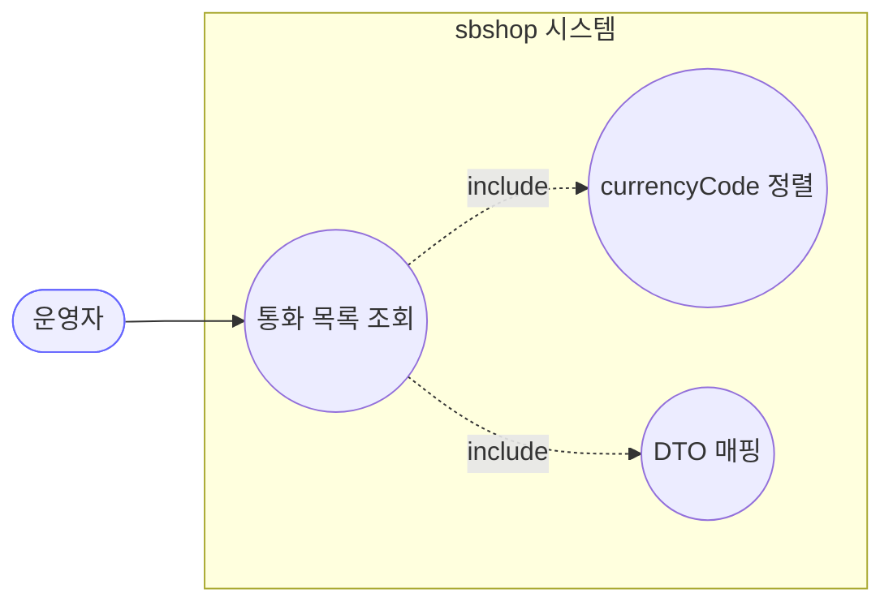
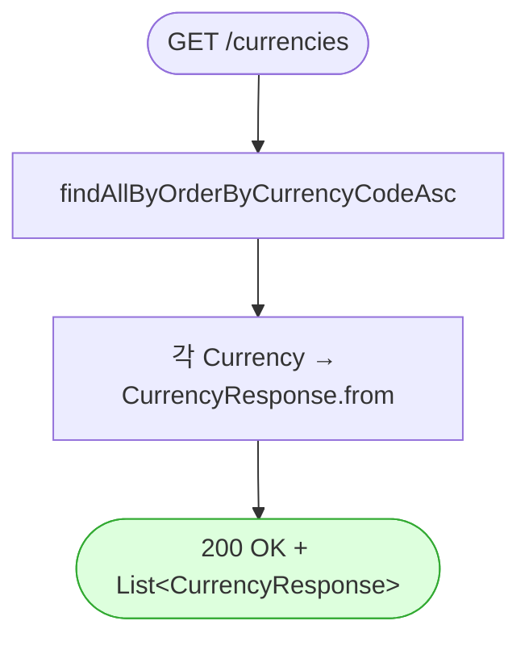

# GET /currencies — 통화(환율) 목록 조회

## 1. 개요

| 항목 | 내용 |
|------|------|
| **Method / URL** | `GET /api/v1/currencies` |
| **목적** | 전체 통화를 `currencyCode` 오름차순으로 조회해 응답 DTO(`currencyCode`·`exchangeRate`)로 반환한다. |
| **핵심 상태전이** | 없음(조회 전용) |
| **부수효과** | 없음. 클래스 레벨 `@Transactional(readOnly = true)` 하위 읽기 전용 조회. |
| **응답** | `200 OK` + `List<CurrencyResponse>` |

## 2. 호출 체인

```
SupplierController.getCurrencies()                         api/.../controller/SupplierController.java:58-61
  └─ SupplierService.getCurrencies()                       core/.../application/supplier/SupplierService.java:50-53   (클래스 @Transactional(readOnly=true) :19)
       └─ CurrencyRepository.findAllByOrderByCurrencyCodeAsc()
                                                            core/.../domain/supplier/repository/CurrencyRepository.java:10
  └─ stream().map(CurrencyResponse::from).toList()          api/.../controller/SupplierController.java:60
       └─ CurrencyResponse.from(Currency)                  api/.../dto/supplier/CurrencyResponse.java:14-16
```

**응답 DTO (`CurrencyResponse`, `CurrencyResponse.java:10-12`)**

| 필드 | 타입 | 출처 | 비고 |
|------|------|------|------|
| `currencyCode` | String | `Currency.getCurrencyCode()` | PK, length 3 |
| `exchangeRate` | BigDecimal | `Currency.getExchangeRate()` | nullable=false |

> `Currency`(`Currency.java:16-28`)는 소프트삭제 필드·status 가 없는 순수 참조 엔티티(`@Id currencyCode`). 소프트삭제 필터가 없어 전량 반환.

## 3. 유스케이스 다이어그램



## 4. 시퀀스 다이어그램

```mermaid
sequenceDiagram
    autonumber
    actor U as 운영자
    participant C as SupplierController
    participant S as SupplierService
    participant R as CurrencyRepository
    participant M as "CurrencyResponse.from"
    Note over S: 클래스 레벨 @Transactional(readOnly=true) — 읽기 전용 경계

    U->>C: GET /api/v1/currencies
    C->>S: getCurrencies()
    S->>R: findAllByOrderByCurrencyCodeAsc()
    R-->>S: List&lt;Currency&gt; (code 오름차순)
    S-->>C: List&lt;Currency&gt;
    loop 각 Currency
        C->>M: from(currency)
        M-->>C: CurrencyResponse
    end
    C-->>U: 200 OK + List&lt;CurrencyResponse&gt;
```

## 5. 순서도 (플로우차트)



> 예외 경로: 상태 가드·검증 없음. 저장소 조회 예외는 `GlobalExceptionHandler.handleGeneral`(`GlobalExceptionHandler.java:52-63`)에서 500.

## 6. 상태 전이표

| 진입 상태 | 허용? | 결과 상태 | 부수효과 | 비고 |
|-----------|:-----:|-----------|----------|------|
| — | — | — | — | **상태 전이 없음(조회 전용).** `Currency` 는 status/소프트삭제 없는 참조 엔티티 → 전량 반환 |

## 7. 🔎 발견사항

발견사항 없음.

> 조회 전용·정렬 위임·DTO 매핑이 명확하며, 억지 결함을 만들지 않는다. (`Currency` 에 소프트삭제 개념이 없어 목록 필터 부재는 결함이 아님.)

## 8. 테스트 커버리지 메모

- **서비스 계층:** `SupplierServiceTest.getCurrencies_delegatesToCurrencyCodeOrderedQuery`(`SupplierServiceTest.java:186-196`)가 `findAllByOrderByCurrencyCodeAsc` 위임(`findAll` 미호출)과 반환 목록을 검증.
- **DTO 계약:** `SupplierResponseContractTest.currencyResponsePreservesContract`(:48-55)·`currencyResponseDoesNotExposeDomainType`(:59-65)가 `currencyCode`·`exchangeRate` JSON 계약과 도메인 타입 미노출을 검증.
- **비어있는 케이스:** 컨트롤러 웹 슬라이스 테스트 없음(계약·서비스 테스트로 간접 커버).

---
*생성: 2026-07-17 · 근거: 현재 워킹트리*
