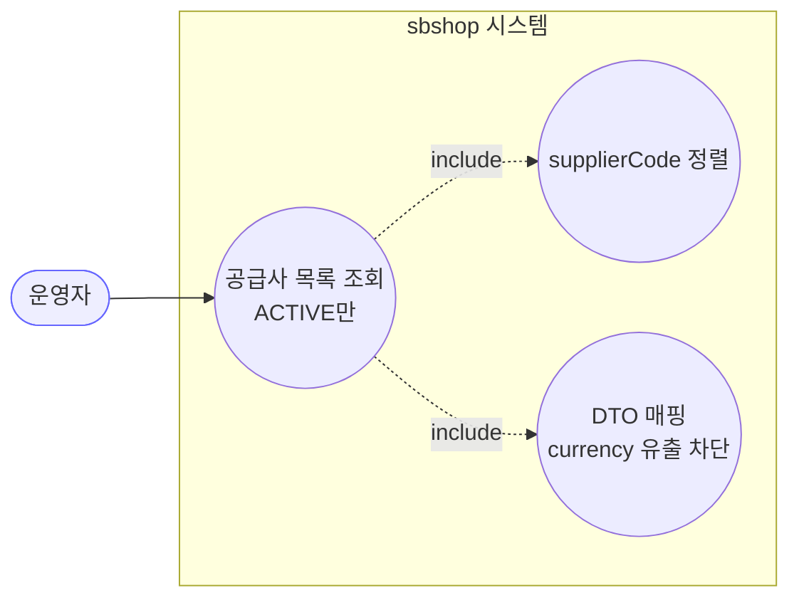
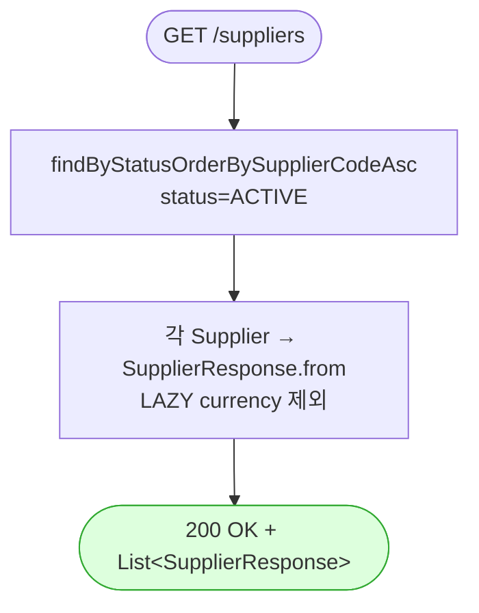

# GET /suppliers — 공급사 목록 조회

## 1. 개요

| 항목 | 내용 |
|------|------|
| **Method / URL** | `GET /api/v1/suppliers` |
| **목적** | 소프트삭제(ARCHIVED/DELETED)를 제외한 `ACTIVE` 공급사를 `supplierCode` 오름차순으로 조회해 응답 DTO로 반환한다. |
| **핵심 상태전이** | 없음(조회 전용) |
| **부수효과** | 없음. 클래스 레벨 `@Transactional(readOnly = true)` 하위의 읽기 전용 조회. |
| **응답** | `200 OK` + `List<SupplierResponse>`(스칼라 필드만, LAZY currency 미노출) |

## 2. 호출 체인

```
SupplierController.getSuppliers()                          api/.../controller/SupplierController.java:36-39
  └─ SupplierService.getSuppliers()                        core/.../application/supplier/SupplierService.java:25-29   (클래스 @Transactional(readOnly=true) :19)
       └─ SupplierRepository.findByStatusOrderBySupplierCodeAsc(ACTIVE)
                                                            core/.../domain/supplier/repository/SupplierRepository.java:17
  └─ stream().map(SupplierResponse::from).toList()         api/.../controller/SupplierController.java:38
       └─ SupplierResponse.from(Supplier)                  api/.../dto/supplier/SupplierResponse.java:19-27
```

**응답 DTO (`SupplierResponse`, `SupplierResponse.java:11-17`)**

| 필드 | 타입 | 출처 | 비고 |
|------|------|------|------|
| `id` | Long | `Supplier.getId()` | BaseEntity PK |
| `supplierCode` | String | `Supplier.getSupplierCode()` | unique, length 10 |
| `supplierName` | String | `Supplier.getSupplierName()` | length 100 |
| `status` | RecordStatus | `Supplier.getStatus()` | ACTIVE만 반환됨(조회 조건상 항상 ACTIVE) |
| `createdAt` | LocalDateTime | BaseEntity | |
| `updatedAt` | LocalDateTime | BaseEntity | |

> LAZY `@ManyToOne currency`(`Supplier.java:26-28`)는 DTO에서 의도적으로 제외 — 지연로딩 유출 차단(`SupplierResponse.java:8-9`).

## 3. 유스케이스 다이어그램



## 4. 시퀀스 다이어그램

```mermaid
sequenceDiagram
    autonumber
    actor U as 운영자
    participant C as SupplierController
    participant S as SupplierService
    participant R as SupplierRepository
    participant M as "SupplierResponse.from"
    Note over S: 클래스 레벨 @Transactional(readOnly=true) — 읽기 전용 경계

    U->>C: GET /api/v1/suppliers
    C->>S: getSuppliers()
    S->>R: findByStatusOrderBySupplierCodeAsc(ACTIVE)
    R-->>S: List&lt;Supplier&gt; (ACTIVE, code 오름차순)
    S-->>C: List&lt;Supplier&gt;
    loop 각 Supplier
        C->>M: from(supplier) (currency 제외)
        M-->>C: SupplierResponse
    end
    C-->>U: 200 OK + List&lt;SupplierResponse&gt;
```

## 5. 순서도 (플로우차트)



> 예외 경로: 별도 상태 가드·검증 없음. 저장소 조회 예외는 `GlobalExceptionHandler.handleGeneral`(`GlobalExceptionHandler.java:52-63`)에서 500으로 처리.

## 6. 상태 전이표

| 진입 상태 | 허용? | 결과 상태 | 부수효과 | 비고 |
|-----------|:-----:|-----------|----------|------|
| — | — | — | — | **상태 전이 없음(조회 전용).** ARCHIVED/DELETED는 쿼리에서 제외되어 응답에 미노출 |

## 7. 🔎 발견사항

### SUP-1 · 🔵 NOTE — 페이지네이션·필터 없는 전체 ACTIVE 반환
- **근거:** `SupplierService.java:28` `findByStatusOrderBySupplierCodeAsc(ACTIVE)` 는 ACTIVE 전량을 무제한 반환한다. limit/offset·검색어 파라미터가 없다.
- **영향:** 공급사 수가 소규모인 현 도메인에서는 문제없으나, 다른 목록 API(action-log 등)가 페이지네이션을 갖춘 것과 비대칭. 대량 증가 시 응답 비대.
- **제안:** 현행 유지가 합리적. 규모 확대 시 페이지네이션 도입 여지만 문서화.

## 8. 테스트 커버리지 메모

- **서비스 계층:** `SupplierServiceTest.getSuppliers_returnsOnlyActive`(`SupplierServiceTest.java:157-168`)·`getSuppliers_delegatesToSupplierCodeOrderedQuery`(:172-182) 가 ACTIVE 한정 조회와 `findByStatusOrderBySupplierCodeAsc` 위임(`findAll` 미호출)을 검증한다.
- **DTO 계약:** `SupplierResponseContractTest.supplierResponseDoesNotExposeDomainTypes`(:25-32)·`supplierResponseDoesNotLeakLazyCurrency`(:36-44) 가 도메인 타입 미노출·LAZY currency 미유출을 검증한다.
- **비어있는 케이스:** 컨트롤러 슬라이스(웹 계층) 테스트는 검색되지 않음 — 실제 JSON 응답의 필드 순서/정렬 end-to-end 검증은 없음(계약 테스트로 간접 커버).

---
*생성: 2026-07-17 · 근거: 현재 워킹트리*
