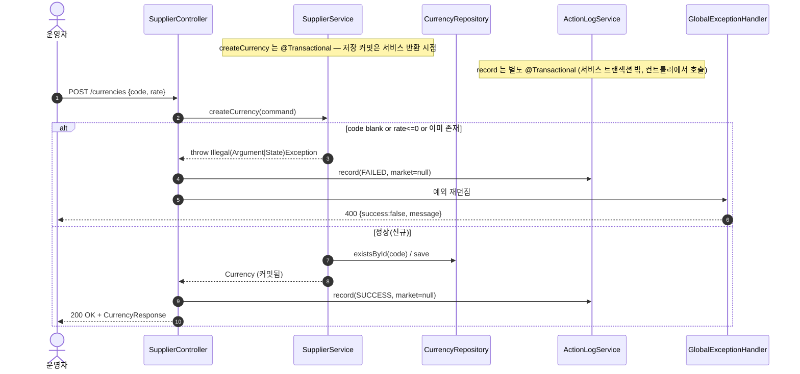

# POST /currencies — 통화(환율) 신규 등록

## 1. 개요

| 항목 | 내용 |
|------|------|
| **Method / URL** | `POST /api/v1/currencies` (바디 `CurrencyRequest`) |
| **목적** | 통화 코드·환율 검증 후, **미존재 시에만** 신규 `Currency` 를 저장한다(생성 전용, 기존 환율 불변). 활동로그(CURRENCY_CREATE)를 성공/실패로 기록한다. |
| **핵심 상태전이** | (신규) → `Currency` 생성. **기존 존재 시 갱신하지 않고 거부**(엔드포인트명은 upsert 지만 실제는 create-only) |
| **부수효과** | 통화 1건 저장(`@Transactional`) + 활동로그 1건(marketType=null) |
| **응답** | `200 OK` + `CurrencyResponse` / 검증·중복 실패 시 `400`(GlobalExceptionHandler) |

## 2. 호출 체인

```
SupplierController.createCurrency(CurrencyRequest)         api/.../controller/SupplierController.java:63-78
  ├─ CurrencyRequest(currencyCode, exchangeRate)           api/.../controller/SupplierController.java:83  (@RequestBody, @Valid 없음)
  ├─ (try) SupplierService.createCurrency(CreateCurrencyCommand)
  │        core/.../application/supplier/SupplierService.java:55-71   @Transactional (:55)
  │      ├─ currencyCode null/blank → IllegalArgumentException      :58-60
  │      ├─ exchangeRate null or signum<=0 → IllegalArgumentException  :62-64
  │      ├─ existsById(currencyCode) → true → IllegalStateException  :66-68 (CurrencyRepository extends JpaRepository)
  │      └─ new Currency(code,rate) → currencyRepository.save()      :69-70 (Currency.java:25-28)
  ├─ ActionLogService.record(CURRENCY_CREATE, null, SUCCESS, ...)  :70-71  (ActionLogService.java:27-41  @Transactional)
  ├─ CurrencyResponse.from(currency)                       :72 (CurrencyResponse.java:14-16)
  └─ (catch Exception) record(CURRENCY_CREATE, null, FAILED, ...) → throw  :73-77
       └─ GlobalExceptionHandler: IllegalArgument/IllegalState → 400  (GlobalExceptionHandler.java:36-50)
```

**요청 바디 (`CurrencyRequest`, `SupplierController.java:83`)**

| 필드 | 타입 | 필수 | 검증 위치 |
|------|------|------|----------|
| `currencyCode` | String | 필수 | 서비스 :58-60 (null/blank 거부) + :66-68 (중복 거부) |
| `exchangeRate` | BigDecimal | 필수(양수) | 서비스 :62-64 (null·0·음수 거부) |

## 3. 유스케이스 다이어그램


## 4. 시퀀스 다이어그램



## 5. 순서도 (플로우차트)


## 6. 상태 전이표

| 진입 상태 | 조건 | 허용? | 결과 상태 | 부수효과 |
|-----------|------|:-----:|-----------|----------|
| (신규) | code 유효 + rate 양수 + 미존재 | ✅ | `Currency` 생성 | save + 활동로그 SUCCESS |
| (기존 존재) | 동일 code 재요청 | ❌ | **미변경(환율 불변)** | 활동로그 FAILED, 400 |
| (신규) | code blank | ❌ | 미생성 | 활동로그 FAILED, 400 |
| (신규) | rate null/0/음수 | ❌ | 미생성 | 활동로그 FAILED, 400 |

## 7. 🔎 발견사항

### SUP-5 · 🟠 GAP — 엔드포인트/파일명은 upsert 지만 실제는 create-only, 환율 갱신 경로 부재
- **근거:** `SupplierService.java:65-68` 은 `existsById` 이면 `IllegalStateException("이미 존재하는 통화입니다")` 로 거부한다. 주석(:65)도 "생성 전용 — 이미 존재하면 거부(기존 환율 불변). 환율 변경은 별도 경로" 라고 명시. 그러나 코드베이스에 환율 수정(PUT/PATCH) 엔드포인트가 존재하지 않는다(`SupplierController` 에 update 핸들러 없음).
- **영향:** 환율이 변동해도 API 로 갱신할 방법이 없다. 운영 시 통화 환율 조정은 DB 직접 수정(수동 DDL/DML)에 의존. 정산·매입원가 계산이 환율에 의존하므로 환율 고착은 재무 오차로 이어질 수 있다.
- **제안:** 환율 갱신 전용 엔드포인트(예: `PATCH /currencies/{code}`)를 추가하거나, 본 POST 를 명시적 upsert(존재 시 rate 갱신)로 전환하는 정책 결정. 최소한 "환율 변경은 수동 DB" 라는 운영 규약을 문서화.

### SUP-6 · 🟠 GAP — 요청 바디 `@Valid`/null 바디 방어 부재로 NPE 위험
- **근거:** `SupplierController.java:64-65` 은 `@RequestBody CurrencyRequest request` 만 있고 `@Valid`·`required` 명시가 없다. 바디 자체가 없는 요청은 `request` 가 null → `request.currencyCode()`(:69) NPE → 500. 이때 catch 블록의 `request.currencyCode()`(:75)도 재-NPE 로 원 예외를 가린다.
- **영향:** 바디 누락 요청이 400 대신 500. createSupplier(SUP-2)와 동일한 패턴의 결함.
- **제안:** `@RequestBody(required = true)` 또는 진입부 null 가드. createSupplier 와 함께 일괄 처리.

### SUP-7 · 🟡 SMELL — 성공/실패 활동로그 try/catch 가 createSupplier 와 구조적으로 중복
- **근거:** `SupplierController.java:67-77`(createCurrency)와 `:45-55`(createSupplier)이 동일한 try/record(SUCCESS)/catch/record(FAILED)/throw 골격을 상수만 바꿔 반복.
- **영향:** 활동로그 규약 변경 시 두 곳 동기 수정 필요.
- **제안:** 공통 헬퍼/AOP 로 추출(SUP-3 과 동일 사안).

## 8. 테스트 커버리지 메모

- **서비스 계층:** `SupplierServiceTest` 가 중복 통화 거부·save 미호출(`existingCurrency_rejected_notOverwritten` :45-53), 신규 생성(:57-66), rate null 거부(:70-74), rate<=0 거부(:78-84), code blank 거부(:88-94)를 커버 — 생성 전용 정책이 잘 고정됨.
- **비어있는 케이스:** ① 컨트롤러 활동로그 SUCCESS/FAILED 기록 검증 없음, ② null 바디(SUP-6) 경로 테스트 없음, ③ 환율 갱신 경로(SUP-5) — 미구현이므로 테스트도 부재, ④ 웹 슬라이스 400 매핑 end-to-end 검증 없음.

---
*생성: 2026-07-17 · 근거: 현재 워킹트리*
