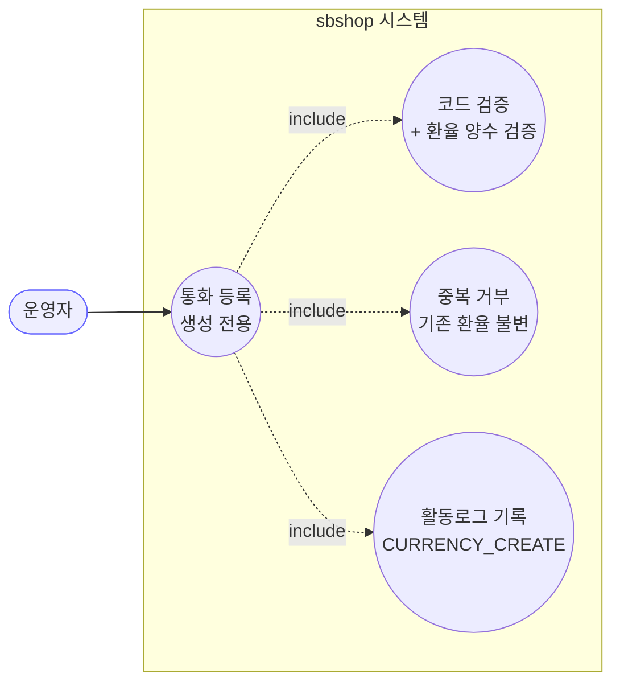
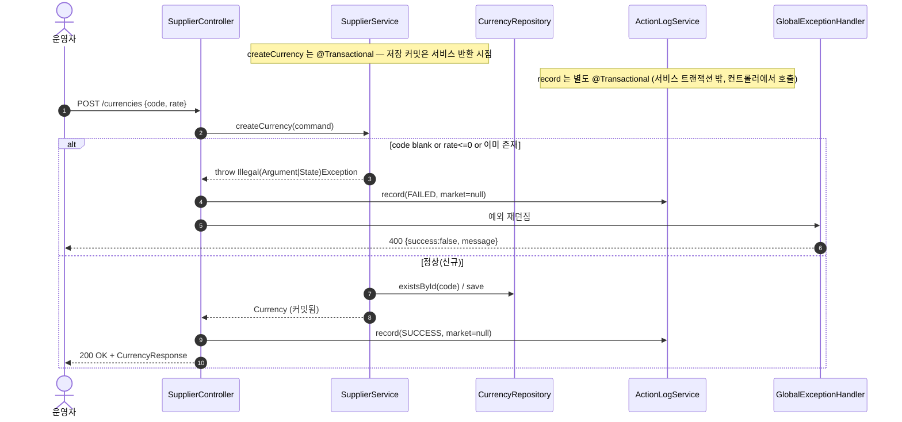
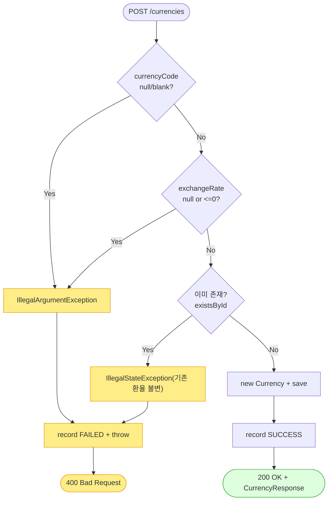

# POST /currencies — 통화(환율) 신규 등록

## 1. 개요

이 기능은 "새 통화(화폐)와 그 환율을 시스템에 등록하는" 기능입니다. 통화 코드와 환율 값이 제대로 들어왔는지 확인하고, **아직 없는 통화일 때만** 새로 저장합니다. 이미 있는 통화면 환율을 바꾸지 않고 거부합니다. (주소창의 이름은 "upsert"(있으면 갱신·없으면 생성)처럼 보이지만, 실제로는 "새로 만들기 전용"이라는 점이 핵심입니다.) 성공이든 실패든 활동로그(CURRENCY_CREATE)에 남깁니다.

| 항목 | 내용 |
|------|------|
| **Method / URL** | `POST /api/v1/currencies` (요청 본문 `CurrencyRequest`) |
| **목적** | 통화 코드와 환율을 검사한 뒤, **없을 때만** 새 `Currency` 를 저장합니다(만들기 전용이라 기존 환율은 건드리지 않음). 활동로그(CURRENCY_CREATE)에 성공/실패를 기록합니다. |
| **핵심 상태전이** | (없던 통화) → `Currency` 생성. **이미 있으면 갱신하지 않고 거부**합니다(이름은 upsert 지만 동작은 "만들기 전용"). |
| **부수효과** | 통화 1건 저장(`@Transactional`) + 활동로그 1건(특정 마켓과 무관하므로 marketType=null). |
| **응답** | 성공 시 `200 OK` + `CurrencyResponse`. 검증 실패나 중복이면 `400`(공통 오류 처리기가 변환). |

## 2. 호출 체인

아래는 요청이 들어와서 응답이 나가기까지 코드가 거치는 순서입니다.

```
SupplierController.createCurrency(CurrencyRequest)         api/.../controller/SupplierController.java:63-78
  ├─ CurrencyRequest(currencyCode, exchangeRate)           api/.../controller/SupplierController.java:83  (@RequestBody, @Valid 없음)
  ├─ (try) SupplierService.createCurrency(CreateCurrencyCommand)
  │        core/.../application/supplier/SupplierService.java:55-71   @Transactional (:55)
  │      ├─ currencyCode null/blank → IllegalArgumentException      :58-60
  │      ├─ exchangeRate null or signum<=0 → IllegalArgumentException  :62-64
  │      ├─ existsById(currencyCode) → true → IllegalStateException  :66-68 (CurrencyRepository extends JpaRepository)
  │      └─ new Currency(code,rate) → currencyRepository.save()      :69-70 (Currency.java:25-28)
  ├─ ActionLogService.record(CURRENCY_CREATE, null, SUCCESS, ...)  :70-71  (ActionLogService.java:27-41  @Transactional)
  ├─ CurrencyResponse.from(currency)                       :72 (CurrencyResponse.java:14-16)
  └─ (catch Exception) record(CURRENCY_CREATE, null, FAILED, ...) → throw  :73-77
       └─ GlobalExceptionHandler: IllegalArgument/IllegalState → 400  (GlobalExceptionHandler.java:36-50)
```

→ 쉽게 말하면: ① 화면(컨트롤러)이 통화 코드와 환율이 담긴 요청을 받습니다. ② 서비스가 순서대로 검사합니다 — 코드가 비었나? 환율이 비었거나 0 이하인가? 이미 있는 통화인가? 하나라도 걸리면 오류를 냅니다. ③ 다 통과하면(= 없던 통화면) 새로 만들어 저장합니다. ④ 저장이 잘 되면 활동로그에 "성공"을 남기고 결과를 돌려주고, ⑤ 도중에 오류가 나면 활동로그에 "실패"를 남긴 뒤 오류를 다시 던져 화면에 400(잘못된 요청)으로 보여줍니다.

**요청 본문 (`CurrencyRequest`, `SupplierController.java:83`)** — 등록할 때 넣어야 하는 값입니다.

| 필드 | 타입 | 필수 | 검증 위치 |
|------|------|------|----------|
| `currencyCode` | String | 필수 | 서비스 :58-60 (비어있으면 거부) + :66-68 (이미 있으면 거부) |
| `exchangeRate` | BigDecimal | 필수(양수) | 서비스 :62-64 (비어있거나 0·음수면 거부) |

## 3. 유스케이스 다이어그램

👉 이 그림은 운영자가 통화를 등록할 때 시스템이 함께 하는 일(코드·환율(양수) 검증, 중복 거부하며 기존 환율은 그대로 둠, 활동로그 기록)을 한눈에 보여줍니다.



## 4. 시퀀스 다이어그램

👉 이 그림은 등록 요청이 성공(없던 통화)하는 경우와 실패(코드 비었거나·환율 0 이하거나·이미 있음)하는 경우에 각 부품이 시간 순서대로 무엇을 주고받는지를 보여줍니다.



## 5. 순서도 (플로우차트)

👉 이 그림은 등록 처리의 검사 순서(코드 비었나 → 환율이 없거나 0 이하인가 → 이미 있는가 → 저장)와 각 단계에서 어떻게 성공/실패로 갈라지는지를 보여줍니다.



## 6. 상태 전이표

들어온 상황에 따라 등록이 되는지, 되면 무슨 부수효과가 생기는지 정리한 표입니다.

| 진입 상태 | 조건 | 허용? | 결과 상태 | 부수효과 |
|-----------|------|:-----:|-----------|----------|
| (없던 통화) | 코드 유효 + 환율 양수 + 아직 없음 | ✅ | `Currency` 생성 | 저장 + 활동로그 성공 기록 |
| (이미 있음) | 같은 코드로 다시 요청 | ❌ | **바뀌지 않음(환율 그대로)** | 활동로그 실패 기록, 400 |
| (없던 통화) | 코드가 비어있음 | ❌ | 만들지 않음 | 활동로그 실패 기록, 400 |
| (없던 통화) | 환율이 비었거나 0·음수 | ❌ | 만들지 않음 | 활동로그 실패 기록, 400 |

## 7. 🔎 발견사항

### SUP-5 · 🟠 GAP — 이름·파일명은 "upsert"인데 실제는 "만들기 전용"이라 환율을 고칠 방법이 없음
- **근거:** `SupplierService.java:65-68` 은 통화가 이미 있으면(`existsById`) `IllegalStateException("이미 존재하는 통화입니다")` 로 거부합니다. 주석(:65)에도 "생성 전용 — 이미 있으면 거부(기존 환율 그대로). 환율 변경은 별도 경로" 라고 적혀 있습니다. 그런데 정작 코드베이스에는 환율을 고치는 별도 엔드포인트(PUT/PATCH)가 없습니다(`SupplierController` 에 수정 핸들러가 없음).
- **영향:** 환율이 바뀌어도 API 로는 값을 갱신할 방법이 없습니다. 실제 운영에서는 환율을 바꾸려면 DB를 직접 손대야(수동 수정) 합니다. 정산·매입 원가 계산이 환율에 기대고 있어서, 환율이 옛날 값에 고정돼 있으면 재무 수치가 틀어질 수 있습니다.
- **제안:** 환율 갱신 전용 엔드포인트(예: `PATCH /currencies/{code}`)를 추가하거나, 이 POST 를 진짜 upsert(있으면 환율 갱신)로 바꿀지 정책으로 정합니다. 최소한 "환율 변경은 DB에서 직접 한다"는 운영 규칙을 문서로 남깁니다.

### SUP-6 · 🟠 GAP — 요청 본문 검증 장치가 없어 본문이 아예 없으면 오류 종류가 뒤바뀜(NPE 위험)
- **근거:** `SupplierController.java:64-65` 는 `@RequestBody CurrencyRequest request` 만 받고 `@Valid`(값 검증 지시)나 `required`(본문 필수 명시)가 없습니다. 본문 자체가 아예 없는 요청이면 `request` 가 null 이 되어, 값을 꺼내는 `request.currencyCode()`(:69) 에서 NPE(널값 접근 오류)가 나 500(서버 오류)이 됩니다. 이때 오류를 처리하는 catch 블록의 `request.currencyCode()`(:75) 도 다시 NPE 를 내어 원래 문제(원 예외)를 가립니다.
- **영향:** 본문을 빠뜨린 요청이 "잘못된 요청(400)"이 아니라 "서버 오류(500)"로 응답됩니다. 공급사 등록(SUP-2)과 완전히 같은 형태의 문제입니다.
- **제안:** `@RequestBody(required = true)` 를 붙이거나 컨트롤러 맨 앞에서 본문이 null 인지 확인합니다. 공급사 등록(SUP-2)과 함께 한꺼번에 처리하면 됩니다.

### SUP-7 · 🟡 SMELL — 성공/실패 활동로그를 감싸는 try/catch 뭉치가 공급사 등록(createSupplier)과 똑같이 반복됨
- **근거:** `SupplierController.java:67-77`(통화 등록)와 `:45-55`(공급사 등록)이 "시도 → record(SUCCESS) → catch → record(FAILED) → 다시 던짐" 이라는 똑같은 뼈대를, 상수 이름만 바꿔 반복하고 있습니다.
- **영향:** 활동로그 기록 방식을 바꾸려면 두 곳을 똑같이 고쳐야 합니다.
- **제안:** 공통 도우미나 AOP 로 빼내어 중복을 없앱니다(공급사 등록 SUP-3 과 같은 사안).

## 8. 테스트 커버리지 메모

- **서비스 계층:** `SupplierServiceTest` 가 이미 있는 통화는 거부하고 저장하지 않는 경우(`existingCurrency_rejected_notOverwritten` :45-53), 새로 만드는 경우(:57-66), 환율이 비어 거부하는 경우(:70-74), 환율이 0·음수라 거부하는 경우(:78-84), 코드가 비어 거부하는 경우(:88-94)를 확인합니다 — "만들기 전용" 정책이 잘 고정돼 있습니다.
- **비어있는 케이스:** ① 컨트롤러에서 활동로그를 성공/실패로 잘 남기는지를 확인하는 테스트가 없습니다. ② 본문이 아예 없는 요청(SUP-6) 경로를 확인하는 테스트가 없습니다. ③ 환율 갱신 경로(SUP-5)는 아직 구현이 없으니 테스트도 없습니다. ④ 웹 계층에서 오류가 400 으로 잘 매핑되는지를 처음부터 끝까지 확인하는 테스트가 없습니다.

---
*(쉬운 설명판 · 2026-07-17 재작성)*
*생성: 2026-07-17 · 근거: 현재 워킹트리*
