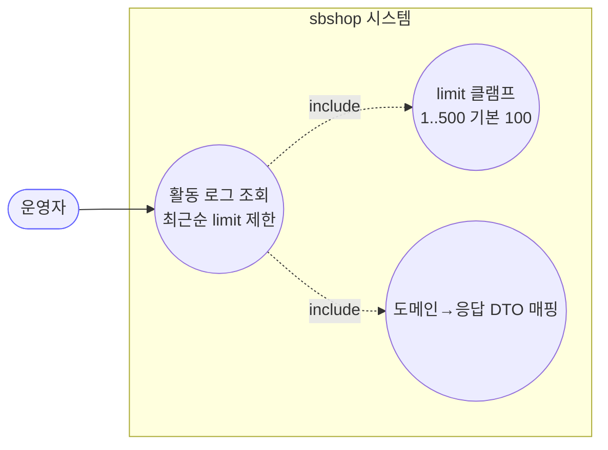
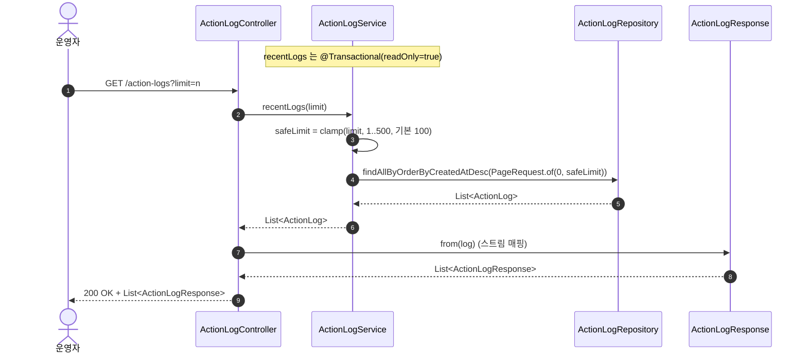
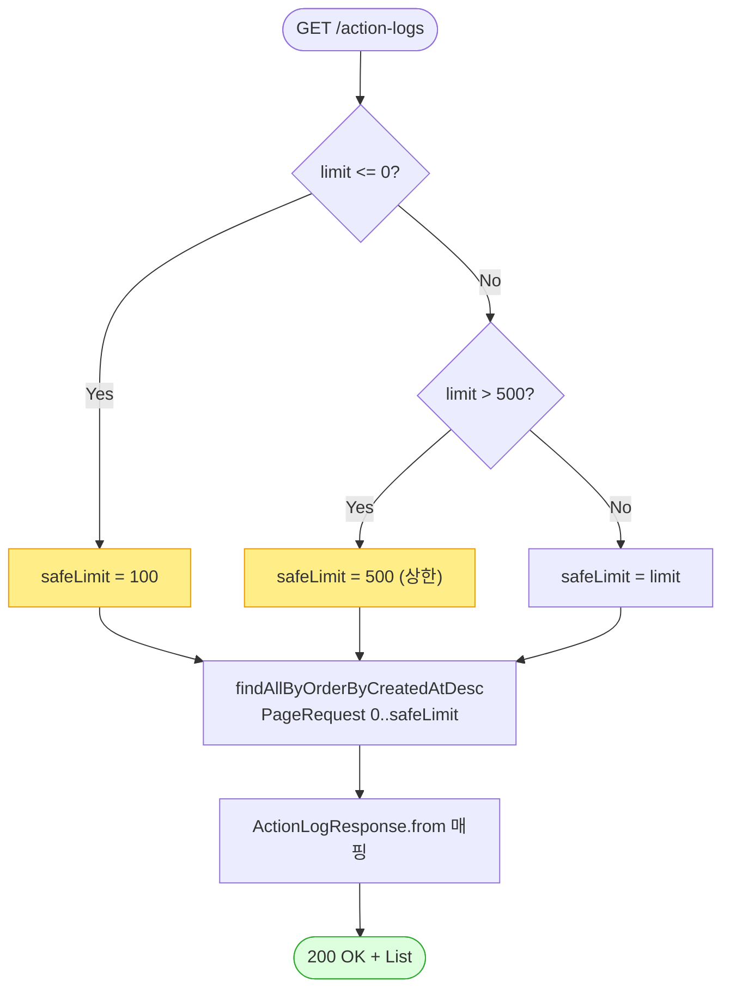

# GET /api/v1/action-logs — 사용자 액션 로그 조회

## 1. 개요

| 항목 | 내용 |
|------|------|
| **Method / URL** | `GET /api/v1/action-logs?limit={n}` |
| **목적** | 사용자·시스템 액션 로그(동기화·구매·송장 등)를 **최근순(createdAt DESC)** 으로 조회한다. 운영 화면의 활동 이력 패널용. (D-042) |
| **핵심 상태전이** | 없음 — 순수 조회(read-only). 부수효과 없음. |
| **부수효과** | 없음. `@Transactional(readOnly = true)`. |
| **응답** | `200 OK` + `List<ActionLogResponse>`(응답 DTO) |

## 2. 호출 체인

```
ActionLogController.getActionLogs()               api/.../controller/ActionLogController.java:26-33
  └─ ActionLogService.recentLogs(limit)           core/.../application/actionlog/ActionLogService.java:44-48
       ├─ safeLimit = clamp(limit, 1..500, 기본 100)   ActionLogService.java:46
       └─ actionLogRepository.findAllByOrderByCreatedAtDesc(PageRequest.of(0, safeLimit))
                                                   core/.../actionlog/repository/ActionLogRepository.java:14
  └─ ActionLogResponse.from(log)  (스트림 매핑)    api/.../dto/actionlog/ActionLogResponse.java:17-25
```

**요청 파라미터**

| 파라미터 | 타입 | 필수 | 기본값 | 비고 |
|----------|------|------|--------|------|
| `limit` | int | No | `100` | 컨트롤러 기본값 100. 서비스에서 `<= 0 → 100`, `> 500 → 500` 으로 클램프(`ActionLogService.java:46`). 상한/하한 방어는 서비스에만 존재. |

**응답 필드 (`ActionLogResponse`, `ActionLogResponse.java:9-15`)**

| 필드 | 타입 | 출처 |
|------|------|------|
| `id` | Long | `ActionLog.id` |
| `actionType` | String | `ActionLog.actionType` |
| `marketType` | String | `ActionLog.marketType`(null 가능) |
| `actionStatus` | String | `ActionLog.actionStatus.name()`(null 가능 — `from()`에서 null-safe) |
| `message` | String | `ActionLog.message`(최대 1000자, 기록 시 truncate) |
| `createdAt` | LocalDateTime | `BaseEntity.createdAt`(`@CreatedDate`) |

## 3. 유스케이스 다이어그램



> **관찰:** 외부 마켓·비동기 없음. 다른 API의 `record(...)` 호출로 적재된 로그를 읽기만 하는 소비측 엔드포인트.

## 4. 시퀀스 다이어그램



## 5. 순서도 (플로우차트)



## 6. 상태 전이표

조회 전용이라 상태 전이 없음. 대신 **limit 값 처리 표**로 대체한다.

| 입력 `limit` | 적용 `safeLimit` | 근거 |
|--------------|:----------------:|------|
| 미지정 | 100 | 컨트롤러 `defaultValue="100"` (`ActionLogController.java:28`) |
| `<= 0` (음수·0) | 100 | `ActionLogService.java:46` |
| `1 ~ 500` | 입력 그대로 | — |
| `> 500` | 500 | `ActionLogService.java:46` `Math.min(limit, 500)` |

## 7. 🔎 발견사항

### F-MISC-1 · 🟡 SMELL — 페이징 없이 `PageRequest` 를 개수 상한(limit)으로만 사용
- **근거:** `ActionLogService.java:47` 은 `PageRequest.of(0, safeLimit)` 로 항상 **0페이지 고정**. 실질적으로 `findTop{N}` 을 흉내낸 것이며 offset/page 파라미터가 없다. `findTop100ByOrderByCreatedAtDesc`(`ActionLogRepository.java:11`)와 역할이 중복.
- **영향:** 501번째 이후 과거 로그에 접근할 수단이 없다(항상 최신 최대 500건). 운영 이력이 쌓이면 과거 조회 불가.
- **제안:** 실제 페이징(page/size) 요구가 있으면 파라미터 추가. 없으면 미사용 `findTop100...` 제거로 중복 정리.

### F-MISC-2 · 🔵 NOTE — limit 상·하한 방어가 서비스에만 있고 컨트롤러 계약에 노출 안 됨
- **근거:** 컨트롤러는 `@RequestParam int limit` 를 그대로 받고(`ActionLogController.java:27-28`) `@Min/@Max` 등 Bean Validation이 없다. 클램프는 `ActionLogService.java:46` 에만 존재.
- **영향:** API 사용자는 `limit=999999` 를 보내도 오류 없이 조용히 500으로 절삭됨(요청과 다른 동작). 계약이 코드 안에 숨어 있음.
- **제안:** 상한을 API 계약(문서/검증 애너테이션)으로 승격하거나, 초과 시 400 반환 여부를 정책으로 확정.

### F-MISC-3 · 🔵 NOTE — `@CrossOrigin(origins = "*")` 전역 허용
- **근거:** `ActionLogController.java:20`. 5개 조회/조작 컨트롤러 다수에 동일 패턴(공통 이슈).
- **영향:** 운영 이력(내부 활동 로그)을 임의 오리진에서 조회 가능. 보안 비중요 정책이라면 무해하나 문서화 필요.
- **제안:** 전 API 공통 CORS 정책으로 승격 검토(개별 `origins="*"` 산재 제거).

## 8. 테스트 커버리지 메모

- **존재:** `ActionLogServiceTest`(core test) — 서비스 계층 검증. `ActionLogSyncListenerTest`·`ActionLogBatchListenerTest` 는 **기록(record)** 경로 검증(이 API의 조회 경로와 다름).
- **비어있는 케이스(조회 경로):**
  - limit 클램프 경계값(0/음수 → 100, 501 → 500) 직접 검증 여부 확인 필요(F-MISC-2).
  - `ActionLogResponse.from` 의 null-safe 매핑(`actionStatus == null`) 케이스.
  - 컨트롤러 레벨 통합 테스트(`ActionLogController`)는 검색되지 않음.

---
*생성: 2026-07-14 · 근거 커밋: main@bd4c915*
