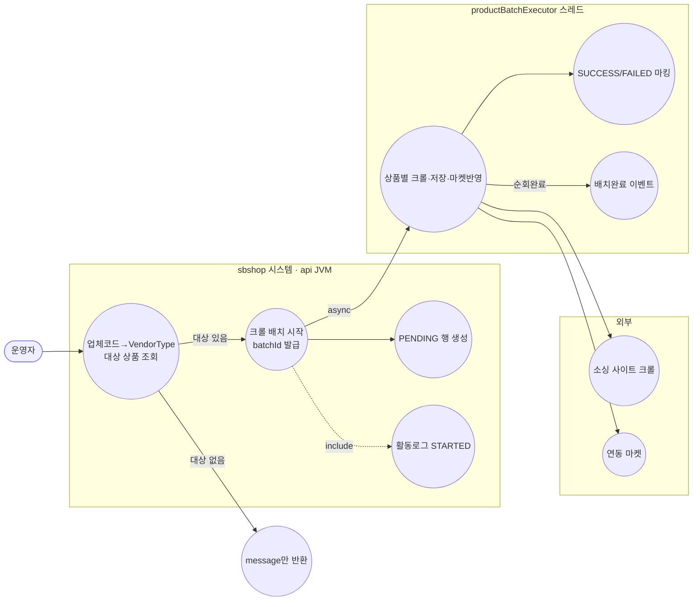
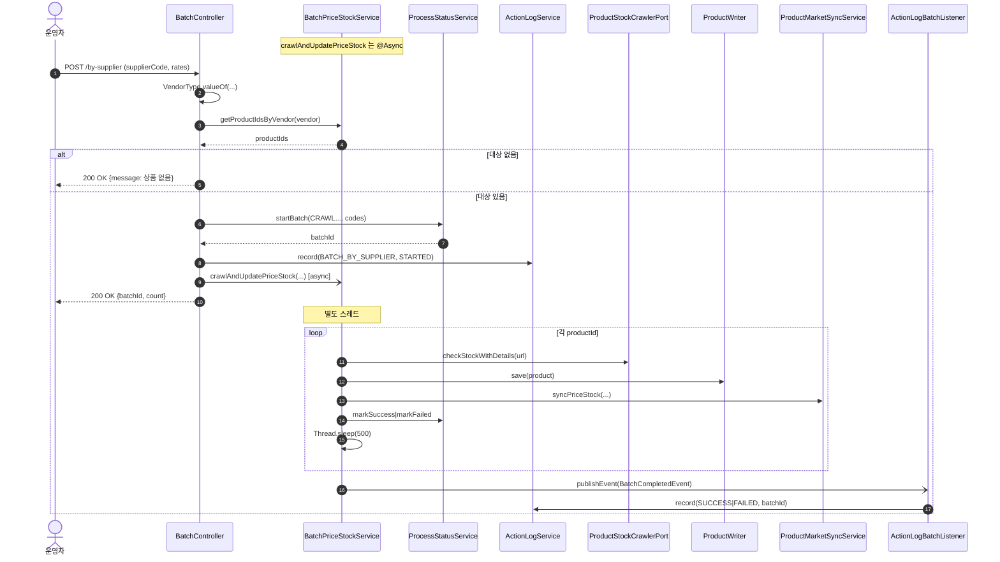

# POST /by-supplier — 소싱업체별 크롤 일괄 업데이트

## 1. 개요

| 항목 | 내용 |
|------|------|
| **Method / URL** | `POST /api/v1/products/batch/by-supplier` |
| **목적** | 소싱업체(`VendorType`) 하나를 지정하면 **해당 업체의 전 상품을 조회**해 크롤 기반 가격·재고 일괄 업데이트를 돌린다. 사실상 `crawl-and-update`의 "대상=업체 전체" 변형. |
| **핵심 상태전이** | 상품별 `ProcessStatus`: `PENDING` → `SUCCESS`/`FAILED`. 배치 완료 시 활동로그 `SUCCESS`/`FAILED`. |
| **부수효과** | crawl 경로와 동일: 크롤 + 상품 저장 + 마켓 재전송 + 활동로그. |
| **비동기 여부** | **비동기** — 대상 조회는 동기, 실제 처리는 `@Async` `crawlAndUpdatePriceStock`. |
| **응답** | 대상 있음: `200 OK` + `{"batchId": "...", "count": "N"}` / 대상 없음: `200 OK` + `{"message": "해당 소싱업체의 상품이 없습니다."}`(batchId 없음) |

## 2. 호출 체인

```
BatchController.updateBySupplier()                api/.../controller/BatchController.java:97-120
  ├─ VendorType.valueOf(supplierCode.toUpperCase())   BatchController.java:100  (잘못된 코드면 IllegalArgumentException → 500, F-BATCH-B1)
  ├─ BatchPriceStockService.getProductIdsByVendor(vendor)  BatchController.java:101
  │       core/.../product/BatchPriceStockService.java:178-182  (동기 조회)
  │       └─ productRepository.findByVendor(vendor)
  ├─ productIds.isEmpty() → 조기반환 (batchId 없이 message)  BatchController.java:102-104
  ├─ productIds → productCodes                        BatchController.java:105
  ├─ ProcessStatusService.startBatch(CRAWL_AND_UPDATE_PRICE_STOCK, productCodes)  BatchController.java:106-108
  ├─ ActionLogService.record(BATCH_BY_SUPPLIER, market=null, STARTED, ...)  BatchController.java:110-112
  └─ BatchPriceStockService.crawlAndUpdatePriceStock(...)  BatchController.java:113-118
          core/.../product/BatchPriceStockService.java:38-93   @Async("productBatchExecutor")  ← crawl 경로와 동일 메서드
          └─ (별도 스레드) 크롤 → 계산 → 저장 → 마켓반영 → SUCCESS/FAILED → BatchCompletedEvent
```

**비동기 실행 인프라** — [crawl-and-update.md](crawl-and-update.md) 와 동일 (`productBatchExecutor`, DB `process_status`, advisory lock 없음, sleep 500 있음). **처리 메서드가 crawl 경로와 물리적으로 같은 `crawlAndUpdatePriceStock`.**

**요청 바디 (`SupplierBatchRequest`)** — `api/.../dto/batch/SupplierBatchRequest.java:5-10`

| 필드 | 타입 | 필수 | 비고 |
|------|------|------|------|
| `supplierCode` | String | 필수 | `VendorType.valueOf(toUpperCase())` — enum 미매칭 시 예외(F-BATCH-B1). null 시 NPE |
| `marginRate` | BigDecimal | No | 기본 `15`(BatchController.java:115) |
| `couponRate` | BigDecimal | No | 기본 `20` — crawl 경로처럼 **미사용**(F-BATCH-6) |
| `minMarginPrice` | BigDecimal | No | 기본 `5000` |

## 3. 유스케이스 다이어그램



## 4. 시퀀스 다이어그램



## 5. 순서도 (플로우차트)

```mermaid
flowchart TD
    START([POST /by-supplier]) --> VEND{"VendorType.valueOf 성공?"}
    VEND -- No --> ERR1[IllegalArgumentException → 500]:::err
    VEND -- Yes --> IDS[getProductIdsByVendor]
    IDS --> EMPTY{대상 상품 있음?}
    EMPTY -- No --> RESP0([200 OK message만<br/>batchId 없음]):::warn
    EMPTY -- Yes --> SB["startBatch → PENDING · batchId"]
    SB --> LOG1[활동로그 STARTED]
    LOG1 --> ASYNC[/@Async 진입: 즉시 200 batchId,count/]:::async
    ASYNC --> RESP([200 OK batchId,count]):::ok

    ASYNC --> LOOP{남은 productId?}
    LOOP -- Yes --> CRAWL[크롤 → 저장 → 마켓반영]
    CRAWL --> OK1[markSuccess]:::ok
    CRAWL -. 예외/URL없음 .-> F1[markFailed]:::warn
    OK1 --> SLEEP[sleep 500]
    F1 --> SLEEP
    SLEEP --> LOOP
    LOOP -- No --> EVT[BatchCompletedEvent → 활동로그]:::ok

    classDef ok fill:#dfd,stroke:#3a3;
    classDef warn fill:#fe8,stroke:#e90;
    classDef err fill:#fdd,stroke:#c33;
    classDef async fill:#def,stroke:#39c;
```

## 6. 상태 전이표

| 대상 | 진입 | 결과 | 부수효과 | 비고 |
|------|------|------|----------|------|
| 요청 | supplierCode 유효 | 진행 | — | enum 미매칭 시 500(F-BATCH-B1) |
| 요청 | 대상 0건 | 조기반환 | 없음 | batchId 없음, message만 |
| `ProcessStatus`(상품별) | 없음 | `PENDING` | 행 생성 | startBatch |
| `ProcessStatus`(상품별) | `PENDING` | `SUCCESS`/`FAILED` | 저장+마켓반영 / 없음 | crawl 경로와 동일 |
| 배치 전체(활동로그) | STARTED | `SUCCESS`/`FAILED` | 활동로그 1행 | 순회 종료 |
| `ProcessStatus` | `PENDING`(미완) | **PENDING 잔류** | — | 배치 중 재시작(F-BATCH-2) |

## 7. 🔎 발견사항

> 횡단 이슈(F-BATCH-1·2·3·4·6·7)는 [crawl-and-update.md](crawl-and-update.md) 참조. 특히 이 엔드포인트는 `crawlAndUpdatePriceStock`을 그대로 호출하므로 F-BATCH-3(트리거 중복)·F-BATCH-6(couponRate 미사용)이 직접 적용된다.

### F-BATCH-B1 · 🟠 GAP — 잘못된 supplierCode가 500(IllegalArgumentException)으로 노출, null이면 NPE
- **근거:** `BatchController.java:100` — `VendorType.valueOf(request.supplierCode().toUpperCase())`. `supplierCode`가 enum에 없으면 `IllegalArgumentException`, null이면 `.toUpperCase()`에서 NPE. 방어·400 매핑 없음.
- **영향:** 사용자 입력 오류가 400이 아닌 500으로 반환되어 클라이언트가 "서버 오류"로 오인. 유효한 vendor 목록도 응답에서 안내되지 않음.
- **제안:** supplierCode 검증 후 미매칭 시 400 + 허용값 목록 반환. null/blank 가드 추가.

### F-BATCH-B2 · 🔵 NOTE — 대상 0건과 처리 진행의 응답 형태가 비대칭 (batchId 유무)
- **근거:** 대상 있음은 `{batchId, count}`(119), 대상 없음은 `{message}`(103). 두 응답의 키 집합이 달라 클라이언트가 분기 처리해야 한다. 다른 세 트리거는 항상 `{batchId, message}`.
- **영향:** 프론트가 by-supplier만 응답 스키마를 다르게 다뤄야 함. batchId 부재 시 status 폴링 대상이 없다.
- **제안:** 대상 0건도 `{batchId:null 또는 빈 배치, message}`로 스키마 통일하거나, 4 트리거 공통 응답 DTO 도입(F-BATCH-3 연계).

### F-BATCH-B3 · 🟡 SMELL — crawl-and-update와 거의 동일 (대상 소스만 상이)
- **근거:** `updateBySupplier`(97-120)는 대상 조회 부분(100-104)을 빼면 `crawlAndUpdate`(41-60)와 JobType·async 메서드·기본값·응답 골격이 동일. 활동로그 actionType만 `BATCH_BY_SUPPLIER`로 다름.
- **제안:** vendor→productIds 해석 후 공통 crawl 트리거 헬퍼로 위임(F-BATCH-3 통합 대상).

## 8. 테스트 커버리지 메모

- **BatchController(api) 테스트 없음.** `getProductIdsByVendor` 단위 테스트도 검색되지 않음.
- **비어있는 케이스:** ① 잘못된/누락 supplierCode(F-BATCH-B1), ② 대상 0건 응답(F-BATCH-B2), ③ vendor 대량 상품 시 startBatch 동기 지연(F-BATCH-5).

---
*생성: 2026-07-14 · 근거 커밋: main@bd4c915*
