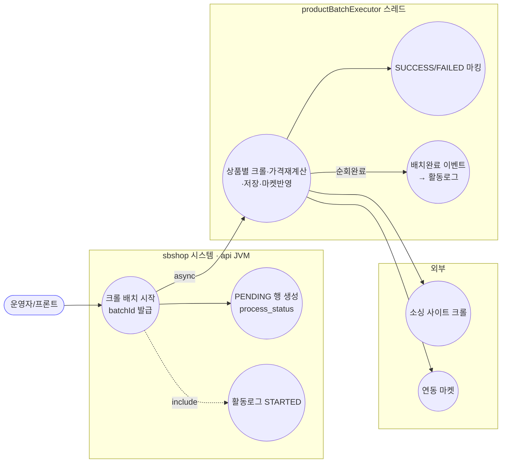
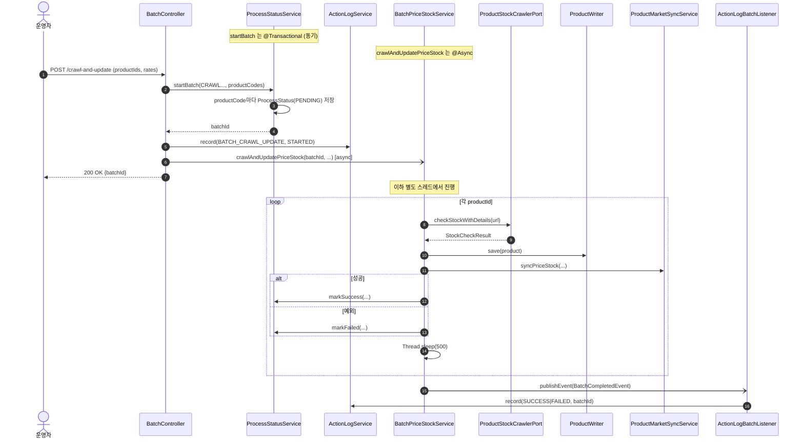

# POST /crawl-and-update — 크롤 기반 가격·재고 일괄 업데이트

## 1. 개요

| 항목 | 내용 |
|------|------|
| **Method / URL** | `POST /api/v1/products/batch/crawl-and-update` |
| **목적** | 지정한 상품 목록의 소싱 URL을 **크롤링해 원가/재고를 재수집**하고, 마진율로 판매가를 재계산한 뒤 상품을 갱신한다. 갱신분은 연동 마켓에도 반영한다(D-060). |
| **핵심 상태전이** | 상품별 `ProcessStatus`: `PENDING`(시작 시 저장) → `SUCCESS`/`FAILED`(각 건 완료 시). 배치 전체는 완료 이벤트로 활동로그에 `SUCCESS`/`FAILED` 기록. |
| **부수효과** | ① 크롤링(외부), ② 상품 DB 저장, ③ 연동 마켓 가격·재고 재전송(`productMarketSyncService`), ④ 활동로그 STARTED + 완료 기록 |
| **비동기 여부** | **비동기** — 서비스가 `@Async("productBatchExecutor")`. 컨트롤러는 `batchId`만 받고 즉시 200 반환. |
| **응답** | `200 OK` + `{"batchId": "...", "message": "크롤 기반 일괄 업데이트가 시작되었습니다."}` |

## 2. 호출 체인

```
BatchController.crawlAndUpdate()                  api/.../controller/BatchController.java:41-60
  ├─ request.productIds() → productCodes(String) 변환   BatchController.java:44-46
  ├─ ProcessStatusService.startBatch(CRAWL_AND_UPDATE_PRICE_STOCK, productCodes)  BatchController.java:47-49
  │       core/.../process/ProcessStatusService.java:23-39  @Transactional (동기)
  │       └─ productCode마다 ProcessStatus(PENDING) 저장    ProcessStatusService.java:26-36
  │       └─ batchId = UUID 앞 8자                         ProcessStatusService.java:25
  ├─ ActionLogService.record(BATCH_CRAWL_UPDATE, market=null, STARTED, ...)  BatchController.java:51-52
  └─ BatchPriceStockService.crawlAndUpdatePriceStock(...)  BatchController.java:53-58
          core/.../product/BatchPriceStockService.java:38-93   @Async("productBatchExecutor")  ← 여기서 비동기 진입
          └─ (별도 스레드) productIds 순회
               ├─ ProductReader.findById()                  BatchPriceStockService.java:44
               ├─ sourcingUrl 없으면 markFailed + continue   BatchPriceStockService.java:48-53
               ├─ ProductStockCrawlerPort.checkStockWithDetails(url)  BatchPriceStockService.java:55  (외부 크롤)
               ├─ MarginCalculator.calculateSalePrice()      BatchPriceStockService.java:60
               ├─ product.update() / updateStockStatus() / updateRestockDate()  BatchPriceStockService.java:70-72
               ├─ ProductWriter.save()                       BatchPriceStockService.java:73
               ├─ productMarketSyncService.syncPriceStock()  BatchPriceStockService.java:76  (마켓 재전송)
               ├─ ProcessStatusService.markSuccess()/markFailed()  BatchPriceStockService.java:78/86
               ├─ Thread.sleep(500)                          BatchPriceStockService.java:83
               └─ (순회 종료) eventPublisher.publishEvent(BatchCompletedEvent)  BatchPriceStockService.java:90-92
                     └─ ActionLogBatchListener.onBatchCompleted()  core/.../actionlog/ActionLogBatchListener.java:22-27
                          └─ ActionLogService.record(actionType, SUCCESS|FAILED, ...)
```

**비동기 실행 인프라**
- 스레드풀 `productBatchExecutor`: core `AsyncConfig.java:31-41` — core=2, max=5, queue=100, `CallerRunsPolicy`.
- `@EnableAsync`는 core `AsyncConfig`와 api `AsyncConfig`(껍데기, D-011) 양쪽에 존재. 빈은 core에만 정의.
- **배치 상태 저장 = DB `process_status` 테이블**(JPA). 인메모리 상태·별도 레지스트리 없음. → 재현 근거는 `ProcessStatusService`가 매 조회를 `processStatusRepository`로 위임하는 점(파일 전체).
- **DB advisory lock 없음** — `ProcessStatusService`·`BatchPriceStockService` 어디에도 `pg_advisory_lock`/비관적 락/중복 실행 가드 없음(두 파일 전체 검토).

**요청 바디 (`CrawlAndUpdateRequest`)** — `api/.../dto/batch/CrawlAndUpdateRequest.java:6-11`

| 필드 | 타입 | 필수 | 기본값(컨트롤러에서 적용) | 비고 |
|------|------|------|--------------------------|------|
| `productIds` | List\<Long\> | 사실상 필수 | — | null·빈 리스트 검증 없음(F-BATCH-4) |
| `marginRate` | BigDecimal | No | `15` | `BatchController.java:55` |
| `couponRate` | BigDecimal | No | `20` | `BatchController.java:56` — **서비스로 전달되지만 crawl 경로에서 미사용**(F-BATCH-6) |
| `minMarginPrice` | BigDecimal | No | `5000` | `BatchController.java:57` |

## 3. 유스케이스 다이어그램



## 4. 시퀀스 다이어그램



## 5. 순서도 (플로우차트)

```mermaid
flowchart TD
    START([POST /crawl-and-update]) --> IDS[productIds → productCodes]
    IDS --> SB["startBatch → PENDING 행 저장 · batchId 발급"]
    SB --> LOG1[활동로그 STARTED]
    LOG1 --> ASYNC[/@Async 진입: 즉시 200 반환/]:::async
    ASYNC --> RESP([200 OK batchId]):::ok

    ASYNC --> LOOP{남은 productId?}
    LOOP -- Yes --> URL{sourcingUrl 존재?}
    URL -- No --> F1[markFailed · failCount++]:::warn
    URL -- Yes --> CRAWL[크롤 → 가격재계산 → save]
    CRAWL --> SYNC[마켓 반영 syncPriceStock]
    SYNC --> OK1[markSuccess]:::ok
    CRAWL -. 예외 .-> F2[markFailed · failCount++]:::warn
    OK1 --> SLEEP[Thread.sleep 500]
    F1 --> SLEEP
    F2 --> SLEEP
    SLEEP --> LOOP
    LOOP -- No --> EVT[BatchCompletedEvent → 활동로그 SUCCESS/FAILED]:::ok

    classDef ok fill:#dfd,stroke:#3a3;
    classDef warn fill:#fe8,stroke:#e90;
    classDef async fill:#def,stroke:#39c;
```

## 6. 상태 전이표

| 대상 | 진입 | 결과 | 부수효과 | 비고 |
|------|------|------|----------|------|
| `ProcessStatus`(상품별) | 시작 시 없음 | `PENDING` | 행 생성 | `startBatch` 동기 저장 |
| `ProcessStatus`(상품별) | `PENDING` | `SUCCESS` | 상품 저장 + 마켓반영 | 크롤·계산 성공 |
| `ProcessStatus`(상품별) | `PENDING` | `FAILED` | 없음(또는 부분) | URL 없음/예외 |
| 배치 전체(활동로그) | STARTED | `SUCCESS`(fail=0) / `FAILED`(fail>0) | 활동로그 1행 | 순회 종료 이벤트 |
| `ProcessStatus` | `PENDING`(미완) | **PENDING 잔류** | — | 배치 중 재시작 시 영구 PENDING (F-BATCH-2) |

## 7. 🔎 발견사항

> 아래 항목 중 **동시 배치 중복 방지·재시작 유실·트리거 4종 중복·status 조회 3종·존재하지 않는 batchId** 는 배치 컨트롤러 전반의 횡단 이슈로, 4개 트리거 문서에서 공통 참조한다. 상세 근거는 본 문서에 집약한다.

### F-BATCH-1 · 🟠 GAP — 동시 배치 중복 실행 방지 장치 부재 (advisory lock·in-flight 가드 없음)
- **근거:** `ProcessStatusService.startBatch`(`ProcessStatusService.java:23-39`)는 매 호출마다 새 `batchId`(UUID 8자)를 발급하고 무조건 PENDING 행을 만든다. 실행 전 "이미 도는 배치가 있는지" 확인하는 로직이 없다. `BatchPriceStockService`(전체)와 `ProcessStatusService`(전체) 어디에도 `pg_advisory_lock`/DB 락/멱등 키가 없다. `productBatchExecutor` 풀은 core=2/max=5(`AsyncConfig.java:34-35`)라 **여러 배치가 물리적으로 동시에 돈다.**
- **영향:** 같은 상품집합을 대상으로 크롤 배치를 연달아 트리거하면 동일 상품에 대해 크롤·저장·마켓 재전송이 중복 실행된다. 마켓 재전송(`syncPriceStock`)이 중복 호출되어 외부 마켓에 불필요한 쓰기가 발생하고, 마지막 쓰기 승자(last-writer-wins)로 결과가 비결정적이 된다.
- **제안:** JobType별(또는 상품집합 해시별) 진행 중 배치 존재 시 409 반환, 혹은 `pg_advisory_xact_lock`으로 직렬화. [[deployment-two-jvm-topology]] 상 api·worker 2 JVM이 같은 배치를 트리거할 수 있어 프로세스 간 락이 필요.

### F-BATCH-2 · 🔴 BUG(후보) — 배치 진행 중 배포/재시작 시 PENDING 행이 영구 잔류 (진행중 배치 유실)
- **근거:** 상태 전이는 오직 `markSuccess`/`markFailed`(`ProcessStatusService.java:52-59`)로만 PENDING→종결된다. 이 호출은 async 스레드가 각 상품을 **끝까지 처리해야** 실행된다. main push=자동배포=api 재시작으로 async 스레드가 중단되면 남은 상품은 PENDING인 채 갱신되지 않는다. 재기동 시 미완 배치를 이어받거나 FAILED로 정리하는 복구 로직이 없다(`ProcessStatusService`·`BatchPriceStockService` 전체에 재개/타임아웃 로직 없음).
- **영향:** [[deploy-interrupts-running-batch]] 그대로 — 배치 중 배포하면 진행중 배치가 잘리고, summary의 `percent`가 100에 도달하지 못한 채 멈춘다(`pending = total - done`이 영구 잔존). 운영자는 완료/실패 판정을 할 수 없다.
- **제안:** 재기동 시 `startedAt` 기준 오래된 PENDING을 TIMEOUT/FAILED로 정리하거나, 배치 상태에 heartbeat를 두고 stale 감지. 최소한 배치 중 배포 금지 운영 규율([[deploy-interrupts-running-batch]]) 문서화.

### F-BATCH-3 · 🟡 SMELL — 4개 트리거 엔드포인트의 컨트롤러 로직 중복
- **근거:** `crawlAndUpdate`(41-60)·`manualUpdate`(62-79)·`manualUpdateAll`(81-95)·`updateBySupplier`(97-120)가 **동일 골격**(productIds→productCodes 변환 → `startBatch` → 활동로그 STARTED → async 서비스 호출 → `{batchId,message}` 반환)을 반복한다. 특히 `crawlAndUpdate`와 `updateBySupplier`는 JobType(`CRAWL_AND_UPDATE_PRICE_STOCK`)·서비스 호출(`crawlAndUpdatePriceStock`)까지 사실상 동일하고 상품 소스만 다르다.
- **제안:** productCodes 변환·startBatch·활동로그 STARTED를 공통 헬퍼로 추출. `updateBySupplier`는 vendor→productIds 해석 후 `crawlAndUpdate` 경로로 위임하면 중복 제거.

### F-BATCH-4 · 🟠 GAP — 요청 검증 부재 (productIds null/빈 리스트, marketType, marginRate 범위)
- **근거:** `CrawlAndUpdateRequest`(record, 검증 애노테이션 없음)와 `BatchController.crawlAndUpdate`에 `@Valid`·null/empty 체크가 없다. `request.productIds().stream()`(`BatchController.java:44`)은 `productIds`가 null이면 NPE. 빈 리스트면 0건짜리 batchId가 발급되어 즉시 완료 이벤트만 남는 무의미 배치가 생긴다.
- **영향:** 잘못된 요청이 500(NPE) 또는 빈 배치로 흘러 활동로그·process_status를 오염시킨다.
- **제안:** `productIds` non-null·non-empty 검증, `marginRate`/`couponRate` 범위 검증 추가.

### F-BATCH-5 · 🟡 SMELL — `startBatch`가 상품별 1행씩 개별 save (배치 insert 아님)
- **근거:** `ProcessStatusService.java:26-36` 루프에서 `processStatusRepository.save(status)`를 건별 호출. 2145건 규모(BatchSummary 주석 언급) 배치면 트랜잭션 내 2145 insert.
- **영향:** startBatch가 동기라 대량 상품 트리거 시 컨트롤러 응답이 지연될 수 있다.
- **제안:** `saveAll` 배치 insert 또는 JDBC batch로 개선.

### F-BATCH-6 · 🔵 NOTE — `couponRate`가 crawl 경로에서 수집만 되고 미사용
- **근거:** 컨트롤러가 `couponRate`(기본 20)를 서비스에 넘기지 않는다. `crawlAndUpdatePriceStock` 시그니처(`BatchPriceStockService.java:39-40`)는 `couponRate`를 받지만 본문(38-93)에서 `marginCalculator.calculateSalePrice`에 `couponRate`를 전달하지 않는다(`buyPrice, bundleQty, marginRate, minMarginPrice`만 사용). 요청 필드 `couponRate`는 컨트롤러에서 기본값만 채워지고 실제 계산에 반영 안 됨.
- **영향:** API 계약상 쿠폰율을 받는 듯 보이나 판매가 계산에 무영향 — 사용자 오해 소지.
- **제안:** 쿠폰율이 판매가에 반영돼야 하는지 정책 확인 후, 미사용이면 파라미터 제거 또는 계산 반영.

### F-BATCH-7 · 🔵 NOTE — 활동로그 STARTED/완료가 이원화, marketType 항상 null
- **근거:** 컨트롤러가 STARTED를 직접 기록(`BatchController.java:51`)하고 완료는 async 이벤트 리스너(`ActionLogBatchListener.java:25`)가 기록. 둘 다 `market=null`. 상품집합에 걸친 배치라 단일 마켓 귀속이 불가한 건 타당하나(order API의 F-S6과 유사 횡단 이슈), STARTED와 완료가 분리돼 조회 시 짝 맞추기가 batchId 문자열 파싱에 의존한다.
- **제안:** 활동로그에 batchId 컬럼(구조화)로 짝을 명시하면 STARTED/완료 연결이 견고해진다.

## 8. 테스트 커버리지 메모

- **BatchController(api) 자체 테스트 없음** — 컨트롤러→startBatch→async 호출 계약을 검증하는 테스트가 검색되지 않음.
- **존재:** `ProcessStatusServiceTest`(startBatch/getBatchStatus/getBatchSummary/zeroTotal), `BatchPriceStockAsyncPoolTest`, `ProductBatchExecutorBeanTest`, `BatchCompletedEventPublishTest`, `ActionLogBatchListenerTest`.
- **비어있는 케이스:** ① 동시 배치 중복(F-BATCH-1), ② 재시작 시 PENDING 잔류/복구(F-BATCH-2), ③ productIds null/빈 리스트(F-BATCH-4), ④ couponRate 반영 여부(F-BATCH-6).

---
*생성: 2026-07-14 · 근거 커밋: main@bd4c915*
