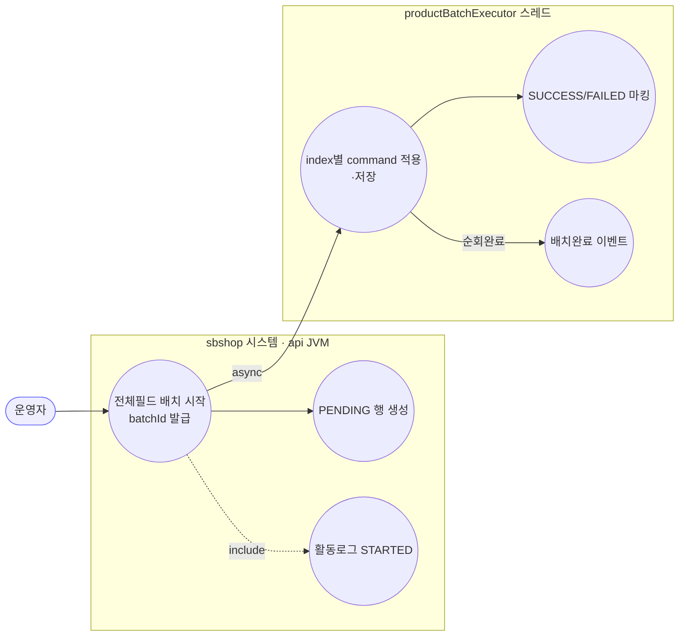
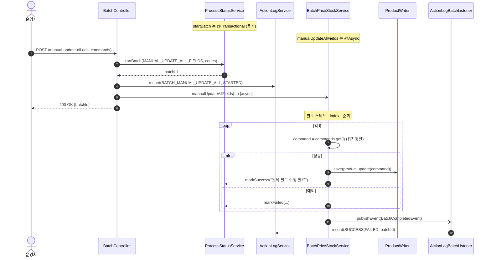

# POST /manual-update-all — 전체 필드 수동 일괄 업데이트

> **[P3 반영 2026-07-14]** F-BATCH-A2 해결 — productIds/commands 길이 불일치 500→400 가드 (커밋 `6095f1b`).

## 1. 개요

| 항목 | 내용 |
|------|------|
| **Method / URL** | `POST /api/v1/products/batch/manual-update-all` |
| **목적** | 상품별로 **전체 필드(`ProductUpdateCommand`)를 직접 지정**해 일괄 수정한다. 가격·재고만이 아닌 임의 필드 갱신용. |
| **핵심 상태전이** | 상품별 `ProcessStatus`: `PENDING` → `SUCCESS`/`FAILED`. 배치 완료 시 활동로그 `SUCCESS`/`FAILED`. |
| **부수효과** | ① 상품 DB 저장만. **크롤 없음, 마켓 재전송 없음**(다른 두 경로와 상이 — F-BATCH-A1). |
| **비동기 여부** | **비동기** — `@Async("productBatchExecutor")`. |
| **응답** | `200 OK` + `{"batchId": "...", "message": "전체 필드 일괄 업데이트가 시작되었습니다."}` |

## 2. 호출 체인

```
BatchController.manualUpdateAll()                 api/.../controller/BatchController.java:81-95
  ├─ request.productIds() → productCodes           BatchController.java:84-86
  ├─ ProcessStatusService.startBatch(MANUAL_UPDATE_ALL_FIELDS, productCodes)  BatchController.java:87-89
  ├─ ActionLogService.record(BATCH_MANUAL_UPDATE_ALL, market=null, STARTED, ...)  BatchController.java:91-92
  └─ BatchPriceStockService.manualUpdateAllFields(batchId, productIds, commands)  BatchController.java:93
          core/.../product/BatchPriceStockService.java:151-176   @Async("productBatchExecutor")  ← 비동기 진입
          └─ (별도 스레드) index i로 productIds 순회               BatchPriceStockService.java:155
               ├─ command = commands.get(i)                       BatchPriceStockService.java:161  (위치 정렬)
               ├─ product.update(command)                         BatchPriceStockService.java:162
               ├─ ProductWriter.save()                            BatchPriceStockService.java:163
               ├─ ProcessStatusService.markSuccess()/markFailed() BatchPriceStockService.java:165/169
               └─ (순회 종료) publishEvent(BatchCompletedEvent BATCH_MANUAL_UPDATE_ALL)  BatchPriceStockService.java:173-175
                     └─ ActionLogBatchListener.onBatchCompleted()  core/.../actionlog/ActionLogBatchListener.java:22-27
```

**비동기 실행 인프라** — 스레드풀 `productBatchExecutor`(core `AsyncConfig.java:31-41`). 배치 상태 저장은 DB `process_status`. **advisory lock 없음.** 마켓 재전송 호출 없음.

**요청 바디 (`ManualUpdateAllRequest`)** — `api/.../dto/batch/ManualUpdateAllRequest.java:6-9`

| 필드 | 타입 | 필수 | 비고 |
|------|------|------|------|
| `productIds` | List\<Long\> | 사실상 필수 | null/빈 검증 없음(F-BATCH-4 공통) |
| `commands` | List\<ProductUpdateCommand\> | 사실상 필수 | **위치 정렬** — `commands.get(i)`가 productIds[i]와 짝. 길이 불일치 시 IndexOutOfBounds(F-BATCH-A2) |

## 3. 유스케이스 다이어그램



> **관찰:** 크롤·마켓 재전송 유스케이스가 **없다** — 다른 두 트리거와 대조적.

## 4. 시퀀스 다이어그램



## 5. 순서도 (플로우차트)

```mermaid
flowchart TD
    START([POST /manual-update-all]) --> SB["startBatch → PENDING · batchId"]
    SB --> LOG1[활동로그 STARTED]
    LOG1 --> ASYNC[/@Async 진입: 즉시 200/]:::async
    ASYNC --> RESP([200 OK batchId]):::ok

    ASYNC --> LOOP{남은 index i?}
    LOOP -- Yes --> CMD["command = commands.get(i)"]
    CMD --> SAVE[product.update+save]
    SAVE --> OK1[markSuccess]:::ok
    CMD -. IndexOutOfBounds / 예외 .-> F1[markFailed · failCount++]:::warn
    OK1 --> LOOP
    F1 --> LOOP
    LOOP -- No --> EVT[BatchCompletedEvent → 활동로그]:::ok

    classDef ok fill:#dfd,stroke:#3a3;
    classDef warn fill:#fe8,stroke:#e90;
    classDef async fill:#def,stroke:#39c;
```

## 6. 상태 전이표

| 대상 | 진입 | 결과 | 부수효과 | 비고 |
|------|------|------|----------|------|
| `ProcessStatus`(상품별) | 없음 | `PENDING` | 행 생성 | startBatch |
| `ProcessStatus`(상품별) | `PENDING` | `SUCCESS` | 상품 저장 | 마켓 재전송 없음 |
| `ProcessStatus`(상품별) | `PENDING` | `FAILED` | 없음 | 예외/IndexOutOfBounds |
| 배치 전체(활동로그) | STARTED | `SUCCESS`/`FAILED` | 활동로그 1행 | 순회 종료 |
| `ProcessStatus` | `PENDING`(미완) | **PENDING 잔류** | — | 배치 중 재시작 (F-BATCH-2) |

## 7. 🔎 발견사항

> 횡단 이슈(F-BATCH-1·2·3·4·7)는 [crawl-and-update.md](crawl-and-update.md) 참조. 본 문서는 전체필드 경로 고유 발견을 다룬다.

### F-BATCH-A1 · 🟠 GAP — 전체필드 배치만 마켓 재전송이 없어 마켓과 로컬이 어긋남
> ⬜ **미해결(백로그)**.
- **근거:** `manualUpdateAllFields`(`BatchPriceStockService.java:151-176`)는 `product.update(command)` + `save`만 하고 `productMarketSyncService.syncPriceStock` 호출이 없다. crawl(76)·manual(133) 경로는 모두 마켓 재전송을 한다.
- **영향:** 전체필드 배치로 **가격/재고를 바꿔도 연동 마켓엔 반영되지 않는다.** command에 가격·재고가 포함될 수 있으므로(ProductUpdateCommand는 전 필드 포괄), 로컬 DB와 마켓 판매가가 조용히 불일치하게 된다.
- **제안:** command에 가격/재고 변경이 포함되면 마켓 재전송을 태우거나, 이 경로는 마켓 미반영임을 API 계약·응답 메시지에 명시.

### F-BATCH-A2 · 🟠 GAP — commands와 productIds 길이 불일치 시 IndexOutOfBounds로 개별 FAILED
> ✅ **해결됨** (커밋 `6095f1b`) — 체크리스트 기준.
- **근거:** `commands.get(i)`(`BatchPriceStockService.java:161`)는 `productIds.size()` 기준 루프(155)를 도는데, `commands.size() < productIds.size()`면 `IndexOutOfBoundsException`. try-catch(156-171)가 이를 잡아 해당 건 markFailed 처리하나, 근본은 **위치 정렬 계약**(F-BATCH-M1과 동형).
- **영향:** 길이 어긋난 요청이 부분 성공/부분 실패로 흘러 결과가 예측 불가. 어긋난 index부터 엉뚱한 command가 적용될 수도 있다.
- **제안:** `productIds.size() == commands.size()` 사전 검증(불일치 시 400). `{productId, command}` 튜플 DTO 권장.

### F-BATCH-A3 · 🟡 SMELL — 다른 두 경로와 부수효과·완충이 제각각 (마켓반영 유무·sleep 유무)
> ⬜ **미해결(백로그)**.
- **근거:** crawl=크롤+마켓반영+sleep, manual=마켓반영+sleep없음, manual-all=마켓반영없음+sleep없음. 세 async 메서드(`BatchPriceStockService`)가 부수효과 정책이 서로 다르다.
- **제안:** 배치 3종의 "상품 저장 후 마켓 반영·완충" 공통 스텝을 추출해 정책을 통일하면 F-BATCH-A1/M2가 함께 해소.

## 8. 테스트 커버리지 메모

- **BatchController(api) 테스트 없음.** `manualUpdateAllFields` 단위 테스트도 검색되지 않음.
- **비어있는 케이스:** ① commands/productIds 길이 불일치(F-BATCH-A2), ② 마켓 미반영으로 인한 로컬-마켓 불일치(F-BATCH-A1), ③ command에 가격/재고 포함 시 기대 동작.

---
*생성: 2026-07-14 · 근거 커밋: main@bd4c915*
