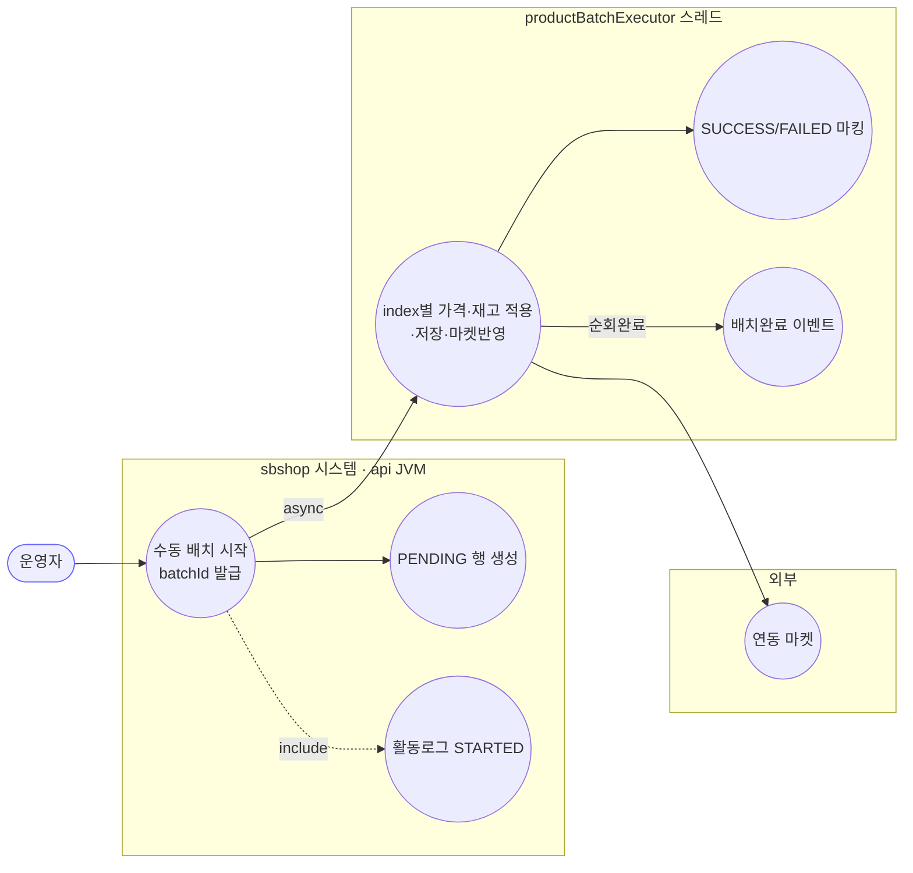
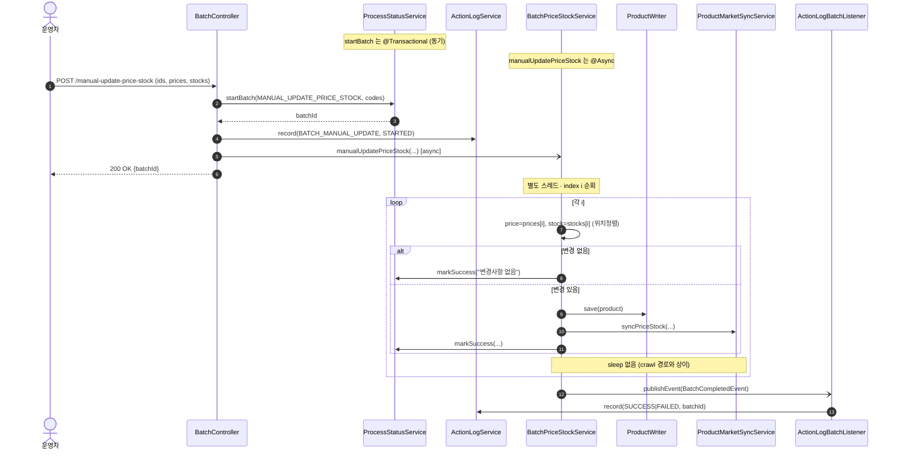

# POST /manual-update-price-stock — 가격·재고 수동 일괄 업데이트

> **[반영 2026-07-15]** F-BATCH-M1(🔴) 해결 — prices/stocks 위치결합을 PriceStockItem 쌍 객체로 대체(엉뚱한 상품 오적용 방지) (커밋 `8d0953b`).

## 1. 개요

| 항목 | 내용 |
|------|------|
| **Method / URL** | `POST /api/v1/products/batch/manual-update-price-stock` |
| **목적** | 크롤 없이 **운영자가 직접 입력한 가격·재고**를 상품 목록에 일괄 적용한다. 변경분은 연동 마켓에도 반영한다(D-060). |
| **핵심 상태전이** | 상품별 `ProcessStatus`: `PENDING` → `SUCCESS`/`FAILED`. 배치 전체 완료 시 활동로그 `SUCCESS`/`FAILED`. |
| **부수효과** | ① 상품 DB 저장, ② 연동 마켓 재전송, ③ 활동로그 STARTED + 완료 기록. **크롤 없음.** |
| **비동기 여부** | **비동기** — `@Async("productBatchExecutor")`. 컨트롤러는 batchId만 반환. |
| **응답** | `200 OK` + `{"batchId": "...", "message": "수동 일괄 업데이트가 시작되었습니다."}` |

## 2. 호출 체인

```
BatchController.manualUpdate()                    api/.../controller/BatchController.java:62-79
  ├─ request.productIds() → productCodes           BatchController.java:65-67
  ├─ ProcessStatusService.startBatch(MANUAL_UPDATE_PRICE_STOCK, productCodes)  BatchController.java:68-70
  │       core/.../process/ProcessStatusService.java:23-39  @Transactional (동기, PENDING 저장)
  ├─ ActionLogService.record(BATCH_MANUAL_UPDATE, market=null, STARTED, ...)  BatchController.java:72-73
  └─ BatchPriceStockService.manualUpdatePriceStock(batchId, productIds, prices, stocks)  BatchController.java:74-77
          core/.../product/BatchPriceStockService.java:95-149   @Async("productBatchExecutor")  ← 비동기 진입
          └─ (별도 스레드) 인덱스 i로 productIds 순회               BatchPriceStockService.java:99
               ├─ price = i < prices.size() ? prices.get(i) : null   BatchPriceStockService.java:105  (위치 정렬)
               ├─ stock = i < stocks.size() ? stocks.get(i) : null   BatchPriceStockService.java:106  (위치 정렬)
               ├─ 변경 없으면 markSuccess("변경사항 없음") + continue   BatchPriceStockService.java:115-119
               ├─ product.update() / updateStockStatus()             BatchPriceStockService.java:128-129
               ├─ ProductWriter.save()                               BatchPriceStockService.java:130
               ├─ productMarketSyncService.syncPriceStock()          BatchPriceStockService.java:133  (마켓 재전송)
               ├─ ProcessStatusService.markSuccess()/markFailed()    BatchPriceStockService.java:135/142
               └─ (순회 종료) publishEvent(BatchCompletedEvent BATCH_MANUAL_UPDATE)  BatchPriceStockService.java:146-148
                     └─ ActionLogBatchListener.onBatchCompleted()    core/.../actionlog/ActionLogBatchListener.java:22-27
```

**비동기 실행 인프라** — crawl 경로와 동일. 스레드풀 `productBatchExecutor`(core `AsyncConfig.java:31-41`, core=2/max=5/queue=100/CallerRunsPolicy). 배치 상태 저장은 DB `process_status` 테이블. **advisory lock 없음.**

> ⚠ crawl 경로와 달리 `Thread.sleep(500)` **없음** — 마켓 재전송을 rate-limit 없이 연속 호출(F-BATCH-M2).

**요청 바디 (`ManualUpdateRequest`)** — `api/.../dto/batch/ManualUpdateRequest.java:6-10`

| 필드 | 타입 | 필수 | 비고 |
|------|------|------|------|
| `productIds` | List\<Long\> | 사실상 필수 | null/빈 검증 없음(F-BATCH-4 공통) |
| `prices` | List\<BigDecimal\> | No | **위치(index)로 productIds와 정렬** — 짝 어긋나면 오적용(F-BATCH-M1) |
| `stocks` | List\<Integer\> | No | 동일 — 위치 정렬 |

## 3. 유스케이스 다이어그램



## 4. 시퀀스 다이어그램



## 5. 순서도 (플로우차트)

```mermaid
flowchart TD
    START([POST /manual-update-price-stock]) --> SB["startBatch → PENDING · batchId"]
    SB --> LOG1[활동로그 STARTED]
    LOG1 --> ASYNC[/@Async 진입: 즉시 200/]:::async
    ASYNC --> RESP([200 OK batchId]):::ok

    ASYNC --> LOOP{남은 index i?}
    LOOP -- Yes --> PICK["price=prices[i], stock=stocks[i] (위치정렬)"]
    PICK --> CHG{변경 있음?}
    CHG -- No --> NOOP[markSuccess 변경없음]:::ok
    CHG -- Yes --> SAVE[update+save]
    SAVE --> SYNC[마켓 반영]
    SYNC --> OK1[markSuccess]:::ok
    SAVE -. 예외 .-> F1[markFailed · failCount++]:::warn
    NOOP --> LOOP
    OK1 --> LOOP
    F1 --> LOOP
    LOOP -- No --> EVT[BatchCompletedEvent → 활동로그]:::ok

    classDef ok fill:#dfd,stroke:#3a3;
    classDef warn fill:#fe8,stroke:#e90;
    classDef async fill:#def,stroke:#39c;
```

## 6. 상태 전이표

| 대상 | 진입 | 결과 | 부수효과 | 비고 |
|------|------|------|----------|------|
| `ProcessStatus`(상품별) | 없음 | `PENDING` | 행 생성 | startBatch |
| `ProcessStatus`(상품별) | `PENDING` | `SUCCESS`(변경없음) | 없음 | 가격·재고 동일 |
| `ProcessStatus`(상품별) | `PENDING` | `SUCCESS`(변경) | 상품 저장 + 마켓반영 | 정상 |
| `ProcessStatus`(상품별) | `PENDING` | `FAILED` | 없음/부분 | 예외 |
| 배치 전체(활동로그) | STARTED | `SUCCESS`/`FAILED` | 활동로그 1행 | 순회 종료 |
| `ProcessStatus` | `PENDING`(미완) | **PENDING 잔류** | — | 배치 중 재시작 (F-BATCH-2) |

## 7. 🔎 발견사항

> 횡단 이슈(F-BATCH-1 동시중복·F-BATCH-2 재시작유실·F-BATCH-3 트리거중복·F-BATCH-4 검증부재·F-BATCH-7 활동로그)는 [crawl-and-update.md](crawl-and-update.md) 에 상세. 본 문서는 수동 경로 고유 발견을 다룬다.

### F-BATCH-M1 · 🔴 BUG(후보) — prices/stocks가 productIds와 위치(index)로만 정렬 → 짝 어긋나면 엉뚱한 상품에 적용
> ✅ **해결됨** (커밋 `8d0953b`) — 체크리스트 기준.
- **근거:** `BatchPriceStockService.java:105-106` 은 `price = i < prices.size() ? prices.get(i) : null`, `stock = i < stocks.size() ? stocks.get(i) : null` 로 **productIds[i]에 prices[i]/stocks[i]를 위치 매칭**한다. 요청 DTO(`ManualUpdateRequest`)는 세 리스트를 독립 배열로 받을 뿐 길이 일치·정렬 보장이 없다.
- **영향:** 프론트가 리스트 순서를 어긋나게 보내거나 일부 상품의 price를 누락(리스트 길이 불일치)하면, **의도와 다른 상품에 가격/재고가 적용**되어 마켓에 잘못된 가격이 전송된다. 조용히 성공(SUCCESS) 처리되어 탐지도 어렵다.
- **제안:** `{productId, price, stock}` 튜플 리스트로 DTO 구조 변경하거나, 최소한 세 리스트 길이 일치 검증. 위치 정렬은 취약한 계약.

### F-BATCH-M2 · 🟡 SMELL — crawl 경로엔 있는 `Thread.sleep(500)` rate-limit이 수동 경로엔 없음
> ⬜ **미해결(백로그)**.
- **근거:** `crawlAndUpdatePriceStock`은 루프 말미 `Thread.sleep(500)`(`BatchPriceStockService.java:83`)로 마켓 재전송을 완충하지만, `manualUpdatePriceStock`(95-149)에는 sleep이 없다.
- **영향:** 수동 배치가 대량이면 `syncPriceStock`(마켓 API)을 무완충 연속 호출 → 마켓 rate-limit/차단 위험. 두 경로 모두 마켓에 쓰는데 완충이 비대칭.
- **제안:** 두 경로의 마켓 재전송 완충 정책을 통일(공통 유틸로 추출, F-BATCH-3와 연계).

### F-BATCH-M3 · 🔵 NOTE — 변경 없음 판정이 price는 equals, stock은 status 파생 비교라 비대칭
> ⬜ **미해결(백로그)**.
- **근거:** `BatchPriceStockService.java:112-113` — `priceChanged`는 `!price.equals(oldPrice)`(BigDecimal equals는 scale 민감, 예: `1000` vs `1000.00`이 다름)로, `statusChanged`는 stock→StockStatus 파생 후 비교. stock 실수치 자체 변경은 status가 안 바뀌면 "변경 없음"으로 스킵된다.
- **영향:** BigDecimal scale 차이로 실제 동일 가격이 변경으로 오판되거나(불필요 마켓 전송), stock 수치만 바뀐 건이 스킵될 수 있다.
- **제안:** 가격 비교는 `compareTo(...) != 0`, 재고는 수치 비교로 명시.

## 8. 테스트 커버리지 메모

- **BatchController(api) 테스트 없음.** 수동 경로 서비스(`manualUpdatePriceStock`) 단위 테스트도 검색되지 않음.
- **비어있는 케이스:** ① prices/stocks 길이 불일치·순서 어긋남(F-BATCH-M1), ② 변경없음 판정 BigDecimal scale(F-BATCH-M3), ③ 대량 배치 rate-limit(F-BATCH-M2).

---
*생성: 2026-07-14 · 근거 커밋: main@bd4c915*
