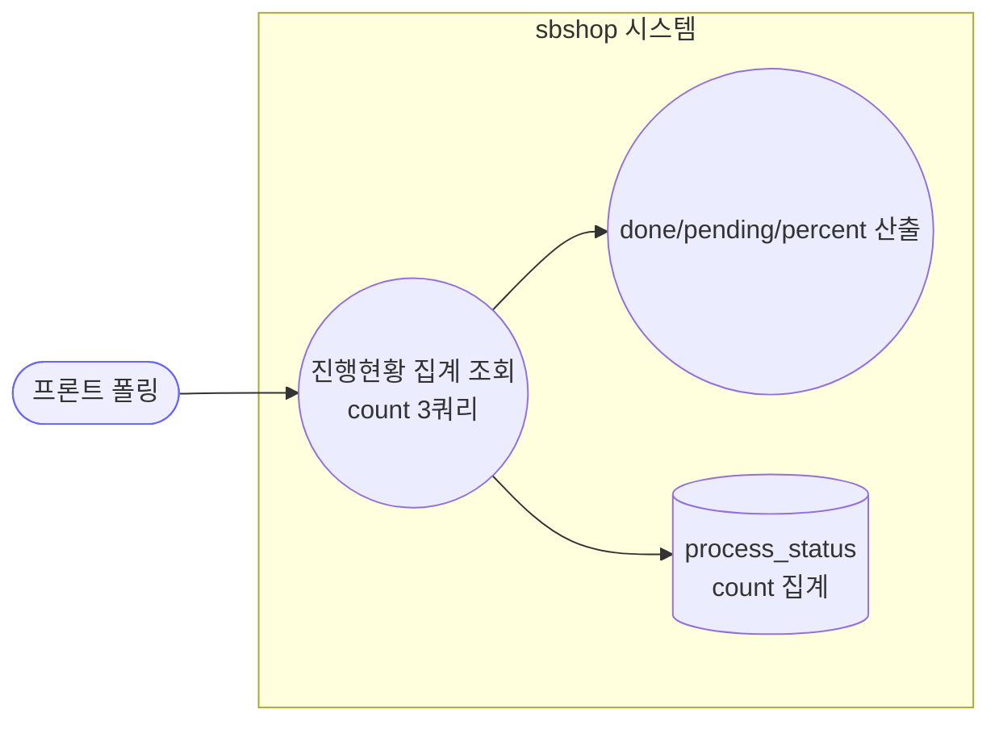
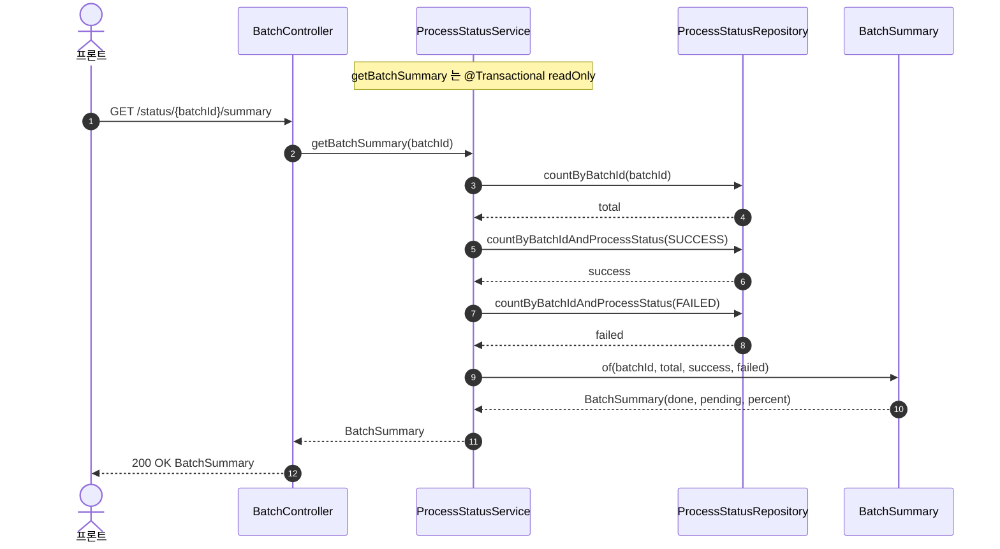
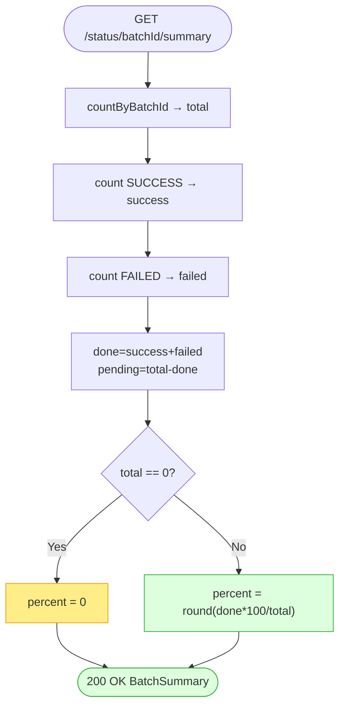

# GET /status/{batchId}/summary — 배치 진행현황 경량 집계

## 1. 개요

| 항목 | 내용 |
|------|------|
| **Method / URL** | `GET /api/v1/products/batch/status/{batchId}/summary` |
| **목적** | 폴링용 **경량 집계** — 전체 행 대신 count 쿼리 3개로 total/success/failed를 산출하고 done/pending/percent를 계산해 반환한다. |
| **핵심 상태전이** | 없음(읽기 전용). |
| **부수효과** | 없음 — `@Transactional(readOnly = true)`. |
| **비동기 여부** | 동기. |
| **응답** | `200 OK` + `BatchSummary`(record: batchId, total, success, failed, pending, done, percent) |

## 2. 호출 체인

```
BatchController.getBatchSummary()                 api/.../controller/BatchController.java:129-133
  └─ ProcessStatusService.getBatchSummary(batchId)  core/.../process/ProcessStatusService.java:66-72
        @Transactional(readOnly = true)
        ├─ processStatusRepository.countByBatchId(batchId)                         → total
        ├─ processStatusRepository.countByBatchIdAndProcessStatus(batchId, SUCCESS) → success
        ├─ processStatusRepository.countByBatchIdAndProcessStatus(batchId, FAILED)  → failed
        └─ BatchSummary.of(batchId, total, success, failed)   core/.../process/BatchSummary.java:16-21
              done = success + failed
              pending = total - done
              percent = total==0 ? 0 : round(done*100/total)
```

**응답 데이터원** — DB `process_status` 테이블에 대한 count 집계 쿼리 3개. 전체 행을 로드하지 않음(폴링 경량화 목적, `BatchSummary.java:3-6` 주석).

## 3. 유스케이스 다이어그램



## 4. 시퀀스 다이어그램



## 5. 순서도 (플로우차트)



## 6. 상태 전이표

읽기 전용 — 상태 전이 없음.

| 입력 batchId | total | percent | 비고 |
|--------------|:-----:|:-------:|------|
| 존재·진행중 | >0 | 0~99 | pending>0 |
| 존재·완료 | >0 | 100 | pending=0 |
| **미존재/오타** | 0 | **0** | 진행중 0%와 구분 불가(F-BATCH-SM1) |

## 7. 🔎 발견사항

### F-BATCH-SM1 · 🟠 GAP — 미존재 batchId와 "방금 시작한 0% 배치"가 동일 응답 (total=0, percent=0)
- **근거:** `getBatchSummary`(`ProcessStatusService.java:66-72`)는 batchId 존재 검증 없이 count만 집계. 미존재 batchId면 total=0 → `BatchSummary.of`에서 percent=0(`BatchSummary.java:19`). 컨트롤러는 그대로 200.
- **영향:** 폴링 클라이언트가 오타/만료 batchId를 "0% 진행중"으로 오인해 무한 폴링할 수 있다. 반대로 "PENDING만 있고 아직 아무것도 안 끝난 배치"도 percent=0이라 미존재와 구분 불가.
- **제안:** 미존재 시 404, 또는 응답에 `exists` 플래그 추가. status 3종 미존재 처리 통일(F-BATCH-S2, status-batch-id.md 참조).

### F-BATCH-SM2 · 🔵 NOTE — percent가 done 기준이라 "완료율"이지 "성공률"이 아님
- **근거:** `BatchSummary.of`(`BatchSummary.java:17`)의 `done = success + failed`. percent는 처리 완료율이며, 실패가 많아도 percent 100에 도달한다.
- **영향:** 프론트가 percent 100을 "전부 성공"으로 오해할 여지. 성공/실패 내역은 별도 필드(success/failed)로 봐야 함.
- **제안:** UI에서 percent와 별개로 failed>0 배지 노출. 문서상 "완료율"임을 명시.

### F-BATCH-SM3 · 🔵 NOTE — SUCCESS/FAILED count 2회 쿼리 (PENDING은 뺄셈으로 유도)
- **근거:** `ProcessStatusService.java:68-70` — total, SUCCESS, FAILED를 각각 쿼리(3 쿼리)하고 pending은 `total-done` 산술. PENDING을 직접 세지 않아, PENDING/SUCCESS/FAILED 외 상태가 생기면 pending 계산이 어긋난다(현재 `ProcessStatusType`은 3종뿐이라 안전).
- **제안:** 상태별 group-by count 단일 쿼리로 줄이면 라운드트립 절감. 상태 enum 확장 시 pending 뺄셈 가정 재검토.

## 8. 테스트 커버리지 메모

- **존재:** `ProcessStatusServiceTest.getBatchSummary_computesAggregate`, `getBatchSummary_zeroTotal_percentZero`(core) — 집계·0나눗셈 방지 검증.
- **BatchController(api) 테스트 없음.**
- **비어있는 케이스:** 미존재 batchId vs 0% 진행중 구분(F-BATCH-SM1), failed>0 시 percent 100 UI 계약(F-BATCH-SM2).

---
*생성: 2026-07-14 · 근거 커밋: main@bd4c915*
