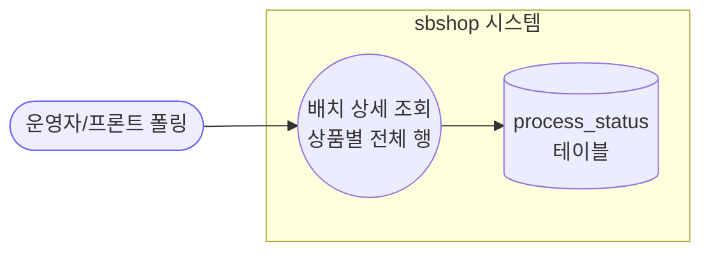
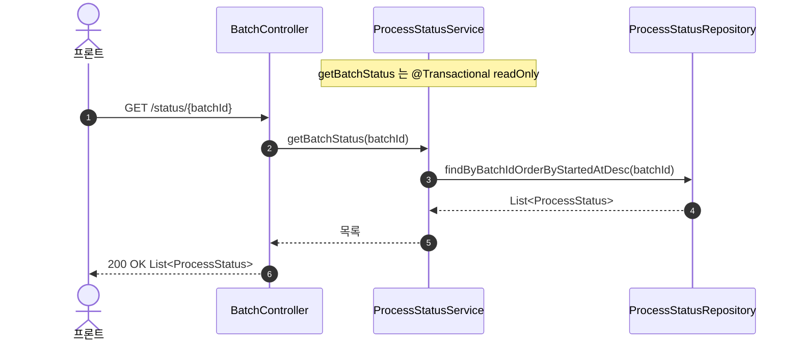
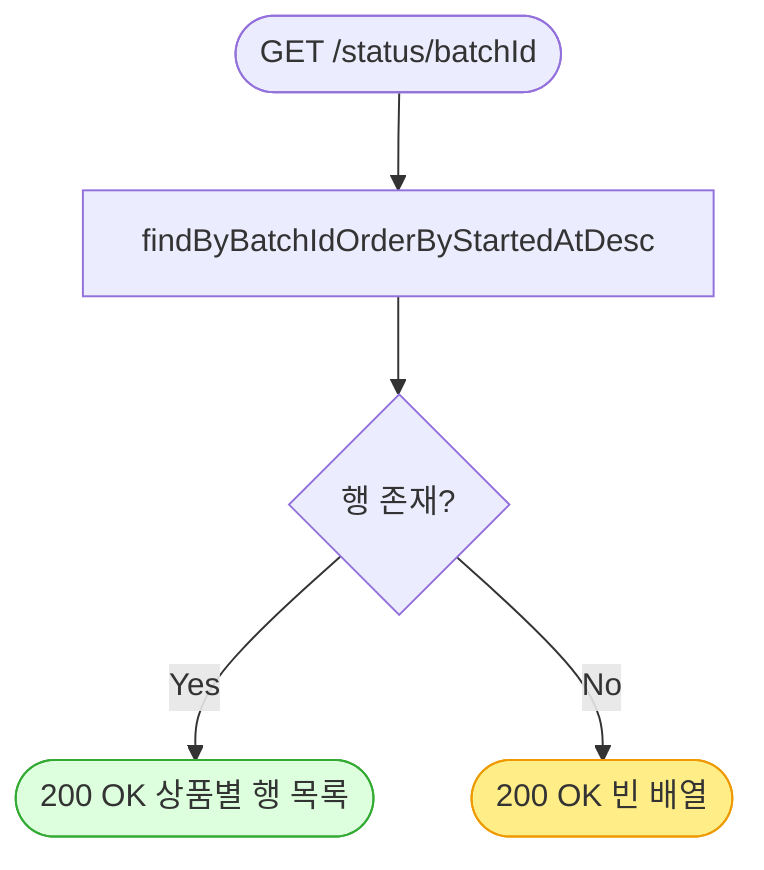

# GET /status/{batchId} — 배치 상세 상태 조회

## 1. 개요

| 항목 | 내용 |
|------|------|
| **Method / URL** | `GET /api/v1/products/batch/status/{batchId}` |
| **목적** | 특정 배치의 **상품별 진행 상태 전체 행**을 최신순으로 반환한다(상세 조회용). |
| **핵심 상태전이** | 없음(읽기 전용). |
| **부수효과** | 없음 — `@Transactional(readOnly = true)` 조회. |
| **비동기 여부** | 동기. |
| **응답** | `200 OK` + `List<ProcessStatus>`(도메인 엔티티 그대로 노출 — F-BATCH-S1) |

## 2. 호출 체인

```
BatchController.getBatchStatus()                  api/.../controller/BatchController.java:122-126
  └─ ProcessStatusService.getBatchStatus(batchId)  core/.../process/ProcessStatusService.java:61-64
        @Transactional(readOnly = true)
        └─ processStatusRepository.findByBatchIdOrderByStartedAtDesc(batchId)
              core/.../domain/process/repository/ProcessStatusRepository.java  (Spring Data 파생 쿼리)
```

**응답 데이터원** — DB `process_status` 테이블. 인메모리 캐시 없음. batchId에 해당하는 모든 상품 행을 `startedAt` 내림차순으로 반환.

## 3. 유스케이스 다이어그램



## 4. 시퀀스 다이어그램



## 5. 순서도 (플로우차트)



## 6. 상태 전이표

읽기 전용 — 상태 전이 없음.

| 입력 batchId | 결과 | 비고 |
|--------------|------|------|
| 존재 | 상품별 행 목록(최신순) | 정상 |
| 미존재/오타 | **빈 배열 + 200** | 404 아님(F-BATCH-S2) |

## 7. 🔎 발견사항

### F-BATCH-S1 · 🟡 SMELL — 도메인 엔티티 `ProcessStatus`를 응답으로 직접 노출
> ✅ **해결됨** (커밋 `54087b6`) — 체크리스트 기준.
- **근거:** `BatchController.java:123` 반환 타입 `ResponseEntity<List<ProcessStatus>>`. summary 엔드포인트가 전용 record(`BatchSummary`)를 쓰는 것과 비대칭. order API의 F-S5/F-H6과 동일한 횡단 이슈.
- **영향:** 직렬화 형태가 도메인 변경에 결합. 내부 필드·지연로딩 유출 위험, 폴링마다 전체 행 페이로드 전송.
- **제안:** 응답 DTO 도입. 폴링은 summary 엔드포인트로 유도하고 상세는 필요 시에만.

### F-BATCH-S2 · 🟠 GAP — 존재하지 않는 batchId도 빈 배열 + 200 (404 아님)
> ⬜ **미해결(백로그)**.
- **근거:** `findByBatchIdOrderByStartedAtDesc`(`ProcessStatusService.java:63`)는 미존재 batchId에 대해 예외 없이 빈 리스트를 반환하고, 컨트롤러는 그대로 200. batchId 존재 검증 없음.
- **영향:** 오타/만료된 batchId와 "아직 행이 없는 배치"를 클라이언트가 구분 불가. 폴링 로직이 빈 배열을 "완료"로 오인할 여지.
- **제안:** batchId 미존재 시 404, 또는 summary처럼 total=0을 명시적으로 표현. 3종 status 엔드포인트의 미존재 처리 정책 통일(F-BATCH-S3, status.md 참조).

### F-BATCH-S3 · 🔵 NOTE — 정렬·페이지네이션 없음, 대용량 배치 전량 반환
> ⬜ **미해결(백로그)**.
- **근거:** 2145건 규모 배치(BatchSummary 주석)를 이 엔드포인트가 전 행 반환. 페이지네이션·필터(FAILED만 등) 없음.
- **영향:** 대량 배치를 상세 조회로 폴링하면 매번 전체 페이로드 — summary가 별도로 있는 이유(폴링 경량화)와 맞물림.
- **제안:** 상세는 페이지네이션/상태 필터 지원, 폴링은 summary 강제.

## 8. 테스트 커버리지 메모

- **존재:** `ProcessStatusServiceTest.getBatchStatus_returnsStatuses`(core) — 정상 조회 검증.
- **BatchController(api) 테스트 없음.**
- **비어있는 케이스:** 미존재 batchId 응답(F-BATCH-S2), 대량 배치 페이로드(F-BATCH-S3).

---
*생성: 2026-07-14 · 근거 커밋: main@bd4c915*
