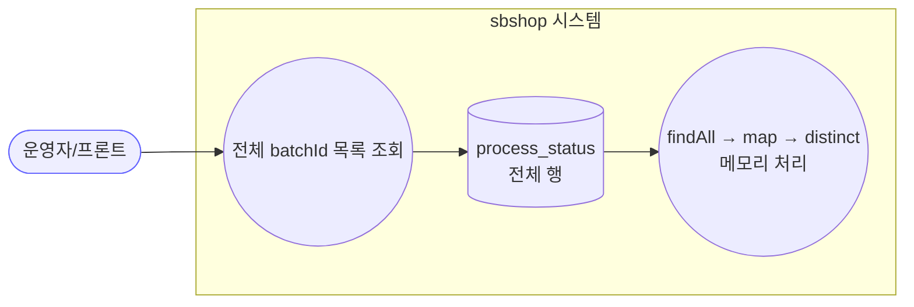
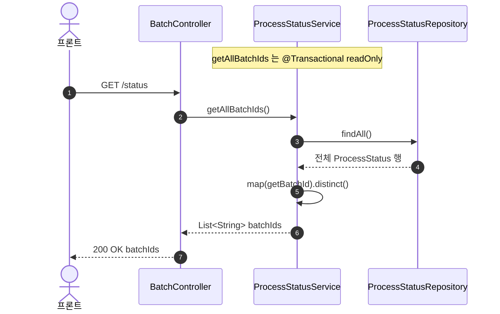
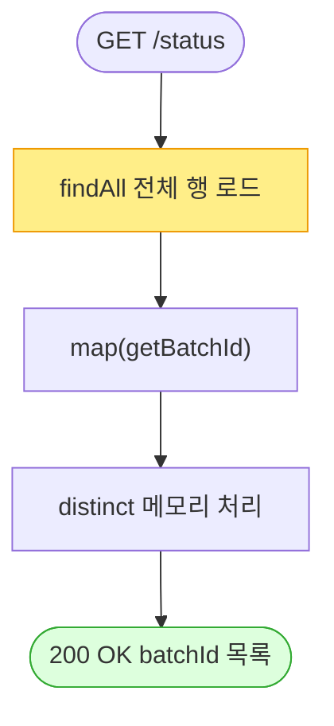

# GET /status — 전체 배치 ID 목록 조회

## 1. 개요

| 항목 | 내용 |
|------|------|
| **Method / URL** | `GET /api/v1/products/batch/status` |
| **목적** | 지금까지 실행된 **모든 배치의 batchId 목록**(중복 제거)을 반환한다. |
| **핵심 상태전이** | 없음(읽기 전용). |
| **부수효과** | 없음 — `@Transactional(readOnly = true)`. |
| **비동기 여부** | 동기. |
| **응답** | `200 OK` + `List<String>`(batchId 문자열 목록) |

## 2. 호출 체인

```
BatchController.getAllBatchIds()                  api/.../controller/BatchController.java:135-138
  └─ ProcessStatusService.getAllBatchIds()         core/.../process/ProcessStatusService.java:74-81
        @Transactional(readOnly = true)
        ├─ processStatusRepository.findAll()        ← ⚠ 테이블 전체 행 로드 (F-BATCH-ST1)
        └─ .map(ProcessStatus::getBatchId).distinct().toList()   (메모리에서 distinct)
```

**응답 데이터원** — DB `process_status` 테이블 **전체 행**을 로드한 뒤 애플리케이션 메모리에서 batchId만 추출·distinct. DB단 `SELECT DISTINCT`/집계 아님.

## 3. 유스케이스 다이어그램



## 4. 시퀀스 다이어그램



## 5. 순서도 (플로우차트)



## 6. 상태 전이표

읽기 전용 — 상태 전이 없음.

| 상황 | 결과 | 비고 |
|------|------|------|
| 배치 이력 있음 | distinct batchId 목록 | 정렬 없음(F-BATCH-ST2) |
| 배치 이력 없음 | 빈 배열 + 200 | — |
| 대량 이력 누적 | 전체 행 로드 후 distinct | 성능 위험(F-BATCH-ST1) |

## 7. 🔎 발견사항

### F-BATCH-ST1 · 🔴 BUG(후보) — `findAll()` 전체 행 로드 후 메모리 distinct — 이력 누적 시 OOM·성능 붕괴
> ✅ **해결됨** (커밋 `1a0485b`) — 체크리스트 기준.
- **근거:** `ProcessStatusService.java:76` `processStatusRepository.findAll()` 로 `process_status` **전 행**을 엔티티로 로드한 뒤 `.map(...).distinct()`(77-80). 배치 1회가 상품 수만큼 행을 만들고(2145건 규모 언급), 배치가 반복 실행될수록 테이블이 무한 성장한다. batchId만 필요한데 전 행을 엔티티로 물어온다.
- **영향:** 운영 기간이 길어질수록 이 엔드포인트 한 번 호출로 수만~수십만 행을 메모리에 적재 → 응답 지연·OOM 위험. api JVM([[deployment-two-jvm-topology]])이 worker와 공유 자원을 쓰는 환경에서 특히 위험.
- **제안:** DB단 `SELECT DISTINCT batch_id`(파생 쿼리 `@Query`) + `startedAt` 최근순 정렬 + 페이지네이션/limit. 오래된 process_status 보존기간(TTL) 정책도 함께 검토.

### F-BATCH-ST2 · 🟠 GAP — 반환 목록에 정렬·시각·상태 정보 없음 (raw batchId 문자열만)
> ⬜ **미해결(백로그)**.
- **근거:** `ProcessStatusService.java:74-81` 은 batchId 문자열만 distinct해 반환. 최신순 정렬도, 각 배치의 시작시각·JobType·진행상태도 없다. batchId는 UUID 앞 8자(`startBatch`)라 순서 의미도 없음.
- **영향:** 프론트가 "최근 배치"를 고르려면 batchId마다 별도 status/summary 폴링을 해야 하고, 목록만으로는 어떤 배치가 최신·진행중인지 알 수 없다.
- **제안:** batchId + startedAt + jobType + summary(done/total)를 담은 목록 DTO 반환. 최신순 정렬.

### F-BATCH-ST3 · 🔵 NOTE — status 조회 3종의 계약·미존재 처리가 제각각
> ⬜ **미해결(백로그)**.
- **근거:** `/status`(전체 batchId 문자열 목록, F-BATCH-ST1), `/status/{batchId}`(상품별 엔티티 전 행, F-BATCH-S1/S2), `/status/{batchId}/summary`(집계 record, F-BATCH-SM1). 반환 타입이 각각 `List<String>`·`List<ProcessStatus>`·`BatchSummary`로 다르고, 미존재 batchId 처리(전자는 목록에 없음, 후 2자는 빈/0 + 200)가 통일돼 있지 않다.
- **영향:** 클라이언트가 세 엔드포인트를 조합할 때 계약 불일치로 분기 처리가 복잡. 미존재 판정 기준이 엔드포인트마다 달라 오류 처리가 취약.
- **제안:** status 계열 응답 DTO·미존재 처리(404 or exists 플래그)·정렬 정책을 3종 공통으로 정의.

## 8. 테스트 커버리지 메모

- **`getAllBatchIds` 단위 테스트 검색되지 않음**(ProcessStatusServiceTest는 startBatch/getBatchStatus/getBatchSummary만 검증).
- **BatchController(api) 테스트 없음.**
- **비어있는 케이스:** ① 대량 이력 시 findAll 성능(F-BATCH-ST1), ② 정렬/메타 부재(F-BATCH-ST2), ③ status 3종 계약 정합(F-BATCH-ST3).

---
*생성: 2026-07-14 · 근거 커밋: main@bd4c915*
