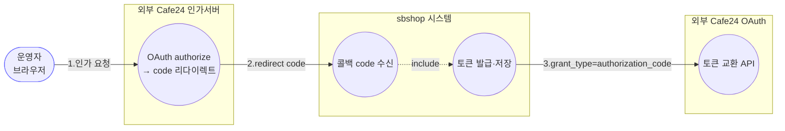
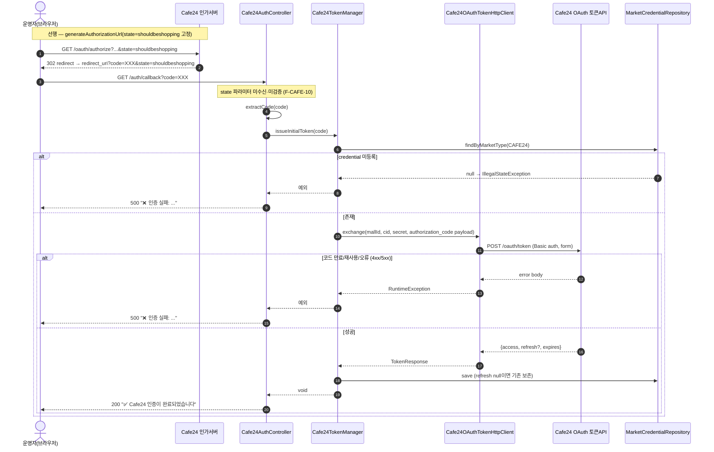
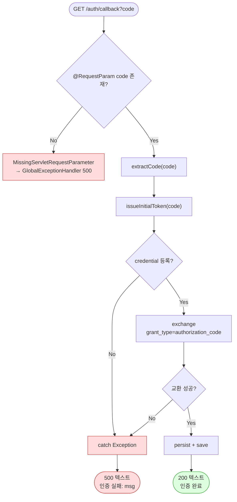

# GET /auth/callback — (레거시) OAuth 인가 콜백 직접 처리

## 1. 개요

| 항목 | 내용 |
|------|------|
| **Method / URL** | `GET /api/admin/sync/cafe24/auth/callback?code=...` |
| **목적** | Cafe24 인가 서버가 브라우저를 리다이렉트할 때 붙는 `code` 파라미터를 직접 받아 토큰을 발급·저장한다. **레거시** 경로 — 브라우저 주소창 직접 진입용이며, 신규 UI 는 `POST /issue-token` 사용. |
| **핵심 상태전이** | (자격증명) refresh 미보유/만료 → **유효 refresh 보유**. `grant_type=authorization_code`. |
| **부수효과** | 외부 Cafe24 OAuth 토큰 교환 + `sb_market_credential` 저장. **활동로그 기록 없음**(issue-token 과 비대칭). |
| **응답** | 성공 `200 OK` + 한글 안내 **텍스트**(HTML 아님) / 실패 `500` + 텍스트. `code` 미존재 시 Spring 이 `MissingServletRequestParameterException` → `GlobalExceptionHandler` 로 500. |

## 2. 호출 체인

```
Cafe24AuthController.handleCafe24AuthCode(@RequestParam code)   api/.../controller/Cafe24AuthController.java:129-139
  ├─ log.info("카페24 인증 코드 수신 완료")                       Cafe24AuthController.java:132
  ├─ extractCode(code)                                          Cafe24AuthController.java:134, 109-124
  ├─ cafe24TokenManager.issueInitialToken(extractCode(code))    infrastructure/.../cafe24/Cafe24TokenManager.java:132-144
  │      ├─ getCredential()                                     Cafe24TokenManager.java:133, 40-42
  │      ├─ payload = "grant_type=authorization_code&code=...&redirect_uri=..."   Cafe24TokenManager.java:137-139
  │      ├─ tokenClient.exchange(...)                           Cafe24TokenManager.java:140-141
  │      │      └─ Cafe24OAuthTokenHttpClient.exchange()        infrastructure/.../cafe24/Cafe24OAuthTokenHttpClient.java:22-57
  │      │           └─ POST https://{mallId}.cafe24api.com/api/v2/oauth/token  (Basic auth, form)
  │      └─ persist() → marketCredentialRepository.save()       Cafe24TokenManager.java:142, 102-110
  ├─ [성공] return 200 "✅ Cafe24 인증이 완료되었습니다..."          Cafe24AuthController.java:135
  └─ [실패] catch → return 500 "❌ 인증 실패: <msg>"              Cafe24AuthController.java:136-138
```

**요청 파라미터**

| 파라미터 | 타입 | 필수 | 비고 |
|----------|------|------|------|
| `code` | String | ✅ (`@RequestParam("code")` 필수 바인딩) | 인가 코드. 누락 시 Spring 이 400/500 바인딩 예외. `extractCode` 가 다시 `code=` 추출을 시도(값에 이미 code 만 오는 정상 케이스엔 그대로 반환). |

## 3. 유스케이스 다이어그램



> **비대칭 관찰:** 동일 로직의 `issue-token` 과 달리 **활동로그(CAFE24_AUTH) 를 남기지 않고**, 응답이 JSON(`Cafe24Status`)이 아닌 평문 텍스트다.

## 4. 시퀀스 다이어그램 (외부 Cafe24·브라우저 리다이렉트 포함)



## 5. 순서도 (플로우차트)



## 6. 상태 전이표

| 진입 조건 | 결과 | HTTP | 응답형태 | 자격증명 변화 | 활동로그 |
|-----------|------|:----:|----------|---------------|:--------:|
| `code` 파라미터 누락 | 바인딩 예외 | 500 | JSON(GlobalExceptionHandler) | 없음 | 없음 |
| credential 미등록 | 실패 | 500 | 텍스트 "❌ 인증 실패" | 없음 | 없음 |
| 인가코드 만료/재사용/오류 | 실패 | 500 | 텍스트 "❌ 인증 실패" | 없음 | 없음 |
| 교환 성공(refresh 포함) | 성공 | 200 | 텍스트 "✅ 인증 완료" | access·refresh·expiry 갱신 | 없음 |
| 교환 성공(refresh 생략) | 성공 | 200 | 텍스트 "✅ 인증 완료" | access·expiry, refresh 보존 | 없음 |

## 7. 🔎 발견사항

### F-CAFE-10 · 🟠 GAP — 콜백이 OAuth `state` 를 수신·검증하지 않음(CSRF)
- **근거:** `handleCafe24AuthCode` 는 `@RequestParam("code")` 만 받고 state 파라미터를 선언조차 하지 않는다(`Cafe24AuthController.java:129-131`). 인가 URL 의 state 는 고정 상수 `shouldbeshopping`(`Cafe24TokenManager.java:128`)이라 무작위성도 없다.
- **영향:** 브라우저 직접 진입 콜백에서 공격자가 `?code=<attacker_code>` 로 유도하면 그대로 교환되어 **피해자 자격증명이 공격자 계정에 연결**될 수 있는 OAuth CSRF. `issue-token` 의 F-CAFE-5 와 동일 위협의 콜백판.
- **제안:** state 를 서버 세션에 발급·저장 후 콜백에서 대조. 관리자 단일 사용자 전제로 수용한다면 명시 문서화. (레거시 경로이므로 폐지도 선택지.)

### F-CAFE-11 · 🟠 GAP — 콜백 에러 파라미터(`error`, `error_description`) 미처리
- **근거:** Cafe24 가 인가 거부 시 `redirect_uri?error=access_denied&error_description=...`(code 없음)로 리다이렉트하는데, 이 엔드포인트는 `code` 를 필수(`@RequestParam("code")`)로 요구한다(`:130`).
- **영향:** 사용자가 인가를 거부/실패하면 code 가 없어 Spring 바인딩 예외(500)만 나고, "사용자가 거부함" 같은 원인을 안내하지 못한다.
- **제안:** `error` 파라미터를 optional 로 받아 우선 감지·전용 안내. (또는 레거시 폐지.)

### F-CAFE-12 · 🟡 SMELL — `issue-token` 과 로직 중복이나 활동로그·응답형태가 비대칭
- **근거:** 두 엔드포인트 모두 `extractCode`→`issueInitialToken`→(성공/실패) 동일 흐름이나, `issue-token` 은 `actionLogService.record(CAFE24_AUTH, ...)` 을 남기고 JSON 을 반환(`Cafe24AuthController.java:88-98`)하는 반면 콜백은 **로그를 남기지 않고** 평문 텍스트를 반환(`:132-138`)한다.
- **영향:** 콜백 경로로 재인증하면 활동로그에 흔적이 없어 감사/추적이 끊긴다. 성공/실패 표현도 채널마다 달라 프런트/모니터링 처리가 이원화.
- **제안:** 콜백에도 동일 활동로그 기록. 중복 흐름을 private 메서드로 추출해 두 엔드포인트가 공유(로그·저장 로직 단일화).

### F-CAFE-13 · 🟡 SMELL — 인가 코드가 access.log 등에 GET 쿼리스트링으로 노출
- **근거:** 코드가 GET URL 파라미터(`?code=...`)로 전달되어(`:130`) 서블릿/프록시 access log, 브라우저 히스토리, Referer 에 평문 잔류 가능. 성공 시에도 로그(`:132`)가 남는다(값 자체는 로그에 없으나 요청 라인엔 남을 수 있음).
- **영향:** 1회용·단시간 유효라 위험은 제한적이나, 인가 코드 유출은 토큰 탈취로 이어질 수 있음.
- **제안:** 콜백 폐지 후 서버측 교환만 사용하거나, 최소한 프록시 access log 에서 쿼리스트링 마스킹.

### F-CAFE-14 · 🔵 NOTE — CORS 전체 허용(`@CrossOrigin(origins = "*")`)이 인증 컨트롤러에 적용
- **근거:** 컨트롤러 클래스에 `@CrossOrigin(origins = "*")`(`Cafe24AuthController.java:23`)가 붙어 `/status`·`/issue-token`·`/auth/callback` 모두 임의 오리진에서 호출 가능.
- **영향:** 토큰 발급·상태 점검 엔드포인트가 모든 오리진에 열려 있어, 관리자 브라우저 세션을 악용한 크로스오리진 호출 표면이 넓다(인증/인가 게이트가 별도로 없다면 더 큼).
- **제안:** 관리 콘솔 오리진으로 CORS 화이트리스트 축소. 인증 계층(관리자 세션/토큰) 존재 여부 확인.

## 8. 테스트 커버리지 메모

- **직접 테스트 없음:** `handleCafe24AuthCode` 대상 테스트가 검색되지 않음.
- **간접 커버:** 하위 `issueInitialToken`→저장 계약은 `Cafe24TokenManagerTest`(특히 refresh 보존 `:94-114`)로 일부 보증되나, `authorization_code` 교환·콜백 성공/실패 응답·에러 파라미터 처리는 미검증.
- **비어있는 케이스:** ① 성공→200 텍스트, ② 교환 실패→500 텍스트, ③ credential 미등록→500, ④ `code` 누락→바인딩 예외, ⑤ `error=` 콜백(F-CAFE-11), ⑥ state 검증(F-CAFE-10). 모두 미검증. 레거시 폐지 여부 결정 후 테스트 범위 확정 권장.

---
*생성: 2026-07-14 · 근거 커밋: main@bd4c915*
