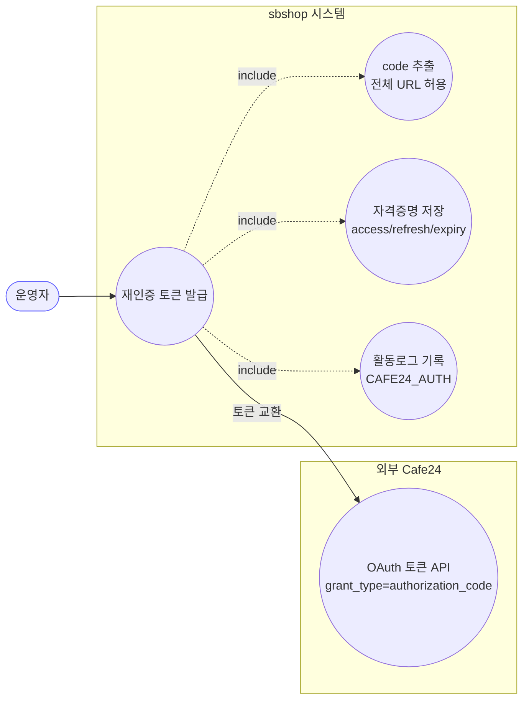
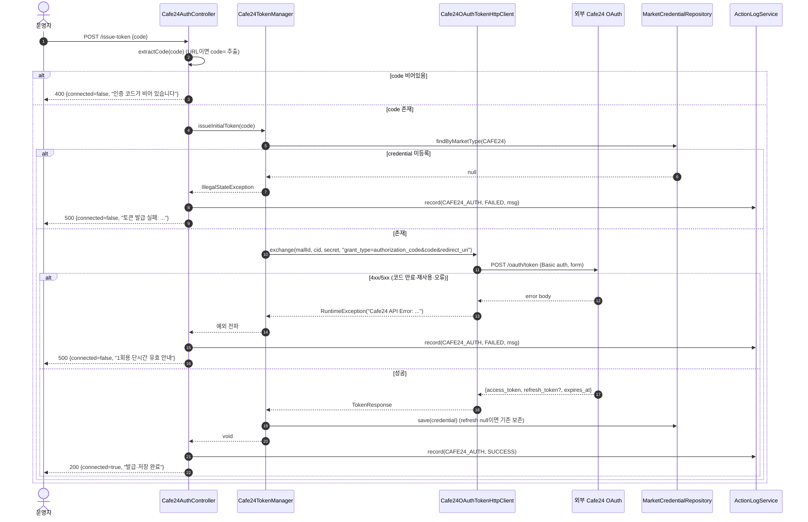
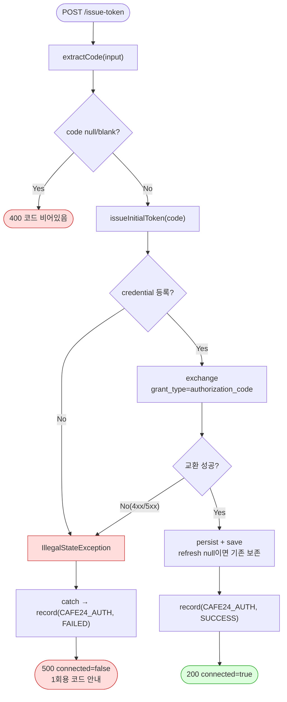

# POST /issue-token — 인가 코드로 리프레시 토큰 발급·저장

## 1. 개요

| 항목 | 내용 |
|------|------|
| **Method / URL** | `POST /api/admin/sync/cafe24/issue-token` |
| **목적** | OAuth 인가 코드(또는 `code=...` 를 포함한 전체 리다이렉트 URL)를 받아 Cafe24 OAuth 토큰 엔드포인트와 교환하고, access/refresh/expires 3종을 `sb_market_credential` 에 저장한다. 신규 UI 의 재인증 경로. |
| **핵심 상태전이** | (자격증명) refresh_token 미보유/만료 → **유효 refresh_token 보유**. `grant_type=authorization_code`. |
| **부수효과** | **외부 Cafe24 OAuth POST(토큰 교환)** + DB 저장 + **활동로그 기록**(`CAFE24_AUTH`, SUCCESS/FAILED). |
| **응답** | 성공 `200 OK` + `Cafe24Status{true,...}` / 코드 없음 `400` / 교환 실패 `500` — **컨트롤러가 자체 catch 로 상태코드 결정**(GlobalExceptionHandler 미도달). |

## 2. 호출 체인

```
Cafe24AuthController.issueToken(IssueTokenRequest)     api/.../controller/Cafe24AuthController.java:78-99
  ├─ extractCode(request.code())                       Cafe24AuthController.java:81, 109-124  (전체 URL에서 code 파라미터 추출)
  ├─ [빈 코드 가드] code null/blank → 400               Cafe24AuthController.java:82-84
  ├─ cafe24TokenManager.issueInitialToken(code)         infrastructure/.../cafe24/Cafe24TokenManager.java:132-144
  │      ├─ getCredential() (없으면 IllegalStateException)   Cafe24TokenManager.java:133-136, 40-42
  │      ├─ payload = "grant_type=authorization_code&code=...&redirect_uri=..."   Cafe24TokenManager.java:137-139
  │      ├─ tokenClient.exchange(mallId=clientId, clientId=accessKey, secret, payload)   Cafe24TokenManager.java:140-141
  │      │      └─ Cafe24OAuthTokenHttpClient.exchange()   infrastructure/.../cafe24/Cafe24OAuthTokenHttpClient.java:22-57
  │      │           ├─ Basic 인증(accessKey:secretKey) 헤더 조립   :25-26
  │      │           ├─ POST https://{mallId}.cafe24api.com/api/v2/oauth/token  (form-urlencoded)   :27-34
  │      │           ├─ 4xx/5xx → RuntimeException("Cafe24 API Error: <body>")   :35-42
  │      │           └─ access_token/expires_at 파싱 (refresh_token 없으면 null)   :45-56
  │      └─ persist(credential, resp) → marketCredentialRepository.save()   Cafe24TokenManager.java:142, 102-110
  ├─ [성공] actionLogService.record(CAFE24_AUTH, "CAFE24", SUCCESS, ...)   Cafe24AuthController.java:88-89
  │      └─ ActionLogConstants.CAFE24_AUTH = "CAFE24_AUTH"   core/.../domain/actionlog/ActionLogConstants.java:84
  └─ [실패] catch → actionLogService.record(...FAILED...) → 500   Cafe24AuthController.java:91-98
```

**요청 바디 (`IssueTokenRequest`)**

| 필드 | 타입 | 필수 | 비고 |
|------|------|------|------|
| `code` | String | ✅ | 인가 코드 원문 또는 `...?code=XXX&...` 전체 URL 붙여넣기 허용. `extractCode` 가 `code=` 뒷부분을 `&` 전까지 잘라냄. |

## 3. 유스케이스 다이어그램



> **선행 유스케이스:** 운영자는 브라우저에서 `generateAuthorizationUrl`(`Cafe24TokenManager.java:120-130`) 로 인가를 마친 뒤, 리다이렉트로 받은 code(또는 URL 전체)를 이 API 에 붙여넣는다.

## 4. 시퀀스 다이어그램



## 5. 순서도 (플로우차트)



## 6. 상태 전이표

| 진입 조건 | 결과 | HTTP | 자격증명 변화 | 활동로그 |
|-----------|------|:----:|---------------|----------|
| code 빈 값 | 거부 | 400 | 없음 | 없음 |
| credential 미등록 | 실패 | 500 | 없음 | FAILED |
| 인가코드 만료/재사용/오류(4xx·5xx) | 실패 | 500 | 없음 | FAILED |
| 교환 성공, 응답에 refresh_token 포함 | 성공 | 200 | access·refresh·expiry 갱신 | SUCCESS |
| 교환 성공, 응답에 refresh_token 생략 | 성공 | 200 | access·expiry 갱신, **기존 refresh 보존** | SUCCESS |

> 참고: `issueToken` 은 예외를 자체 `catch (Exception)` 로 처리해 500 을 직접 반환하므로 `GlobalExceptionHandler`(IllegalState→400) 로 넘어가지 않는다.

## 7. 🔎 발견사항

### F-CAFE-5 · 🟠 GAP — OAuth `state` 파라미터를 발급·검증하지 않음(CSRF)
> ⬜ **미해결(백로그)**.

- **근거:** 인가 URL 은 `state=shouldbeshopping` 고정 상수(`Cafe24TokenManager.java:128`)로 매 요청 동일하고, `issueToken`/`issueInitialToken` 어디에서도 콜백으로 돌아온 state 를 대조하지 않는다(요청 DTO `IssueTokenRequest` 에 state 필드조차 없음, `Cafe24AuthController.java:35`).
- **영향:** OAuth authorization-code CSRF 방어의 핵심인 state 무작위성·검증이 없어, 공격자가 자신의 인가 코드를 피해자 세션에 주입(계정 연결 탈취)하는 고전적 위협에 노출. 상수 state 는 검증하지 않으므로 실질 무방비.
- **제안:** 요청별 난수 state 생성·세션/서버 저장 후 콜백에서 대조. 관리자 전용 단일 사용자 도구라는 운영 전제라면 그 리스크 수용 여부를 명시 문서화.

### F-CAFE-6 · 🟠 GAP — 재인증(토큰 저장)에 동시성 락 부재
> ⬜ **미해결(백로그)**.

- **근거:** `getValidAccessToken()` 의 refresh 는 `refreshLock.runExclusively(0xCAFE24)` 로 2 JVM 직렬화되지만(`Cafe24TokenManager.java:57-63`), `issueInitialToken()` 은 락 없이 곧바로 `exchange`+`persist`+`save` 한다(`:132-144`).
- **영향:** 재인증과 백그라운드 자동 갱신이 겹치면 두 경로가 동일 `MarketCredential` 로우를 경쟁 갱신 → last-writer-wins 로 갓 발급한 refresh_token 이 구 refresh 회전 결과에 덮여 무효화될 수 있음(2 JVM 토폴로지에서 실제 위험).
- **제안:** `issueInitialToken` 도 동일 `CAFE24_TOKEN_LOCK_KEY` 임계구역 안에서 수행하거나, 최소한 저장을 원자적으로.

### F-CAFE-7 · 🔵 NOTE — 인가 코드 재사용 방지는 Cafe24 측에만 의존
> ⬜ **미해결(백로그)**.

- **근거:** 코드 원문/URL 을 그대로 교환하며 로컬에 사용 이력을 남기지 않는다(`Cafe24AuthController.java:81-86`). 재사용 시 Cafe24 가 4xx 를 반환하면 `RuntimeException`(`Cafe24OAuthTokenHttpClient.java:35-42`)→500 으로 나타나고, 응답 문구가 "1회용·단시간 유효"를 안내한다(`Cafe24AuthController.java:96-97`).
- **영향:** 정상 방어 흐름이나, 재사용/만료/네트워크 오류가 모두 동일 500 으로 뭉개져 사용자가 원인 구분이 어려움.
- **제안:** 필요 시 Cafe24 오류 본문의 error 코드(예: invalid_grant)를 파싱해 "코드 만료/재사용" 을 명시.

### F-CAFE-8 · 🟡 SMELL — 인가 코드가 로그·payload 에 평문 노출 가능
> ⬜ **미해결(백로그)**.

- **근거:** `issueInitialToken` 은 `code` 를 `String.format` 으로 payload 에 삽입하며 URL 인코딩하지 않는다(`Cafe24TokenManager.java:137-139`). 교환 실패 시 `Cafe24OAuthTokenHttpClient` 가 응답 본문을 예외 메시지에 담고(`:38-42`), 그 메시지가 `issueToken` 응답과 로그(`Cafe24AuthController.java:92-94`)로 흘러갈 수 있음.
- **영향:** ① code 에 `&`/`=` 등 특수문자가 있으면 payload 파싱 붕괴(현재 Cafe24 코드에는 드물지만 미가드), ② 오류 본문에 민감정보가 있으면 로그 유출.
- **제안:** payload 값 URL 인코딩. 예외 메시지에 담기는 외부 응답 본문 길이/내용 마스킹 검토(GET 경로 `Cafe24RestClient.enrich` 는 300자 제한을 두는데 OAuth 경로는 무제한).

### F-CAFE-9 · 🔵 NOTE — `extractCode` 는 첫 `code=` 만 처리, 인코딩된 값 미복원
> ⬜ **미해결(백로그)**.

- **근거:** `extractCode`(`Cafe24AuthController.java:109-124`)는 문자열에서 첫 `code=` 이후 `&` 전까지를 취한다. URL 인코딩된 code(`%..`)를 디코딩하지 않고, `error=`/`error_description=` 같은 콜백 에러 파라미터는 인지하지 못한다.
- **영향:** 인가 실패로 `?error=access_denied` 만 담긴 URL 을 붙여넣으면 `code=` 가 없어 입력 전체가 그대로 code 로 간주되어 무의미한 교환 시도→500. 사용자에게 "거부됨"을 안내하지 못함.
- **제안:** `error` 파라미터 우선 감지 후 전용 메시지 반환. code 값 URL 디코딩.

## 8. 테스트 커버리지 메모

- **컨트롤러 직접 테스트 없음:** `issueToken` / `extractCode` 를 대상으로 한 테스트가 검색되지 않음.
- **간접 커버:** `issueInitialToken`→`exchange`→`persist` 의 저장 계약(refresh null 시 기존 보존)은 `Cafe24TokenManagerTest.preservesExistingRefreshTokenWhenResponseOmitsIt`(`:94-114`)이 refresh 경로로 검증하나, `authorization_code` payload 조립·`issueInitialToken` 자체는 미검증.
- **비어있는 케이스:** ① 빈 code→400, ② credential 미등록→500+FAILED 로그, ③ 교환 4xx→500+FAILED 로그, ④ 성공→200+SUCCESS 로그, ⑤ `extractCode` 의 전체 URL/`&` 절단/`error=` 케이스(F-CAFE-9). 모두 미검증.

---
*생성: 2026-07-14 · 근거 커밋: main@bd4c915*
