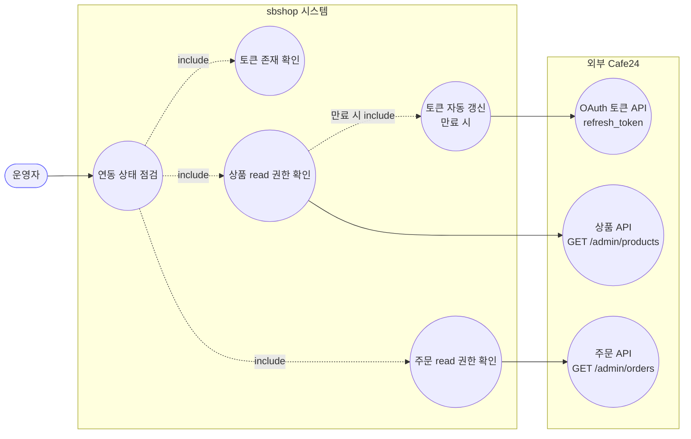
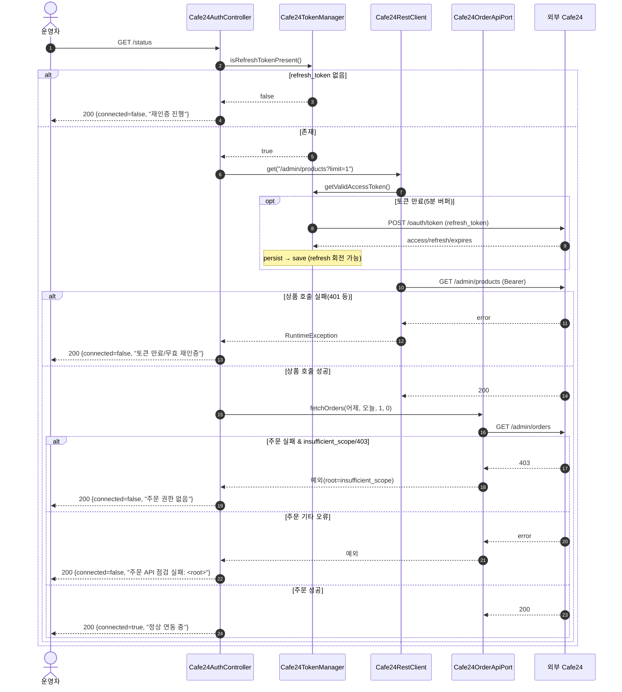
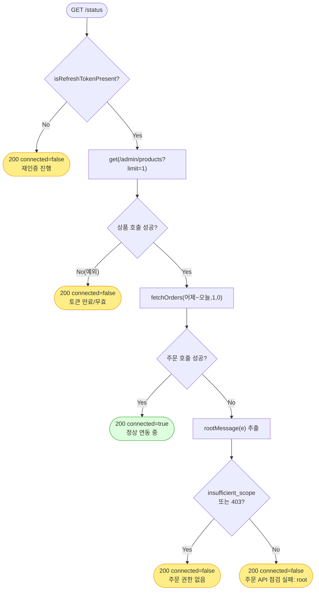

# GET /status — Cafe24 연동 상태 점검

## 1. 개요

| 항목 | 내용 |
|------|------|
| **Method / URL** | `GET /api/admin/sync/cafe24/status` |
| **목적** | 리프레시 토큰의 '존재'가 아니라 '유효성'을 실 Cafe24 API 호출로 검증한다. 상품 read + 주문 read(`mall.read_order`) 두 권한을 모두 확인해 연동 정상 여부를 판정한다. |
| **핵심 상태전이** | 없음(읽기 전용 점검). 단, 내부적으로 토큰 만료 시 `getValidAccessToken()` 이 **refresh_token 회전 + DB 저장**의 부수효과를 일으킬 수 있음. |
| **부수효과** | **외부 Cafe24 GET 2회**(상품 1건·주문 1건). 토큰 만료 시 자동 갱신으로 `sb_market_credential` 갱신 가능. |
| **응답** | `200 OK` + `Cafe24Status{connected, message}` — **성공/실패 무관 항상 200**(예외를 삼켜 status 필드로만 표현). |

## 2. 호출 체인

```
Cafe24AuthController.status()                         api/.../controller/Cafe24AuthController.java:42-73
  ├─ cafe24TokenManager.isRefreshTokenPresent()       infrastructure/.../cafe24/Cafe24TokenManager.java:44-47
  │      └─ marketCredentialRepository.findByMarketType(CAFE24)   Cafe24TokenManager.java:41
  ├─ [상품 권한 확인] cafe24RestClient.get("/admin/products?limit=1")   Cafe24AuthController.java:50
  │      └─ Cafe24RestClient.get()                    infrastructure/.../cafe24/client/Cafe24RestClient.java:25-37
  │           ├─ tokenManager.getApiUrl()             Cafe24TokenManager.java:112-118  (https://{mallId}.cafe24api.com/api/v2)
  │           └─ tokenManager.getValidAccessToken()   Cafe24TokenManager.java:49-69
  │                ├─ isTokenValid() (만료 5분 전 버퍼)  Cafe24TokenManager.java:71-78
  │                └─ refreshLock.runExclusively(0xCAFE24) → doRefresh()   Cafe24TokenManager.java:57-63, 80-100
  │                     └─ tokenClient.exchange(grant_type=refresh_token)  Cafe24OAuthTokenHttpClient.java:22-57
  │                          → persist() → marketCredentialRepository.save()   Cafe24TokenManager.java:102-110
  │           └─ RestClient GET → 외부 Cafe24  (Bearer 헤더)   Cafe24RestClient.java:27-32
  ├─ [주문 권한 확인] cafe24OrderApiPort.fetchOrders(어제, 오늘, 1, 0)   Cafe24AuthController.java:60
  │      └─ Cafe24OrderApiPort.fetchOrders()          core/.../application/order/port/Cafe24OrderApiPort.java:21  (외부 GET /admin/orders)
  │      └─ rootMessage(e) 로 근본원인 추출 → insufficient_scope/403 판별   Cafe24AuthController.java:62-70, 101-107
  └─ return Cafe24Status(true, "정상 연동 중...")       Cafe24AuthController.java:72
```

**요청 파라미터:** 없음.

**응답 바디 (`Cafe24Status`)**

| 필드 | 타입 | 비고 |
|------|------|------|
| `connected` | boolean | 최종 연동 정상 여부 |
| `message` | String | 사용자 안내 문구(재인증 유도 포함) |

## 3. 유스케이스 다이어그램



> **관찰:** 순수 점검 API 이나 내부적으로 외부 호출 2~3회(상품·주문·필요 시 토큰 갱신)를 유발한다. 실패 원인을 "토큰 무효" vs "주문 권한 없음" 으로 구분해 사용자에게 다른 재인증 안내를 준다.

## 4. 시퀀스 다이어그램



## 5. 순서도 (플로우차트)



## 6. 상태 전이표

이 API 는 자체 상태 전이가 없다(읽기 전용). 아래는 **판정 결과표**.

| 조건 | connected | message 요지 | 외부 호출 |
|------|:---------:|--------------|-----------|
| refresh_token 부재 | false | 토큰 없음 → 재인증 | 없음 |
| 상품 호출 실패 | false | 토큰 만료/무효 → 재인증 | 상품 1 |
| 상품 성공 + 주문 403/insufficient_scope | false | 주문 권한(mall.read_order) 없음 | 상품 1 + 주문 1 |
| 상품 성공 + 주문 기타 오류 | false | 주문 API 점검 실패: `<root>` | 상품 1 + 주문 1 |
| 상품·주문 모두 성공 | true | 정상 연동 중 | 상품 1 + 주문 1 |
| (만료 토큰일 때) 위 경로 진입 시 | — | — | + 토큰 갱신 1 (부수효과: refresh 회전·DB save) |

## 7. 🔎 발견사항

### F-CAFE-1 · 🟡 SMELL — 상태 점검이 외부 호출 2~3회를 유발(무거운 헬스체크)
- **근거:** `Cafe24AuthController.java:50`(상품)·`:60`(주문) 두 번의 실 API 호출, 만료 시 `Cafe24TokenManager.java:57-63` 에서 토큰 갱신 1회 추가. 상태 페이지 폴링·자동 새로고침이 있으면 호출이 곱해진다.
- **영향:** UI 가 주기적으로 `/status` 를 호출하면 불필요한 외부 트래픽과 함께 **refresh_token 회전을 자주 촉발**할 수 있다(만료 임박 시). Cafe24 refresh_token 회전은 2 JVM 경쟁 유발 이력이 있어([`Cafe24TokenManager.java:29`] 주석) 부수효과가 가볍지 않다.
- **제안:** 점검 결과를 짧게 캐시(예: 60초)하거나, 상품/주문 중 하나만으로 대표 점검 후 필요 시에만 세부 확인.

### F-CAFE-2 · 🟠 GAP — 모든 실패를 200 으로 감싸 HTTP 계층에서 오류를 구분 불가
- **근거:** `status()` 는 상품/주문 호출 예외를 각각 `catch (Exception e)` 로 삼키고(`:51-55`, `:61-71`) 항상 `ResponseEntity.ok(...)` 를 반환한다. HTTP 상태는 언제나 200.
- **영향:** 프런트/모니터링이 HTTP 상태로 헬스를 판단할 수 없고 반드시 `connected` 필드를 파싱해야 한다. 네트워크 타임아웃·서버 오류(5xx 상당)와 "권한 없음"이 동일하게 200+false 로 뭉개진다.
- **제안:** 의도된 설계라면 문서화. 모니터링 연동이 필요하면 진짜 장애(연결 실패)와 재인증 필요(비즈니스 상태)를 다른 HTTP 코드로 분리 검토.

### F-CAFE-3 · 🟡 SMELL — 상품 실패 메시지가 원인을 "토큰 만료/무효"로 단정
- **근거:** `:51-55` 는 상품 GET 의 **모든 예외**를 "리프레시 토큰이 만료/무효입니다"로 표기한다. 실제로는 네트워크 오류·5xx·스코프 부족(mall.read_product 누락) 등도 이 문구로 나온다.
- **영향:** 상품 read 스코프만 없거나 Cafe24 일시 장애일 때도 사용자에게 "토큰 만료"로 오안내 → 재인증해도 원인이 다르면 반복.
- **제안:** 주문 경로처럼(`:62-70`) 상품 경로도 `rootMessage`/스코프·상태코드 분기로 원인을 구분.

### F-CAFE-4 · 🔵 NOTE — `getApiUrl()`/토큰이 null 이어도 방어 없이 외부 호출 시도
- **근거:** `Cafe24RestClient.getBaseUrl()`(`:20-23`)은 `apiUrl==null` 이면 빈 문자열을 반환하고, `get()` 은 그대로 `"" + path` 로 요청을 만든다. credential 미등록 시 `getValidAccessToken()`(`Cafe24TokenManager.java:51-53`)이 먼저 `IllegalStateException` 을 던져 실제로는 예외 경로로 빠지지만, URL 조립은 방어되지 않음.
- **영향:** 현재 흐름상 치명적이진 않으나, 토큰 획득이 선행되지 않는 호출 경로가 생기면 잘못된 URL 로 요청될 수 있음.
- **제안:** `getBaseUrl()` 이 null 이면 명시적 예외로 조기 실패.

## 8. 테스트 커버리지 메모

- **직접 테스트 없음:** `Cafe24AuthController.status()` 를 대상으로 한 컨트롤러/통합 테스트가 검색되지 않음. `ApiContextLoadSmokeTest` 는 컨텍스트 로드만 확인.
- **간접 커버:** 토큰 유효/만료/갱신/보존 경로는 `Cafe24TokenManagerTest`(4케이스)·`Cafe24TokenManagerConcurrencyTest`·`Cafe24TokenManagerFailFastTest` 가 검증. `status()` 가 의존하는 `getValidAccessToken` 계약은 여기서 보증됨.
- **비어있는 케이스:** ① refresh 부재 분기, ② 상품 실패→false, ③ 주문 403→"권한 없음", ④ 주문 기타 오류→"점검 실패", ⑤ 모두 성공→true. 모두 미검증. `Cafe24RestClient`/`Cafe24OrderApiPort` 목으로 5분기 검증 권장.

---
*생성: 2026-07-14 · 근거 커밋: main@bd4c915*
