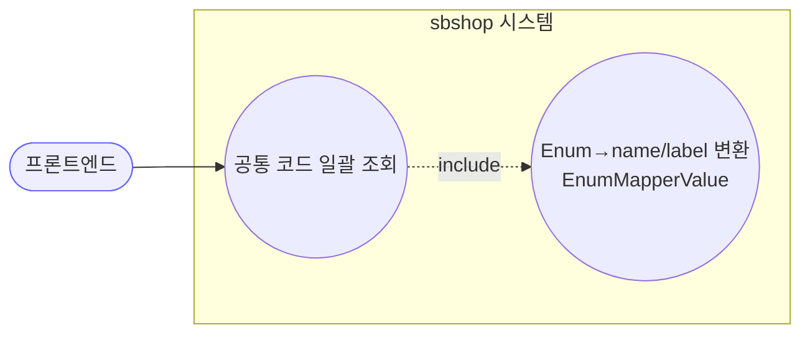
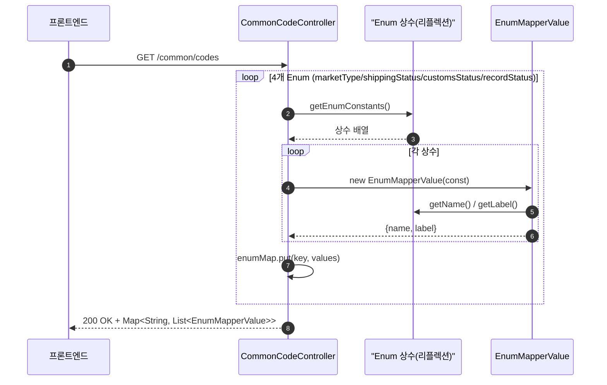
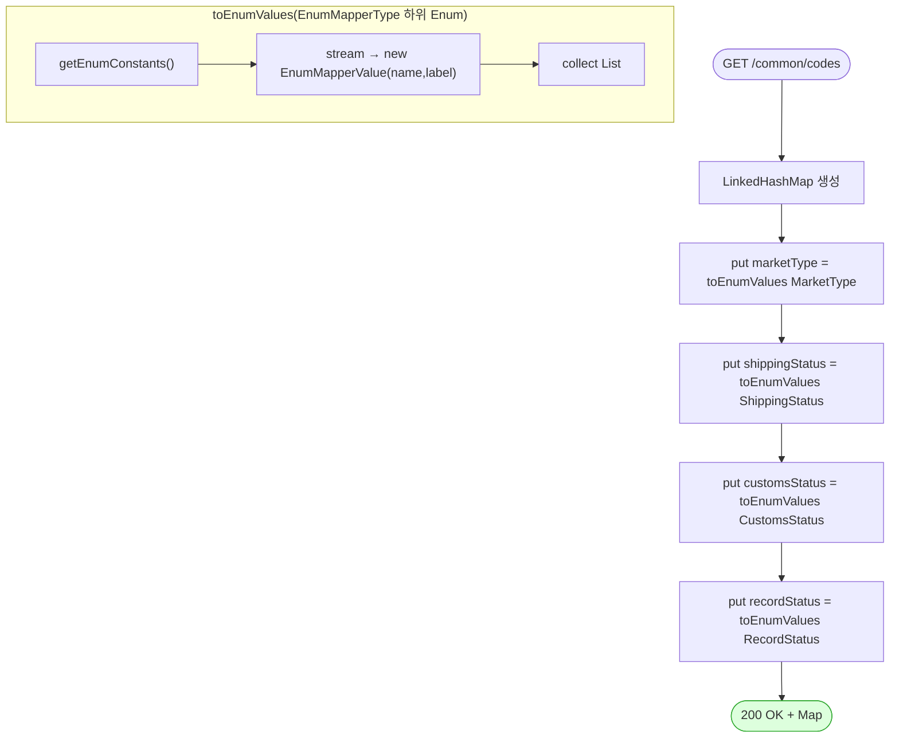

# GET /api/v1/common/codes — 공통 코드(Enum) 조회

## 1. 개요

| 항목 | 내용 |
|------|------|
| **Method / URL** | `GET /api/v1/common/codes` |
| **목적** | 프론트엔드 드롭다운·필터·라벨링에 쓰이는 서버 측 Enum 목록을 `{ name, label }` 쌍으로 일괄 반환한다. 프론트가 Enum을 하드코딩하지 않게 하는 단일 진실 원천. |
| **핵심 상태전이** | 없음 — 순수 조회. DB·외부 접근 없음(Enum 상수 리플렉션만). |
| **부수효과** | 없음. `@Transactional` 조차 불필요(무상태). |
| **응답** | `200 OK` + `Map<String, List<EnumMapperValue>>` |

## 2. 호출 체인

```
CommonCodeController.getCommonCodes()             api/.../controller/CommonCodeController.java:26-36
  └─ toEnumValues(MarketType.class)               CommonCodeController.java:38-42
  └─ toEnumValues(ShippingStatus.class)
  └─ toEnumValues(CustomsStatus.class)
  └─ toEnumValues(RecordStatus.class)
       └─ e.getEnumConstants() 리플렉션 → stream
            └─ new EnumMapperValue(enumConst)     core/.../domain/common/enums/EnumMapperValue.java:10-13
                 ├─ enumConst.getName()   (EnumMapperType 인터페이스)  EnumMapperType.java:4
                 └─ enumConst.getLabel()  (EnumMapperType 인터페이스)  EnumMapperType.java:6
```

**응답 구조** — 키가 고정 4개인 `LinkedHashMap`(삽입 순서 보존).

| 키 | Enum 소스 | 비고 |
|----|-----------|------|
| `marketType` | `MarketType` (`domain/order/enums`) | 쿠팡/스마트스토어/11번가/ESM/Cafe24 등 |
| `shippingStatus` | `ShippingStatus` | NEW·PREPARING·PURCHASED·SHIPPED·DELIVERED·CANCELED·… |
| `customsStatus` | `CustomsStatus` | 통관 상태 |
| `recordStatus` | `RecordStatus` (`domain/common`) | 논리 삭제/활성 등 |

각 값은 `EnumMapperValue { name, label }` (`EnumMapperValue.java:6-8`). 모든 대상 Enum은 `EnumMapperType`(`name()`+`label()`)을 구현해야 매핑 가능.

## 3. 유스케이스 다이어그램



> **관찰:** 행위자가 운영자가 아니라 **프론트엔드(부팅 시 코드 캐시)**. 외부 마켓·DB 무관.

## 4. 시퀀스 다이어그램



## 5. 순서도 (플로우차트)



## 6. 상태 전이표

조회 전용·무상태. 대신 **반환 키 계약표**로 대체한다.

| 응답 키 | 항상 존재? | 소스 Enum | 비어질 수 있나 |
|---------|:----------:|-----------|:--------------:|
| `marketType` | ✅ | `MarketType` | Enum 상수가 있는 한 비지 않음 |
| `shippingStatus` | ✅ | `ShippingStatus` | 동일 |
| `customsStatus` | ✅ | `CustomsStatus` | 동일 |
| `recordStatus` | ✅ | `RecordStatus` | 동일 |

> 응답은 항상 정확히 이 4개 키. 다른 도메인 Enum(예: `ShippingCarrier`, `ActionStatus`)은 **포함되지 않음**(F-MISC-4).

## 7. 🔎 발견사항

### F-MISC-4 · 🟠 GAP — 노출 Enum이 하드코딩 4종뿐, 다른 도메인 Enum 누락
- **근거:** `CommonCodeController.java:30-33` 이 `marketType/shippingStatus/customsStatus/recordStatus` 4개만 수동 `put`. 반면 시스템에는 `ShippingCarrier`(송장 API가 사용), `ActionStatus`(액션 로그) 등 프론트가 라벨링해야 할 Enum이 더 있다.
- **영향:** 프론트가 `ShippingCarrier` 같은 값을 여전히 하드코딩하거나 별도 경로로 얻어야 함 → "단일 진실 원천" 목적이 부분적으로만 달성됨. 새 Enum 추가 시 이 컨트롤러 수동 수정 필요(누락되기 쉬움).
- **제안:** `EnumMapperType` 구현체를 클래스패스 스캔으로 자동 등록하거나, 최소한 프론트가 실제 쓰는 Enum 목록을 점검해 누락분 추가.

### F-MISC-5 · 🟡 SMELL — `EnumMapperValue` 필드가 비-final·게터 노출(가변)
- **근거:** `EnumMapperValue.java:7-8` `private String name; private String label;` — `final` 아님, `@Getter`만. 불변 값 객체인데 record가 아니라 클래스.
- **영향:** 순수 직렬화 DTO치고 가변. 실질 위험은 낮으나 `ActionLogResponse` 가 `record` 인 것과 스타일 비대칭.
- **제안:** `record EnumMapperValue(String name, String label)` 로 전환 검토(생성자에서 `EnumMapperType` 받아 매핑).

### F-MISC-6 · 🔵 NOTE — 캐시 없음, 요청마다 리플렉션 재수행
- **근거:** `getCommonCodes()` 는 매 호출마다 4개 Enum을 `getEnumConstants()` + 스트림 매핑(`CommonCodeController.java:38-42`). Enum은 불변이라 결과가 절대 안 바뀜.
- **영향:** 비용은 미미하나 정적 응답에 캐싱·`Cache-Control` 헤더가 없어 프론트가 매 부팅마다 재요청.
- **제안:** 결과를 static 캐시하거나 HTTP 캐시 헤더 부여(무상태·불변이므로 안전).

## 8. 테스트 커버리지 메모

- 이 컨트롤러(`CommonCodeController`)·`EnumMapperValue` 전용 테스트가 **검색되지 않음**.
- **비어있는 케이스:** ① 4개 키 모두 존재·비어있지 않음, ② 각 Enum 상수 수 == 응답 리스트 크기, ③ `name/label` 이 `EnumMapperType` 구현과 일치. 회귀 방지용으로 Enum 추가 시 키 누락(F-MISC-4)을 잡는 계약 테스트 권장.

---
*생성: 2026-07-14 · 근거 커밋: main@bd4c915*
