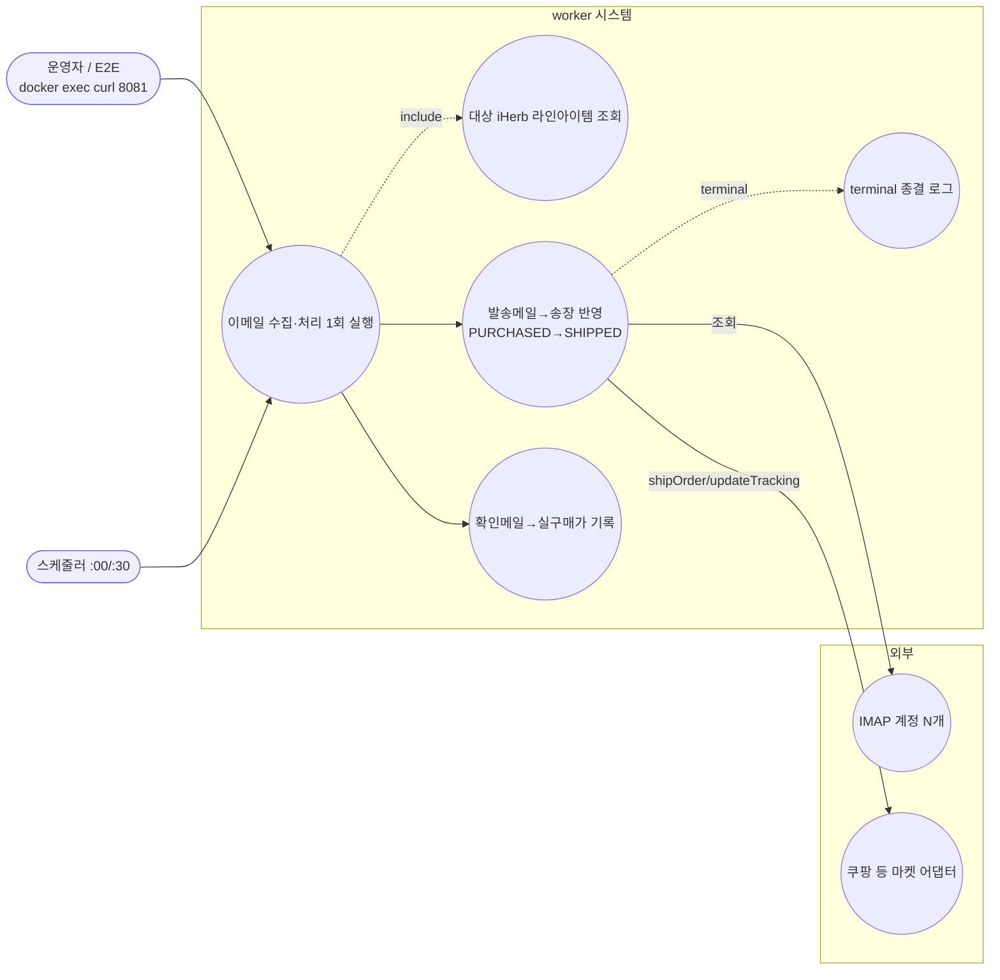
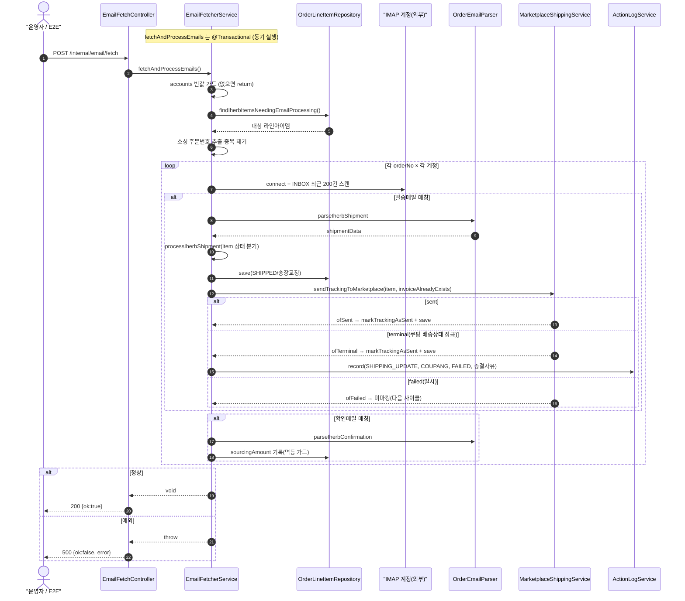
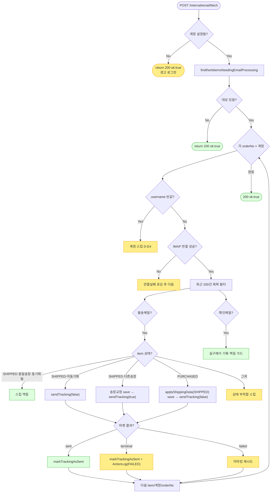

# POST /internal/email/fetch — 이메일 IMAP 수집·송장 처리 즉시 트리거 (worker)

> **[반영 2026-07-15]** F-MISC-18(🔴) 해결 — AtomicBoolean CAS 재진입 가드로 수동/스케줄러 동시실행 중복 송장 차단 (커밋 `c8e2bb8`).

## 1. 개요

| 항목 | 내용 |
|------|------|
| **Method / URL** | `POST /internal/email/fetch` (worker 모듈, 컨테이너 로컬 8081 전용) |
| **목적** | 스케줄러(:00/:30)를 기다리지 않고 iHerb 발송/확인 이메일 IMAP 수집 → 송장 대조 → 마켓 송장 반영 파이프라인을 **즉시 1회** 실행한다. 운영/E2E 검증용(`docker exec curl localhost:8081`). |
| **핵심 상태전이** | 대상 라인아이템 `PURCHASED → SHIPPED`(발송 메일 매칭 시) / `SHIPPED` 송장 교정 / 확인 메일로 `sourcingAmount`(실구매가) 기록. |
| **부수효과** | ① 외부 IMAP 서버 다중 계정 연결·조회, ② 라인아이템 저장(송장/상태/실구매가), ③ **마켓 송장 전송**(shipOrder/updateTracking), ④ terminal 시 액션 로그 기록. |
| **응답** | 성공 `200 {ok:true}` / 실패 `500 {ok:false,error}` — **동기 실행**(파이프라인 완료까지 대기). |

## 2. 호출 체인

```
EmailFetchController.fetch()                       worker/.../controller/EmailFetchController.java:29-40
  └─ emailFetcherService.fetchAndProcessEmails()   worker/.../service/EmailFetcherService.java:40-70  (@Transactional)
       ├─ properties.getAccounts() 빈값 가드         :42-45  (D-E4)
       ├─ orderLineItemRepository.findIherbItemsNeedingEmailProcessing()   :48
       │      └─ infra OrderLineItemRepositoryImpl.findIherbItemsNeedingEmailProcessing  :35-45
       │             = sourcingVendor="IHB" & orderNo present & (PURCHASED OR (SHIPPED & 미동기화))
       ├─ 소싱 주문번호 추출·중복 제거(HashSet)        :55-62
       └─ for orderNo in orderNos:  searchAndProcessForOrderNo(orderNo)   :67-69
            └─ for account in properties.getAccounts():                    :76-78
                 └─ searchInAccountForOrderNo(account, orderNo)            :85-169
                      ├─ 빈 username 계정 스킵(D-E4)   :87-90
                      ├─ IMAP 연결(imaps, 타임아웃 10s/30s)  :92-102
                      ├─ INBOX READ_ONLY, 최근 200건만 스캔   :105-115
                      ├─ 발송 메일 "주문이 발송되었습니다 #{orderNo}"
                      │    → parser.parseIherbShipment → processIherbShipment(...)  :127-138
                      └─ 확인 메일 "주문이 확인되었습니다 #{orderNo}"
                           → parser.parseIherbConfirmation → processIherbConfirmation(...)  :141-150

[송장 반영 파이프라인] processIherbShipment()        :172-258
  ├─ findBySourcingData_SourcingOrderNo(orderNo)     :174
  └─ 각 item 상태별 분기:
       ├─ SHIPPED & 동일송장 & 마켓동기화됨 → 스킵(멱등)   :189-200
       ├─ SHIPPED & 동일송장 & 미동기화 → sendTracking(false=최초등록) → handleMarketResult  :204-207
       ├─ SHIPPED & 다른송장 → 송장 교정 save → sendTracking(true=updateTracking) → handle  :212-229
       └─ PURCHASED → applyShippingData(SHIPPED) save → sendTracking(false) → handle       :233-252
            └─ MarketplaceShippingService.sendTrackingToMarketplace(item, invoiceAlreadyExists)  core/.../service/MarketplaceShippingService.java:62

[결과 후처리] handleMarketResult()                   :267-289
  ├─ result.sent()     → markTrackingAsSent + save                         :269-273
  ├─ result.isTerminal() → markTrackingAsSent + save + ActionLog(FAILED,COUPANG)  :274-285 (D-E6 재시도 종결)
  └─ 일시 failed        → 미마킹(다음 사이클 재시도)                         :286-288

[확인 메일 파이프라인] processIherbConfirmation()     :292-326
  └─ 실구매가 없으면 sourcingAmount 기록(멱등 가드 :306) → save
```

**호출자 비교** — 동일 서비스 메서드를 **스케줄러도 호출**: `OrderSyncScheduler.syncOrders()`(`worker/.../scheduler/OrderSyncScheduler.java:36-48`, cron `0 0/30`). 이 컨트롤러는 그 스케줄 경로의 **수동 트리거 복제**다(F-MISC-19).

## 3. 유스케이스 다이어그램



## 4. 시퀀스 다이어그램



## 5. 순서도 (플로우차트)



## 6. 상태 전이표 (라인아이템)

| 진입 상태 / 조건 | 발송메일 처리 | 결과 상태 | 마켓 전송 | 근거 |
|------------------|---------------|-----------|-----------|------|
| `PURCHASED` | 송장 반영 | `SHIPPED` | `shipOrder`(false) | `EmailFetcherService.java:233-252` |
| `SHIPPED` · 동일송장 · 마켓 동기화됨 | 스킵(멱등) | 유지 | 없음 | `:189-200` |
| `SHIPPED` · 동일송장 · 미동기화 | 재시도 | 유지 | `shipOrder`(false) | `:204-207` |
| `SHIPPED` · 다른송장 | 송장 교정 | 유지 | `updateTracking`(true) | `:212-229` |
| 그 외 상태 | 스킵 | 유지 | 없음 | `:253-255` |
| (확인메일) `sourcingAmount` 미기록 | 실구매가 기록 | 유지 | 없음 | `:301-324` |

> 마켓 결과 후처리(`handleMarketResult`): **sent**→마킹 / **terminal**→마킹+감사로그(재시도 종결, D-E6) / **failed**→미마킹(다음 사이클 재시도).

## 7. 🔎 발견사항

### F-MISC-17 · 🟠 GAP — `/internal` 엔드포인트에 접근제어가 "포트 비노출" 관례에만 의존
- **근거:** `EmailFetchController.java:22,29` `POST /internal/email/fetch` 는 인증/인가 코드가 전혀 없다. 보호는 "nginx에 노출 안 함, 8081 로컬만"이라는 **주석상 관례**(`:16-19`)뿐. worker JVM은 api와 같은 컨테이너에서 8081을 연다.
- **영향:** 컨테이너 네트워크에 접근 가능한 무엇이든(사이드카·오설정 프록시·SSRF) 인증 없이 **IMAP 수집→마켓 송장 전송** 파이프라인을 임의 실행 가능. 부수효과가 큰(마켓에 실제 송장 전송) 엔드포인트라 위험도 높음.
- **제안:** 최소한 공유 시크릿 헤더/로컬호스트 바인딩 강제 검증. 관례가 아니라 코드로 접근 제어(보안 비중요 정책이라도 부수효과 크기 대비 문서화 필요).

### F-MISC-18 · 🔴 BUG(후보) — 재진입/중복 처리 방지 없음: 스케줄러와 수동 트리거 동시 실행 시 이중 처리
- **근거:** `fetchAndProcessEmails`(`:40`)에 실행 중 잠금이 없다. 스케줄러 `OrderSyncScheduler.syncOrders`(cron `0 0/30`, `:36`)와 이 컨트롤러가 **같은 메서드를 같은 worker JVM에서** 호출한다. :00/:30 근처에 수동 트리거를 호출하면 두 실행이 겹칠 수 있다.
- **영향:** 동일 orderNo를 두 실행이 동시에 집으면 `sendTrackingToMarketplace` 가 마켓에 **중복 송장 전송**을 시도할 수 있음. 상태 가드(SHIPPED·동기화됨 스킵 `:189`)와 확인메일 멱등 가드(`:306`)가 일부 완화하나, PURCHASED→SHIPPED 전이가 커밋되기 전 두 트랜잭션이 겹치면 이중 전송 창이 존재.
- **제안:** advisory lock(원장 권장 패턴)이나 `SyncStatusService.markRunning(EMAIL)` 기반 재진입 가드를 서비스 진입부에 두어 동시 1회만 허용. 원장 등재 권장.

### F-MISC-19 · 🟡 SMELL — 컨트롤러가 스케줄러 경로를 우회해 서비스 직접 호출(상태 추적 불일치)
- **근거:** 스케줄러는 `syncStatusService.markRunning/Completed/Failed(EMAIL)` 로 동기화 상태를 기록(`OrderSyncScheduler.java:39-46`)하지만, 이 컨트롤러(`EmailFetchController.java:33`)는 `fetchAndProcessEmails()` 만 직접 호출 → **SyncStatus 갱신 없음**.
- **영향:** 수동 트리거로 실행하면 상태 대시보드/`SyncStatus` 에 EMAIL 동기화가 "실행됨"으로 안 남음. 운영자가 트리거했는데 상태판엔 미반영 → 혼선.
- **제안:** 컨트롤러도 스케줄러와 동일하게 `markRunning/Completed/Failed` 를 감싸거나, 상태 기록을 서비스 안으로 내려 두 경로가 공유.

### F-MISC-20 · 🟠 GAP — 컨트롤러 응답이 파이프라인 실제 결과를 반영하지 못함
- **근거:** `fetch()` 는 예외만 잡아 500(`:35-38`), 그 외엔 무조건 `200 {ok:true}`(`:34`). 그런데 서비스는 **계정 미설정·대상 없음·IMAP 연결 실패·마켓 terminal(전송 실패)** 을 모두 내부에서 삼키고 정상 반환한다(`:42-45,:165-168,:286-288`).
- **영향:** 마켓 송장 전송이 terminal로 실패해도(F-MISC-17의 핵심 부수효과) 트리거 응답은 `ok:true`. E2E/운영자가 "성공"으로 오판. 실제 처리 건수·실패 사유가 응답에 없음.
- **제안:** 처리 요약(대상 건수·전송 성공/종결/실패 카운트)을 응답에 실어 트리거 결과를 관측 가능하게. 최소한 "대상 0건"과 "처리 성공"을 구분.

### F-MISC-21 · 🟡 SMELL — IMAP 스캔이 "최근 200건 제목 부분일치"에 의존(누락·오매칭 위험)
- **근거:** `EmailFetcherService.java:112,115,127,141` — `totalMessages-199` 부터만 가져와 `subject.contains(...)` 로 필터. 200건을 넘는 과거 발송메일은 스캔 범위 밖.
- **영향:** 처리 지연으로 대상 메일이 최근 200건 밖으로 밀리면 **영구 미처리**(주문번호가 계속 대상에 남아도 못 찾음). `contains` 는 유사 제목 오매칭 가능.
- **제안:** IMAP 서버 측 검색(SearchTerm) 대체 가능 계정은 사용하고, 범위를 날짜 기반으로 재설계. Gmail SubjectTerm 미지원 회피의 트레이드오프임을 문서화.

### F-MISC-22 · 🔵 NOTE — 다계정·다주문 순회의 IMAP 연결 비용(N×M) + 조기종료 부재
- **근거:** `:67-78` orderNo마다 모든 계정을 순회하며 계정별로 IMAP connect/close 반복. 한 계정에서 찾아도 다른 계정 스캔은 orderNo 단위로만 조기 종료(메일 2종 발견 시 `:153-154`).
- **영향:** 주문·계정 수가 늘면 IMAP 연결 수가 곱으로 증가(연결 타임아웃 10s/30s 감안 시 지연 큼). 동기 실행이라 컨트롤러 응답도 그만큼 지연.
- **제안:** 계정별 1회 연결로 모든 대상 orderNo를 한 세션에서 처리하도록 순회 순서 반전 검토(계정 바깥 루프).

## 8. 테스트 커버리지 메모

- **존재:** `EmailFetcherServiceTest`(worker test) — 서비스 처리 로직 검증(파서 매핑·상태 분기 등 일부).
- **비어있는 케이스:**
  - 컨트롤러(`EmailFetchController`) 자체의 200/500 응답·접근제어(F-MISC-17) 테스트 없음.
  - **재진입/중복 처리**(F-MISC-18) 회귀 테스트 — 동시 실행 시나리오 미검증.
  - **terminal 결과의 응답 반영**(F-MISC-20) — 현재 응답이 결과를 안 담아 검증 대상 자체가 없음.
  - IMAP 200건 경계·조기종료(F-MISC-21/22).
  - `handleMarketResult` 의 sent/terminal/failed 3분기(`:269-288`) 직접 검증 여부 확인 필요.

---
*생성: 2026-07-14 · 근거 커밋: main@bd4c915*
