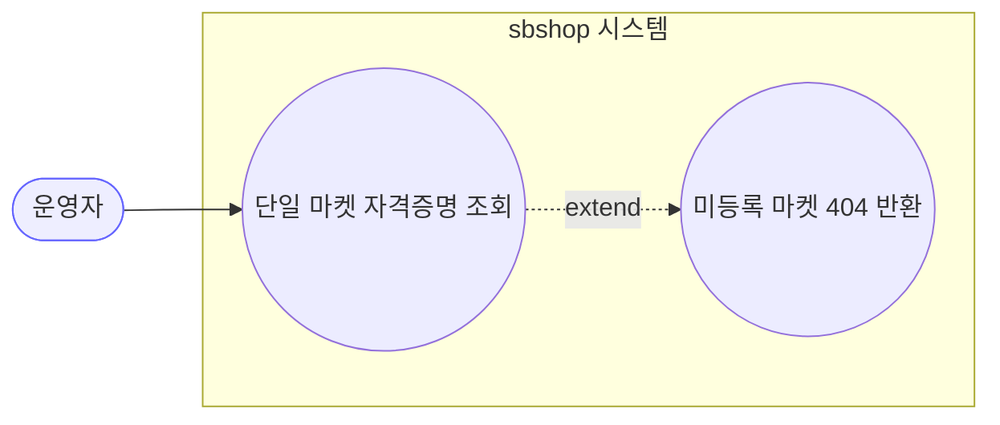
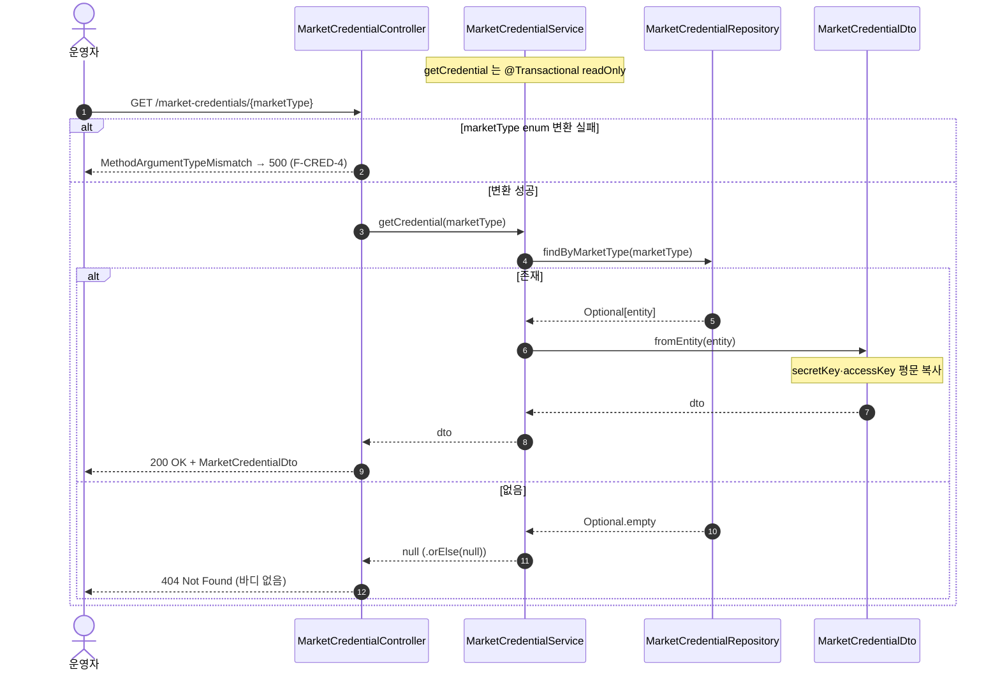
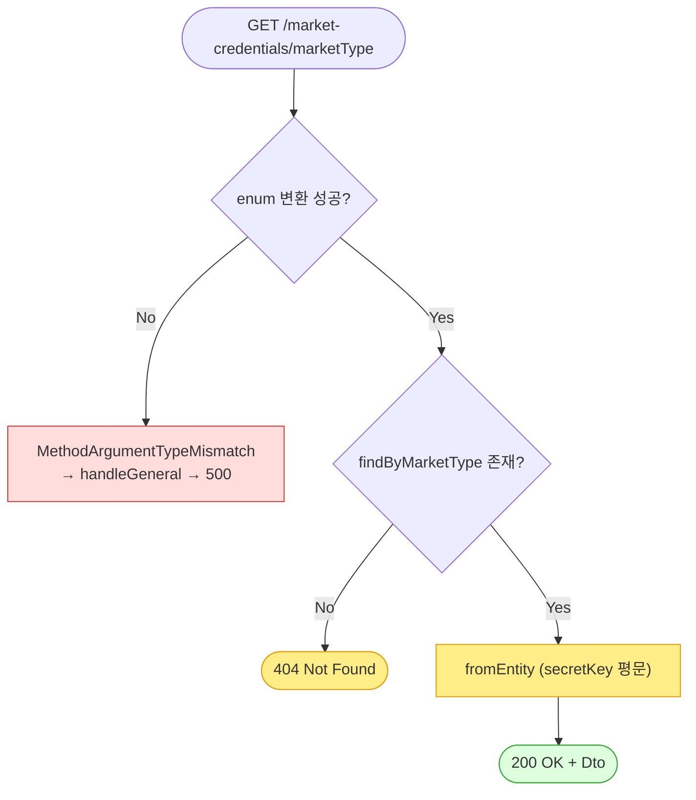

# GET /market-credentials/{marketType} — 단일 마켓 자격증명 조회

> **[P1 반영 2026-07-14]** F-CRED-4(미정의 marketType→500) 해결 — `MethodArgumentTypeMismatchException` 핸들러로 400 처리 (커밋 `60b02fe`).

## 1. 개요

| 항목 | 내용 |
|------|------|
| **Method / URL** | `GET /api/v1/market-credentials/{marketType}` |
| **목적** | 특정 마켓(경로변수 `marketType`)의 자격증명 1건을 조회한다. |
| **핵심 상태전이** | 없음(순수 조회, `@Transactional(readOnly = true)`) |
| **부수효과** | 없음(로컬 조회만) |
| **응답** | 존재: `200 OK` + `MarketCredentialDto` / 미존재: `404 Not Found`(바디 없음) |

## 2. 호출 체인

```
MarketCredentialController.getCredential(marketType)   api/.../controller/MarketCredentialController.java:36-41
  └─ (Spring) String → MarketType enum 변환             @PathVariable, 실패 시 MethodArgumentTypeMismatchException (F-CRED-4)
  └─ MarketCredentialService.getCredential(marketType)  core/.../application/market/MarketCredentialService.java:27-32
       ├─ MarketCredentialRepository.findByMarketType() core/.../domain/market/repository/MarketCredentialRepository.java:11
       ├─ Optional.map(MarketCredentialDto::fromEntity) MarketCredentialDto.java:17-28 (secretKey 평문 복사)
       └─ .orElse(null)                                 MarketCredentialService.java:31 → 컨트롤러가 null → 404
  └─ dto != null ? 200 : 404                            MarketCredentialController.java:40
```

**경로변수 (`marketType`)**

| 값 | 처리 | 근거 |
|----|------|------|
| 유효 enum(`COUPANG`·`SMART_STORE`·`ELEVEN_STREET`·`GMARKET`·`AUCTION`·`CAFE24`·`UNKNOWN`) | enum 변환 성공 → 조회 | `MarketType.java:10-16` |
| `UNKNOWN` | **유효 enum** — 조회 대상이 됨 | `MarketType.java:16` (F-CRED-5) |
| 미정의 문자열(예: `FOO`) | 변환 실패 → 예외 | Spring 바인딩 (F-CRED-4) |

## 3. 유스케이스 다이어그램



## 4. 시퀀스 다이어그램



## 5. 순서도 (플로우차트)



## 6. 상태 전이표

| 진입 조건 | 허용? | 결과 | 부수효과 | 비고 |
|-----------|:-----:|------|----------|------|
| 미정의 `marketType` 문자열 | ❌ | `500`(예상은 400/404) | 없음 | F-CRED-4 — 전용 핸들러 부재 |
| 유효 enum, 미등록 | ✅ | `404 Not Found` | 없음 | `.orElse(null)` → 컨트롤러 404 |
| 유효 enum, 등록됨 | ✅ | `200 OK` + Dto | 없음 | **secretKey 평문 포함** (F-CRED-1 참조) |
| `UNKNOWN` | ✅ | 등록 여부에 따라 200/404 | 없음 | F-CRED-5 — 유효 enum 취급 |

## 7. 🔎 발견사항

### F-CRED-4 · 🟠 GAP — 미정의 `marketType` 경로변수가 400/404 아닌 500 으로 응답
- **근거:** `@PathVariable MarketType marketType`(`MarketCredentialController.java:37-38`)의 String→enum 변환 실패는 Spring `MethodArgumentTypeMismatchException` 을 던진다. `GlobalExceptionHandler`(`api/.../exception/GlobalExceptionHandler.java`)에는 `IllegalStateException`(400)·`IllegalArgumentException`(400)·`Exception`(500) 핸들러만 있고 **타입 미스매치 전용 핸들러가 없어** `handleGeneral` 로 흘러 `500` + "서버 내부 오류" 를 반환한다(`GlobalExceptionHandler.java:32-43`).
- **영향:** 클라이언트 입력 오류(잘못된 마켓 코드)가 서버 오류(5xx)로 잘못 표면화된다. 재시도·모니터링·알람이 5xx 스파이크로 오탐. 응답 메시지에 내부 예외 문자열 노출.
- **제안:** `MethodArgumentTypeMismatchException`(또는 `HttpMessageNotReadableException` 포함) 핸들러를 추가해 `400 Bad Request` 로 정규화. 전 컨트롤러 공통 이슈이므로 `GlobalExceptionHandler` 레벨 수정.

### F-CRED-5 · 🔵 NOTE — `UNKNOWN` 이 유효 enum이라 조회/저장 대상이 됨
- **근거:** `MarketType.UNKNOWN`(`MarketType.java:16`)은 실 마켓이 아닌 fallback 값이나 enum 상수로 존재. 따라서 `GET /market-credentials/UNKNOWN` 은 변환 성공하여 조회 경로로 진입한다(404 or 200).
- **영향:** 실 마켓이 아닌 `UNKNOWN` 자격증명이 조회·(PUT 시) 생성될 수 있어 데이터에 의미 없는 레코드가 생길 여지. 동작 오류는 아니나 의도 확인 필요.
- **제안:** `UNKNOWN` 을 자격증명 API 대상에서 제외할지(400) 정책 확인. 제외 시 서비스 진입 가드 추가.

### F-CRED-6 · 🔵 NOTE — 404 응답이 바디 없이 반환되어 프론트 파싱과 비대칭
- **근거:** 미존재 시 `ResponseEntity.notFound().build()`(`MarketCredentialController.java:40`)로 **빈 바디** 404. 프론트 `fetchCredential`(`marketApi.ts:18-21`)은 `data` 를 `MarketCredential` 로 기대하므로 404 는 axios 에러로 처리된다(설정 화면은 목록 API 를 주로 사용).
- **영향:** 신규 마켓(미등록) 단건 조회 시 정상 흐름임에도 4xx 에러 로그가 남는다. `GlobalExceptionHandler` 의 `{success,message}` 규격과도 다른 형태(빈 바디).
- **제안:** 미등록을 "빈 자격증명 200" 으로 볼지 "404" 로 볼지 계약 통일. 유지한다면 프론트에서 404 를 정상 케이스로 처리.

## 8. 테스트 커버리지 메모

- 본 엔드포인트(`getCredential`)에 대한 컨트롤러/서비스 테스트 **없음**.
- **비어있는 케이스:** ① 등록됨 → 200 + DTO, ② 미등록 → 404, ③ 미정의 marketType → (현재 500, 기대 400) F-CRED-4, ④ `secretKey` 마스킹 여부(F-CRED-1), ⑤ `UNKNOWN` 처리(F-CRED-5).
- 정책 확정(F-CRED-1·4·5) 후 Red 테스트부터 추가 권장.

---
*생성: 2026-07-14 · 근거 커밋: main@bd4c915*
