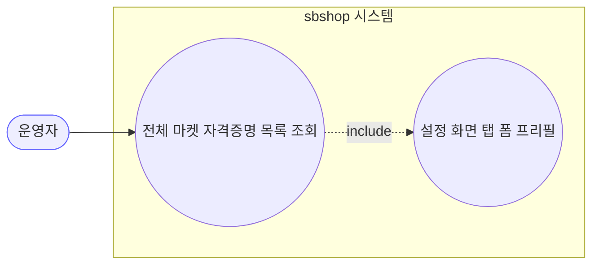
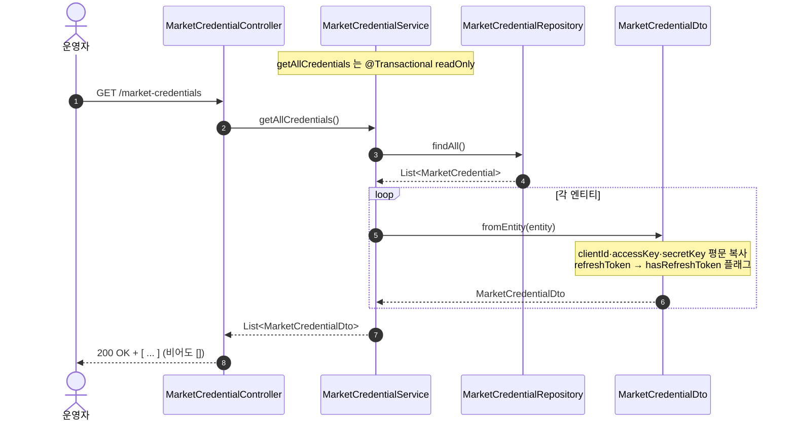
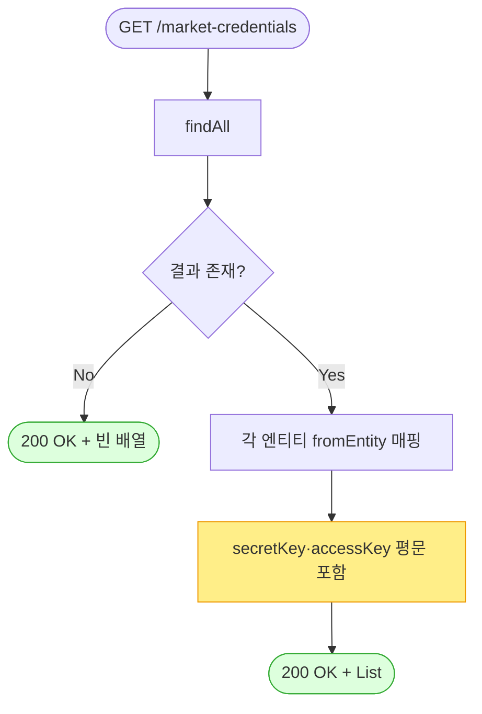

# GET /market-credentials — 마켓 자격증명 목록 조회

> **[P5b 반영 2026-07-15]** F-CRED-1(🔴) 해결 — accessKey·secretKey 평문 제거, hasX 플래그 마스킹 (커밋 `019e20d`).

## 1. 개요

| 항목 | 내용 |
|------|------|
| **Method / URL** | `GET /api/v1/market-credentials` |
| **목적** | 등록된 모든 마켓(쿠팡·스마트스토어·11번가·G마켓·옥션·카페24)의 API 자격증명을 목록으로 조회한다. 설정 화면(`Settings.tsx`)이 탭별 폼을 채우는 데 사용. |
| **핵심 상태전이** | 없음(순수 조회, `@Transactional(readOnly = true)`) |
| **부수효과** | 없음(로컬 조회만) |
| **응답** | `200 OK` + `List<MarketCredentialDto>` — **비어 있어도 빈 배열 `[]` 200** |

## 2. 호출 체인

```
MarketCredentialController.getAllCredentials()        api/.../controller/MarketCredentialController.java:31-34
  └─ MarketCredentialService.getAllCredentials()       core/.../application/market/MarketCredentialService.java:21-25
       ├─ MarketCredentialRepository.findAll()          core/.../domain/market/repository/MarketCredentialRepository.java:10 (JpaRepository)
       └─ MarketCredentialDto.fromEntity(each)          core/.../application/market/dto/MarketCredentialDto.java:17-28
            └─ clientId·accessKey·secretKey·redirectUri **평문 그대로 복사**  MarketCredentialDto.java:20-24
            └─ refreshToken → hasRefreshToken(boolean) 로만 노출  MarketCredentialDto.java:25-26
```

**응답 바디 (`MarketCredentialDto`) — 필드별 노출 정책**

| 필드 | 타입 | 노출 형태 | 근거 | 비고 |
|------|------|-----------|------|------|
| `id` | Long | 원본 | `MarketCredentialDto.java:20` | — |
| `marketType` | MarketType(enum) | 원본 | `:21` | — |
| `clientId` | String | **평문** | `:22` | 마스킹 없음 |
| `accessKey` | String | **평문** | `:23` | 마스킹 없음 (F-CRED-1) |
| `secretKey` | String | **평문** | `:24` | 마스킹 없음 (F-CRED-1) |
| `redirectUri` | String | 원본 | `:25` | — |
| `hasRefreshToken` | boolean | **파생 플래그** | `:25-26` | `refreshToken != null && !isBlank()` — 유일하게 마스킹된 시크릿 |
| `refreshToken` | — | **미노출** | (DTO에 필드 없음) | — |
| `accessToken` | — | **미노출** | (DTO에 필드 없음) | — |
| `tokenExpiresAt` | — | **미노출** | (DTO에 필드 없음) | — |

## 3. 유스케이스 다이어그램



> **관찰:** 외부 마켓과 상호작용하지 않는 순수 로컬 조회. 활동로그(`ActionLogService`) 기록도 없음(조회계열).

## 4. 시퀀스 다이어그램



## 5. 순서도 (플로우차트)



## 6. 상태 전이표

| 진입 조건 | 허용? | 결과 | 부수효과 | 비고 |
|-----------|:-----:|------|----------|------|
| 자격증명 0건 | ✅ | `200 OK` + `[]` | 없음 | 빈 배열(예외 아님) |
| 자격증명 N건 | ✅ | `200 OK` + N개 DTO | 없음 | **secretKey 평문 포함** (F-CRED-1) |

## 7. 🔎 발견사항

### F-CRED-1 · 🔴 BUG(후보) — 목록 응답이 `secretKey`·`accessKey`·`clientId` 를 평문으로 반환(마스킹 부재)
> ✅ **해결됨** (커밋 `019e20d`) — 체크리스트 기준.

- **근거:** `MarketCredentialDto.fromEntity()` (`MarketCredentialDto.java:22-24`) 가 `clientId/accessKey/secretKey` 를 원본 그대로 복사한다. `getAllCredentials()`(`MarketCredentialService.java:21-25`)는 이 DTO 리스트를 그대로 반환하고, 컨트롤러(`MarketCredentialController.java:33`)가 200으로 내보낸다. `refreshToken` 만 `hasRefreshToken` 플래그로 마스킹될 뿐(`MarketCredentialDto.java:25-26`), 정작 서명에 쓰이는 `secretKey` 는 평문 노출.
- **영향:** 인증/인가가 없는 이 API(`@CrossOrigin(origins = "*")`, `MarketCredentialController.java:24`)로 전 마켓의 시크릿 키가 평문 유출된다. 프론트(`marketApi.ts:3-11`)도 `secretKey: string` 을 그대로 받아 폼에 프리필한다(`Settings.tsx`). 브라우저 개발자도구·프록시·캐시 어디서든 노출.
- **제안:** 조회 응답에서 `secretKey`(그리고 정책에 따라 `accessKey`)를 `hasRefreshToken` 과 같은 마스킹 방식(`****` 또는 `hasSecretKey` 플래그)으로 대체. 편집 시 "변경 없으면 기존 값 유지" 시맨틱과 함께 설계 필요. **원장 등재 권장.**

### F-CRED-2 · 🟠 GAP — 저장 시 암호화 부재로 DB에 평문 저장(조회는 그 평문을 그대로 반출)
> ⬜ **미해결(백로그)**.

- **근거:** 엔티티 `MarketCredential`(`MarketCredential.java:39-58`)의 `client_id/access_key/secret_key` 컬럼에 암호화 컨버터(`@Convert` 등)가 없다. `saveCredential`(`MarketCredentialService.java:41-43`)이 평문을 그대로 set. 따라서 이 목록 API는 **DB 평문 → 응답 평문** 경로.
- **영향:** DB 덤프·백업·로그 어디서든 시크릿 평문 노출. F-CRED-1 과 결합 시 저장·전송 양단 모두 평문.
- **제안:** `secretKey` 등에 JPA `AttributeConverter` 기반 암호화(at-rest) 도입 검토. 정책 결정 대상.

### F-CRED-3 · 🔵 NOTE — 목록 API는 활동로그를 남기지 않음(조회계열 일관)
> ⬜ **미해결(백로그)**.

- **근거:** `getAllCredentials`(`MarketCredentialController.java:31-34`)에는 `actionLogService.record(...)` 호출이 없다(PUT 에만 존재, `:52/56`).
- **영향:** 시크릿 노출 성격의 조회임에도 감사 추적이 없다. 다른 조회 API(`getOrders` 등)와 일관되나, 민감 데이터 반출 관점에선 접근 로그 부재가 감사 공백.
- **제안:** 민감 자격증명 조회는 최소한 접근 로그(누가·언제) 기록을 검토(정책 사안).

## 8. 테스트 커버리지 메모

- `MarketCredentialService.getAllCredentials` / `MarketCredentialDto.fromEntity` 의 **마스킹 계약을 검증하는 테스트 없음**.
- 인접 테스트 `MarketCredentialValidationTest`(`core/src/test/.../MarketCredentialValidationTest.java`)는 **동기화 서비스**의 빈 자격증명 fast-fail(D-043)만 검증하며, 본 API(목록 조회/마스킹)와 무관.
- **비어있는 케이스:** ① 빈 배열 반환, ② `secretKey` 마스킹 여부(F-CRED-1 정책 확정 후 Red 테스트), ③ `hasRefreshToken` 파생 로직(refreshToken null/blank/값).

---
*생성: 2026-07-14 · 근거 커밋: main@bd4c915*
