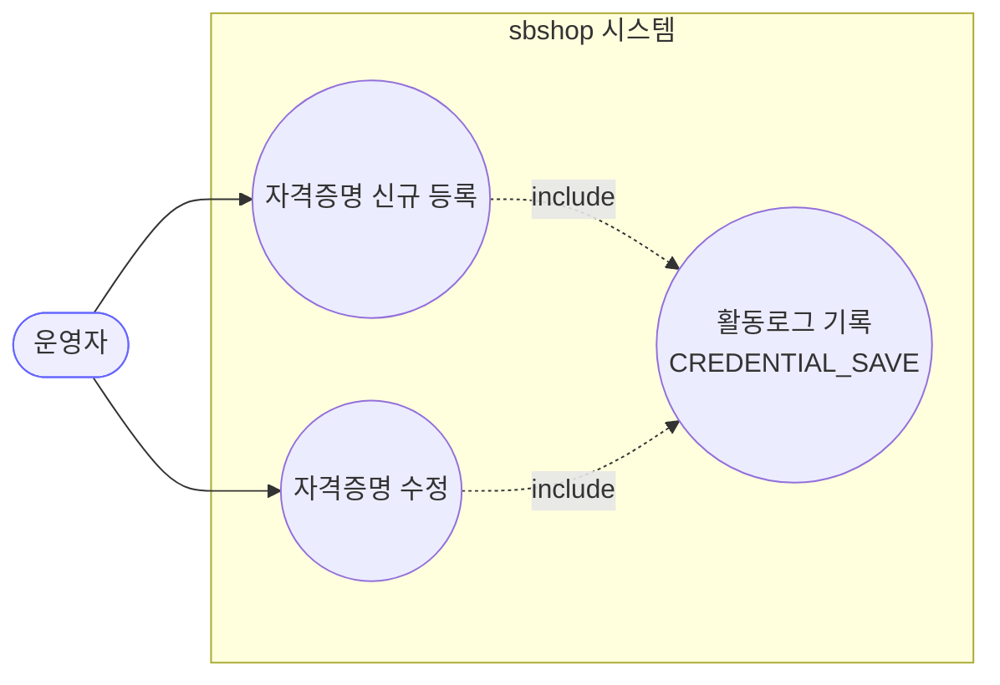
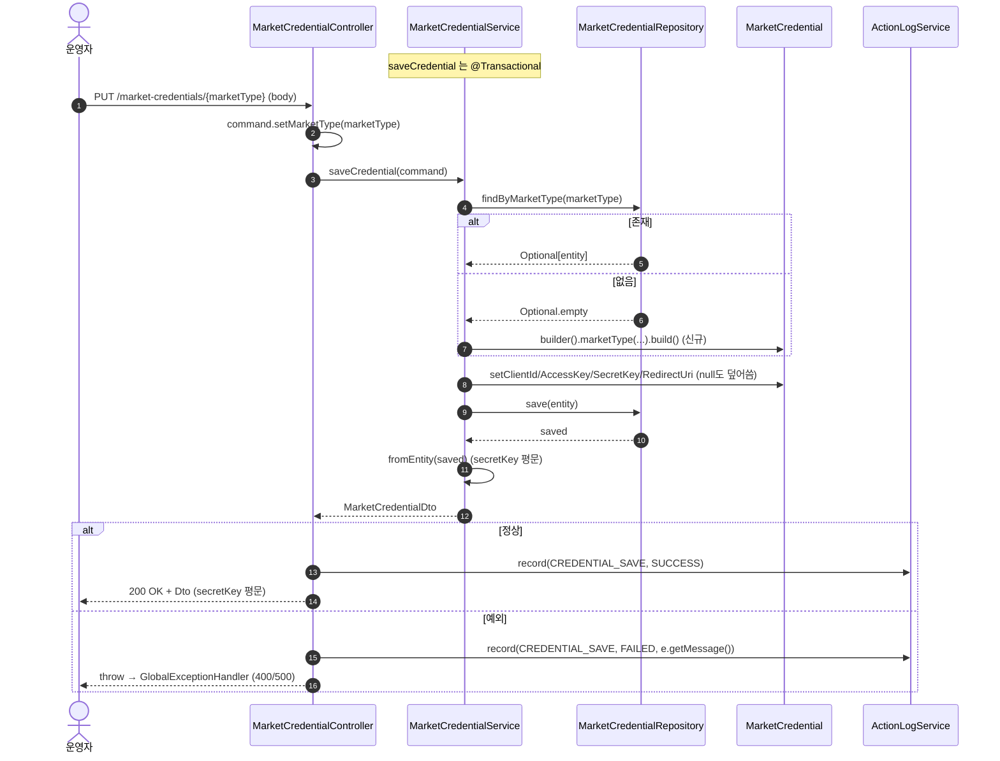
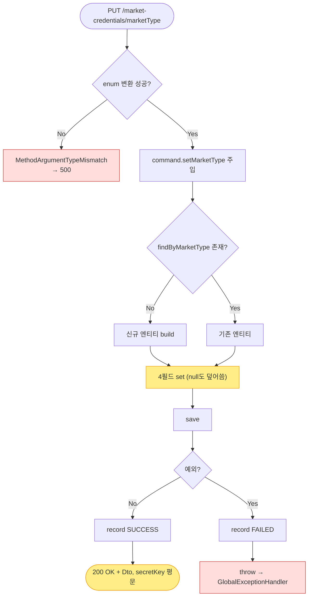

# PUT /market-credentials/{marketType} — 마켓 자격증명 등록/수정(Upsert)

> **[P5b 반영 2026-07-15]** F-CRED-7·8 해결 — 저장 응답 마스킹, 빈 시크릿이면 기존값 유지 (커밋 `019e20d`).

## 1. 개요

| 항목 | 내용 |
|------|------|
| **Method / URL** | `PUT /api/v1/market-credentials/{marketType}` |
| **목적** | 특정 마켓의 API 자격증명을 **등록 또는 수정(upsert)** 한다. 기존 레코드가 있으면 갱신, 없으면 새로 생성. |
| **핵심 상태전이** | (없음) → 레코드 생성 / (존재) → 4개 필드 덮어쓰기 |
| **부수효과** | **로컬 저장** + **활동로그 기록**(`CREDENTIAL_SAVE`, 성공/실패 모두). 외부 마켓 전송 없음. |
| **응답** | `200 OK` + `MarketCredentialDto`(저장 결과) / 실패 시 예외 전파 → `GlobalExceptionHandler` |

## 2. 호출 체인

```
MarketCredentialController.saveCredential(marketType, command)   api/.../controller/MarketCredentialController.java:43-60
  ├─ command.setMarketType(marketType)                           MarketCredentialController.java:48 (경로변수를 커맨드에 주입 — 바디값 무시)
  ├─ MarketCredentialService.saveCredential(command)             core/.../application/market/MarketCredentialService.java:34-48  @Transactional
  │    ├─ repo.findByMarketType(command.getMarketType())         MarketCredentialService.java:36-37
  │    │    └─ .orElseGet(() -> MarketCredential.builder()...build())  MarketCredentialService.java:38-39 (신규 생성)
  │    ├─ credential.setClientId(command.getClientId())          MarketCredentialService.java:41 (null-skip 아님 — null 덮어씀)
  │    ├─ credential.setAccessKey(command.getAccessKey())        MarketCredentialService.java:42
  │    ├─ credential.setSecretKey(command.getSecretKey())        MarketCredentialService.java:43
  │    ├─ credential.setRedirectUri(command.getRedirectUri())    MarketCredentialService.java:44
  │    ├─ repo.save(credential)                                  MarketCredentialService.java:46
  │    └─ MarketCredentialDto.fromEntity(saved)                  MarketCredentialDto.java:17 (secretKey 평문 반환)
  ├─ (성공) actionLogService.record(CREDENTIAL_SAVE, SUCCESS)    MarketCredentialController.java:52-53
  └─ (예외) actionLogService.record(CREDENTIAL_SAVE, FAILED); throw   MarketCredentialController.java:55-58
```

**요청 바디 (`MarketCredentialSaveCommand`)**

| 필드 | 타입 | 필수 | 병합 방식 | 근거 | 비고 |
|------|------|------|-----------|------|------|
| `marketType` | MarketType | — | **바디값 무시** | `MarketCredentialController.java:48` | 경로변수로 덮어씀 |
| `clientId` | String | 검증 없음 | **덮어쓰기(null이면 null로)** | `MarketCredentialService.java:41` | null-skip 아님 (F-CRED-8) |
| `accessKey` | String | 검증 없음 | 덮어쓰기 | `:42` | — |
| `secretKey` | String | 검증 없음 | 덮어쓰기 | `:43` | — |
| `redirectUri` | String | 검증 없음 | 덮어쓰기 | `:44` | — |

> **미갱신 필드(수정 시 보존):** `refreshToken`·`accessToken`·`tokenExpiresAt`·`isActive` 는 `saveCredential` 이 건드리지 않아 기존 값 유지(신규 생성 시 `isActive` 는 엔티티 기본값 `true`, `MarketCredential.java:86`). OAuth 토큰 보존 관점에선 의도적.

## 3. 유스케이스 다이어그램



> **관찰:** 이 API 는 외부 마켓과 상호작용하지 않는다(순수 로컬 upsert + 로그). 자격증명이 실제로 유효한지 검증하는 라이브 호출은 없음.

## 4. 시퀀스 다이어그램



## 5. 순서도 (플로우차트)



## 6. 상태 전이표

| 진입 조건 | 허용? | 결과 | 부수효과 | 비고 |
|-----------|:-----:|------|----------|------|
| 미정의 `marketType` | ❌ | `500`(기대 400) | 로그 없음(예외가 서비스 前) | F-CRED-4 (get 문서와 공유) |
| 유효 enum, 미등록 | ✅ | 신규 생성 → `200` | `CREDENTIAL_SAVE` SUCCESS 로그 | upsert-insert |
| 유효 enum, 등록됨 | ✅ | 4필드 덮어쓰기 → `200` | `CREDENTIAL_SAVE` SUCCESS 로그 | upsert-update, null 필드도 덮어씀(F-CRED-8) |
| 저장 중 예외 | ❌ | 예외 전파 | `CREDENTIAL_SAVE` FAILED 로그 | `@Transactional` 롤백 |
| `UNKNOWN` | ✅ | 생성/수정 | 로그 SUCCESS | F-CRED-5 — 무의미 레코드 생성 여지 |

## 7. 🔎 발견사항

### F-CRED-7 · 🔴 BUG(후보) — 저장 성공 응답이 방금 저장한 `secretKey` 를 평문으로 되돌려줌
> ✅ **해결됨** (커밋 `019e20d`) — 체크리스트 기준.

- **근거:** `saveCredential` 이 `MarketCredentialDto.fromEntity(saved)`(`MarketCredentialService.java:47`)를 반환하고, 컨트롤러(`MarketCredentialController.java:54`)가 그대로 200 으로 내보낸다. `fromEntity` 는 `secretKey/accessKey` 를 평문 복사(`MarketCredentialDto.java:22-24`).
- **영향:** 저장 왕복(request→response) 전 구간에서 시크릿 평문 노출. F-CRED-1(목록)·F-CRED-2(저장 at-rest)와 동일 뿌리의 저장 경로 변형. 인증 없는 `@CrossOrigin(*)` API 라 노출면이 넓다.
- **제안:** 저장 응답도 마스킹 DTO 로 통일(F-CRED-1 과 함께 처리). **원장 등재 권장.**

### F-CRED-8 · 🟠 GAP — PUT 이 부분 업데이트가 아니라 4필드 전체 덮어쓰기(null 도 덮어씀) → 기존 값 소실 위험
> ✅ **해결됨** (커밋 `019e20d`) — 체크리스트 기준.

- **근거:** `saveCredential`(`MarketCredentialService.java:41-44`)은 `command` 의 각 필드를 **무조건** set 한다. sourcing/shipping 계열의 null-skip 병합(`toSourcingData`/`toShippingData`)과 달리 null 가드가 없다. 프론트 `saveCredential(marketType, Partial<MarketCredential>)`(`marketApi.ts:23-28`)은 `Partial` 을 보내므로 일부 필드가 누락되면 **누락 필드가 null 로 저장돼 기존 값이 지워진다.**
- **영향:** 예) `secretKey` 만 바꾸려고 그 필드만 보내면 `clientId/accessKey/redirectUri` 가 null 로 덮어써져 연동이 깨진다. `refreshToken/accessToken` 은 보존되나(미터치) 나머지 4필드는 취약.
- **제안:** PUT 의 전체 교체 시맨틱을 유지할지(그렇다면 프론트가 항상 전체 필드 전송하도록 계약 명시) vs. null-skip 병합으로 부분 업데이트를 허용할지 정책 확인. 현재 프론트(`Settings.tsx`)가 폼 전체를 전송하는지 확인 필요.

### F-CRED-9 · 🟠 GAP — 자격증명 필드 입력 검증 전무(빈 값/형식 검증 없음)
> ⬜ **미해결(백로그)**.

- **근거:** 요청(`MarketCredentialSaveCommand.java`)·서비스(`MarketCredentialService.java:34-48`) 어디에도 null/blank/형식 검증이 없다. 빈 문자열 `secretKey` 도 그대로 저장된다.
- **영향:** 불완전 자격증명이 저장되고 200 을 반환한다. 실제 마켓 연동은 나중 동기화 시점에야 실패한다(그 실패는 `MarketCredentialValidationTest` D-043 가 다루는 별개 지점). 즉 **저장 시점 fast-fail 부재**로 잘못된 값이 조용히 안착.
- **제안:** 최소한 마켓별 필수 키(예: 쿠팡 accessKey/secretKey)에 대한 blank 검증을 저장 진입 시 추가. D-043(동기화단 검증)과 대칭되게 저장단에도 게이트.

### F-CRED-10 · 🟡 SMELL — 저장 실패 시 활동로그 메시지에 `e.getMessage()` 원문 노출
> ⬜ **미해결(백로그)**.

- **근거:** `MarketCredentialController.java:57` 이 `"API 키 저장 실패: " + e.getMessage()` 를 활동로그로 남긴다. 예외 원문에 시크릿/내부 구조가 섞여 로그에 유입될 수 있다.
- **영향:** 활동로그(감사 화면)에 내부 예외 메시지 노출. 민감 데이터 로그 유입 가능성.
- **제안:** 실패 로그는 요약 메시지로 표준화하고 상세는 서버 로그(`log.error`)로 분리.

## 8. 테스트 커버리지 메모

- 본 엔드포인트(`saveCredential`)의 upsert/검증/마스킹 계약을 검증하는 테스트 **없음**.
- 이름이 유사한 `MarketCredentialValidationTest`(`core/src/test/.../MarketCredentialValidationTest.java`)는 **동기화 서비스**의 빈 자격증명 fast-fail(D-043)만 다루며 저장 API 와 무관 — 혼동 주의.
- **비어있는 케이스:** ① 신규 insert, ② 기존 update, ③ 부분 필드 전송 시 null 덮어쓰기 동작(F-CRED-8), ④ 빈 secretKey 저장 허용 여부(F-CRED-9), ⑤ 저장 응답 secretKey 마스킹(F-CRED-7), ⑥ 실패 시 FAILED 로그 기록.
- 정책 확정(F-CRED-7·8·9) 후 Red 테스트부터 추가 권장 → `sbshop-normalize` 사이클로 이관.

---
*생성: 2026-07-14 · 근거 커밋: main@bd4c915*
