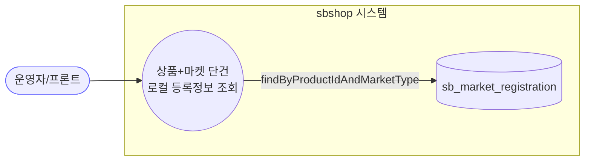
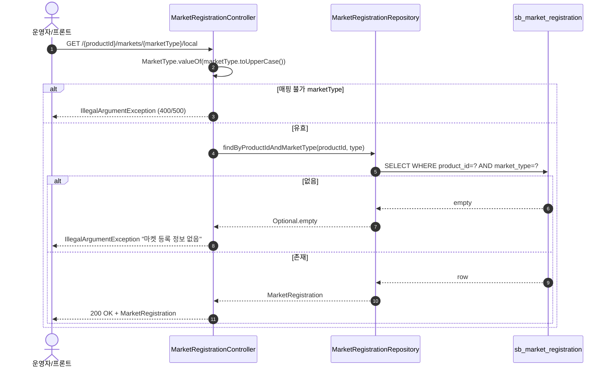
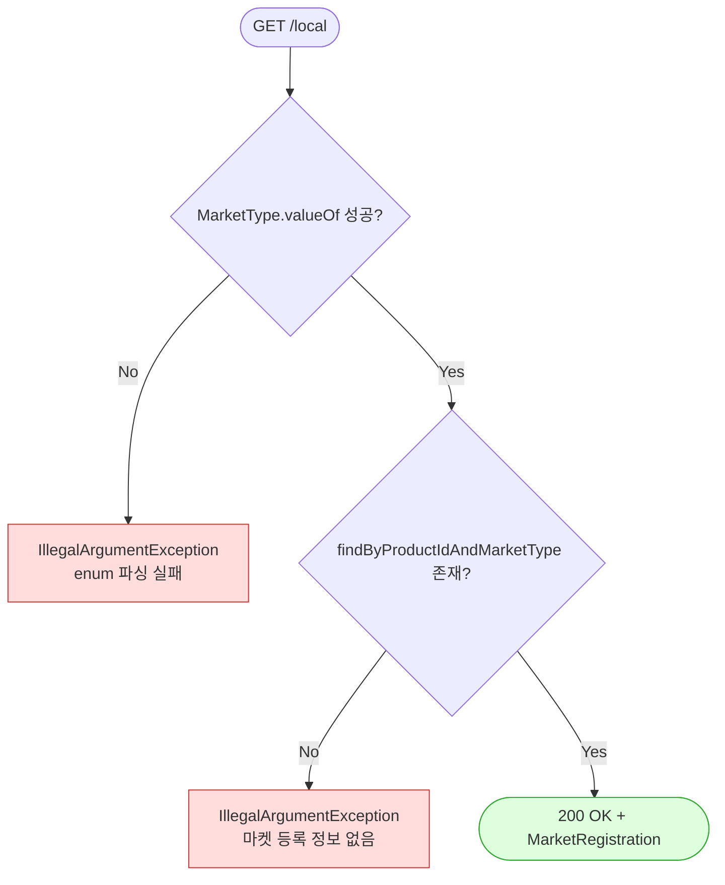

# GET /products/{productId}/markets/{marketType}/local — 특정 마켓 로컬 등록정보 단건 조회

## 1. 개요

| 항목 | 내용 |
|------|------|
| **Method / URL** | `GET /api/v1/products/{productId}/markets/{marketType}/local` |
| **목적** | 특정 상품(`productId`)의 **특정 마켓(`marketType`)에 대한 로컬 등록정보(`MarketRegistration`) 단건**을 조회한다. "local" = 외부 마켓 호출 없이 **자사 DB에 저장된 값**만 반환(↔ `sync` 는 라이브 마켓 조회). |
| **핵심 상태전이** | **없음** — 순수 조회. |
| **부수효과** | 없음(로컬 DB 조회만). |
| **응답** | `200 OK` + `MarketRegistration`(도메인 엔티티). 없으면 `IllegalArgumentException`(→ 대개 500/400 전파). |

## 2. 호출 체인

```
MarketRegistrationController.getLocalMarketData()       api/.../controller/MarketRegistrationController.java:37-48
  └─ MarketType.valueOf(marketType.toUpperCase())        MarketRegistrationController.java:43   (enum 파싱, 실패 시 IllegalArgumentException)
  └─ marketRegistrationRepository.findByProductIdAndMarketType(productId, type)   core/.../market/repository/MarketRegistrationRepository.java:21
       └─ Optional<MarketRegistration>
       └─ .orElseThrow(IllegalArgumentException "마켓 등록 정보 없음: ...")   MarketRegistrationController.java:46
  └─ ResponseEntity.ok(MarketRegistration)               MarketRegistrationController.java:47
```

- **요청 파라미터:** `@PathVariable Long productId`, `@PathVariable String marketType`(문자열 — enum 아님).
- `marketType` 은 `String` 으로 받아 컨트롤러 내부에서 `MarketType.valueOf(marketType.toUpperCase())` 로 파싱한다(`java:43`). 매핑 안 되는 값이면 `IllegalArgumentException`(F-MREG-3).
- **DTO 없음 / Service 없음** — 컨트롤러가 Repository 직접 호출(F-MREG-6).
- 응답 엔티티는 `list-registrations` 와 동일하게 원시 JSON(`marketIdentifiers`/`marketDetailedInfo`) 포함 전체 노출(F-MREG-4).

## 3. 유스케이스 다이어그램



> **관찰:** "local" 은 외부 마켓 미조회를 명시. 라이브 조회가 필요하면 `sync` 사용.

## 4. 시퀀스 다이어그램



## 5. 순서도 (플로우차트)



## 6. 상태 전이표

| 진입 조건 | 허용? | 결과 | 부수효과 | 비고 |
|-----------|:-----:|------|----------|------|
| `marketType` enum 매핑 실패 | ❌ | `IllegalArgumentException` | 없음 | 대소문자 무시 파싱, 그래도 불일치면 예외(F-MREG-3) |
| 유효 `marketType` + 등록 존재 | ✅ | `MarketRegistration` + 200 | 없음 | 정상 |
| 유효 `marketType` + 등록 없음 | ❌ | `IllegalArgumentException` "마켓 등록 정보 없음" | 없음 | 404 성격이나 예외 타입/상태코드 미정의(F-MREG-3) |

## 7. 🔎 발견사항

### F-MREG-3 · 🟠 GAP — `marketType` 유효성·미존재를 `IllegalArgumentException` 으로만 처리(상태코드 불명확)
> 🔶 **부분/오탐** — bad-enum은 이미 400(오탐), 404 시맨틱 구분 부재는 잔존.

- **근거:** `MarketRegistrationController.java:43` 의 `MarketType.valueOf(marketType.toUpperCase())` 는 매핑 실패 시 `IllegalArgumentException` 을 던지고, `java:46` 의 `orElseThrow` 도 동일하게 `IllegalArgumentException` 을 던진다. 별도 `@ExceptionHandler`/`ResponseStatus` 매핑이 컨트롤러에 없다.
- **영향:** (a) "잘못된 마켓명"과 (b) "등록 정보 없음"이 **같은 예외 타입**이라 클라이언트가 원인을 구분하기 어렵다. (b) 는 의미상 404 여야 하나 전역 핸들러 설정에 따라 400/500 으로 전파될 수 있다. `MarketType.UNKNOWN` 이 enum 에 존재하므로 `"unknown"` 문자열은 예외 없이 통과해 "등록 없음"으로 흘러가는 점도 혼동 요인.
- **제안:** 미존재는 404(`NoSuchElementException`/전용 예외), 잘못된 마켓명은 400 으로 분리. `UNKNOWN` 을 조회 대상에서 명시적으로 배제할지 정책 확인.

### F-MREG-4 · 🟡 SMELL — 응답으로 도메인 엔티티(`MarketRegistration`) 직접 노출
> ✅ **해결됨** (커밋 `54087b6`) — 체크리스트 기준.

- **근거:** `MarketRegistrationController.java:38` 반환 타입 `MarketRegistration`. `marketIdentifiers`/`marketDetailedInfo` 원시 JSON 및 내부 필드 전체 노출.
- **영향:** `list-registrations` 의 F-MREG-4 와 동일 — 직렬화가 영속 모델에 결합, 내부 식별자 노출.
- **제안:** 조회 응답 DTO 도입(전 API 공통).

### F-MREG-6 · 🟡 SMELL — 컨트롤러가 Repository 직접 호출(서비스 계층 부재)
> ✅ **해결됨** (커밋 `d81fa42`) — 체크리스트 기준.

- **근거:** `MarketRegistrationController.java:44-46` — enum 파싱·조회·예외를 컨트롤러가 직접 수행.
- **제안:** `list-registrations` 의 F-MREG-6 참조. 조회 유스케이스로 이관 검토.

## 8. 테스트 커버리지 메모

- `getLocalMarketData` 직접 대상 테스트 **검색되지 않음**.
- **비어있는 케이스:** ① 정상 단건 조회, ② 잘못된 `marketType`(enum 미매핑) → 예외/상태코드, ③ 유효 마켓 + 미등록 → 예외/상태코드(F-MREG-3), ④ `"unknown"` 문자열 입력 시 동작.
- 예외→상태코드 매핑 정책 확정 후 계약 테스트 추가 권장.

---
*생성: 2026-07-14 · 근거 커밋: main@bd4c915*
