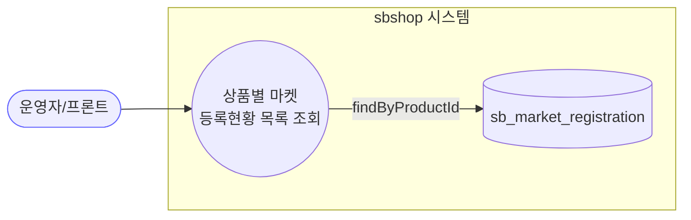
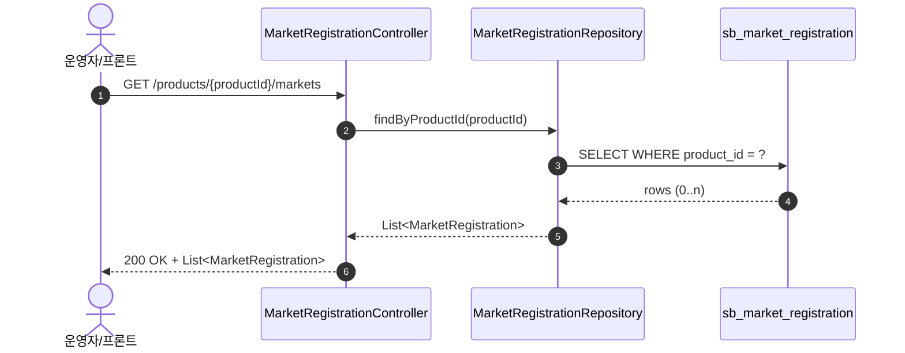
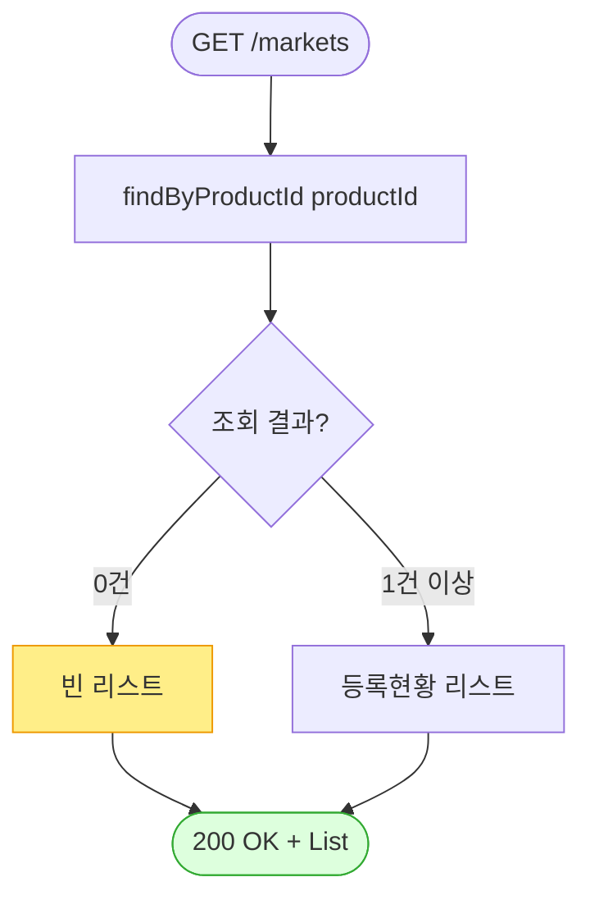

# GET /products/{productId}/markets — 상품의 마켓 등록현황 목록 조회

## 1. 개요

| 항목 | 내용 |
|------|------|
| **Method / URL** | `GET /api/v1/products/{productId}/markets` |
| **목적** | 특정 상품(`productId`)에 대해 존재하는 **마켓별 등록현황(`MarketRegistration`) 목록**을 조회한다. 각 마켓(쿠팡·스마트스토어·11번가·카페24·ESM)에 상품이 어떻게 등록/동기화되어 있는지를 한 번에 보여준다. |
| **핵심 상태전이** | **없음** — 순수 조회(read-only). 상태 변화·부수효과 없음. |
| **부수효과** | 없음(로컬 DB 조회만). 외부 마켓 호출 없음. |
| **응답** | `200 OK` + `List<MarketRegistration>`(도메인 엔티티 리스트 그대로) |

## 2. 호출 체인

```
MarketRegistrationController.getMarketRegistrations()   api/.../controller/MarketRegistrationController.java:30-35
  └─ marketRegistrationRepository.findByProductId(productId)   core/.../market/repository/MarketRegistrationRepository.java:15
       └─ (Spring Data 파생 쿼리) SELECT * FROM sb_market_registration WHERE product_id = ?
  └─ ResponseEntity.ok(List<MarketRegistration>)          MarketRegistrationController.java:34
```

- **DTO 없음** — 요청 파라미터는 `@PathVariable Long productId` 하나뿐. 응답도 도메인 엔티티 `MarketRegistration` 을 그대로 직렬화한다(F-MREG-4).
- **Service 없음** — 컨트롤러가 Repository 를 직접 호출한다(애플리케이션 서비스 계층 미경유, F-MREG-6).
- 반환 엔티티 `MarketRegistration` 의 직렬화 형태:
  - `marketIdentifiers`·`marketDetailedInfo` 는 `@JsonRawValue` + 커스텀 getter(`MarketRegistration.java:59-67`)로 **원시 JSON 문자열**을 그대로 노출하며, 유효하지 않으면 `"{}"` 로 대체된다.
  - `isSynced`·`lastSyncedAt`·`sbProductId`·`marketProductName` 등 내부 필드도 전부 노출된다.

## 3. 유스케이스 다이어그램



> **관찰:** 외부 마켓과 상호작용하지 않는 순수 조회. 동일 컨트롤러의 `sync` API 와 대조적.

## 4. 시퀀스 다이어그램



> `productId` 검증·존재 확인이 없어 **없는 상품이면 빈 리스트 + 200** 을 반환한다(404 아님, F-MREG-2).

## 5. 순서도 (플로우차트)



> 분기·가드·예외 경로가 사실상 없다. `productId` 가 숫자로 파싱되지 않으면 스프링 MVC 단에서 400(`MethodArgumentTypeMismatchException`)이 발생하나, 이는 컨트롤러 로직 이전 단계다.

## 6. 상태 전이표

| 진입 조건 | 허용? | 결과 | 부수효과 | 비고 |
|-----------|:-----:|------|----------|------|
| `productId` 에 등록 N건 존재 | ✅ | `List`(N건) | 없음 | 정상 |
| `productId` 에 등록 0건 | ✅ | 빈 `List` + 200 | 없음 | 존재하지 않는 상품도 동일 응답(F-MREG-2) |
| `productId` 비-숫자 | ❌ | 400 | 없음 | 스프링 타입 변환 실패(컨트롤러 진입 전) |

> 이 API 는 상태를 바꾸지 않으므로 "상태 전이" 개념상 항상 read-only.

## 7. 🔎 발견사항

### F-MREG-2 · 🟠 GAP — 존재하지 않는 `productId` 도 빈 리스트 + 200 을 반환(존재 검증 없음)
- **근거:** `MarketRegistrationController.java:33` 은 `findByProductId(productId)` 결과를 검증 없이 그대로 반환한다. `Product` 존재 여부를 확인하지 않는다.
- **영향:** 잘못된/삭제된 `productId` 요청과 "등록이 하나도 없는 정상 상품" 요청이 응답상 구분되지 않는다. 프론트가 404 로 오류 처리하려 해도 불가.
- **제안:** 목록 조회는 빈 리스트 반환이 자연스러운 REST 관례이므로 **의도라면 NOTE 로 격하**. 다만 `sync`/`local` 엔드포인트는 404 성격(IllegalArgumentException)을 던지므로 **동일 컨트롤러 내 일관성**을 위해 정책 확인 권장.

### F-MREG-4 · 🟡 SMELL — 응답으로 도메인 엔티티(`MarketRegistration`) 직접 노출
- **근거:** `MarketRegistrationController.java:31` 반환 타입이 `List<MarketRegistration>`(JPA 엔티티). 응답 DTO 미사용.
- **영향:** 직렬화 형태가 도메인/영속 모델 변경에 결합된다. `marketIdentifiers`·`marketDetailedInfo` 의 **원시 JSON**이 그대로 클라이언트에 노출(내부 마켓 식별자·벤더 코드 등). `sbProductId` 같은 내부 매핑키도 노출.
- **제안:** 조회 응답 DTO 도입(order 도메인의 `OrderDetailDto` 와 대칭). 전 API 공통 횡단 이슈로 승격 가능(order 문서 F-S5·F-H6 과 동일 계열).

### F-MREG-6 · 🟡 SMELL — 컨트롤러가 Repository 를 직접 호출(애플리케이션 서비스 계층 부재)
- **근거:** `MarketRegistrationController.java:27-28` 이 `MarketRegistrationRepository`·`MarketClientRouter` 를 직접 주입받아, 세 엔드포인트 모두 서비스 경유 없이 리포지토리/라우터를 다룬다. `sync` 엔드포인트에는 `extractVendorItemId`→`productId` 폴백 등 도메인 로직도 컨트롤러에 들어 있다(`java:61-64`).
- **영향:** 트랜잭션 경계·재사용·테스트 지점이 컨트롤러에 묶인다. 동일 조회를 다른 곳에서 재사용하기 어렵고, 컨트롤러 단위테스트가 곧 통합테스트가 된다.
- **제안:** `MarketRegistrationQueryService`(또는 유스케이스) 도입으로 조회/동기화 흐름을 서비스 계층으로 이동 검토. 이 세 엔드포인트 공통.

## 8. 테스트 커버리지 메모

- `getMarketRegistrations` 를 직접 대상으로 하는 컨트롤러/서비스 테스트가 **검색되지 않음**.
- **비어있는 케이스:** ① 등록 N건 정상 반환, ② 등록 0건 → 빈 리스트(F-MREG-2 동작 확정), ③ 응답 직렬화에 원시 JSON 노출 여부(F-MREG-4).
- 순수 조회라 우선순위 낮음. 응답 계약(DTO 도입) 결정 시 회귀 테스트 추가 권장.

---
*생성: 2026-07-14 · 근거 커밋: main@bd4c915*
