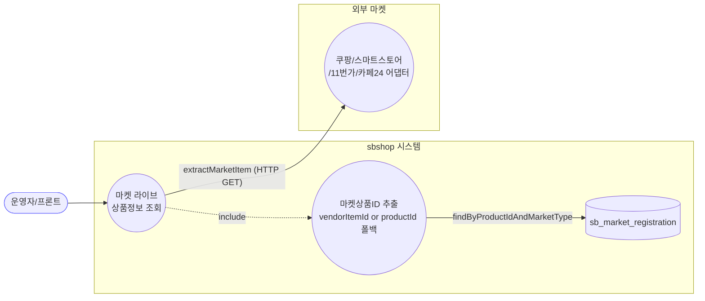
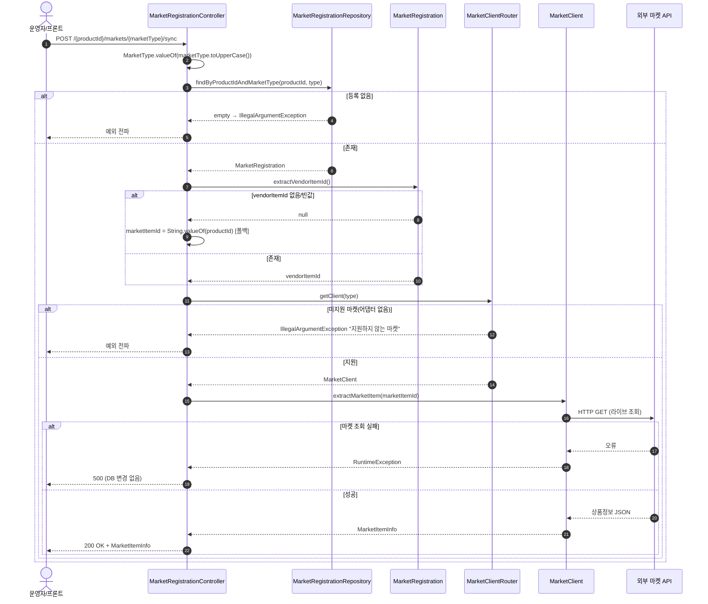
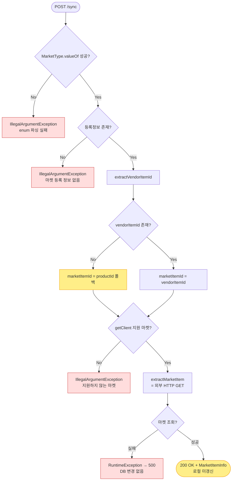

# POST /products/{productId}/markets/{marketType}/sync — 마켓 라이브 상품정보 조회(동기화)

## 1. 개요

| 항목 | 내용 |
|------|------|
| **Method / URL** | `POST /api/v1/products/{productId}/markets/{marketType}/sync` |
| **목적** | 특정 상품(`productId`)의 특정 마켓(`marketType`) 등록정보를 기준으로, **외부 마켓 API를 라이브 조회**하여 현재 마켓에 올라간 상품정보(`MarketItemInfo`)를 가져온다. 마켓별 상품ID(`vendorItemId` 등)를 추출해 어댑터로 조회한다. |
| **핵심 상태전이** | **없음(주의).** 이름은 "sync"지만 실제로는 **읽기 전용 라이브 조회**다. 로컬 `MarketRegistration` 을 갱신하거나 `markSynced()`(`isSynced`/`lastSyncedAt`)를 호출하지 **않는다**(F-MREG-1). |
| **부수효과** | **외부 마켓 API 호출**(HTTP GET, 예: 쿠팡 seller-products). DB 쓰기·트랜잭션 **없음**. |
| **응답** | `200 OK` + `MarketItemInfo`(record DTO — 마켓에서 방금 읽어온 라이브 상품정보) |

## 2. 호출 체인

```
MarketRegistrationController.syncMarketLive()           api/.../controller/MarketRegistrationController.java:50-69
  └─ MarketType.valueOf(marketType.toUpperCase())        MarketRegistrationController.java:56   (enum 파싱)
  └─ marketRegistrationRepository.findByProductIdAndMarketType(productId, type)   core/.../market/repository/MarketRegistrationRepository.java:21
       └─ .orElseThrow(IllegalArgumentException "마켓 등록 정보 없음")   MarketRegistrationController.java:59
  └─ reg.extractVendorItemId()                           core/.../market/MarketRegistration.java:99-111  (marketIdentifiers JSON → "vendorItemId")
       └─ null/empty 이면 String.valueOf(reg.getProductId()) 폴백   MarketRegistrationController.java:62-64  (F-MREG-5)
  └─ marketClientRouter.getClient(type)                  core/.../market/client/MarketClientRouter.java:19-25  (미지원 마켓이면 IllegalArgumentException)
       └─ MarketClient client                            core/.../market/client/MarketClient.java:9  (포트 인터페이스)
  └─ client.extractMarketItem(marketItemId)              core/.../market/client/MarketClient.java:15
       └─ (예: CoupangMarketClient) 외부 HTTP GET → MarketItemInfo   infrastructure/.../coupang/adapter/CoupangMarketClient.java:90-113
  └─ ResponseEntity.ok(MarketItemInfo)                   MarketRegistrationController.java:68
```

**외부 마켓 등록 포트 (`MarketClient`, `client/MarketClient.java:9-31`)** — 이 API 가 사용하는 메서드는 `extractMarketItem(String)` 하나:

| 포트 메서드 | 이 API 사용 | 성격 |
|-------------|:-----------:|------|
| `getSupportedMarket()` | (라우터 내부) | 어댑터 등록키 |
| `publish(Product)` | ❌ | 마켓 신규 등록(발행) |
| **`extractMarketItem(String)`** | ✅ | **라이브 상품정보 조회(HTTP GET)** |
| `parseLocalData(Map)` | ❌ | 로컬 rawData 파싱 |
| `syncPriceAndStock(...)` | ❌ | 가격·재고 동기화 |
| `syncImagesAndHtml(...)` | ❌ | 이미지·상세 동기화 |

- **어댑터 구현:** `CoupangMarketClient.extractMarketItem`(`infrastructure/.../coupang/adapter/CoupangMarketClient.java:90-113`)은 `restClient.get(...)` 로 쿠팡 seller-products API 를 호출하고 응답 JSON 을 `MarketItemInfo` 로 매핑한다. 조회 실패 시 `RuntimeException("쿠팡 데이터 추출 오류")` 를 던진다(로컬/마켓 어느 것도 저장 안 함).
- **DTO 없음(요청)** — path 변수뿐. 응답은 record `MarketItemInfo`(`client/dto/MarketItemInfo.java:8-24`).
- **Service 없음** — 컨트롤러가 Repository·Router·도메인(`extractVendorItemId`)·폴백 로직을 직접 조립(F-MREG-6).

## 3. 유스케이스 다이어그램



> **관찰:** "sync"라는 이름과 달리 마켓→자사 방향으로 **데이터를 되받아 응답할 뿐**, 자사 DB 를 갱신하지 않는다(F-MREG-1). ESM(GMARKET/AUCTION) 어댑터는 미존재라 라우터에서 차단된다(F-MREG-7).

## 4. 시퀀스 다이어그램



> **트랜잭션/롤백 경계 없음** — DB 쓰기가 전혀 없으므로 롤백 개념이 없다. 마켓 조회 실패는 단순 500 전파.

## 5. 순서도 (플로우차트)



## 6. 상태 전이표

| 진입 조건 | 허용? | 로컬 상태 변화 | 외부 호출 | 비고 |
|-----------|:-----:|----------------|-----------|------|
| `marketType` enum 미매핑 | ❌ | 없음 | 없음 | `IllegalArgumentException`(F-MREG-3) |
| 등록정보 미존재 | ❌ | 없음 | 없음 | `IllegalArgumentException` "마켓 등록 정보 없음" |
| `vendorItemId` 없음 | ✅ | 없음 | 있음(productId 로 조회) | **폴백**이 오조회 유발 가능(F-MREG-5) |
| 지원 어댑터 없음(ESM 등) | ❌ | 없음 | 없음 | 라우터에서 "지원하지 않는 마켓"(F-MREG-7) |
| 마켓 조회 성공 | ✅ | **없음(미갱신)** | 있음 | `MarketItemInfo` 반환만, `markSynced()` 미호출(F-MREG-1) |
| 마켓 조회 실패 | ❌ | 없음 | 있음 | `RuntimeException` → 500, 롤백할 것 없음 |

## 7. 🔎 발견사항

### F-MREG-1 · 🟠 GAP — POST/`sync` 인데 자사 DB를 전혀 갱신하지 않음(읽기 전용) — 이름·메서드·의미 불일치
- **근거:** `MarketRegistrationController.java:50-69` 전체에 저장 호출이 없다. `reg.markSynced()`(`MarketRegistration.java:91-94`), `updateMarketIdentifiers`, `save` 어느 것도 호출하지 않고 조회한 `MarketItemInfo` 를 그대로 반환한다. `markSynced()` 를 호출하는 곳은 상품 발행/관리 유스케이스뿐(`ProductPublishUseCase.java:61`, `ProductManageUseCase.java:128`, `ProductMarketSyncService.java:67`)이고 이 엔드포인트와 무관하다.
- **영향:** 엔티티에 `isSynced`·`lastSyncedAt` 필드가 있음에도 이 "sync" 는 그 값을 갱신하지 않는다. 사용자가 "동기화 완료"로 인지하지만 자사 상태는 그대로다. 또한 부수효과 없는 조회에 **POST** 를 사용해 HTTP 시맨틱(GET 이 적절)과도 어긋난다.
- **제안:** (a) 진짜 동기화(라이브 조회 → 로컬 반영 + `markSynced()`)를 의도했다면 반영 로직 추가, (b) 순수 라이브 조회가 의도라면 엔드포인트를 GET + `/live` 류로 개명하고 `isSynced` 갱신 책임을 명확히 분리. **정책 확인 필요.**

### F-MREG-5 · 🟠 GAP — `vendorItemId` 부재 시 `productId`(자사 PK)로 폴백해 마켓 API를 오조회
- **근거:** `MarketRegistrationController.java:61-64` — `extractVendorItemId()` 가 null/빈값이면 `marketItemId = String.valueOf(reg.getProductId())` 로 대체한다. `extractVendorItemId()`(`MarketRegistration.java:99-111`)는 **쿠팡 전용 키 `vendorItemId` 만** 읽으므로, 스마트스토어/11번가/카페24 등록은 대개 null → 폴백을 탄다(도메인 주석 D-052, `MarketRegistration.java:113-122` 가 이 한계를 명시하고 `extractMarketCode()` 를 별도 제공하나 컨트롤러는 여전히 `extractVendorItemId()` 를 씀).
- **영향:** 자사 `productId` 를 마켓 상품ID로 넘겨 `extractMarketItem` 을 호출하면 **엉뚱한/존재하지 않는 마켓 상품을 조회**하거나 예외가 난다. 비-쿠팡 마켓에서 `sync` 가 사실상 오동작할 가능성.
- **제안:** 폴백 대신 마켓별 정확한 코드 추출(`extractMarketCode()`, `MarketRegistration.java:123`)로 교체하고, 코드가 없으면 폴백 대신 **명시적 예외**로 실패시킬지 검토.

### F-MREG-7 · 🟠 GAP — ESM(GMARKET/AUCTION) 마켓타입은 어댑터 미존재로 `sync`/`local` 대상에서 사실상 배제
- **근거:** `MarketType` enum 은 `GMARKET`·`AUCTION` 을 정의(`MarketType.java:13-14`)하고 `extractMarketCode()` 도 이들을 분기 처리하나, `infrastructure/.../client/` 하위에 이 두 마켓의 `MarketClient` 구현이 없다(존재: cafe24/coupang/elevenst/smartstore). 따라서 `marketClientRouter.getClient(GMARKET)`(`MarketClientRouter.java:19-25`)은 "지원하지 않는 마켓입니다"로 예외를 던진다.
- **영향:** ESM 등록건에 대해 `sync` 호출 시 항상 실패. 프론트/운영자에게 "미지원"이 조회 시점에야 예외로 노출된다.
- **제안:** ESM 어댑터 도입 계획 확인, 또는 미지원 마켓을 사전 필터/명시적 안내로 처리. `MarketClientRouter.hasClient()`(`java:27-29`)가 이미 있으므로 컨트롤러에서 사전 체크 가능.

### F-MREG-3 · 🟠 GAP — `marketType` 유효성·미존재를 `IllegalArgumentException` 으로만 처리
- **근거:** `MarketRegistrationController.java:56`(enum 파싱)·`:59`(orElseThrow) 모두 `IllegalArgumentException`. `get-local` 의 F-MREG-3 과 동일 계열(같은 컨트롤러 반복 패턴).
- **영향:** 잘못된 마켓명·등록 없음·미지원 마켓(F-MREG-7)이 서로 다른 원인인데 상태코드 구분이 불명확.
- **제안:** 예외→상태코드 매핑 정비(400/404/501 분리). `get-local` F-MREG-3 과 함께 처리.

### F-MREG-6 · 🟡 SMELL — 컨트롤러가 Repository·Router·도메인 로직을 직접 조립(서비스 계층 부재)
- **근거:** `MarketRegistrationController.java:56-67` — enum 파싱·조회·`extractVendorItemId` 폴백·라우팅·외부 호출을 컨트롤러가 직접 수행. 트랜잭션 경계 없음.
- **영향:** 재사용·테스트·정책 변경(F-MREG-1/5)이 컨트롤러에 묶인다.
- **제안:** `MarketSyncUseCase`(또는 서비스)로 이관. 세 엔드포인트 공통(list/local 문서 F-MREG-6 참조).

## 8. 테스트 커버리지 메모

- `syncMarketLive` 직접 대상 테스트 **검색되지 않음**.
- **비어있는 케이스:** ① 정상 라이브 조회 → `MarketItemInfo` 반환, ② `vendorItemId` 부재 시 폴백 동작(F-MREG-5), ③ 미지원 마켓(ESM) 라우터 예외(F-MREG-7), ④ 마켓 조회 실패 시 DB 무변화 확인(F-MREG-1 — 애초에 쓰기 없음), ⑤ POST 인데 상태 미변경 계약(F-MREG-1).
- 정책 확정(F-MREG-1 동기화 의미, F-MREG-5 코드 추출) 후 계약/통합 테스트 추가 권장. 외부 마켓 호출은 어댑터 목킹 필요.

---
*생성: 2026-07-14 · 근거 커밋: main@bd4c915*
