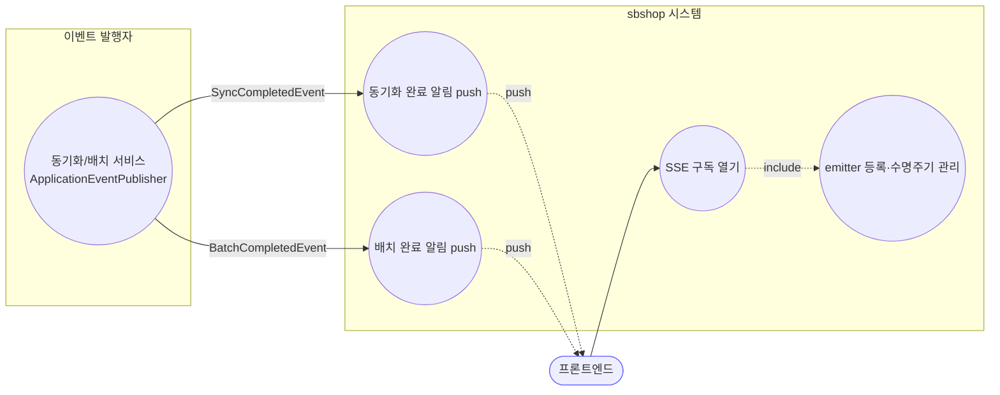
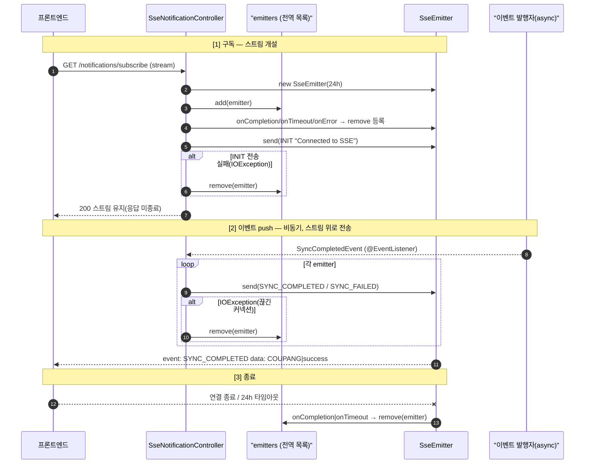
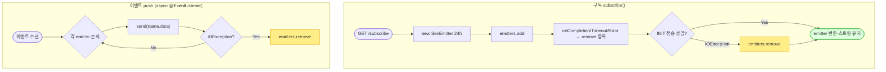

# GET /api/v1/notifications/subscribe — SSE 실시간 알림 구독

## 1. 개요

| 항목 | 내용 |
|------|------|
| **Method / URL** | `GET /api/v1/notifications/subscribe` (Content-Type `text/event-stream`) |
| **목적** | 프론트가 동기화·배치 완료/실패 알림을 실시간으로 받도록 **SSE 스트림**을 연다. 서버는 도메인 이벤트(`SyncCompletedEvent`, `BatchCompletedEvent`)를 수신하면 열린 모든 커넥션에 push한다. |
| **핵심 상태전이** | emitter 수명주기: **등록(add)** → INIT 전송 → 이벤트 push … → **완료/타임아웃/오류 시 제거(remove)**. |
| **부수효과** | 전역 `CopyOnWriteArrayList<SseEmitter>` 에 emitter 추가/제거(공유 가변 상태), 초기 `INIT` 이벤트 1건 전송. |
| **응답** | `200 OK` + 장기 유지 SSE 스트림(타임아웃 **24h** = `86400000ms`) |

## 2. 호출 체인

```
[구독 진입]
SseNotificationController.subscribe()             api/.../controller/SseNotificationController.java:23-50
  ├─ new SseEmitter(86400000L)                     :26  (타임아웃 24시간)
  ├─ emitters.add(emitter)                          :29  (전역 목록 등록)
  ├─ emitter.onCompletion(() -> emitters.remove)    :32  (수명주기 콜백)
  ├─ emitter.onTimeout(() -> emitters.remove)       :35
  ├─ emitter.onError(e -> emitters.remove)          :38
  ├─ emitter.send(event INIT "Connected to SSE")    :42  (IOException 시 즉시 remove :45)
  └─ return emitter                                 :49

[이벤트 push — 별도 스레드/발행자]
onSyncCompleted(SyncCompletedEvent)  @EventListener  :52-72
  └─ for emitter in emitters:
       ├─ success → send("SYNC_COMPLETED", "{market}|success")   :59-61
       └─ 실패    → send("SYNC_FAILED", "{market}|fail|{err}")    :63-65
       └─ IOException → emitters.remove(emitter)                  :69

onBatchCompleted(BatchCompletedEvent)  @EventListener  :82-93
  ├─ name = batchEventName(success)  → BATCH_COMPLETED | BATCH_FAILED   :74-76
  ├─ data = batchPayload(batchId, success) → "{batchId}|{true|false}"   :78-80
  └─ for emitter: send(name, data) / IOException → remove              :86-92
```

**이벤트 발행 출처(생산자)** — 이 컨트롤러는 소비만. 실제 발행은 동기화 서비스/배치 처리(`SyncCompletedEvent`, `BatchCompletedEvent` 를 `ApplicationEventPublisher` 로 발행하는 코어 서비스)에서 이뤄진다.

**SSE 이벤트 계약**

| event name | data 포맷 | 트리거 |
|------------|-----------|--------|
| `INIT` | `"Connected to SSE"` | 구독 직후 1회 |
| `SYNC_COMPLETED` | `"{MarketType}|success"` | `SyncCompletedEvent.isSuccess()==true` |
| `SYNC_FAILED` | `"{MarketType}|fail|{errorMessage}"` | 동기화 실패 |
| `BATCH_COMPLETED` | `"{batchId}|true"` | `BatchCompletedEvent.isSuccess()==true` |
| `BATCH_FAILED` | `"{batchId}|false"` | 배치 실패 |

## 3. 유스케이스 다이어그램



## 4. 시퀀스 다이어그램



## 5. 순서도 (플로우차트)



## 6. 상태 전이표 (emitter 수명주기)

| 이벤트 | emitters 목록 변화 | 근거 |
|--------|--------------------|------|
| 구독 성공 | **+1**(add) | `:29` |
| INIT 전송 IOException | **-1**(즉시 remove) | `:45` |
| 정상 종료(클라 close) | **-1**(onCompletion) | `:32` |
| 24h 타임아웃 | **-1**(onTimeout) | `:35` |
| 컨테이너 오류 | **-1**(onError) | `:38` |
| push 중 IOException | **-1**(remove) | `:69, :90` |

## 7. 🔎 발견사항

### F-MISC-12 · 🟠 GAP — SSE emitter 누수 위험: heartbeat/keepalive 없음 + 24h 초장기 타임아웃
- **근거:** `SseNotificationController.java:26` 타임아웃 24시간, 그리고 구독 후 이벤트가 없으면 서버가 **주기적 ping을 보내지 않는다**(INIT 1회뿐). remove는 오직 `send()`가 IOException을 던질 때만(`:69,:90`) 일어난다.
- **영향:** 프록시(nginx)·클라가 조용히 끊긴 "half-open" 커넥션이 **다음 push까지(최대 24h) 목록에 잔존**. 유휴 시간대(이벤트 없는 밤 등)에는 죽은 emitter가 계속 쌓여 메모리/커넥션 누수 가능. 브라우저 자동 재연결까지 겹치면 중복 등록.
- **제안:** 주기적 heartbeat(예: 15~30s 코멘트/ping) 전송으로 죽은 커넥션을 조기 감지·제거하고, 타임아웃을 현실적 값으로 하향.

### F-MISC-13 · 🟠 GAP — 인증·구독자 수 상한 없음(무제한 등록)
- **근거:** `:23` `@GetMapping` 은 인증 검사가 없고 `@CrossOrigin("*")`(`:17`). `emitters.add`(`:29`)에 상한이 없다.
- **영향:** 임의 오리진/미인증 클라가 무제한 SSE 커넥션을 열 수 있음 → 리소스 소진(간이 DoS 표면). 브라우저 재연결 루프가 상한 없이 목록을 부풀릴 수 있음.
- **제안:** 인증/세션 요구 및 사용자당·전역 커넥션 상한 도입 검토(보안 비중요 정책이면 최소한 상한만).

### F-MISC-14 · 🟡 SMELL — push 실패 처리가 `remove`뿐, 부분 전송/재전송·순서 보장 없음
- **근거:** `onSyncCompleted`·`onBatchCompleted` 는 IOException 시 해당 emitter를 목록에서 빼기만 한다(`:69,:90`). 놓친 이벤트를 클라가 복구할 `Last-Event-ID`/id 필드가 없다.
- **영향:** 재연결한 클라는 끊긴 사이의 SYNC/BATCH 알림을 영구 유실. 프론트가 알림을 놓치면 상태 불일치.
- **제안:** SSE `id` 부여 + `Last-Event-ID` 기반 재전송, 또는 클라가 재연결 시 상태를 REST로 재조회하는 보정 경로 명시.

### F-MISC-15 · 🟡 SMELL — 두 리스너의 "순회+send+IOException remove" 로직 중복
- **근거:** `:55-71`(sync)과 `:86-92`(batch)가 동일한 브로드캐스트 패턴을 중복 구현. `SyncCompletedEvent`(`SyncCompletedEvent.java`)·`BatchCompletedEvent`(`BatchCompletedEvent.java`) 페이로드만 다름.
- **제안:** `broadcast(String name, String data)` 공통 메서드로 추출해 remove 규칙을 한 곳에 두면 F-MISC-12/14 개선도 단일 지점에서 가능.

### F-MISC-16 · 🔵 NOTE — 컨트롤러가 전역 가변 상태(emitters)를 필드로 보유
- **근거:** `:21` `CopyOnWriteArrayList<SseEmitter> emitters` 를 컨트롤러 인스턴스 필드로 둠. 스레드-세이프 컬렉션이라 자료구조 자체는 안전하나, 알림 브로드캐스트 책임이 컨트롤러에 결합.
- **영향:** 멀티 JVM(api/worker 2 프로세스) 토폴로지에서 **worker에서 발행된 이벤트는 api 프로세스의 emitters에 닿지 않음** — SSE는 api JVM 로컬 이벤트만 브로드캐스트(worker의 스케줄러 동기화 알림은 별도 경로가 아니면 프론트에 안 감). 배포 토폴로지상 확인 필요.
- **제안:** SSE 브로드캐스트를 전용 컴포넌트로 분리하고, 크로스-JVM 알림이 필요하면 Redis pub/sub 등 공유 채널 경유 검토.

## 8. 테스트 커버리지 메모

- **존재:** `SseNotificationBatchTest`(api test) — `batchEventName`·`batchPayload` **순수 함수만** 검증(`BATCH_COMPLETED/FAILED`, `"{id}|{bool}"`). 실제 emitter 등록/제거·브로드캐스트·수명주기는 검증하지 않음.
- **비어있는 케이스:**
  - emitter add/remove 수명주기(onCompletion/onTimeout/onError)와 누수(F-MISC-12).
  - `onSyncCompleted` 의 SYNC_COMPLETED/SYNC_FAILED 분기·페이로드.
  - IOException 발생 시 목록에서 제거되는지(F-MISC-14).
  - 크로스-JVM 브로드캐스트 도달성(F-MISC-16) — 통합/토폴로지 검증 필요.

---
*생성: 2026-07-14 · 근거 커밋: main@bd4c915*
