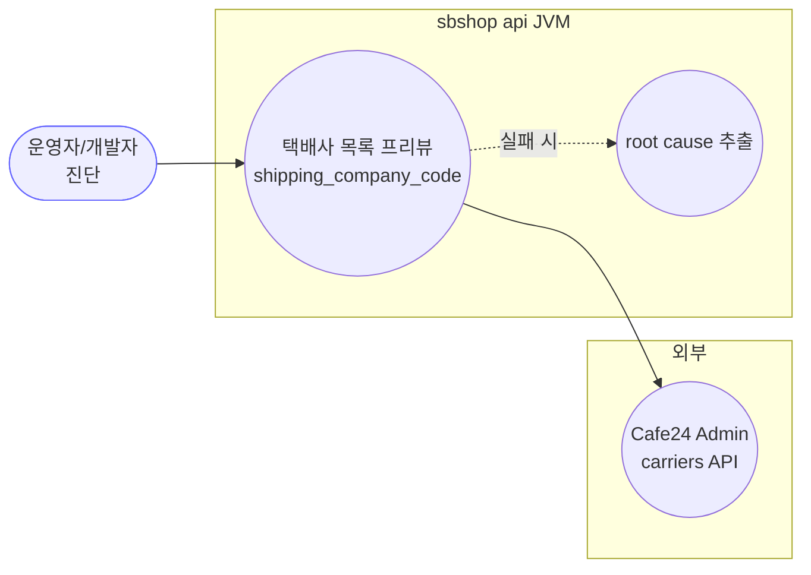
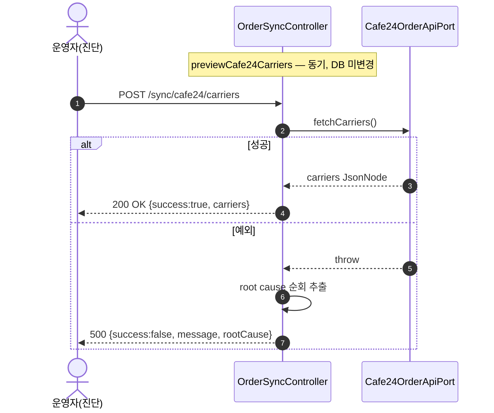
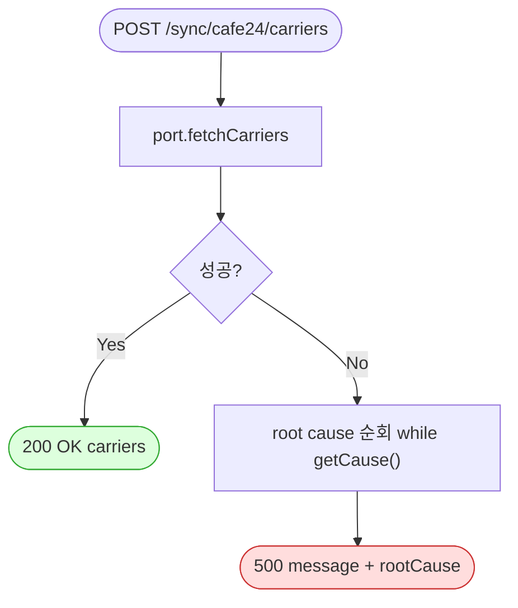

# POST /sync/cafe24/carriers — Cafe24 몰 등록 택배사 목록 프리뷰(진단)

## 1. 개요

| 항목 | 내용 |
|------|------|
| **Method / URL** | `POST /api/v1/orders/sync/cafe24/carriers` |
| **목적** | **진단용.** Cafe24 몰에 등록된 택배사 목록(`shipping_company_code`)을 반환한다. 송장 등록 시 택배사 코드 매핑 검증용. |
| **핵심 상태전이** | 없음(읽기 전용, DB 미변경). |
| **부수효과** | Cafe24 택배사 API 1회 호출만. 저장/이벤트/로그 없음. |
| **응답** | `200 OK` + `{success:true, carriers:<원시 JsonNode>}` / 실패 시 `500` + `{success:false, message, rootCause}` |

## 2. 호출 체인

```
OrderSyncController.previewCafe24Carriers()                api/.../controller/OrderSyncController.java:160-173
  └─ cafe24OrderApiPort.fetchCarriers()                     OrderSyncController.java:163
        └─ Cafe24OrderApiPort.fetchCarriers()               core/.../order/port/Cafe24OrderApiPort.java:27
              └─ Cafe24 REST GET /api/v2/admin/carriers      [어댑터 구현체]
  └─ (catch) root cause 순회 추출 → 500 {message, rootCause} OrderSyncController.java:164-172
```

> **주의:** `Cafe24OrderSyncService` 미경유, 포트 직접 호출. 동기 실행이라 catch/500 이 실제 동작.

**요청 바디/파라미터**: 없음.

## 3. 유스케이스 다이어그램



> **관찰:** 송장 등록 경로에서 sbshop 택배사 enum → Cafe24 `shipping_company_code` 매핑을 확정하기 위한 조회 도구. PII 는 포함하지 않음.

## 4. 시퀀스 다이어그램



## 5. 순서도 (플로우차트)



## 6. 상태 전이표

| 대상 | 진입 조건 | 결과 | 부수효과 |
|------|-----------|------|----------|
| DB/도메인 | — | **변경 없음** | 읽기 전용 |
| 응답 | fetchCarriers 성공 | `200 {success:true, carriers}` | 원시 JsonNode 노출(PII 아님) |
| 응답 | 예외 | `500 {success:false, message, rootCause}` | root cause 포함 |

## 7. 🔎 발견사항

### F-SYNC-15 · 🟡 SMELL — 실패 로그 메시지가 "Cafe24 주문 프리뷰 실패"로 오기재(preview 문구 복사)
> ⬜ **미해결(백로그)**.
- **근거:** `previewCafe24Carriers()` 의 catch 로그가 `log.error("Cafe24 주문 프리뷰 실패", e)`(OrderSyncController.java:165) — 실제로는 **택배사 조회** 실패인데 preview 엔드포인트의 문구를 그대로 복사했다.
- **영향:** 운영 로그에서 택배사 조회 실패가 주문 프리뷰 실패로 오인 분류되어 원인 추적이 흐려진다.
- **제안:** `"Cafe24 택배사 조회 실패"` 로 교정.

### F-SYNC-14 · 🟡 SMELL — root cause 추출 로직 중복 (공통)
> ✅ **해결됨** (커밋 `04062a9`) — 체크리스트 기준.
- **근거:** preview 와 동일한 `while(cur.getCause()!=null...)` 복붙(166-169). [[cafe24-preview.md]] F-SYNC-14 참조.
- **제안:** 공용 유틸로 통합.

### F-SYNC-13 · 🟠 GAP — 진단 엔드포인트가 인증 없이 운영에 노출 (공통, 단 PII 없음)
> ⬜ **미해결(백로그)**.
- **근거:** carriers 도 인증/프로파일 가드 없이 `@CrossOrigin(origins="*")` 하에 노출. preview 와 달리 PII 는 없으나, Cafe24 연동 존재·택배사 구성 정보가 외부에 드러난다.
- **영향/제안:** [[cafe24-preview.md]] F-SYNC-13 과 함께 프로파일 가드로 일괄 차단 권장(심각도는 preview 보다 낮음 — PII 없음).

### F-SYNC-16 · 🔵 NOTE — 응답 타입 `ResponseEntity<Object>` — 원시 JsonNode 노출
> ⬜ **미해결(백로그)**.
- **근거:** 반환 타입 `Object`(161). [[cafe24-preview.md]] F-SYNC-16 과 동일 성격.

## 8. 테스트 커버리지 메모

- 진단 엔드포인트로 자동화 우선순위 낮음. F-SYNC-15(로그 오기재) 는 테스트보다 즉시 문자열 수정 대상.
- **비어있는 케이스:** 인증/프로파일 가드 부재.

---
*생성: 2026-07-14 · 근거 커밋: main@bd4c915*
