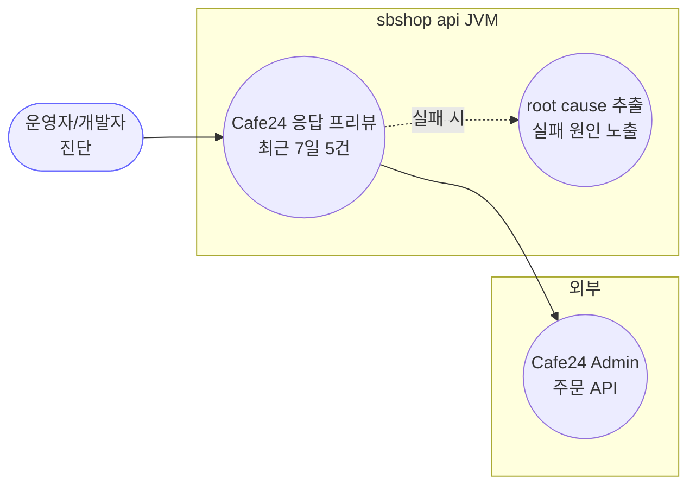
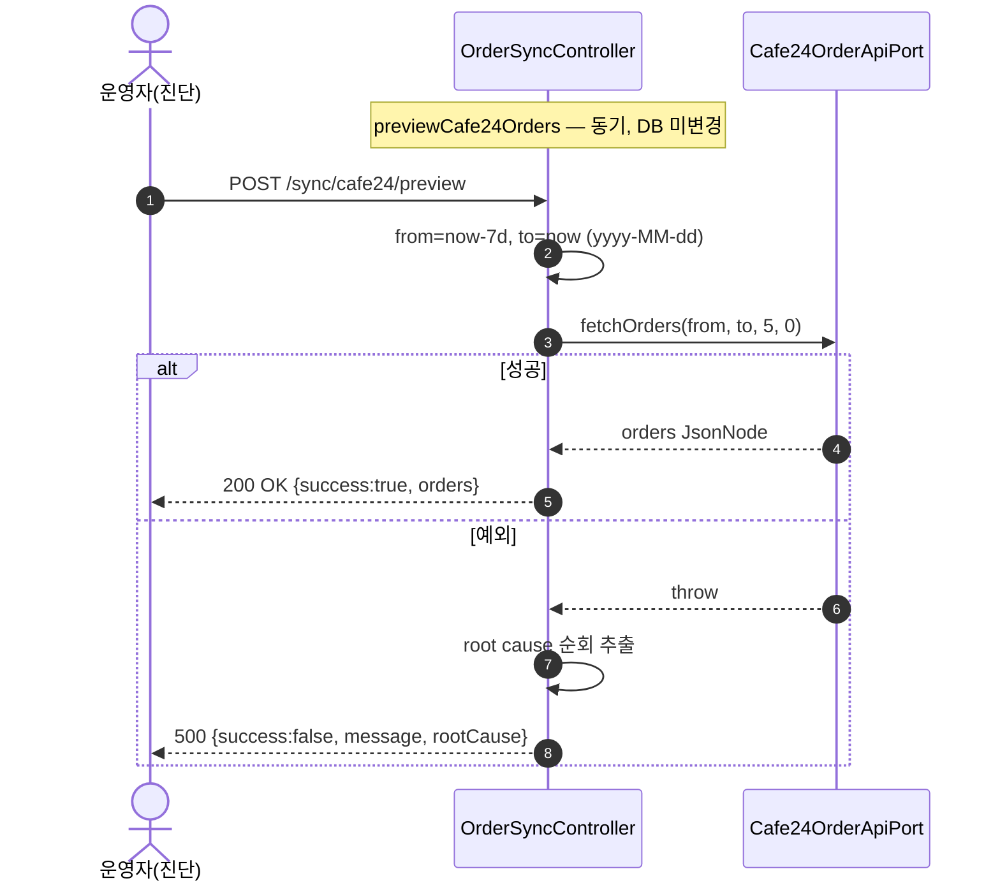
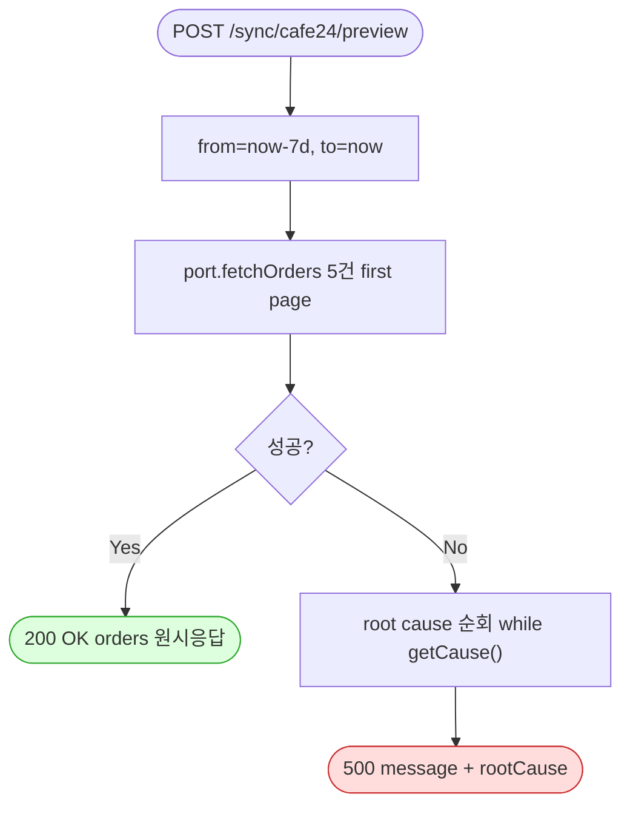

# POST /sync/cafe24/preview — Cafe24 주문 API 원시 응답 프리뷰(진단)

## 1. 개요

| 항목 | 내용 |
|------|------|
| **Method / URL** | `POST /api/v1/orders/sync/cafe24/preview` |
| **목적** | **진단용.** Cafe24 주문 API 의 최근 7일 first page(5건) 원시 응답을 그대로 반환한다. 파싱 검증·응답 구조/실제 필드명(예: PCCC) 확인용. |
| **핵심 상태전이** | 없음(읽기 전용, DB 미변경). |
| **부수효과** | Cafe24 주문 API 1회 호출만. 저장/이벤트/로그(ActionLog) 없음. |
| **응답** | `200 OK` + `{success:true, orders:<원시 JsonNode>}` / 실패 시 `500` + `{success:false, message, rootCause}` |

## 2. 호출 체인

```
OrderSyncController.previewCafe24Orders()                  api/.../controller/OrderSyncController.java:140-157
  ├─ 기간 계산: from = now-7d, to = now (yyyy-MM-dd)          OrderSyncController.java:143-145
  └─ cafe24OrderApiPort.fetchOrders(from, to, 5, 0)          OrderSyncController.java:146
        └─ Cafe24OrderApiPort (인터페이스)                     core/.../order/port/Cafe24OrderApiPort.java:21
              └─ Cafe24 REST GET /api/v2/admin/orders (embed=items,receivers,buyer)  [어댑터 구현체]
  └─ (catch) root cause 순회 추출 → 500 {message, rootCause}  OrderSyncController.java:148-156
```

> **주의:** 이 엔드포인트는 `Cafe24OrderSyncService` 를 **경유하지 않고** 포트를 직접 호출한다. 동기 실행(HTTP 응답이 실제 결과를 담음)이라, 위 sync 엔드포인트들과 달리 catch/500 이 실제로 동작한다.

**요청 바디/파라미터**: 없음. 기간(7일)·limit(5)·offset(0) 모두 하드코딩.

## 3. 유스케이스 다이어그램



> **관찰:** DB·이벤트·로그를 건드리지 않는 순수 조회 진단 엔드포인트. F-SYNC-12(PCCC 필드명 미확정)를 라이브에서 확정하기 위한 도구.

## 4. 시퀀스 다이어그램



## 5. 순서도 (플로우차트)



## 6. 상태 전이표

| 대상 | 진입 조건 | 결과 | 부수효과 |
|------|-----------|------|----------|
| DB/도메인 | — | **변경 없음** | 읽기 전용 |
| 응답 | fetchOrders 성공 | `200 {success:true, orders}` | 원시 JsonNode 그대로 노출 |
| 응답 | 예외 | `500 {success:false, message, rootCause}` | 최심 root cause 메시지 포함 |

## 7. 🔎 발견사항

### F-SYNC-13 · 🟠 GAP — 진단 엔드포인트가 인증 없이 운영에 노출 + 원시 주문(PII) 반환
- **근거:** `previewCafe24Orders()`(140-157)는 인증/권한 검사가 없고(컨트롤러에 시큐리티 애노테이션 없음), `@CrossOrigin(origins="*")`(OrderSyncController.java:31) 하에 **주문 원시 응답을 그대로** 반환한다. 응답에는 수취인 이름·연락처·주소·PCCC 등 PII 가 포함될 수 있다.
- **영향:** 진단용 POST 임에도 외부에서 호출 가능하면 최근 주문 개인정보가 노출된다.
- **제안:** 프로파일 가드(dev only)·인증·CORS 축소. 최소한 운영 프로파일에서 비활성화.
- **연관:** [[cafe24-carriers.md]] 도 동일 성격(단 carriers 는 PII 아님).

### F-SYNC-14 · 🟡 SMELL — root cause 추출 로직 중복 (preview·carriers·Cafe24 서비스)
- **근거:** `previewCafe24Orders()`(150-153)와 `previewCafe24Carriers()`(166-169)가 동일한 `while(cur.getCause()!=null && cur.getCause()!=cur)` 루트원인 순회를 복붙했고, `Cafe24OrderSyncService.failureReason()`(81-92)도 유사 로직을 갖는다.
- **제안:** 공용 유틸(`Throwables.rootCause`)로 추출해 3곳 통합.

### F-SYNC-15 · 🔵 NOTE — 잘못된 실패 로그 메시지("주문 프리뷰 실패")를 carriers 와 공유
- **근거:** `previewCafe24Carriers()` 의 catch 로그가 `"Cafe24 주문 프리뷰 실패"`(165) — 실제로는 택배사 조회 실패인데 preview 문구를 재사용.
- **제안:** carriers 전용 메시지로 교정([[cafe24-carriers.md]] F-SYNC-15 와 동일 항목).

### F-SYNC-16 · 🔵 NOTE — 응답 타입 `ResponseEntity<Object>` — 원시 JsonNode 직접 노출
- **근거:** 반환 타입이 `Object`(141)이고 `orders` 에 파싱 전 JsonNode 를 그대로 실음. 진단 목적상 의도적이나, 프런트가 이 형태에 의존하면 계약이 불안정.
- **제안:** 진단 전용임을 문서화하고 일반 조회 API 와 혼용 금지.

## 8. 테스트 커버리지 메모

- 진단 엔드포인트로 자동화 테스트 필요성 낮음. 다만 F-SYNC-13(노출) 회귀 방지를 위해 프로파일 가드가 도입되면 그 가드에 대한 테스트 권장.
- **비어있는 케이스:** 인증/프로파일 가드 부재(현재 아무 테스트 없음).

---
*생성: 2026-07-14 · 근거 커밋: main@bd4c915*
