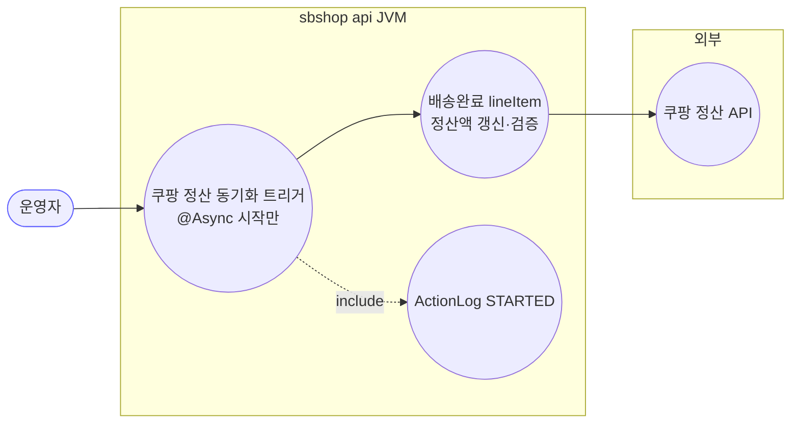
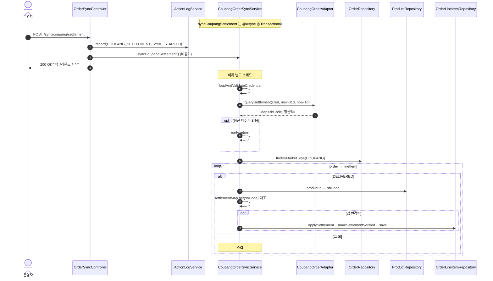
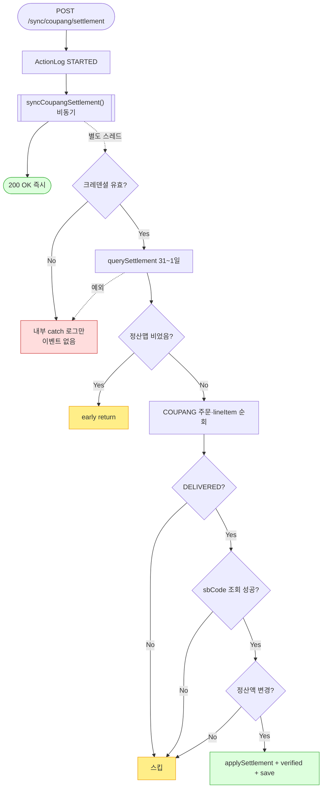

# POST /sync/coupang/settlement — 쿠팡 정산 데이터 동기화 트리거

## 1. 개요

| 항목 | 내용 |
|------|------|
| **Method / URL** | `POST /api/v1/orders/sync/coupang/settlement` |
| **목적** | 쿠팡 정산 API(최근 31~1일 전)를 조회해 **배송완료(DELIVERED) 라인아이템**의 실제 정산액을 갱신하는 동기화를 **백그라운드(@Async)로 트리거**한다. |
| **핵심 상태전이** | 없음(트리거). lineItem 은 `applySettlement` + `markSettlementVerified` 로 정산액·검증플래그 갱신. |
| **부수효과** | 쿠팡 정산 API 호출 · 배송완료 lineItem 정산액 upsert · `ActionLog(COUPANG_SETTLEMENT_SYNC, STARTED)`. **SyncCompletedEvent(SSE) 발행 없음.** |
| **응답** | `200 OK` + `{success:true, message:"쿠팡 정산 데이터 동기화가 백그라운드에서 시작되었습니다."}` |

## 2. 호출 체인

```
OrderSyncController.syncCoupangSettlement()                api/.../controller/OrderSyncController.java:176-194
  ├─ ActionLogService.record(COUPANG_SETTLEMENT_SYNC,"COUPANG",STARTED,...)   OrderSyncController.java:180 (D-076)
  └─ CoupangOrderSyncService.syncCoupangSettlement()  @Async @Transactional   core/.../order/service/CoupangOrderSyncService.java:91-152
       ├─ loadAndValidateCredential()                                  CoupangOrderSyncService.java:96 / 155-165
       ├─ fromDate=now-31d, toDate=now-1d                              CoupangOrderSyncService.java:98-99
       ├─ coupangOrderAdapter.querySettlement(cred, from, to) → Map<sbCode,BigDecimal>   CoupangOrderSyncService.java:104
       │       └─ CoupangOrderAdapter (정산 API 어댑터)
       ├─ settlementMap.isEmpty() → early return                       CoupangOrderSyncService.java:107-110
       ├─ orderRepository.findByMarketType(COUPANG)                    CoupangOrderSyncService.java:113
       └─ 각 order → 각 lineItem 순회                                  CoupangOrderSyncService.java:116-146
             ├─ DELIVERED 아닌 건 스킵                                 CoupangOrderSyncService.java:120-124
             ├─ productId→sbCode 조회(productRepository)               CoupangOrderSyncService.java:126-131
             ├─ settlementMap.get(sbCode) 대조·변경 시만               CoupangOrderSyncService.java:133-138
             ├─ item.applySettlement(actual) + markSettlementVerified()   CoupangOrderSyncService.java:139-140
             └─ orderLineItemRepository.save(item)                     CoupangOrderSyncService.java:141
```

**요청 바디/파라미터**: 없음. 기간은 `now-31d ~ now-1d` 하드코딩(전일까지 정산 확정 가정).

## 3. 유스케이스 다이어그램



> **관찰:** 주문 동기화와 달리 `SyncCompletedEvent(SSE)` 를 발행하지 않는다(프런트 완료 알림 없음). 또한 최초 정산 추정치(0.89)를 실제값으로 덮는 확정 단계.

## 4. 시퀀스 다이어그램



## 5. 순서도 (플로우차트)



## 6. 상태 전이표

| 대상 | 진입 조건 | 결과 | 부수효과 |
|------|-----------|------|----------|
| 정산 실행 | 항상(중복 가드 **없음** — F-SYNC-17) | 실행 | 정산 API 호출 |
| 정산맵 | 비었음 | early return | 없음 |
| lineItem | shippingStatus == DELIVERED | 대상 | — |
| lineItem | ≠ DELIVERED | 스킵 | — |
| lineItem | productId==null 또는 sbCode 없음 | 스킵 | — |
| 정산액 | 기존값과 다름(또는 기존 null) | `applySettlement` + `markSettlementVerified` | save |
| 정산액 | 동일 | 미갱신 | 불필요 write 방지 |

## 7. 🔎 발견사항

### F-SYNC-1 · 🔴 BUG — status 미갱신 + 크로스-JVM 미공유 (공통)
- **근거:** 컨트롤러가 `SyncStatusService` 미갱신. writer 는 worker 의 `OrderSyncScheduler.java:114-120`(COUPANG_SETTLEMENT) 뿐, 인메모리 미공유.
- **영향/제안:** [[sync-coupang.md]] F-SYNC-1 참조.

### F-SYNC-2 · 🔴 BUG — `@Async` 예외가 컨트롤러 catch 로 오지 않음 (공통, 여기선 더 심함)
- **근거:** `syncCoupangSettlement()` `@Async`(91). 게다가 서비스 내부 catch(149-151)는 `log.error` **만** 하고 스택도 안 남기며 이벤트도 안 낸다. 컨트롤러 catch(188-193)는 도달 불가.
- **영향:** 정산 동기화 실패는 **어디에도 사용자-관측 신호가 남지 않는다**(주문 동기화는 최소한 SyncCompletedEvent(failed) 라도 냄). 완전 침묵 실패.
- **제안:** 최소한 ActionLog FAILED 기록 또는 이벤트 발행 추가.

### F-SYNC-17 · 🟠 GAP — 정산 동기화에 중복 실행 가드(isSyncing) 없음
- **근거:** 주문 동기화(`syncCoupangOrders`)는 `isSyncing.compareAndSet` 가드가 있으나, `syncCoupangSettlement`(91-152)에는 **없다**. 정산 전용 락도 없음.
- **영향:** 정산 트리거를 연타하거나 스케줄러(새벽 2시)와 수동 트리거가 겹치면 동일 정산 처리가 병렬 실행되어 중복 write·경합 발생 가능.
- **제안:** 정산 전용 `AtomicBoolean` 가드 또는 DB advisory lock([[deployment-two-jvm-topology]] — 크로스-JVM 경합까지 막으려면 advisory lock 필수).

### F-SYNC-4 · 🟡 SMELL — 최초 추정 정산액 `0.89` 하드코딩과의 이원화
- **근거:** 최초 정산 추정치는 `buildLineItemFromDto`(`CoupangOrderSyncService.java:276`)의 `×0.89`, 실제 확정은 이 API. 두 값의 근거(수수료율)가 코드에 상수로 분산.
- **영향/제안:** [[sync-coupang.md]] F-SYNC-4 와 동일. 수수료율 외부화 시 함께 정리.

### F-SYNC-18 · 🔵 NOTE — sbCode 미보유·미배송 lineItem 은 조용히 정산 누락
- **근거:** DELIVERED 아니거나 productId/sbCode 없으면 스킵(120-131). 정산 대상에서 빠졌다는 신호(카운트/로그)가 없어 `updatedCount` 만 집계.
- **영향:** 실제 정산됐어야 할 건이 매핑 누락으로 빠져도 관측되지 않음.
- **제안:** 스킵 사유별 카운트 로그 추가로 정산 누락 가시화.

## 8. 테스트 커버리지 메모

- 정산 대조 로직(변경 시만 갱신·DELIVERED 필터·sbCode 매핑)은 단위 테스트 대상. 커밋 D-076 관련 ActionLog STARTED 기록은 확인됨.
- **비어있는 케이스:** ① 중복 실행 가드 부재(F-SYNC-17), ② 침묵 실패(F-SYNC-2), ③ sbCode 미매핑 정산 누락(F-SYNC-18).

---
*생성: 2026-07-14 · 근거 커밋: main@bd4c915*
