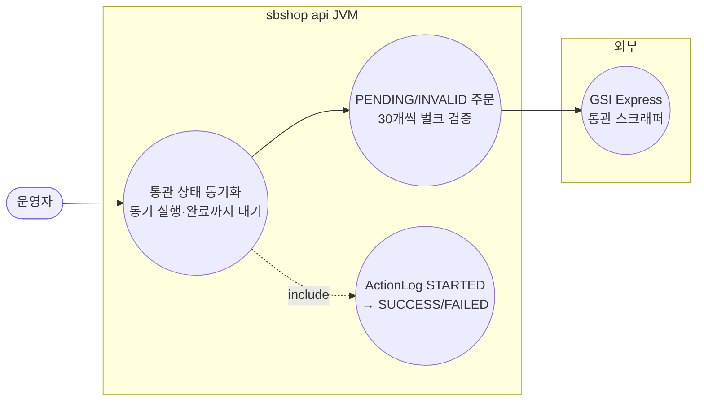
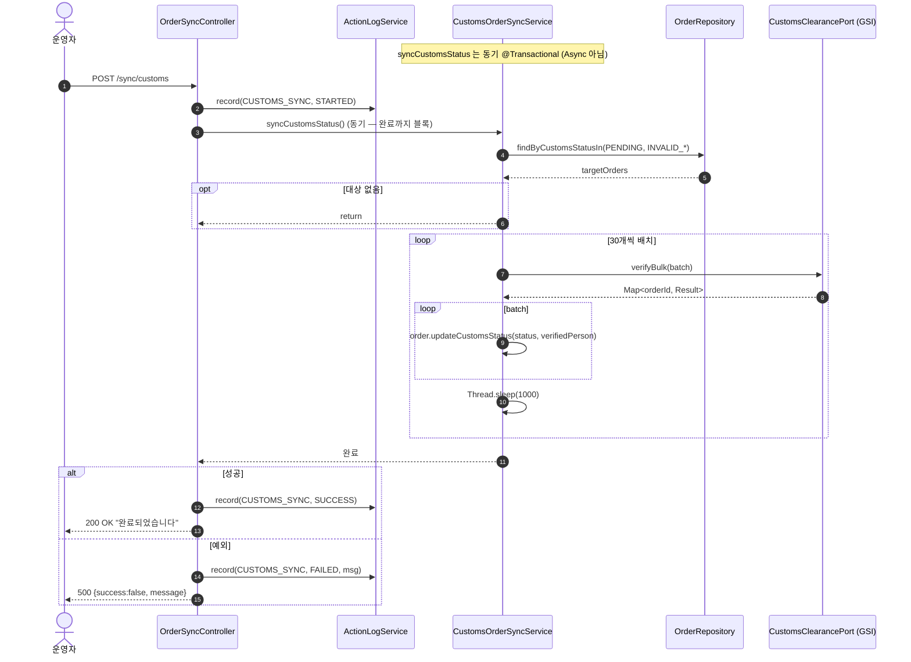
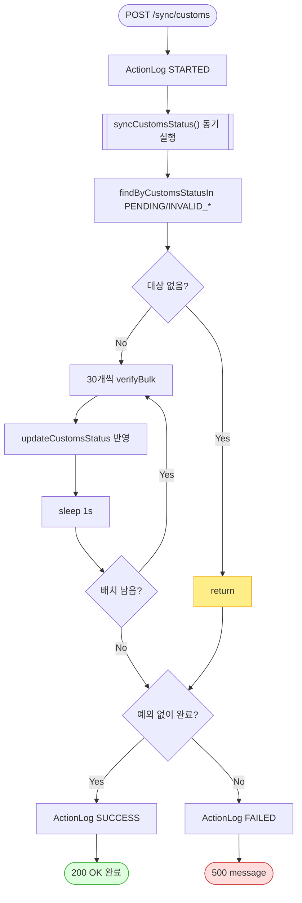

# POST /sync/customs — 통관 상태 동기화 트리거

## 1. 개요

| 항목 | 내용 |
|------|------|
| **Method / URL** | `POST /api/v1/orders/sync/customs` |
| **목적** | 통관번호가 있고 PENDING/INVALID_* 상태인 주문을 GSI Express 스크래퍼로 벌크 검증(30개씩)해 통관 상태를 갱신한다. |
| **핵심 상태전이** | 주문 CustomsStatus: `PENDING`·`INVALID_*` → 검증 결과 상태(VALID/INVALID_*). |
| **부수효과** | GSI Express 스크래핑 · 주문 CustomsStatus 갱신 · `ActionLog` **STARTED→SUCCESS/FAILED 전 구간 기록**(D-076). SSE 이벤트 없음. |
| **응답** | `200 OK` + `{success:true, message:"통관 상태 동기화가 완료되었습니다."}` / 실패 시 `500` + `{success:false, message}` |

> **다른 sync 엔드포인트와의 결정적 차이:** `syncCustomsStatus()` 는 **`@Async` 가 아니다**(동기 실행). 따라서 컨트롤러가 실제 완료를 기다리고, catch/500 이 실제 동작하며, SUCCESS/FAILED ActionLog 도 정상 기록된다.

## 2. 호출 체인

```
OrderSyncController.syncCustomsOrders()                    api/.../controller/OrderSyncController.java:197-221
  ├─ ActionLogService.record(CUSTOMS_SYNC, null, STARTED,...)   OrderSyncController.java:201 (D-076)
  ├─ CustomsOrderSyncService.syncCustomsStatus()  @Transactional (동기)   core/.../order/service/CustomsOrderSyncService.java:32-79
  │     ├─ orderRepository.findByCustomsData_CustomsStatusIn(PENDING, INVALID_PCCC/PHONE/ZIPCODE)   CustomsOrderSyncService.java:39-44
  │     ├─ targetOrders.isEmpty() → return                      CustomsOrderSyncService.java:49-51
  │     └─ batchSize=30 순회                                     CustomsOrderSyncService.java:54-76
  │           ├─ customsClearancePort.verifyBulk(batch) → Map<orderId,Result>   CustomsOrderSyncService.java:60
  │           │       └─ CustomsClearancePort (GSI Express 스크래퍼 어댑터)
  │           ├─ order.updateCustomsStatus(status, verifiedPerson)   CustomsOrderSyncService.java:63-67
  │           └─ Thread.sleep(1000) 배치 간 딜레이               CustomsOrderSyncService.java:70-75
  ├─ ActionLogService.record(CUSTOMS_SYNC, null, SUCCESS,...)   OrderSyncController.java:207 (동기 완료)
  └─ (catch) ActionLogService.record(CUSTOMS_SYNC, null, FAILED,...)   OrderSyncController.java:215
```

**요청 바디/파라미터**: 없음. 배치 크기 30·딜레이 1초 하드코딩.

## 3. 유스케이스 다이어그램



> **관찰:** 유일하게 완결적인 ActionLog(STARTED/SUCCESS/FAILED) 를 남기는 엔드포인트. 다른 sync 들이 이 패턴을 따르지 못하는 근본 원인은 `@Async`(F-SYNC-3).

## 4. 시퀀스 다이어그램



## 5. 순서도 (플로우차트)



## 6. 상태 전이표

| 진입 CustomsStatus | 대상? | 결과 | 부수효과 |
|--------------------|:-----:|------|----------|
| `PENDING` | ✅ | verifyBulk 결과 상태 | updateCustomsStatus |
| `INVALID_PCCC`/`INVALID_PHONE`/`INVALID_ZIPCODE` | ✅ | 재검증 결과 상태 | updateCustomsStatus |
| `VALID` | ❌ | 유지 | 스킵(조회 대상 아님) |
| 통관번호 공백/없음 | ❌ | 유지 | findBy... 조건상 미포함(통관번호 유무는 상태로 간접 필터) |
| verifyBulk 결과 없음 | — | `CustomsVerificationResult.pending()` | 기본값(PENDING 유지) |

## 7. 🔎 발견사항

### F-SYNC-19 · 🔴 BUG — 동기 트랜잭션 안에서 `Thread.sleep(1000)` × 배치 → 대상 많으면 DB 트랜잭션·HTTP 스레드 장기 점유
> ✅ **해결됨** (커밋 `1ef9a6f`) — 체크리스트 기준.
- **근거:** `syncCustomsStatus()` 는 `@Transactional`(32) **동기** 실행이고 배치마다 `Thread.sleep(1000)`(70)을 한다. 대상 300건이면 sleep 만 10초 + GSI 스크래핑 시간. 이 전 구간이 **하나의 트랜잭션**이며 **HTTP 요청 스레드**를 붙잡는다.
- **영향:** ① 요청 타임아웃 위험, ② 긴 트랜잭션이 DB 커넥션·락을 장시간 점유, ③ 스크래핑 지연이 그대로 HTTP 응답 지연. 다른 sync 는 `@Async` 인데 유독 통관만 동기라 장시간 블로킹.
- **제안:** `@Async` 화(다른 sync 와 정합)하거나 배치 커밋 분리(트랜잭션을 배치 단위로 쪼갬). sleep 은 트랜잭션 밖으로.

### F-SYNC-20 · 🟠 GAP — 배치 단위 예외 시 전체 롤백 — 앞 배치의 검증 결과까지 소실
> ⬜ **미해결(백로그)**.
- **근거:** 단일 `@Transactional` 이라 마지막 배치에서 `verifyBulk` 예외가 나면 앞서 반영한 모든 배치의 `updateCustomsStatus` 가 롤백된다. 컨트롤러는 FAILED 기록 후 500.
- **영향:** 300건 중 290건 검증 성공 후 마지막에 실패하면 290건 결과도 날아가 재검증 필요.
- **제안:** 배치별 트랜잭션 분리로 부분 성공 보존. F-SYNC-19 와 함께 해결 가능.

### F-SYNC-21 · 🟡 SMELL — 배치 크기(30)·딜레이(1000ms) 매직넘버 하드코딩
> ⬜ **미해결(백로그)**.
- **근거:** `batchSize=30`(54), `Thread.sleep(1000)`(71) 이 코드 상수. GSI 부하 정책이 코드에 박힘.
- **제안:** 설정값으로 외부화(운영 튜닝 용이).

### F-SYNC-3-note · 🔵 NOTE — 이 엔드포인트만 ActionLog SUCCESS/FAILED 를 남긴다(모범 사례이자 대조군)
> 🔶 **부분/오탐** — 결함이 아니라 모범 사례 대조군(customs 만 SUCCESS/FAILED 기록). 체크리스트에 결함 항목 없음.
- **근거:** 동기 실행 덕에 `OrderSyncController.java:207/215` 가 SUCCESS/FAILED 를 기록한다. 나머지 sync 는 `@Async` 라 STARTED 만 남는다(F-SYNC-3).
- **영향/제안:** 다른 sync 를 이벤트 리스너 기반으로 개선할 때 이 완결 로깅 계약을 목표 상태로 삼을 것. [[sync-coupang.md]] F-SYNC-3 참조.

### F-SYNC-22 · 🔵 NOTE — `marketType=null` 로 ActionLog 기록(통관은 마켓 무관)
> ⬜ **미해결(백로그)** — marketType=null 은 통관 특성상 의도적(NOTE).
- **근거:** `record(CUSTOMS_SYNC, null, ...)`(201/207/215). 통관은 전 마켓 공통이라 의도적 null.
- **영향:** ActionLog 마켓 필터에서 통관 이벤트가 "마켓 없음"으로 분류됨. 의도된 설계이나 집계 시 인지 필요.

## 8. 테스트 커버리지 메모

- `verifyBulk` 결과 반영·PENDING 기본값·배치 경계(30 경계, 나머지 배치)는 단위 테스트 대상.
- **비어있는 케이스:** ① 긴 트랜잭션·sleep 블로킹(F-SYNC-19), ② 배치 중 예외 롤백 범위(F-SYNC-20), ③ 대상 0건 early return.

---
*생성: 2026-07-14 · 근거 커밋: main@bd4c915*
