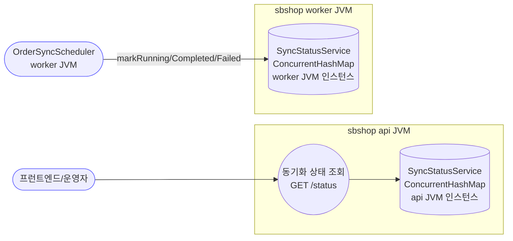
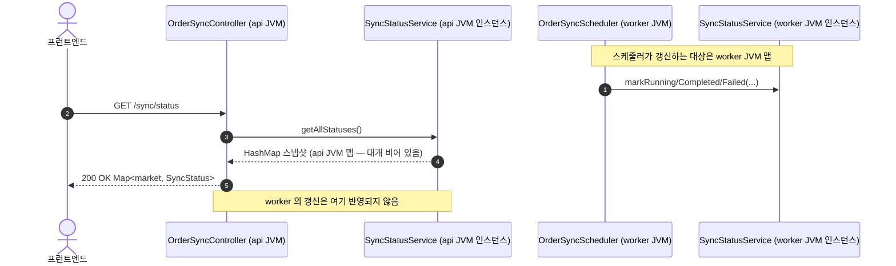
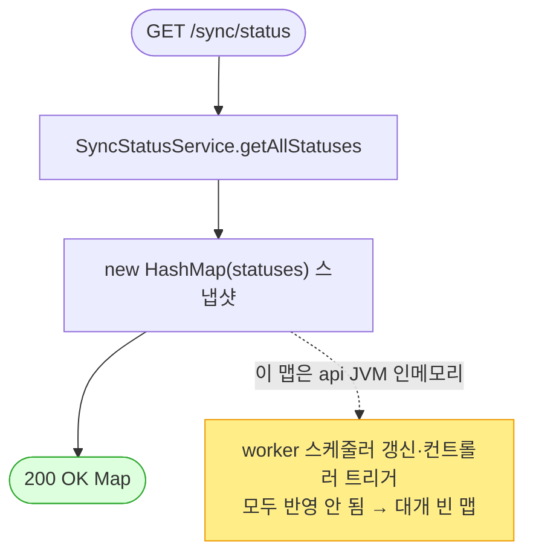

# GET /sync/status — 동기화 상태 조회

> **[E 반영 2026-07-15]** F-SYNC-24 — SyncStatusResponse DTO (커밋 `54087b6`).

> **[P4a 반영 2026-07-15]** F-SYNC-1·2·23·25 해결 — 동기화 상태 DB화(sb_market_sync_status, 두 JVM 공유) + @Async 메서드 자기기록(조기 완료마킹 제거) (커밋 `059ed79`).

## 1. 개요

| 항목 | 내용 |
|------|------|
| **Method / URL** | `GET /api/v1/orders/sync/status` |
| **목적** | 마켓별 동기화 상태(RUNNING/COMPLETED/FAILED · 마지막 완료시각 · 에러메시지)를 조회한다. |
| **핵심 상태전이** | 없음(조회 전용). |
| **부수효과** | 없음. `SyncStatusService` 의 인메모리 맵을 그대로 반환. |
| **응답** | `200 OK` + `Map<marketType, SyncStatus{marketType, status, lastSyncAt, errorMessage}>` |

## 2. 호출 체인

```
OrderSyncController.getSyncStatus()                        api/.../controller/OrderSyncController.java:224-227
  └─ SyncStatusService.getAllStatuses()                    core/.../application/sync/SyncStatusService.java:31-33
        └─ new HashMap<>(statuses)  (ConcurrentHashMap 스냅샷 반환)   SyncStatusService.java:32
```

**writer 측(다른 프로세스):**
```
OrderSyncScheduler (worker JVM)   worker/.../scheduler/OrderSyncScheduler.java
  ├─ markRunning(EMAIL/COUPANG/SMART_STORE/ELEVEN_STREET/GMARKET/COUPANG_SETTLEMENT/CUSTOMS)   :39,54,69,84,99,114,129
  ├─ markCompleted(...)   :42,57,72,87,102,117,132
  └─ markFailed(..., msg) :45,60,75,90,105,120,135
```

**요청 바디/파라미터**: 없음.

## 3. 유스케이스 다이어그램



> **결정적 관찰:** 조회는 **api JVM** 의 맵을, 갱신은 **worker JVM** 의 맵을 대상으로 한다. 두 맵은 별개 프로세스의 인메모리 인스턴스라 **절대 같은 데이터가 아니다**(F-SYNC-1의 핵심). 컨트롤러 트리거 sync 도 이 맵을 쓰지 않으므로, api JVM 맵은 사실상 항상 비어 있다.

## 4. 시퀀스 다이어그램



## 5. 순서도 (플로우차트)



## 6. 상태 전이표

| 상태 값 | 설정 주체 | 의미 | 관측 가능? (api JVM /status) |
|---------|-----------|------|:---:|
| `RUNNING` | worker `markRunning` | 스케줄러 실행 시작 | ❌ (worker 맵) |
| `COMPLETED` | worker `markCompleted` | 완료(+lastSyncAt) | ❌ |
| `FAILED` | worker `markFailed` | 실패(+errorMessage) | ❌ |
| (없음) | — | 미실행/타 JVM | ✅ 항상 이 상태로 보임 |

> `SyncStatus` 필드: `marketType`·`status`·`lastSyncAt`·`errorMessage`(`SyncStatusService.java:37-42`).

## 7. 🔎 발견사항

### F-SYNC-1 · 🔴 BUG — 조회(api JVM)와 갱신(worker JVM/미갱신 컨트롤러)의 상태 저장소가 분리되어 /status 가 실질적으로 항상 빈 값
- **근거:** `getSyncStatus()`(224-227)는 api JVM 의 `SyncStatusService.getAllStatuses()` 를 반환한다. 이 맵의 유일한 writer 는 **worker JVM** 의 `OrderSyncScheduler`(markRunning/Completed/Failed, `OrderSyncScheduler.java:39~135`)다. `SyncStatusService` 는 `@Service` + 인메모리 `ConcurrentHashMap`(`SyncStatusService.java:15`)이라 **프로세스 경계를 넘지 못한다**. 또한 컨트롤러의 6개 트리거(coupang/smartstore/11st/esmplus/settlement/customs)는 이 서비스를 **전혀 호출하지 않는다**.
- **영향:** ① api JVM 이 반환하는 status 맵은 스케줄러 갱신을 못 받아 **항상 비어 있다**(빈 `{}`). ② 설령 같은 JVM이라도 컨트롤러 트리거는 상태를 안 남긴다. 결과적으로 이 엔드포인트는 **의도한 정보를 전혀 제공하지 못한다**. 프런트 동기화 진행/실패 표시가 무력화.
- **제안:** 상태 저장소를 **DB 또는 Redis** 로 이전해 크로스-JVM 공유([[deployment-two-jvm-topology]] — 프로세스 간 공유상태는 DB/advisory lock). 동시에 컨트롤러 트리거와 스케줄러가 **같은 저장소**에 기록하도록 통일. 근본 해법은 `SyncCompletedEvent`(주문 sync 가 이미 발행) 를 구독해 상태를 갱신하는 리스너 도입.
- **연관:** 각 sync 문서의 F-SYNC-1 이 이 엔드포인트에 수렴. 원장 등재 권장.

### F-SYNC-23 · 🔴 BUG — 스케줄러가 `@Async` sync 를 호출하고 즉시 `markCompleted` → RUNNING/COMPLETED가 실제 실행과 무관
- **근거:** `OrderSyncScheduler.syncCoupangOrders()`(52-63)는 `markRunning(COUPANG)` 직후 `coupangOrderSyncService.syncCoupangOrders()`(**@Async**, 즉시 반환)를 호출하고 곧바로 `markCompleted(COUPANG)` 를 부른다. 실제 동기화는 별도 스레드에서 이제 막 시작할 뿐이다(EMAIL·CUSTOMS 는 동기라 예외).
- **영향:** 설령 F-SYNC-1 을 고쳐 크로스-JVM 공유가 되어도, COUPANG/SMART_STORE/ELEVEN_STREET/GMARKET/COUPANG_SETTLEMENT 는 **시작하자마자 COMPLETED 로 찍히고**, 비동기 내부에서 난 실패는 스케줄러 catch 로 오지 않아 **FAILED 도 못 남긴다**(lastSyncAt·errorMessage 부정확).
- **제안:** `@Async` 결과를 `CompletableFuture` 로 반환받아 완료 콜백에서 markCompleted/Failed 하거나, 상태 갱신을 서비스의 `SyncCompletedEvent` 발행 지점으로 옮긴다. F-SYNC-1 리스너 방안이 이 문제도 함께 해소.

### F-SYNC-24 · 🟡 SMELL — 조회 응답이 도메인 내부 정적 클래스(`SyncStatusService.SyncStatus`)를 직접 노출
- **근거:** 반환 제네릭이 `Map<String, SyncStatusService.SyncStatus>`(OrderSyncController.java:225). 응답 DTO 없이 서비스 내부 클래스를 직렬화한다.
- **영향:** 응답 계약이 내부 구현에 결합(도메인 라인아이템 API 의 F-S5/F-H6 와 동일한 횡단 이슈).
- **제안:** 전 API 공통으로 응답 DTO 도입 검토.

### F-SYNC-25 · 🔵 NOTE — 상태 맵이 재시작 시 소실(휘발성) · TTL/정리 없음
- **근거:** 인메모리 맵이라 JVM 재시작 시 전부 사라진다(배포=재시작이면 매 배포마다 초기화 — [[deploy-interrupts-running-batch]]). 오래된 항목 정리 로직도 없음.
- **제안:** DB/Redis 이전 시 자연 해결(F-SYNC-1). 이력 보존이 필요하면 스키마 설계에 반영.

## 8. 테스트 커버리지 메모

- `SyncStatusService` 자체는 단순 맵 래퍼라 로직 테스트 가치 낮음. 핵심은 **통합 계약**(트리거→상태반영→조회)이 크로스-JVM 에서 성립하는지이며, 현재 구조에서는 성립하지 않음(F-SYNC-1/23).
- **비어있는 케이스:** ① 컨트롤러 트리거 후 status 반영, ② 스케줄러 async 완료 후 status 정확성, ③ 크로스-JVM 공유. 세 케이스 모두 현행 구조로는 실패가 예상되어 정책·설계 확정 후 Red 테스트 권장.

---
*생성: 2026-07-14 · 근거 커밋: main@bd4c915*
