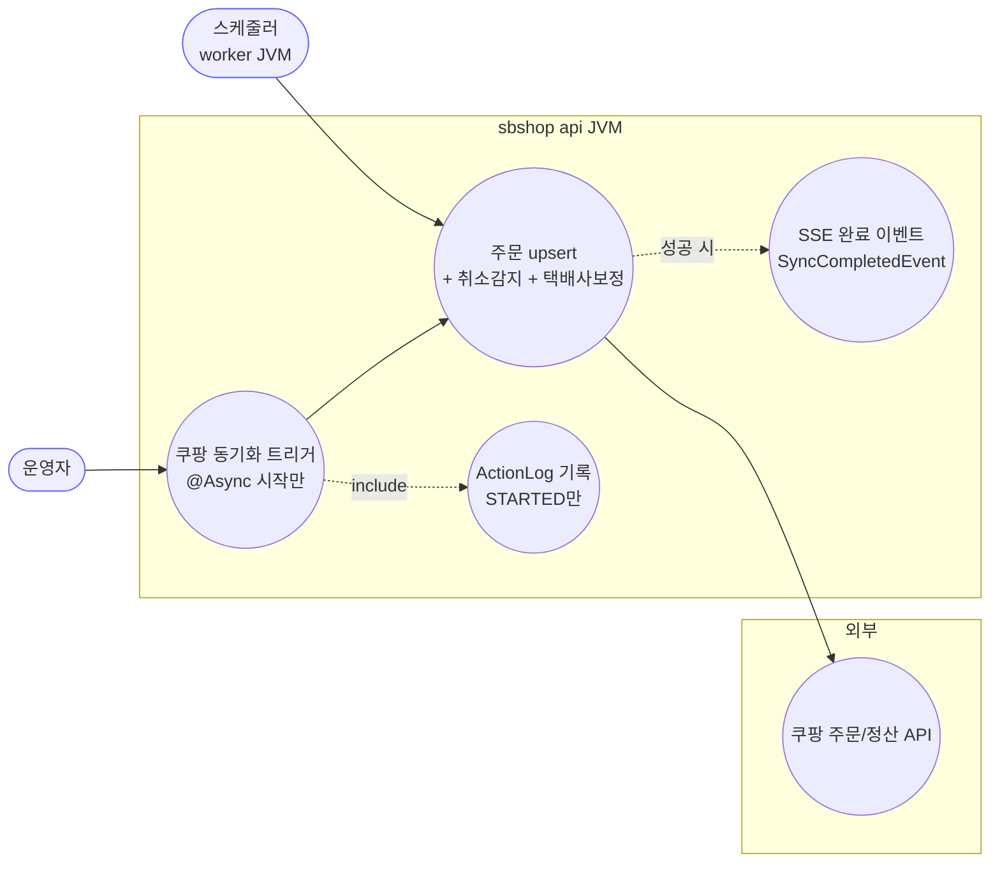
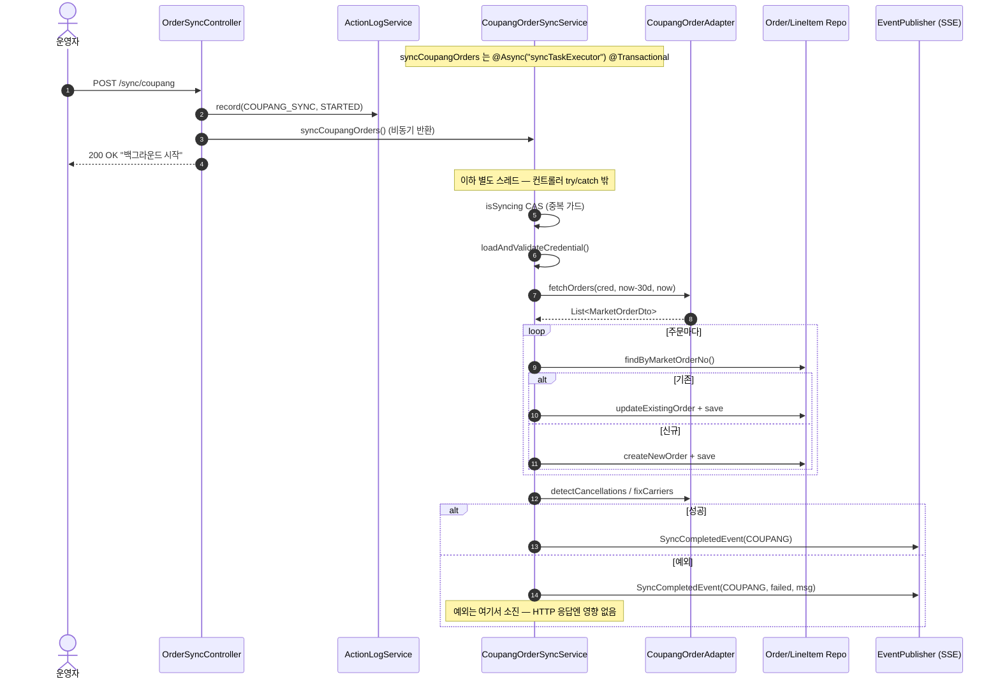
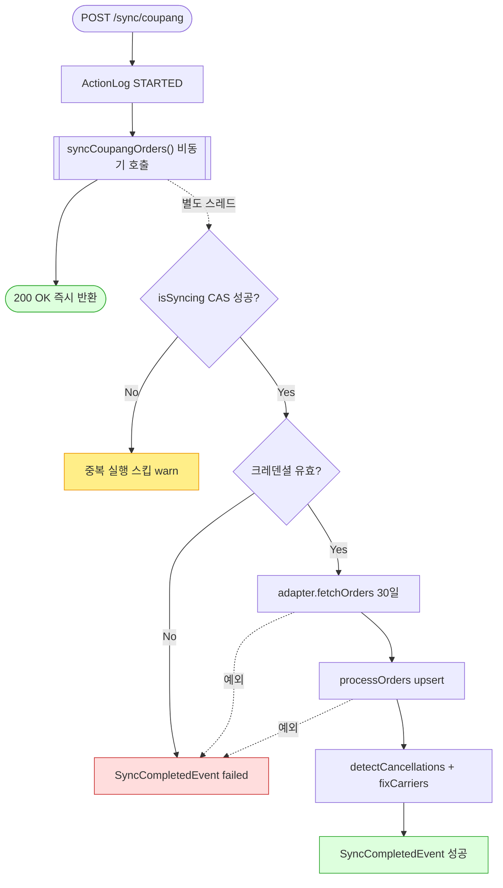

# POST /sync/coupang — 쿠팡 주문 동기화 트리거

> **[P4a 반영 2026-07-15]** F-SYNC-1·2·23·25 해결 — 동기화 상태 DB화(sb_market_sync_status, 두 JVM 공유) + @Async 메서드 자기기록(조기 완료마킹 제거) (커밋 `059ed79`).

## 1. 개요

| 항목 | 내용 |
|------|------|
| **Method / URL** | `POST /api/v1/orders/sync/coupang` |
| **목적** | 쿠팡 최근 30일 주문을 API로 조회해 자사 DB에 저장/갱신하는 동기화를 **백그라운드(@Async)로 트리거**한다. |
| **핵심 상태전이** | 없음(트리거 전용). lineItem별 배송상태는 마켓 응답값으로 갱신되나, 이 컨트롤러는 결과를 기다리지 않음. |
| **부수효과** | 쿠팡 주문 API 호출 · 주문/라인아이템 upsert · 취소감지(CANCELED) · 택배사 보정 · `ActionLog(STARTED)` 기록 · `SyncCompletedEvent` 발행(SSE). |
| **응답** | `200 OK` + `{success:true, message:"...백그라운드에서 시작되었습니다."}` (실행 시작만 보장, 완료 아님) |

## 2. 호출 체인

```
OrderSyncController.syncCoupangOrders()                    api/.../controller/OrderSyncController.java:51-72
  ├─ ActionLogService.record("COUPANG_SYNC","COUPANG",STARTED,...)   OrderSyncController.java:55
  └─ CoupangOrderSyncService.syncCoupangOrders()  @Async @Transactional   core/.../order/service/CoupangOrderSyncService.java:54-88
       ├─ isSyncing.compareAndSet(false,true)  중복실행 가드          CoupangOrderSyncService.java:58
       ├─ loadAndValidateCredential()  (COUPANG 크레덴셜 null/불완전 검증)   CoupangOrderSyncService.java:155-165
       ├─ coupangOrderAdapter.fetchOrders(cred, now-30d, now)         CoupangOrderSyncService.java:68
       │       └─ CoupangOrderAdapter (마켓 어댑터 — 쿠팡 REST 호출)
       ├─ processOrders(orders, cred)                                 CoupangOrderSyncService.java:168-185
       │     ├─ orderRepository.findByMarketOrderNo()                 (기존/신규 분기)
       │     ├─ updateExistingOrder() → updateLineItemFromDto()       CoupangOrderSyncService.java:188-219
       │     │       └─ ShippingUpdateCommand.toShippingData(existing)  (null-skip 병합, trackingSentToMarket 가드)
       │     └─ createNewOrder() → buildOrderFromDto/buildLineItemFromDto   CoupangOrderSyncService.java:242-293
       │             └─ resolveProductId()  (vendorItemId→sellerProductId 역조회·보강 D-046)   CoupangOrderSyncService.java:296-332
       ├─ postSyncProcess(orders)                                     CoupangOrderSyncService.java:342-349
       │     ├─ coupangOrderAdapter.detectCancellations(...)   (API 미포함 주문 → CANCELED)
       │     └─ coupangOrderAdapter.fixCarriers(...)           (택배사 ETC 보정)
       └─ eventPublisher.publishEvent(SyncCompletedEvent(COUPANG))    CoupangOrderSyncService.java:85 (성공 시)
```

**요청 바디**: 없음. **경로/쿼리 파라미터**: 없음(기간은 서비스가 `now-30d ~ now` 로 하드코딩 — F-SYNC-7).

## 3. 유스케이스 다이어그램



> **관찰:** 컨트롤러는 `@Async` 서비스를 호출하고 즉시 200 을 반환한다. 실제 upsert·마켓호출·이벤트는 별도 스레드에서 일어나 컨트롤러의 try/catch 밖이다(F-SYNC-2).

## 4. 시퀀스 다이어그램



## 5. 순서도 (플로우차트)



## 6. 상태 전이표

| 대상 | 진입 조건 | 결과 | 부수효과 |
|------|-----------|------|----------|
| 동기화 실행 | `isSyncing=false` | 실행 | 30일 주문 upsert |
| 동기화 실행 | `isSyncing=true` | **스킵**(warn 로그만) | 없음 — 호출자는 이를 알 수 없음 |
| lineItem 배송상태 | 항상 | 마켓값으로 갱신 | trackingNo/carrier 는 `trackingSentToMarket=true` 일 때만 덮어씀 |
| API 미포함 기존주문 | non-terminal | `CANCELED` | detectCancellations |
| 주소/우편번호 | 진행(PREPARING↑) lineItem 존재 시 | **보호(미갱신)** | D-074 |

## 7. 🔎 발견사항

### F-SYNC-1 · 🔴 BUG — `GET /status` 가 참조하는 SyncStatusService 를 이 트리거는 갱신하지 않음 (게다가 크로스-JVM 미공유)
> ✅ **해결됨** (커밋 `059ed79`) — 체크리스트 기준.
- **근거:** `OrderSyncController.syncCoupangOrders()`(51-72)는 `SyncStatusService.markRunning/Completed` 를 전혀 호출하지 않는다. 상태 기록은 오직 **worker JVM** 의 `OrderSyncScheduler.java:54-62` 만 수행한다. `SyncStatusService`(`sync/SyncStatusService.java:15`)는 인메모리 `ConcurrentHashMap` 이라 api-JVM 과 worker-JVM 간에 공유되지 않는다.
- **영향:** ① 운영자가 이 API 로 수동 동기화를 돌려도 `GET /sync/status` 는 상태 변화를 전혀 못 보여준다(항상 스케줄러 흔적만/공백). ② 두 JVM 토폴로지에서 status 는 api-JVM 인스턴스가 항상 빈 맵을 반환(스케줄러는 worker-JVM 에서만 씀). 프런트 동기화 진행 UI 가 무의미해진다.
- **제안:** 상태를 DB/Redis 로 이전하거나(크로스-JVM 공유), 최소한 컨트롤러 트리거에서도 `markRunning`→(비동기 완료 콜백)→`markCompleted` 를 기록. 근본은 `SyncCompletedEvent` 기반으로 status 를 갱신하는 리스너 도입.
- **연관:** [[deployment-two-jvm-topology]] — 프로세스 간 공유상태는 DB/advisory lock 로.

### F-SYNC-2 · 🔴 BUG — `@Async` 서비스의 예외가 컨트롤러 try/catch 로 오지 않아 실패가 200 으로 은폐됨
> ✅ **해결됨** (커밋 `059ed79`) — 체크리스트 기준.
- **근거:** `CoupangOrderSyncService.syncCoupangOrders()` 는 `@Async("syncTaskExecutor")`(54). 컨트롤러의 `try { coupangOrderSyncService.syncCoupangOrders(); } catch(Exception e){ 500 }`(57-71)는 **비동기 호출이 즉시 반환**하므로 사실상 절대 catch 로 진입하지 않는다. 실제 실패는 서비스 내부 catch(77-80)에서 `SyncCompletedEvent(failed)` 로만 처리되고 HTTP 는 이미 200.
- **영향:** 크레덴셜 누락·API 오류 등 실질 실패에도 API 는 `success:true` 를 반환. 컨트롤러의 catch/500 분기는 **사실상 죽은 코드**(DI/프록시 예외 등 극히 드문 경우만 도달).
- **제안:** 트리거 성격이면 응답 메시지를 "요청 접수"로 낮추고 catch 를 제거하거나, 완료/실패는 status·ActionLog·SSE 로만 관측하도록 계약을 명문화.

### F-SYNC-3 · 🟠 GAP — 성공/실패 ActionLog 미기록(STARTED 만) — 완료 추적 불가
> ⬜ **미해결(백로그)**.
- **근거:** 컨트롤러는 `record(COUPANG_SYNC, STARTED)`(55)만 남긴다. 비동기 완료/실패 시 SUCCESS/FAILED 를 기록하는 경로가 없다(customs 엔드포인트는 SUCCESS/FAILED 를 남기는 것과 비대칭 — [[customs.md]]).
- **영향:** ActionLog 조회로는 쿠팡 동기화가 끝났는지·실패했는지 알 수 없다. STARTED 만 쌓임.
- **제안:** `SyncCompletedEvent` 리스너에서 SUCCESS/FAILED ActionLog 기록. F-SYNC-1 과 동일 리스너로 해결 가능.

### F-SYNC-4 · 🟡 SMELL — 정산액 수수료율 `0.89`(11%) 하드코딩
> ⬜ **미해결(백로그)**.
- **근거:** `CoupangOrderSyncService.java:276` `dto.getTotalAmount().multiply(new BigDecimal("0.89"))`. 마켓별 수수료가 상수로 코드에 박힘.
- **영향:** 수수료율 변경·마켓별 차등 시 코드 수정 필요. 초기 추정 정산액이며 실제값은 `syncCoupangSettlement` 이 덮음(→ [[coupang-settlement.md]])이나 그 전까지 부정확.
- **제안:** 수수료율을 설정/마켓 메타로 외부화.

### F-SYNC-5 · 🟡 SMELL — 4개 마켓 동기화 서비스의 upsert 골격 중복
> ✅ **해결됨** (커밋 `baad6ff`) — 체크리스트 기준 (Cafe24 보류).
- **근거:** coupang/smartstore/11st 서비스가 `syncXxx`→`processOrders`→`updateExistingOrder`/`createNewOrder`→`updateLineItemFromDto`→`buildOrderFromDto`/`buildLineItemFromDto` 구조를 거의 동일하게 반복(`CoupangOrderSyncService.java:168-293` ↔ `SmartStoreOrderSyncService.java:88-185` ↔ `ElevenstOrderSyncService.java:88-202`). 차이는 크레덴셜 검증·resolveProductId·postSyncProcess 뿐.
- **제안:** 공통 추상 클래스/템플릿 메서드로 골격 추출, 마켓별 훅만 오버라이드. 회귀 위험 크므로 계약 테스트 확보 후 착수.

## 8. 테스트 커버리지 메모

- `CoupangOrderSyncService` 단위 테스트 존재 여부는 core test 재확인 필요(본 분석 범위 밖). resolveProductId 의 D-046 역조회·보강 경로는 회귀 위험이 높아 우선 대상.
- **비어있는 케이스:** ① `@Async` 실패 시 HTTP 계약(F-SYNC-2), ② status 미갱신(F-SYNC-1), ③ 중복 실행 가드(isSyncing) 하에서의 동작.

---
*생성: 2026-07-14 · 근거 커밋: main@bd4c915*
