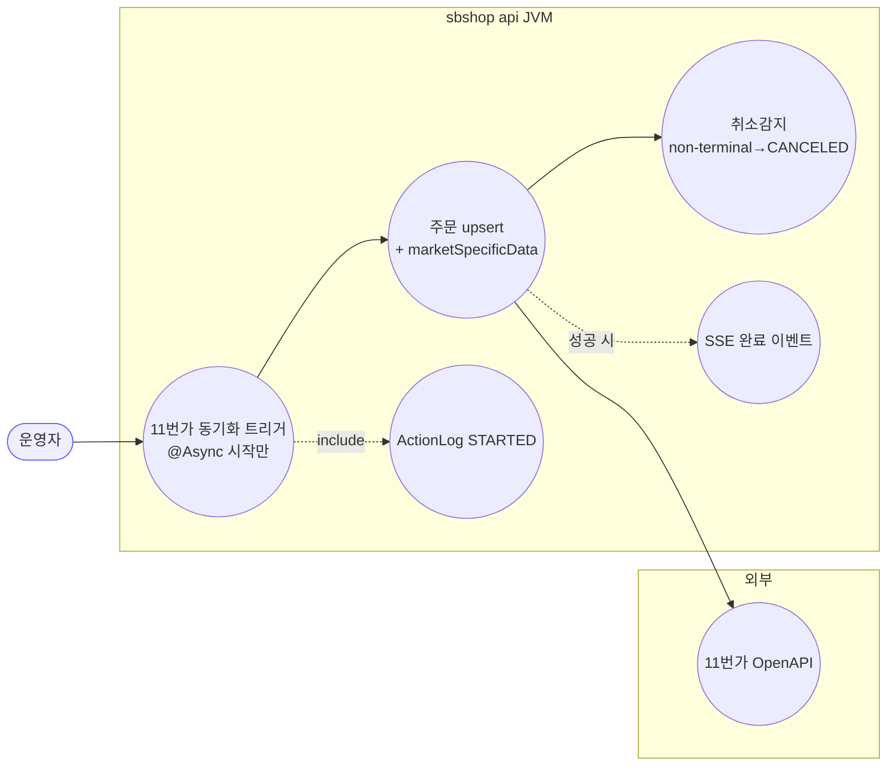
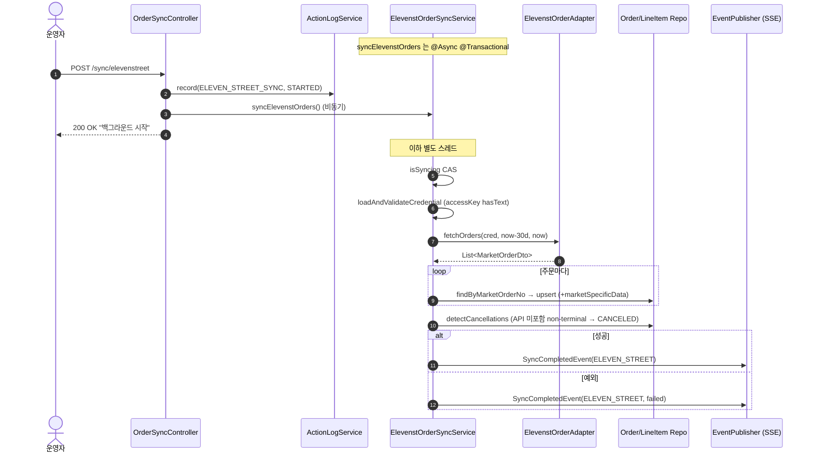
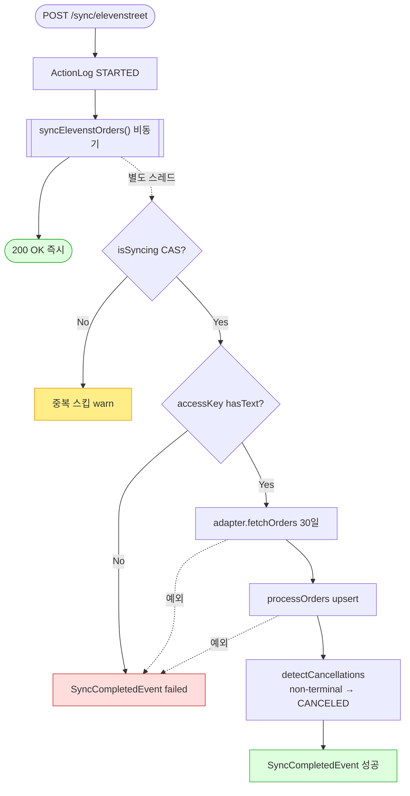

# POST /sync/elevenstreet — 11번가 주문 동기화 트리거

> **[P4a 반영 2026-07-15]** F-SYNC-1·2·23·25 해결 — 동기화 상태 DB화(sb_market_sync_status, 두 JVM 공유) + @Async 메서드 자기기록(조기 완료마킹 제거) (커밋 `059ed79`).

## 1. 개요

| 항목 | 내용 |
|------|------|
| **Method / URL** | `POST /api/v1/orders/sync/elevenstreet` |
| **목적** | 11번가 최근 30일 주문을 API로 조회해 자사 DB에 upsert하는 동기화를 **백그라운드(@Async)로 트리거**한다. |
| **핵심 상태전이** | 없음(트리거). lineItem 배송상태 갱신 + 취소감지(→ CANCELED). |
| **부수효과** | 11번가 API 호출 · 주문/라인아이템 upsert · **취소감지(D-028, 서비스 자체 구현)** · `marketSpecificData` 반영 · `ActionLog(STARTED)` · `SyncCompletedEvent`(SSE). |
| **응답** | `200 OK` + `{success:true, message:"...백그라운드에서 시작되었습니다."}` |

## 2. 호출 체인

```
OrderSyncController.syncElevenStreetOrders()               api/.../controller/OrderSyncController.java:100-117
  ├─ ActionLogService.record("ELEVEN_STREET_SYNC","ELEVEN_STREET",STARTED,...)   OrderSyncController.java:103
  └─ ElevenstOrderSyncService.syncElevenstOrders()  @Async @Transactional   core/.../order/service/ElevenstOrderSyncService.java:46-75
       ├─ isSyncing.compareAndSet(false,true)  중복 가드                 ElevenstOrderSyncService.java:49
       ├─ loadAndValidateCredential()  (accessKey hasText — D-043)       ElevenstOrderSyncService.java:77-86
       ├─ elevenstOrderAdapter.fetchOrders(cred, now-30d, now)           ElevenstOrderSyncService.java:57
       │       └─ ElevenstOrderAdapter (마켓 어댑터)
       ├─ processOrders(orders, cred)                                    ElevenstOrderSyncService.java:88-102
       │     ├─ updateExistingOrder() → updateLineItemFromDto()          ElevenstOrderSyncService.java:104-127
       │     │       └─ ShippingUpdateCommand.toShippingData(existing)   (null-skip 병합)
       │     │       └─ order.setMarketSpecificDataFromMap(...)          ElevenstOrderSyncService.java:140-146
       │     └─ createNewOrder() → buildOrderFromDto/buildLineItemFromDto   ElevenstOrderSyncService.java:149-202
       │             └─ resolveProductId()  (marketProductCode→findBySbCode)   ElevenstOrderSyncService.java:204-210
       ├─ postSyncProcess(orders) → detectCancellations(...)             ElevenstOrderSyncService.java:223-268
       │       └─ isNonTerminal() 판정 후 CANCELED 반영 (D-028)          ElevenstOrderSyncService.java:274-283
       └─ eventPublisher.publishEvent(SyncCompletedEvent(ELEVEN_STREET)) ElevenstOrderSyncService.java:72 (성공 시)
```

**요청 바디/파라미터**: 없음. 기간은 `now-30d ~ now` 하드코딩(취소감지도 동일 창).

## 3. 유스케이스 다이어그램



> **관찰:** 11번가는 취소/반품/교환 조회 API 가 없어, `detectCancellations` 를 **서비스 코드로 자체 구현**(D-028)해 API 미포함 non-terminal 주문을 CANCELED 로 전이시킨다. 쿠팡은 어댑터가, 스마트스토어는 아무도 하지 않는다.

## 4. 시퀀스 다이어그램



## 5. 순서도 (플로우차트)



## 6. 상태 전이표

| 대상 | 진입 조건 | 결과 | 부수효과 |
|------|-----------|------|----------|
| 동기화 실행 | `isSyncing=false` | 실행 | 30일 주문 upsert |
| 동기화 실행 | `isSyncing=true` | 스킵(warn) | 없음 |
| lineItem 배송상태 | 항상 | 마켓값 갱신 | trackingNo/carrier 무조건 병합(sent 가드 없음 — F-SYNC-8과 동일 성격) |
| API 미포함 기존주문 | non-terminal(≠CANCELED/DELIVERED/RETURNED/EXCHANGED) | `CANCELED` | detectCancellations(D-028) |
| API 미포함 기존주문 | terminal | **유지** | 종결 상태는 취소로 오인 안 함 |

## 7. 🔎 발견사항

### F-SYNC-1 · 🔴 BUG — status 미갱신 + 크로스-JVM 미공유 (공통)
> ✅ **해결됨** (커밋 `059ed79`) — 체크리스트 기준.
- **근거:** 컨트롤러가 `SyncStatusService` 미갱신. writer 는 worker 의 `OrderSyncScheduler.java:99-105` 뿐, 인메모리 미공유.
- **영향/제안:** [[sync-coupang.md]] F-SYNC-1 참조.

### F-SYNC-2 · 🔴 BUG — `@Async` 예외가 컨트롤러 catch 로 오지 않음 (공통)
> ✅ **해결됨** (커밋 `059ed79`) — 체크리스트 기준.
- **근거:** `syncElevenstOrders()` `@Async`(46). 컨트롤러 try/catch(106-116) 사실상 도달 불가.
- **영향/제안:** [[sync-coupang.md]] F-SYNC-2 참조.

### F-SYNC-10 · 🟠 GAP — 취소감지가 orderDate 기준 30일 창 밖 주문을 건너뜀 → 오래된 취소 누락
> ⬜ **미해결(백로그)**.
- **근거:** `detectCancellations()`(238-244)는 `order.getOrderDate()` 가 `[now-30d, now]` 밖이면 `continue`. 그런데 `orderDate == null` 인 주문은 창 필터를 통과(240 `if(orderDate != null)`)해 감지 대상이 된다.
- **영향:** ① 31일 이상 지난 뒤 취소된 주문은 감지 안 됨(fetchOrders 도 30일이라 대체로 정합하나, 경계에서 미탐 가능). ② `orderDate == null` 주문은 창 무관하게 매번 감지 후보가 되어 성능/오탐 여지. 대체로 의도된 범위 한정이나 문서화 필요.
- **제안:** 감지 창을 fetchOrders 창과 명시적으로 동기화하고, `orderDate == null` 처리 방침(스킵 vs 포함)을 확정.

### F-SYNC-8 · 🟡 SMELL — 송장 병합에 `trackingSentToMarket` 가드 없음 (스마트스토어와 동일)
> ⬜ **미해결(백로그)**.
- **근거:** `updateLineItemFromDto()`(116-127)가 마켓 송장을 무조건 병합. 쿠팡의 보존 가드 부재.
- **영향/제안:** [[sync-smartstore.md]] F-SYNC-8 참조.

### F-SYNC-5 · 🟡 SMELL — upsert 골격 중복 (공통)
> ✅ **해결됨** (커밋 `baad6ff`) — 체크리스트 기준 (Cafe24 보류).
- **근거:** 쿠팡/스마트스토어와 거의 동일 골격 + `detectCancellations` 는 이미 이 서비스에도 인라인 복제됨(쿠팡 어댑터 정본을 이식). [[sync-coupang.md]] F-SYNC-5 참조.

## 8. 테스트 커버리지 메모

- `detectCancellations`/`isNonTerminal` 은 서비스 내부 메서드라 단위 테스트 가능. terminal 보존·non-terminal 취소 전이 계약 테스트 존재 여부 재확인 권장.
- **비어있는 케이스:** ① orderDate null·창 경계 취소감지(F-SYNC-10), ② `@Async` 실패 계약, ③ marketSpecificData 병합.

---
*생성: 2026-07-14 · 근거 커밋: main@bd4c915*
