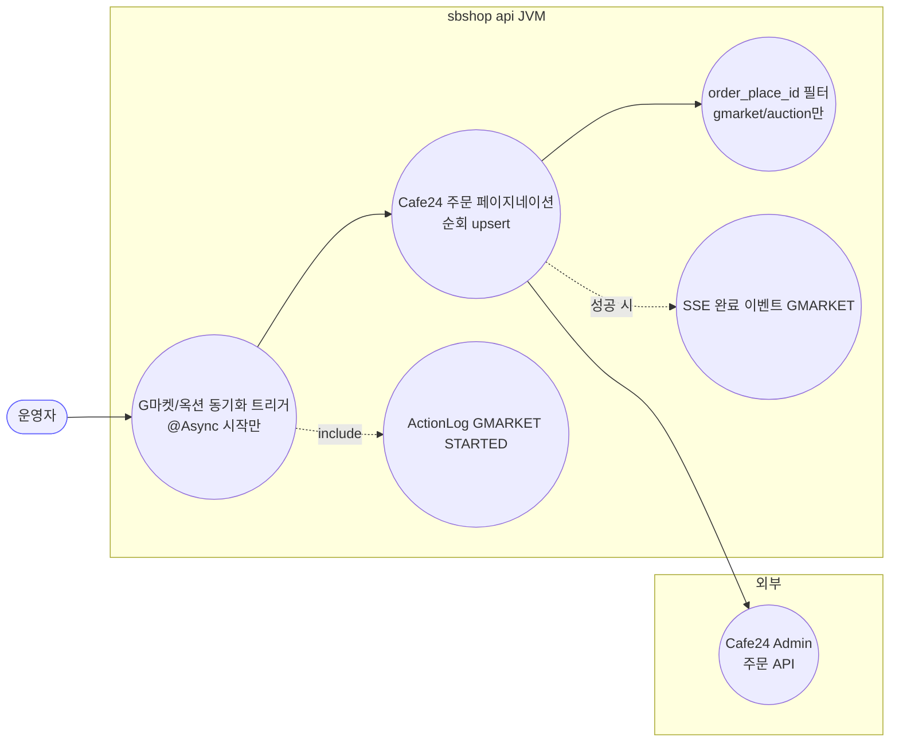
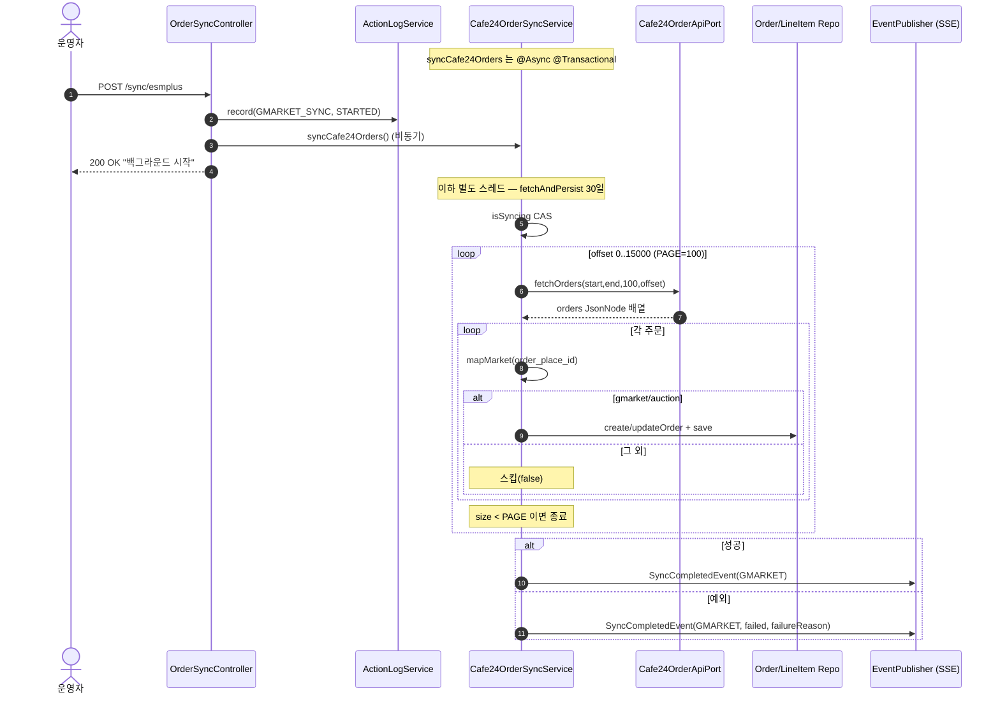
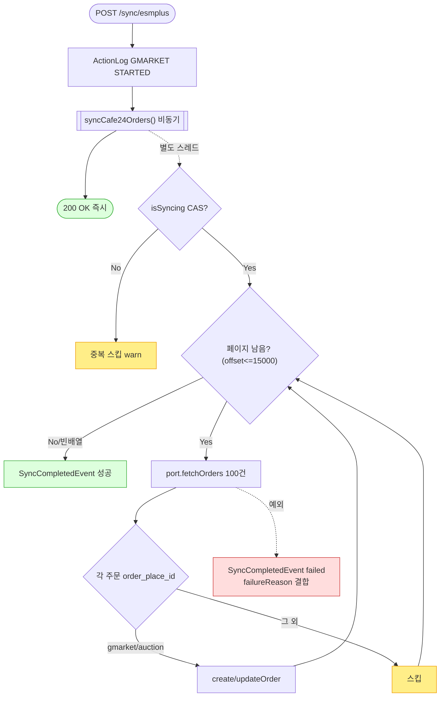

# POST /sync/esmplus — G마켓/옥션 주문 동기화 트리거 (Cafe24 주문 API 경유)

> **[P4a 반영 2026-07-15]** F-SYNC-1·2·23·25 해결 — 동기화 상태 DB화(sb_market_sync_status, 두 JVM 공유) + @Async 메서드 자기기록(조기 완료마킹 제거) (커밋 `059ed79`).

## 1. 개요

| 항목 | 내용 |
|------|------|
| **Method / URL** | `POST /api/v1/orders/sync/esmplus` |
| **목적** | ESM+ Selenium 스크래핑 대신 **Cafe24 주문 API**로 G마켓/옥션 주문을 조회·upsert하는 동기화를 **백그라운드(@Async)로 트리거**한다. `order_place_id` 로 gmarket/auction 만 처리. |
| **핵심 상태전이** | 없음(트리거). lineItem 배송상태는 Cafe24 `order_status` 코드 → 도메인 상태 매핑으로 갱신. |
| **부수효과** | Cafe24 주문 API 페이지네이션 호출 · G마켓/옥션 주문 upsert · `marketSpecificData`(cafe24_order_id 등) 갱신 · `ActionLog(GMARKET_SYNC, STARTED)` · `SyncCompletedEvent(GMARKET)`(SSE). **취소감지 없음.** |
| **응답** | `200 OK` + `{success:true, message:"G마켓/옥션 주문 동기화(Cafe24 API)가 백그라운드에서 시작되었습니다."}` |

## 2. 호출 체인

```
OrderSyncController.syncEsmplusOrders()                    api/.../controller/OrderSyncController.java:120-137
  ├─ ActionLogService.record("GMARKET_SYNC","GMARKET",STARTED,...)   OrderSyncController.java:123
  └─ Cafe24OrderSyncService.syncCafe24Orders()  @Async @Transactional   core/.../order/service/Cafe24OrderSyncService.java:53-75
       ├─ isSyncing.compareAndSet(false,true)  중복 가드                 Cafe24OrderSyncService.java:56
       ├─ fetchAndPersist(now-30d, now)  @Transactional                  Cafe24OrderSyncService.java:95-117
       │     └─ 페이지네이션 loop (PAGE=100, offset≤15000)               Cafe24OrderSyncService.java:101-115
       │           ├─ cafe24OrderApiPort.fetchOrders(start,end,100,offset)   port/Cafe24OrderApiPort.java:21
       │           │       └─ Cafe24 REST GET /admin/orders (embed=items,receivers,buyer)
       │           └─ persistOrder(o)                                    Cafe24OrderSyncService.java:120-136
       │                 ├─ mapMarket(order_place_id) → GMARKET/AUCTION/null(스킵)   Cafe24OrderSyncService.java:290-299
       │                 ├─ resolveMarketOrderNo(o)                      Cafe24OrderSyncService.java:358-361
       │                 ├─ createOrder() → buildLineItem()              Cafe24OrderSyncService.java:138-231
       │                 │     ├─ resolveProductId(item) (product_no/code → marketRegistration CAFE24)   Cafe24OrderSyncService.java:234-248
       │                 │     ├─ mapStatus(order_status) 코드 매핑       Cafe24OrderSyncService.java:302-326
       │                 │     └─ extractPccc() (PCCC 방어적 추출)        Cafe24OrderSyncService.java:262-276
       │                 └─ updateOrder() (배송상태 갱신 + refreshMarketSpecific)   Cafe24OrderSyncService.java:165-209
       └─ eventPublisher.publishEvent(SyncCompletedEvent(GMARKET))       Cafe24OrderSyncService.java:72 (성공 시)
```

**요청 바디/파라미터**: 없음. 기간은 `now-30d ~ now` 하드코딩. 페이지 크기 PAGE=100, offset 상한 15000.

## 3. 유스케이스 다이어그램



> **관찰:** G마켓/옥션이 Cafe24 오픈마켓 연동으로 들어오므로, Cafe24 주문 중 `order_place_id ∈ {gmarket,auction}` 만 취해 GMARKET/AUCTION 으로 저장한다. 그 외(직접몰·타마켓)는 스킵해 중복 저장을 막는다.

## 4. 시퀀스 다이어그램



## 5. 순서도 (플로우차트)



## 6. 상태 전이표

| 대상 | 진입 조건 | 결과 | 부수효과 |
|------|-----------|------|----------|
| 동기화 실행 | `isSyncing=false` | 실행 | 30일 Cafe24 주문 페이지네이션 |
| 동기화 실행 | `isSyncing=true` | 스킵(warn) | 없음 |
| 주문 | `order_place_id ∈ {gmarket,auction}` | upsert(GMARKET/AUCTION) | marketSpecific·PCCC 반영 |
| 주문 | 그 외 order_place_id | **스킵** | 없음(중복 방지) |
| lineItem 상태 | items 개수 == 기존 lineItem 수 | 아이템별 매핑 | mapStatus |
| lineItem 상태 | 개수 불일치 | **첫 아이템 상태를 전체 적용**(방어적) | F-SYNC-11 |
| 취소된 주문 | — | **미감지** | detectCancellations 없음 |

## 7. 🔎 발견사항

### F-SYNC-1 · 🔴 BUG — status 미갱신 + 크로스-JVM 미공유 (공통)
> ✅ **해결됨** (커밋 `059ed79`) — 체크리스트 기준.
- **근거:** 컨트롤러가 `SyncStatusService` 미갱신. writer 는 worker 의 `OrderSyncScheduler.java:69-75`(GMARKET) 뿐, 인메모리 미공유.
- **영향/제안:** [[sync-coupang.md]] F-SYNC-1 참조.

### F-SYNC-2 · 🔴 BUG — `@Async` 예외가 컨트롤러 catch 로 오지 않음 (공통)
> ✅ **해결됨** (커밋 `059ed79`) — 체크리스트 기준.
- **근거:** `syncCafe24Orders()` `@Async`(53). 컨트롤러 try/catch(126-136) 사실상 도달 불가. (단, 서비스가 `failureReason` 로 근본원인을 이벤트에 담아 은폐를 완화 — 79-92.)
- **영향/제안:** [[sync-coupang.md]] F-SYNC-2 참조.

### F-SYNC-11 · 🟠 GAP — items 개수 불일치 시 첫 아이템 상태를 전체 lineItem 에 일괄 적용
> ⬜ **미해결(백로그)**.
- **근거:** `updateOrder()`(201-208): Cafe24 items 배열 크기 ≠ 자사 lineItem 수이면 `firstOf(itemsArr)` 의 `order_status` 를 **모든 lineItem 에 동일 적용**. 주석대로 sbshop 은 order_item_code 를 보존하지 않아 정확 매핑 불가한 방어적 처리.
- **영향:** 한 주문에 서로 다른 상태의 아이템이 섞여 있으면(부분 배송/부분 취소), 실제와 다른 상태가 일부 lineItem 에 기록될 수 있다.
- **제안:** order_item_code 를 lineItem 에 보존해 정확 매핑을 복원하거나, 불일치 시 상태를 갱신하지 않는 보수적 정책 검토.

### F-SYNC-12 · 🟠 GAP — PCCC 필드명이 미확정이라 후보 키 순차 시도(추출 실패 시 통관번호 누락 가능)
> ⬜ **미해결(백로그)**.
- **근거:** `extractPccc()`(262-276)가 `PCCC_KEYS`(257-260) 7개 후보를 buyer→receiver→order 순으로 시도. 실제 Cafe24 필드명이 문서로 100% 확정 안 됨(주석 명시). 모두 blank 면 null(기존값 미변경).
- **영향:** Cafe24 응답의 실제 PCCC 필드가 후보에 없으면 통관번호가 채워지지 않아, 이후 `customs` 동기화([[customs.md]])의 검증 대상에서 누락된다.
- **제안:** `cafe24/preview` 로 실제 응답 키를 확인해 정확 필드명을 확정([[cafe24-preview.md]] 목적과 직결).

### F-SYNC-6 · 🟠 GAP — 취소감지 부재 (스마트스토어와 동일)
> ⬜ **미해결(백로그)**.
- **근거:** `Cafe24OrderSyncService` 에 detectCancellations 경로 없음. Cafe24 API 가 종료건도 반환하면 mapStatus 로 CANCELED/RETURNED/EXCHANGED 가 갱신되지만, 응답에서 사라진 주문의 잔류 여부는 미처리.
- **영향/제안:** Cafe24 주문 API 가 취소건을 계속 반환하는지 확인. 반환 안 하면 [[sync-elevenstreet.md]] 의 detectCancellations 패턴 필요.

### F-SYNC-7 · 🔵 NOTE — offset 상한 15000 초과 시 조용히 절단
> ⬜ **미해결(백로그)**.
- **근거:** `fetchAndPersist()`(101) `while(offset <= 15000)`. 30일 주문이 15100건을 넘으면 초과분이 조용히 누락된다(Cafe24 offset 상한 제약이나 로그 경고 없음).
- **제안:** 상한 도달 시 경고 로그·기간 분할 순회 검토.

## 8. 테스트 커버리지 메모

- `mapStatus`(코드→상태), `resolveMarketOrderNo`, `extractPccc` 등 순수 매핑 함수는 단위 테스트 용이. 커밋 이력상 Cafe24 E2E 실전테스트 결과서 존재(D-E1~E6).
- **비어있는 케이스:** ① items 개수 불일치 상태 매핑(F-SYNC-11), ② PCCC 후보 키 미스(F-SYNC-12), ③ offset 절단(F-SYNC-7), ④ `@Async` 실패 계약.

---
*생성: 2026-07-14 · 근거 커밋: main@bd4c915*
