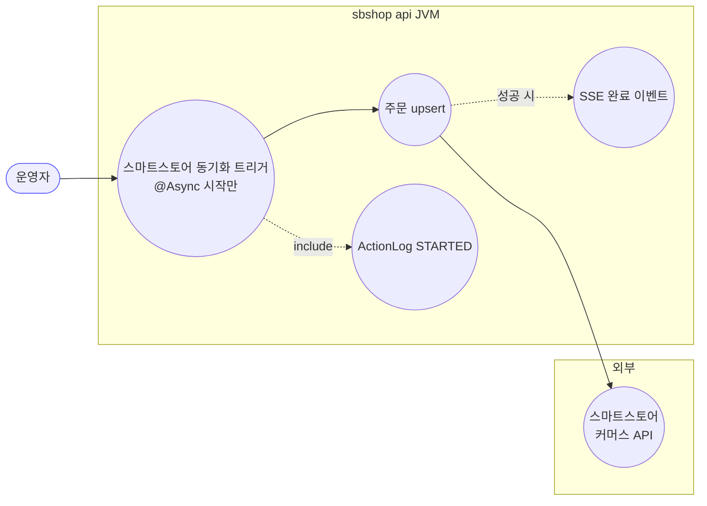
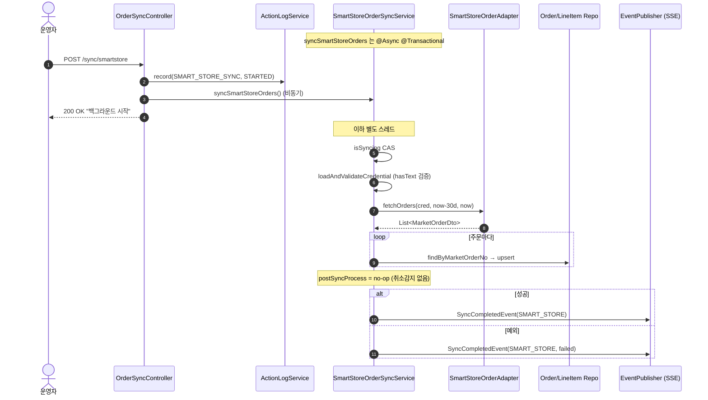
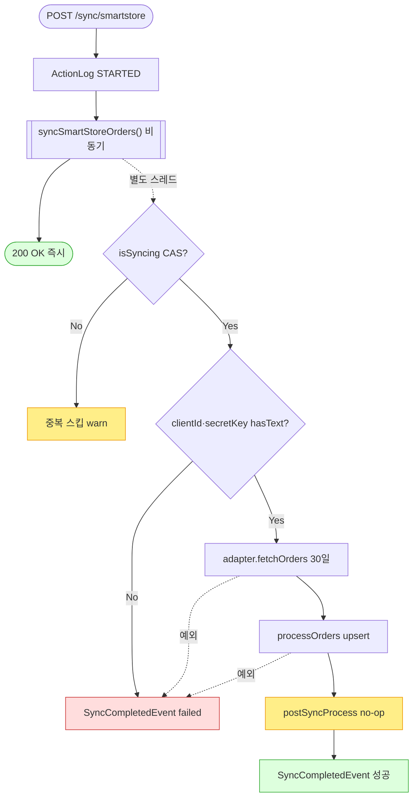

# POST /sync/smartstore — 스마트스토어 주문 동기화 트리거

> **[P4a 반영 2026-07-15]** F-SYNC-1·2·23·25 해결 — 동기화 상태 DB화(sb_market_sync_status, 두 JVM 공유) + @Async 메서드 자기기록(조기 완료마킹 제거) (커밋 `059ed79`).

## 1. 개요

| 항목 | 내용 |
|------|------|
| **Method / URL** | `POST /api/v1/orders/sync/smartstore` |
| **목적** | 스마트스토어 최근 30일 주문을 API로 조회해 자사 DB에 upsert하는 동기화를 **백그라운드(@Async)로 트리거**한다. |
| **핵심 상태전이** | 없음(트리거). lineItem 배송상태는 마켓 응답값으로 갱신. |
| **부수효과** | 스마트스토어 API 호출 · 주문/라인아이템 upsert · `ActionLog(STARTED)` · `SyncCompletedEvent`(SSE). **취소감지·택배사보정 없음**(postSyncProcess 빈 구현). |
| **응답** | `200 OK` + `{success:true, message:"...백그라운드에서 시작되었습니다."}` |

## 2. 호출 체인

```
OrderSyncController.syncSmartStoreOrders()                 api/.../controller/OrderSyncController.java:75-97
  ├─ ActionLogService.record("SMART_STORE_SYNC","SMART_STORE",STARTED,...)   OrderSyncController.java:79
  └─ SmartStoreOrderSyncService.syncSmartStoreOrders()  @Async @Transactional   core/.../order/service/SmartStoreOrderSyncService.java:45-74
       ├─ isSyncing.compareAndSet(false,true)  중복 가드                 SmartStoreOrderSyncService.java:48
       ├─ loadAndValidateCredential()  (clientId/secretKey hasText — D-043)   SmartStoreOrderSyncService.java:76-86
       ├─ smartStoreOrderAdapter.fetchOrders(cred, now-30d, now)         SmartStoreOrderSyncService.java:56
       │       └─ SmartStoreOrderAdapter (마켓 어댑터)
       ├─ processOrders(orders, cred)                                    SmartStoreOrderSyncService.java:88-102
       │     ├─ updateExistingOrder() → updateLineItemFromDto()          SmartStoreOrderSyncService.java:104-127
       │     │       └─ ShippingUpdateCommand.toShippingData(existing)   (null-skip 병합)
       │     └─ createNewOrder() → buildLineItemFromDto()                SmartStoreOrderSyncService.java:142-185
       │             └─ resolveProductId()  (marketProductCode→productRepository.findBySbCode)   SmartStoreOrderSyncService.java:187-193
       ├─ postSyncProcess(orders)  → 빈 구현(no-op)                      SmartStoreOrderSyncService.java:206
       └─ eventPublisher.publishEvent(SyncCompletedEvent(SMART_STORE))   SmartStoreOrderSyncService.java:71 (성공 시)
```

**요청 바디/파라미터**: 없음. 기간은 서비스가 `now-30d ~ now` 하드코딩.

## 3. 유스케이스 다이어그램



> **관찰:** 쿠팡과 달리 `postSyncProcess` 가 no-op 이라 **취소감지(detectCancellations)가 없다** — 취소된 주문이 이전 상태로 영구 잔류할 수 있다(F-SYNC-6).

## 4. 시퀀스 다이어그램



## 5. 순서도 (플로우차트)



## 6. 상태 전이표

| 대상 | 진입 조건 | 결과 | 부수효과 |
|------|-----------|------|----------|
| 동기화 실행 | `isSyncing=false` | 실행 | 30일 주문 upsert |
| 동기화 실행 | `isSyncing=true` | 스킵(warn) | 없음 |
| lineItem 배송상태 | 항상 | 마켓값 갱신 | trackingNo/carrier 무조건 병합(쿠팡 같은 sent 가드 없음 — F-SYNC-8) |
| 취소된 주문 | — | **미감지**(잔류) | postSyncProcess no-op |
| marketType | dto≠기존 일 때만 전달 | 변경 | 그 외 null 로 보존 |

## 7. 🔎 발견사항

### F-SYNC-1 · 🔴 BUG — status 미갱신 + 크로스-JVM 미공유 (공통)
> ✅ **해결됨** (커밋 `059ed79`) — 체크리스트 기준.
- **근거:** 이 컨트롤러도 `SyncStatusService` 를 갱신하지 않으며, 유일한 writer 인 `OrderSyncScheduler.java:84-92` 는 worker JVM 소속. `SyncStatusService` 는 인메모리라 api JVM 의 `GET /status` 에 반영 안 됨.
- **영향/제안:** [[sync-coupang.md]] F-SYNC-1 과 동일. 전 엔드포인트 공통 결함.

### F-SYNC-2 · 🔴 BUG — `@Async` 예외가 컨트롤러 catch 로 오지 않음 (공통)
> ✅ **해결됨** (커밋 `059ed79`) — 체크리스트 기준.
- **근거:** `syncSmartStoreOrders()` `@Async`(45). 컨트롤러 try/catch(82-96)는 비동기 즉시반환으로 사실상 도달 불가. 실패해도 200.
- **영향/제안:** [[sync-coupang.md]] F-SYNC-2 와 동일.

### F-SYNC-6 · 🟠 GAP — 취소감지(detectCancellations) 부재 — 취소 주문 영구 잔류
> ⬜ **미해결(백로그)**.
- **근거:** `SmartStoreOrderSyncService.postSyncProcess()`(206)가 **빈 구현**이다. 반면 쿠팡은 `coupangOrderAdapter.detectCancellations`, 11번가는 자체 `detectCancellations`(`ElevenstOrderSyncService.java:229-268`, D-028)를 수행한다.
- **영향:** 스마트스토어에서 취소/반품된 주문이 fetchOrders 응답에서 사라지면, 자사 DB 의 해당 주문은 NEW/PREPARING 등 이전 상태로 **영구 잔류**한다. 주문 목록·집계 왜곡.
- **제안:** 11번가의 `detectCancellations` 패턴을 이식하거나, 스마트스토어 취소/반품 조회 API 가 있으면 그를 사용. 스마트스토어 API 가 종료건도 반환하는지 정책 확인 필요.

### F-SYNC-8 · 🟡 SMELL — 배송정보 병합에 `trackingSentToMarket` 가드 없음(쿠팡과 비대칭)
> ⬜ **미해결(백로그)**.
- **근거:** `updateLineItemFromDto()`(116-127)는 마켓 trackingNo/carrier 를 무조건 커맨드에 실어 병합한다. 쿠팡(`CoupangOrderSyncService.java:210-217`)은 `trackingSentToMarket=true` 일 때만 덮어쓰는 보존 가드를 둔다.
- **영향:** 자사에서 먼저 입력한 송장이 아직 마켓에 반영되기 전, 동기화가 마켓의 (구/공백) 송장으로 덮을 수 있다. null-skip 병합이 일부 완화하나 마켓이 다른 값을 주면 덮임.
- **제안:** 스마트스토어 송장 write-path 흐름을 확인해 쿠팡과 동일한 보존 가드가 필요한지 판정.

### F-SYNC-5 · 🟡 SMELL — upsert 골격 중복 (공통)
> ✅ **해결됨** (커밋 `baad6ff`) — 체크리스트 기준 (Cafe24 보류).
- **근거:** 쿠팡/11번가와 거의 동일한 골격. [[sync-coupang.md]] F-SYNC-5 참조.

### F-SYNC-9 · 🔵 NOTE — `resolveProductId` 는 sbCode 직접 매핑만 지원(marketRegistration 미사용)
> ⬜ **미해결(백로그)**.
- **근거:** `SmartStoreOrderSyncService.java:187-193` 은 `productRepository.findBySbCode(dto.getMarketProductCode())` 로만 매핑한다. 쿠팡은 `marketRegistration` identifiers 검색 + 역조회 보강을 한다.
- **영향:** 스마트스토어 상품코드 ≠ sbCode 인 케이스는 매핑 실패(productId null). 마켓별 매핑 전략 불일치.
- **제안:** 스마트스토어 발행 시 어떤 식별자가 저장되는지 확인해 매핑 경로 정합화.

## 8. 테스트 커버리지 메모

- 취소감지 부재(F-SYNC-6)를 고정하는 계약 테스트 없음(11번가는 `detectCancellations` 로직이 서비스에 있어 테스트 가능). 정책 확정 후 Red 테스트 권장.
- **비어있는 케이스:** ① 취소 주문 잔류, ② 송장 보존 가드(F-SYNC-8), ③ `@Async` 실패 계약.

---
*생성: 2026-07-14 · 근거 커밋: main@bd4c915*
