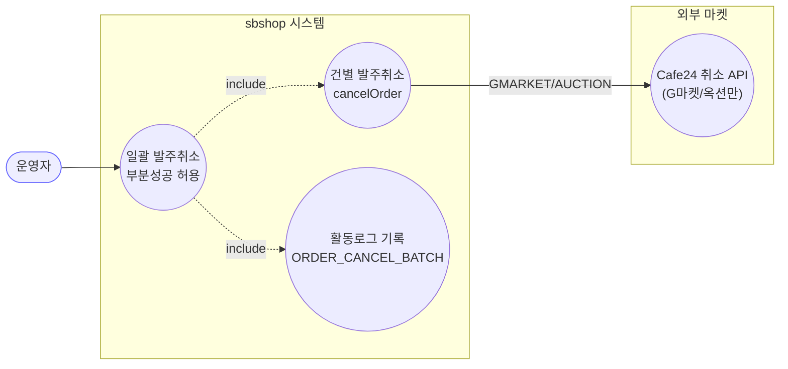
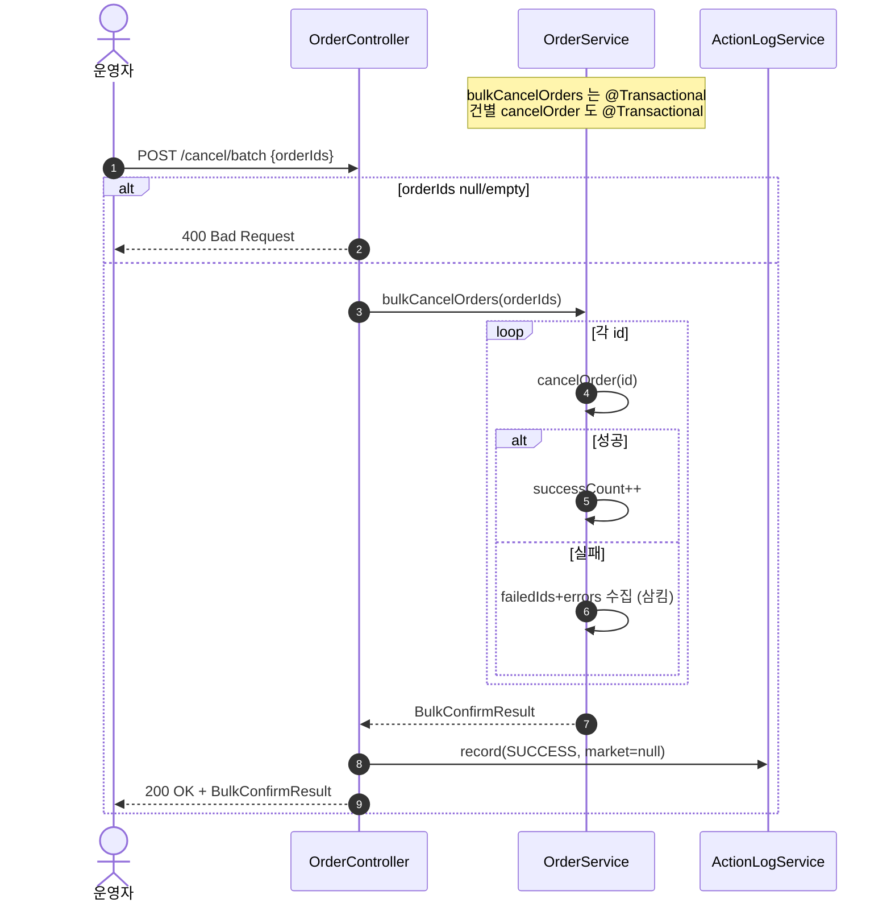
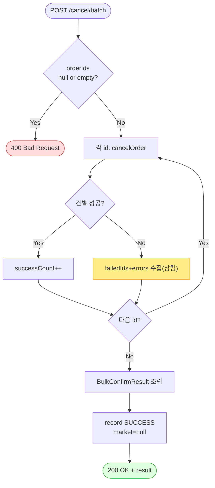

# POST /cancel/batch — 일괄 발주취소

## 1. 개요

| 항목 | 내용 |
|------|------|
| **Method / URL** | `POST /api/v1/orders/cancel/batch` (바디 `{ "orderIds": [Long...] }`) |
| **목적** | 여러 주문을 순차 취소한다. 개별 실패를 삼키고 성공/실패 집계를 반환한다(부분 성공 허용). |
| **핵심 상태전이** | 각 주문 라인아이템 → `CANCELED` (건별 `cancelOrder` 위임) |
| **부수효과** | 건별 마켓 취소 전파(G마켓/옥션만). **개별 트랜잭션** — 한 건 실패가 다른 건을 롤백하지 않음. |
| **응답** | `200 OK` + `BulkConfirmResult` / 빈 목록이면 `400` |

## 2. 호출 체인

```
OrderController.bulkCancelOrders()                api/.../controller/OrderController.java:133-154
  ├─ request.get("orderIds") null/empty 가드 → 400  :138-141
  └─ OrderService.bulkCancelOrders()              core/.../order/service/OrderService.java:171-195  @Transactional
       └─ for each id: cancelOrder(id)             :178-187  (건별 try/catch, 실패 삼킴·집계)
            └─ (건별 흐름은 cancel-order.md 참조)   OrderService.java:136-168
       └─ BulkConfirmResult 조립                    :189-194
  └─ ActionLogService.record(ORDER_CANCEL_BATCH, market=null, SUCCESS/FAILED)  OrderController.java:146/150
```

**요청 바디:** `Map<String, List<Long>>` — 키 `orderIds`. (응답 타입은 `BulkConfirmResult` 재사용)

## 3. 유스케이스 다이어그램



## 4. 시퀀스 다이어그램



## 5. 순서도 (플로우차트)



## 6. 상태 전이표

| 진입 | 허용? | 결과 | 부수효과 | 비고 |
|------|:-----:|------|----------|------|
| `orderIds` null/empty | ❌ | — | — | 400 |
| 일부 건 실패 | ✅ | 성공 건만 CANCELED | 성공 건만 마켓 전파 | 실패 건 개별 롤백·집계 기록 |
| 전 건 실패 | ✅ | 변화 없음 | — | `successCount=0`, 컨트롤러는 여전히 **SUCCESS 로그** (F-ORD-17) |

## 7. 🔎 발견사항

### F-ORD-17 · 🟠 GAP — 전건 실패여도 컨트롤러가 활동로그를 SUCCESS 로 남김 (confirm-batch F-ORD-9 와 동형)
- **근거:** `OrderService.bulkCancelOrders`(171-195) 는 예외 없이 항상 `BulkConfirmResult` 를 반환 → `OrderController.java:144-148` try 가 무조건 통과해 `record(SUCCESS, ...)`. catch(149-152)는 도달 불가.
- **영향:** `failedCount>0`/전건 실패여도 "일괄 발주취소 성공 (N건)" 으로 기록. N 은 요청 건수라 성공 건수와 불일치. 감사 로그 왜곡.
- **제안:** `result.getFailedCount()` 기반으로 로그 상태·메시지 분기.

### F-ORD-18 · 🟡 SMELL — confirm-batch 와 거의 동일한 구조의 코드 중복
- **근거:** `OrderService.bulkCancelOrders`(171-195) 와 `bulkConfirmOrders`(107-131) 는 `for + try/catch + successCount/failedIds/errors 수집 + BulkConfirmResult 조립` 을 통째로 중복. 유일 차이는 위임 메서드(`cancelOrder` vs `confirmOrder`)와 로그 문구. 컨트롤러단(89-110 vs 133-154)도 대칭 중복.
- **제안:** `bulkProcess(ids, Consumer<Long> perItem)` 같은 공통 배치 헬퍼로 추출.

### F-ORD-19 · 🟡 SMELL — cancel-batch 의 catch 분기는 도달 불가한 죽은 코드
- **근거:** `OrderController.java:149-152`. 서비스가 개별 실패를 삼키므로(182-186) 외부로 예외가 나오지 않음.
- **제안:** F-ORD-17 수정과 함께 결과 기반 로깅으로 대체 시 정리됨.

### F-ORD-20 · 🔵 NOTE — 요청 DTO 없이 `Map<String,List<Long>>` 직접 바인딩 (F-ORD-11 과 동형)
- **근거:** `OrderController.java:134-136`. confirm-batch 와 동일하게 `orderIds` 문자열 키 사용. 발송(`/ship`)만 `OrderShipRequest` DTO 사용해 비대칭.
- **제안:** 전용 요청 DTO 로 배치 3종 통일.

## 8. 테스트 커버리지 메모

- `bulkCancelOrders` 를 직접 대상으로 하는 단위 테스트가 **검색되지 않음**(건별 `cancelOrder` 전파는 `OrderServiceCancelPropagationTest` 존재).
- **비어있는 케이스:** ① 빈 목록 400, ② 부분 실패 집계, ③ 전건 실패 시 로그 상태(F-ORD-17), ④ 개별 트랜잭션 격리.
- 정책 확정 후 Red 테스트 권장.

---
*생성: 2026-07-14 · 근거 커밋: main@bd4c915*
