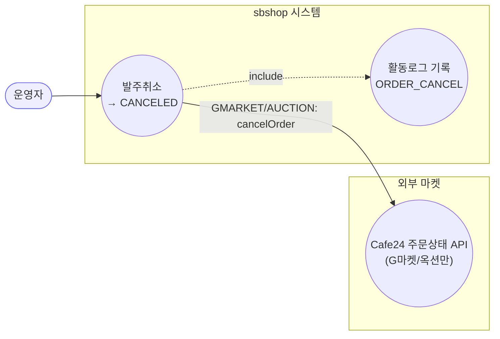
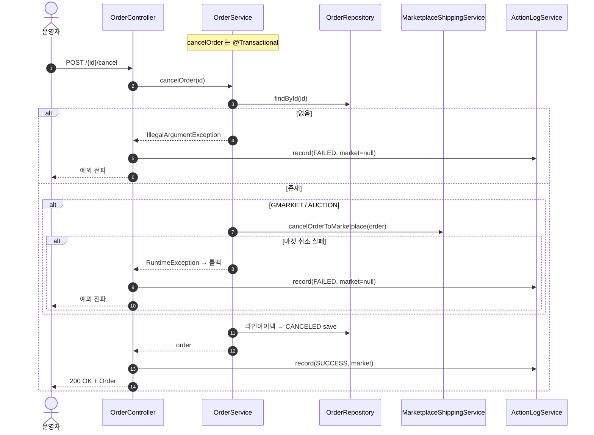

# POST /{id}/cancel — 단건 발주취소

## 1. 개요

| 항목 | 내용 |
|------|------|
| **Method / URL** | `POST /api/v1/orders/{id}/cancel` |
| **목적** | 주문을 취소한다. G마켓/옥션은 Cafe24 주문상태 API 로 마켓에 실제 취소를 전파하고, 그 외 마켓은 로컬 상태만 CANCELED 로 변경한다. |
| **핵심 상태전이** | 모든 라인아이템 → `CANCELED` (shippingData 가 있는 라인만) |
| **부수효과** | **G마켓/옥션만** 마켓 취소 API 호출(`cancelOrderToMarketplace`). 실패 시 예외→`@Transactional` 롤백. |
| **응답** | `200 OK` + `Order`(도메인 엔티티) |

## 2. 호출 체인

```
OrderController.cancelOrder()                     api/.../controller/OrderController.java:115-130
  └─ OrderService.cancelOrder()                   core/.../order/service/OrderService.java:136-168  @Transactional
       ├─ orderRepository.findById()               :140  (없으면 IllegalArgumentException)
       ├─ if GMARKET/AUCTION → cancelOrderToMarketplace()  :144-152
       │      └─ MarketplaceShippingService.cancelOrderToMarketplace(order)  service/MarketplaceShippingService.java:137-146
       │           └─ getPort(marketType).cancelOrder(cred, order)  (실패 시 RuntimeException 재포장→롤백)
       └─ 라인아이템 순회 → CANCELED 전이·save        :155-165  (shippingData != null 인 라인만)
  └─ ActionLogService.record(ORDER_CANCEL, marketOf(order)|null, SUCCESS/FAILED)  OrderController.java:122/126
```

**요청:** 경로변수 `id`(Long)만. 바디 없음.

## 3. 유스케이스 다이어그램



## 4. 시퀀스 다이어그램



## 5. 순서도 (플로우차트)

```mermaid
flowchart TD
    START([POST /{id}/cancel]) --> FIND{findById 성공?}
    FIND -- No --> ERR1[IllegalArgumentException]:::err
    FIND -- Yes --> MT{marketType?}
    MT -- GMARKET / AUCTION --> PROP[cancelOrderToMarketplace]
    MT -- 그 외 --> LOOP
    PROP --> RES{취소 성공?}
    RES -- No --> ERR2[RuntimeException<br/>→ @Transactional 롤백]:::err
    RES -- Yes --> LOOP[라인아이템 순회<br/>shippingData 있으면 CANCELED save]
    LOOP --> OK([200 OK + Order]):::ok

    classDef err fill:#fdd,stroke:#c33;
    classDef ok fill:#dfd,stroke:#3a3;
```

## 6. 상태 전이표

| 진입 라인상태 | 허용? | 결과 상태 | 마켓 전송 | 비고 |
|-----------|:-----:|-----------|-----------|------|
| 임의 상태(shippingData 존재) | ✅ | `CANCELED` | GMARKET/AUCTION만 | **상태 무관 무조건 CANCELED** (F-ORD-13) |
| shippingData `null` 라인 | — | 미변경 | — | 순회에서 건너뜀(157) |
| 그 외 마켓(쿠팡 등) | ✅ | `CANCELED` | **없음(로컬 only)** | 마켓엔 취소 미전파 (F-ORD-14) |

## 7. 🔎 발견사항

### F-ORD-13 · 🟠 GAP — 이미 배송중/배송완료여도 상태 가드 없이 무조건 CANCELED 로 덮어씀
- **근거:** `OrderService.java:155-165` 는 `shippingData != null` 만 확인하고 현재 상태와 무관하게 모든 라인을 `CANCELED` 로 전이한다(진입 상태 검증 없음).
- **영향:** SHIPPED/DELIVERED 인 라인아이템도 로컬에서 CANCELED 로 바뀐다. 배송·정산 리포트가 실제 물류 상태와 어긋난다. 특히 쿠팡 등 마켓 미전파 마켓은 마켓엔 배송중인데 로컬만 취소로 남는 불일치.
- **제안:** 취소 허용 상태(예: NEW/PREPARING/PURCHASED)만 CANCELED 로 전이하거나, 배송 진행 상태는 취소 거부.

### F-ORD-14 · 🔵 NOTE — 쿠팡/스마트스토어/11번가/Cafe24 는 마켓에 취소가 전파되지 않음(로컬 only)
- **근거:** `OrderService.java:144-152` 는 `GMARKET`·`AUCTION` 에서만 `cancelOrderToMarketplace` 를 호출. 나머지 마켓은 로컬 CANCELED 전이만 한다(주석 143 이 "현행 로컬-only 유지" 명시).
- **영향:** 의도된 현행 설계지만, 운영자는 "취소" 가 마켓에 반영됐다고 오해할 수 있음. 마켓엔 여전히 접수 상태로 남음.
- **제안:** 응답/로그에 "로컬 취소(마켓 미전파)" 임을 명시하거나, 마켓별 취소 어댑터 확장 로드맵으로 관리.

### F-ORD-15 · 🟠 GAP — 실패 활동로그가 항상 `marketType=null`
- **근거:** `OrderController.java:126` catch 분기가 `null` 로 기록(성공 분기 122 는 `marketOf(order)`). confirm(F-ORD-5)·소싱(F-S6) 과 동형.
- **영향:** 취소 실패 이벤트가 마켓 집계에서 누락 분류. G마켓/옥션 마켓 API 실패 시 특히 마켓을 알 수 있음에도 null.
- **제안:** 실패 로그도 조회한 order 로 마켓 채우기(findById 실패만 null).

### F-ORD-16 · 🟡 SMELL — 응답 도메인 엔티티(`Order`) 직접 노출
- **근거:** `OrderController.java:116` 반환 `ResponseEntity<Order>`. 전 수정계열 공통(F-ORD-1).
- **제안:** 응답 DTO 도입 검토.

## 8. 테스트 커버리지 메모

- **존재:** `OrderServiceCancelPropagationTest`(core test) — GMARKET/AUCTION 전파 호출, COUPANG 미전파(회귀 불변), GMARKET 전파 실패 시 RuntimeException 을 4 케이스로 검증.
- **비어있는 케이스:** ① 배송중/완료 상태에서의 CANCELED 덮어쓰기(F-ORD-13) 동작, ② shippingData null 라인 스킵, ③ 라인 CANCELED 전이 자체(전파 테스트는 마켓 호출 여부 위주).
- 정책 확정(F-ORD-13) 후 Red 테스트 권장.

---
*생성: 2026-07-14 · 근거 커밋: main@bd4c915*
