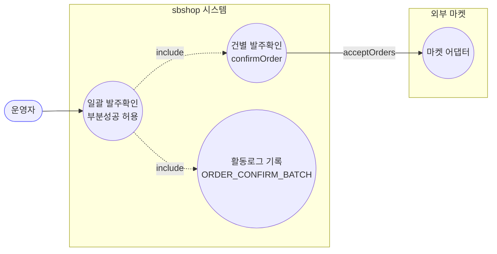
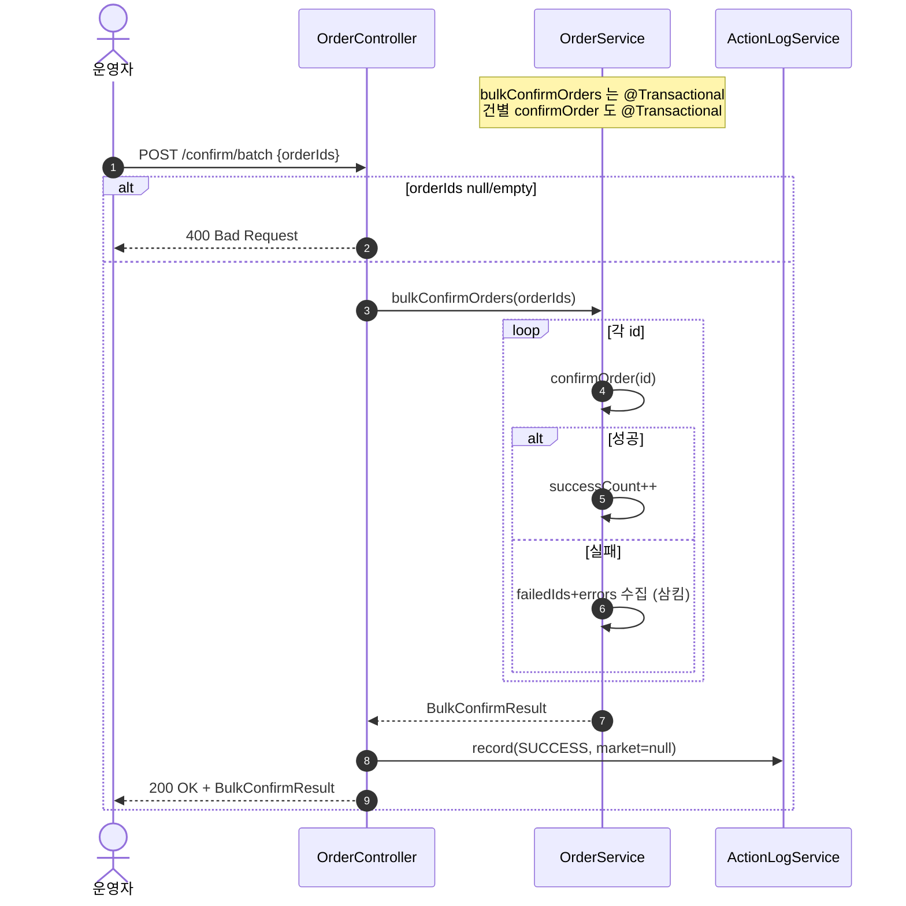
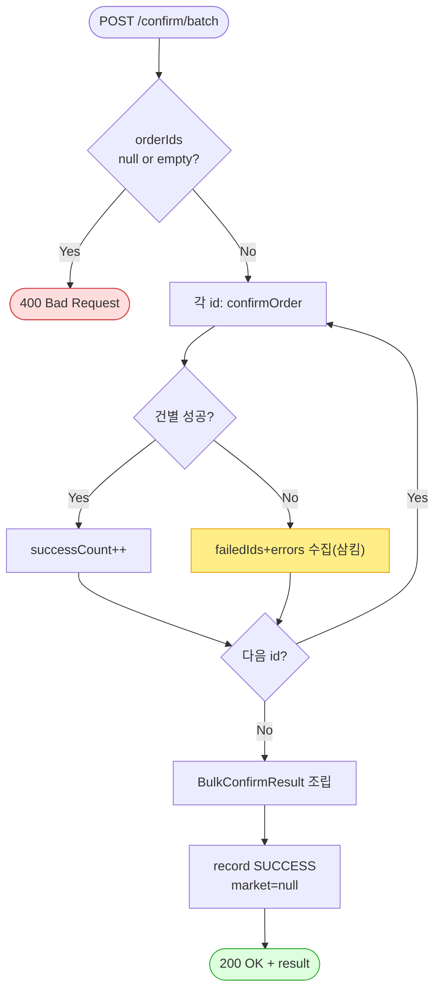

# POST /confirm/batch — 일괄 발주확인

> **[P3 반영 2026-07-14]** F-ORD-9 해결 — 전건/부분 실패를 SUCCESS로 남기던 활동로그를 결과기반 SUCCESS/FAILED로 교정 (커밋 `ffdaed3`).

## 1. 개요

| 항목 | 내용 |
|------|------|
| **Method / URL** | `POST /api/v1/orders/confirm/batch` (바디 `{ "orderIds": [Long...] }`) |
| **목적** | 여러 주문을 순차 발주확인한다. 개별 실패를 삼키고 성공/실패 집계를 반환한다(부분 성공 허용). |
| **핵심 상태전이** | 각 주문 라인아이템 `NEW` → `PREPARING` (건별 `confirmOrder` 위임) |
| **부수효과** | 건별 마켓 접수 API 호출. **개별 트랜잭션**(건별 `@Transactional`) — 한 건 실패가 다른 건을 롤백하지 않음. |
| **응답** | `200 OK` + `BulkConfirmResult`(성공수·실패수·실패ID·에러메시지) / 빈 목록이면 `400` |

## 2. 호출 체인

```
OrderController.bulkConfirmOrders()               api/.../controller/OrderController.java:89-110
  ├─ request.get("orderIds") null/empty 가드 → 400  :94-97
  └─ OrderService.bulkConfirmOrders()             core/.../order/service/OrderService.java:107-131  @Transactional
       └─ for each id: confirmOrder(id)            :114-123  (건별 try/catch, 실패 삼킴·집계)
            └─ (건별 흐름은 confirm-order.md 참조)  OrderService.java:58-104
       └─ BulkConfirmResult 조립                    :125-130
  └─ ActionLogService.record(ORDER_CONFIRM_BATCH, market=null, SUCCESS/FAILED)  OrderController.java:102/106
```

**요청 바디:** `Map<String, List<Long>>` — 키 `orderIds`.

## 3. 유스케이스 다이어그램



## 4. 시퀀스 다이어그램



## 5. 순서도 (플로우차트)



## 6. 상태 전이표

| 진입 | 허용? | 결과 | 부수효과 | 비고 |
|------|:-----:|------|----------|------|
| `orderIds` null/empty | ❌ | — | — | 400 |
| 일부 건 실패 | ✅ | 성공 건만 전이 | 성공 건만 마켓 접수 | 실패 건은 개별 롤백, 집계에 기록 |
| 전 건 실패 | ✅ | 전이 없음 | — | `successCount=0`, 컨트롤러는 여전히 **SUCCESS 로그** (F-ORD-9) |

## 7. 🔎 발견사항

### F-ORD-9 · 🟠 GAP — 전건 실패여도 컨트롤러가 활동로그를 SUCCESS 로 남김
- **근거:** `OrderService.bulkConfirmOrders`(107-131) 는 예외를 던지지 않고 항상 `BulkConfirmResult` 를 반환한다. 따라서 `OrderController.java:100-104` 의 try 블록은 예외 없이 통과해 **항상 `record(SUCCESS, ...)`** 를 남긴다(catch(105-108)는 사실상 도달 불가).
- **영향:** `failedCount>0` 또는 전건 실패여도 활동로그엔 "일괄 발주확인 성공 (N건)" 으로 기록된다. 로그 메시지의 N 은 실패 포함 요청 건수(`orderIds.size()`)라 성공 건수와도 불일치. 운영 감사 로그가 실제 결과를 왜곡.
- **제안:** `result.getFailedCount()>0` 이면 부분성공/실패로 로그 상태·메시지 분기.

### F-ORD-10 · 🟡 SMELL — `bulkConfirmOrders` 의 catch 분기는 도달 불가한 죽은 코드
- **근거:** `OrderController.java:105-108`. 서비스가 개별 실패를 내부에서 삼키므로(118-122) 외부로 예외가 나오지 않음. 유일한 예외 경로는 서비스 진입 전 인프라 오류 정도.
- **제안:** F-ORD-9 수정과 함께 결과 기반 로깅으로 대체하면 이 분기 존치 여부가 정리됨.

### F-ORD-11 · 🔵 NOTE — 요청 DTO 없이 `Map<String,List<Long>>` 직접 바인딩
- **근거:** `OrderController.java:90-92`. 타입 계약이 문서화되지 않고 `orderIds` 키가 문자열 상수로 흩어짐(취소 배치·발송과 제각각: 발송은 `OrderShipRequest` DTO 사용).
- **영향:** 키 오타·스키마 변경에 취약. 배치 3종(confirm/cancel/ship)의 요청 형태 비대칭.
- **제안:** 전용 요청 DTO(`OrderIdsRequest`)로 통일.

### F-ORD-12 · 🔵 NOTE — 부분 실패가 200 으로 반환됨(HTTP 의미 관점)
- **근거:** 전건 실패여도 `ResponseEntity.ok(result)`(104). 결과 본문에 실패가 담기지만 상태코드는 성공.
- **영향:** 클라이언트가 상태코드만 보면 성공으로 오인. 부분성공(207 유사) 시맨틱 부재.
- **제안:** 프런트가 본문 `failedCount` 를 반드시 확인하도록 계약 명문화(현행 설계 존중 시) 또는 부분성공 표현 도입.

## 8. 테스트 커버리지 메모

- `bulkConfirmOrders` 를 직접 대상으로 하는 단위 테스트가 **검색되지 않음.**
- **비어있는 케이스:** ① 빈 목록 400, ② 부분 실패 집계 정확성, ③ 전건 실패 시 로그 상태(F-ORD-9), ④ 개별 트랜잭션 격리(한 건 롤백이 다른 건 미영향).
- 정책 확정 후 Red 테스트 권장.

---
*생성: 2026-07-14 · 근거 커밋: main@bd4c915*
