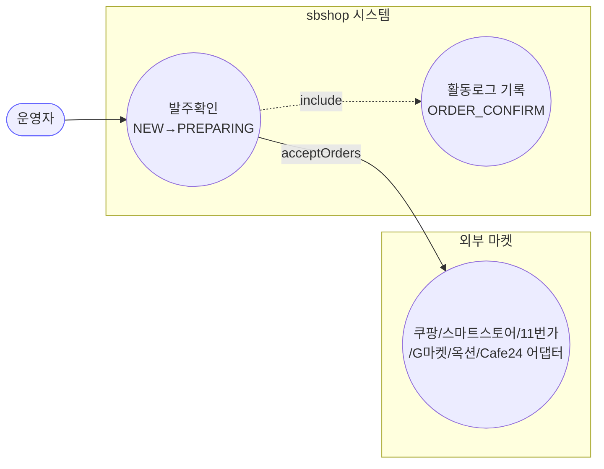
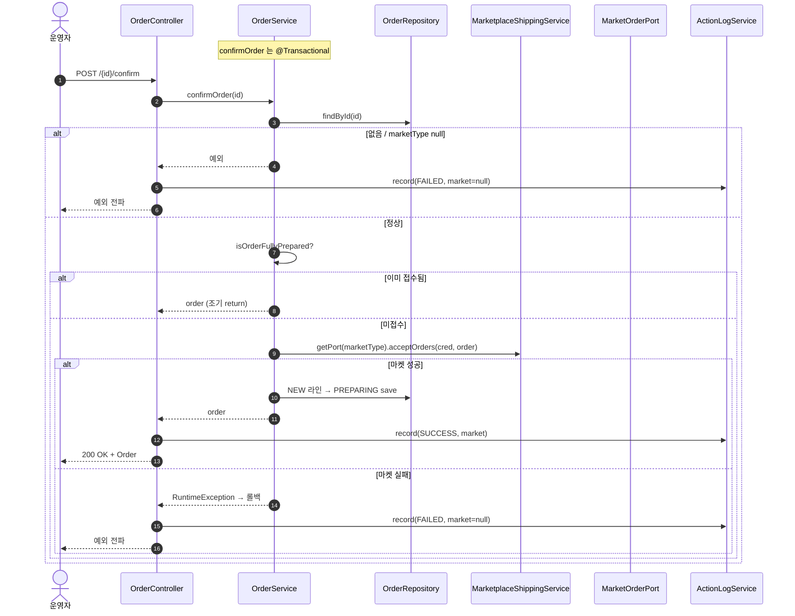

# POST /{id}/confirm — 단건 발주확인(주문 접수)

> **[P2 반영 2026-07-14]** F-ORD-6 해결 — 진행/종료 상태 발주확인 재호출 차단 (커밋 `dfcf8b3`).

## 1. 개요

| 항목 | 내용 |
|------|------|
| **Method / URL** | `POST /api/v1/orders/{id}/confirm` |
| **목적** | 마켓플레이스에 주문 접수(발주확인) API 를 호출하고, 성공 시 주문의 `NEW` 라인아이템을 `PREPARING` 으로 전이한다. |
| **핵심 상태전이** | 라인아이템 `NEW` → `PREPARING` (마켓 접수 API 성공 후) |
| **부수효과** | **마켓 접수 API 호출**(`port.acceptOrders`). 실패 시 예외→`@Transactional` 롤백. |
| **응답** | `200 OK` + `Order`(도메인 엔티티) |

## 2. 호출 체인

```
OrderController.confirmOrder()                    api/.../controller/OrderController.java:71-86
  └─ OrderService.confirmOrder()                  core/.../order/service/OrderService.java:58-104  @Transactional
       ├─ orderRepository.findById()               :62  (없으면 IllegalArgumentException)
       ├─ marketType null 가드                      :66-68 (IllegalStateException)
       ├─ isOrderFullyPrepared() → 이미 접수면 조기 return  :71-73 / :555-563
       ├─ credentialRepository.findByMarketType()  :76  (없으면 RuntimeException)
       ├─ callMarketplaceAcceptApi()               :80 / :566-569
       │      └─ MarketplaceShippingService.getPort(marketType).acceptOrders(cred, order)
       ├─ (실패 시) catch → RuntimeException 재포장  :81-85
       └─ NEW 라인아이템 순회 → PREPARING 전이·save  :88-100
  └─ ActionLogService.record(ORDER_CONFIRM, marketOf(order)|null, SUCCESS/FAILED)  OrderController.java:78/82
```

**요청:** 경로변수 `id`(Long)만. 바디 없음.

## 3. 유스케이스 다이어그램



## 4. 시퀀스 다이어그램



## 5. 순서도 (플로우차트)

```mermaid
flowchart TD
    START([POST /{id}/confirm]) --> FIND{findById 성공?}
    FIND -- No --> ERR1[IllegalArgumentException]:::err
    FIND -- Yes --> MT{marketType != null?}
    MT -- No --> ERR2[IllegalStateException]:::err
    MT -- Yes --> PREP{이미 접수완료?<br/>isOrderFullyPrepared}
    PREP -- Yes --> RET([order 그대로 반환]):::ok
    PREP -- No --> CRED{크레덴셜 존재?}
    CRED -- No --> ERR3[RuntimeException<br/>credentials not found]:::err
    CRED -- Yes --> CALL[acceptOrders 호출]
    CALL --> RES{성공?}
    RES -- No --> ERR4[RuntimeException 재포장<br/>→ @Transactional 롤백]:::err
    RES -- Yes --> LOOP[NEW 라인아이템만<br/>PREPARING 전이·save]
    LOOP --> OK([200 OK + Order]):::ok

    classDef err fill:#fdd,stroke:#c33;
    classDef ok fill:#dfd,stroke:#3a3;
```

## 6. 상태 전이표

| 진입 라인상태 | 허용? | 결과 상태 | 마켓 전송 | 비고 |
|-----------|:-----:|-----------|-----------|------|
| 전 라인 `PREPARING`/`SHIPPED`/`DELIVERED` | ✅ | 유지 | **없음** | `isOrderFullyPrepared` → 조기 return, 접수 API 미호출 |
| 일부/전체 `NEW` | ✅ | `NEW`→`PREPARING` | acceptOrders | 정상 접수 경로 |
| `UNKNOWN`/`CANCELED` 등 혼재 | ✅ | 접수 후 `NEW`만 전이 | acceptOrders | `isOrderFullyPrepared`=false → 접수 재호출됨 (F-ORD-6) |
| marketType `null` | ❌ | — | — | IllegalStateException |

## 7. 🔎 발견사항

### F-ORD-5 · 🟠 GAP — 실패 활동로그가 항상 `marketType=null`
- **근거:** `OrderController.java:82` catch 분기가 `marketOf(order)` 가 아니라 상수 `null` 로 기록한다. 성공 분기(78)는 `marketOf(order)` 를 쓴다.
- **영향:** 접수 실패 이벤트가 마켓 필터/집계에서 마켓 미상으로 분류된다. `id` 로 주문을 다시 조회하면 마켓을 알 수 있음에도 생략. 소싱 API 의 F-S6 과 동형 이슈지만, 여기선 실패 원인이 조회 실패가 아니라 마켓 API 실패이므로 마켓을 알 수 있어 더 아쉽다.
- **제안:** 성공/실패 모두 주문 조회 후 마켓 채우기(단, findById 실패 케이스만 null 유지).

### F-ORD-6 · 🟠 GAP — 종료/혼재 상태에서 접수 API 가 재호출될 수 있음
- **근거:** `OrderService.java:555-563` `isOrderFullyPrepared` 는 **모든 라인이 PREPARING/SHIPPED/DELIVERED** 여야 true. 한 라인이라도 CANCELED/RETURNED/EXCHANGED/UNKNOWN 이면 false → 접수 API 재호출 후 `NEW` 라인만 전이(88-100).
- **영향:** 이미 배송 진행 중이거나 일부 취소된 주문에 마켓 접수 API 가 다시 나가 마켓이 거부하거나 중복 접수될 수 있음. NEW 라인이 하나도 없어도 접수 API 는 호출된다.
- **제안:** "미접수 라인이 실제로 존재할 때만" 접수 API 를 호출하도록 가드 강화(예: NEW 라인 존재 여부 선판정).

### F-ORD-7 · 🟡 SMELL — 응답으로 도메인 엔티티(`Order`) 직접 노출
- **근거:** `OrderController.java:72` 반환 타입 `ResponseEntity<Order>`. 조회계열이 `OrderDetailDto` 를 쓰는 것과 비대칭. 전 수정계열 공통(F-ORD-1 참조).
- **제안:** 응답 DTO 도입 검토.

### F-ORD-8 · 🔵 NOTE — 마켓 접수 실패를 `RuntimeException` 으로 뭉갬(원인 유형 소실)
- **근거:** `OrderService.java:81-85` 가 모든 예외를 `RuntimeException("마켓플레이스 주문 접수 실패: ...")` 로 재포장. 크레덴셜 없음은 별도 `RuntimeException`(77).
- **영향:** 호출부(일괄 접수)가 실패 유형(일시/영구/인증)을 구분하지 못해 재시도 정책을 세울 수 없다. 컨트롤러 응답도 일괄 500 계열.
- **제안:** 실패 유형 분류(배송 경로의 `MarketShippingResult` 처럼) 또는 최소한 원인 예외 타입 보존.

## 8. 테스트 커버리지 메모

- `confirmOrder` 를 직접 대상으로 하는 단위 테스트가 **검색되지 않음**(취소 전파는 `OrderServiceCancelPropagationTest` 존재).
- **비어있는 케이스:** ① `isOrderFullyPrepared` 조기 return, ② 마켓 접수 실패 시 롤백, ③ 크레덴셜 없음, ④ 혼재 상태 재호출(F-ORD-6), ⑤ marketType null 가드.
- 정책 확정(F-ORD-6) 후 Red 테스트 권장.

---
*생성: 2026-07-14 · 근거 커밋: main@bd4c915*
