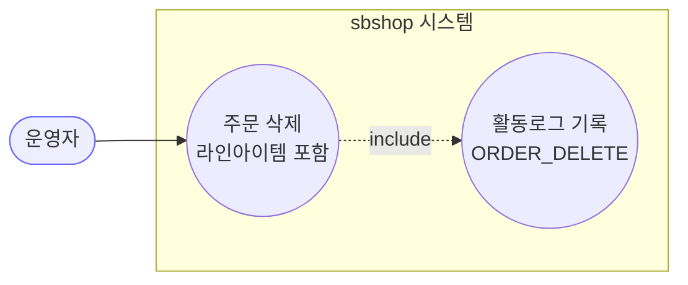
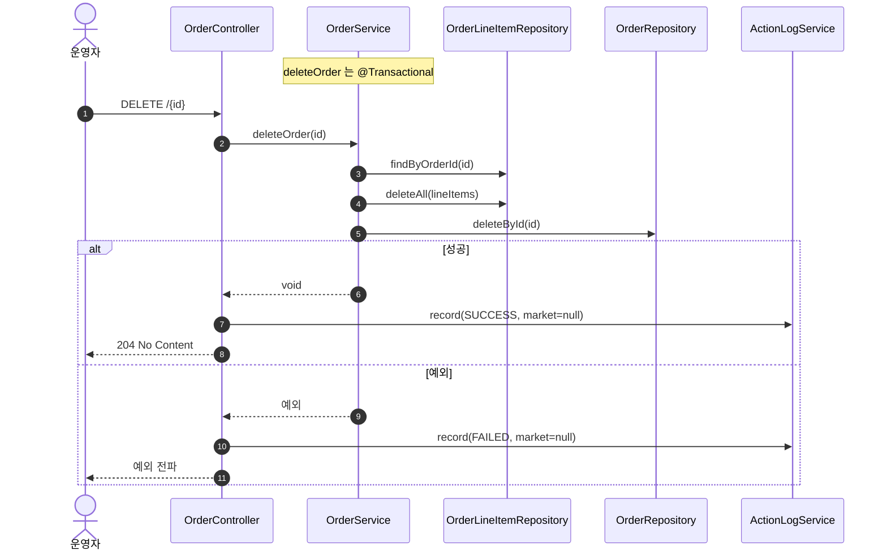

# DELETE /{id} — 주문 삭제

> **[P1 반영 2026-07-14]** F-ORD-37(삭제 로그 marketType null) 해결 — 삭제 전 마켓 확보 (커밋 `6e320e0`). F-ORD-34·35(미존재/종료상태 삭제)는 P2 잔존.
> **[P2 반영 2026-07-14]** ⚠️ 엔드포인트 제거됨 — DELETE /orders/{id} 폐지(주문=마켓 미러, 커밋 `dfcf8b3`/`6c396f4`). F-ORD-34·35·36 무효화.

## 1. 개요

| 항목 | 내용 |
|------|------|
| **Method / URL** | `DELETE /api/v1/orders/{id}` |
| **목적** | 주문과 그 라인아이템을 DB 에서 물리 삭제한다. |
| **핵심 상태전이** | 없음(레코드 자체 삭제). 상태 무관 무조건 삭제. |
| **부수효과** | 라인아이템 전건 + 주문 물리 삭제. **마켓 전송·상태 확인 없음.** |
| **응답** | `204 No Content` |

## 2. 호출 체인

```
OrderController.deleteOrder()                     api/.../controller/OrderController.java:268-283
  └─ OrderService.deleteOrder()                   core/.../order/service/OrderService.java:520-526  @Transactional
       ├─ orderLineItemRepository.findByOrderId()  :523
       ├─ orderLineItemRepository.deleteAll(lineItems)  :524
       └─ orderRepository.deleteById(id)           :525
  └─ ActionLogService.record(ORDER_DELETE, market=null, SUCCESS/FAILED)  OrderController.java:275/279
```

**요청:** 경로변수 `id`(Long)만. 바디 없음.

## 3. 유스케이스 다이어그램



> **관찰:** 외부 마켓 상호작용 없음. 로컬 물리 삭제만.

## 4. 시퀀스 다이어그램



## 5. 순서도 (플로우차트)

```mermaid
flowchart TD
    START([DELETE /{id}]) --> FIND[findByOrderId]
    FIND --> DELL[deleteAll lineItems]
    DELL --> DELO[deleteById order]
    DELO --> R{예외 발생?}
    R -- Yes --> ERR[예외 전파<br/>→ @Transactional 롤백]:::err
    R -- No --> OK([204 No Content]):::ok

    classDef err fill:#fdd,stroke:#c33;
    classDef ok fill:#dfd,stroke:#3a3;
```

## 6. 상태 전이표

| 진입 상태 | 허용? | 결과 | 부수효과 | 비고 |
|-----------|:-----:|------|----------|------|
| 존재하지 않는 id | ✅(무해) | 변화 없음 | 없음 | `deleteById` 는 없는 id 에 예외 안 냄(스프링 데이터 기본) (F-ORD-34) |
| 임의 상태(NEW~DELIVERED) | ✅ | 물리 삭제 | 없음 | **상태 가드 없음** (F-ORD-35) |
| `SHIPPED`/`DELIVERED` | ✅ | 물리 삭제 | 없음 | 배송 진행/완료건도 삭제됨 (F-ORD-35) |

## 7. 🔎 발견사항

### F-ORD-34 · 🟠 GAP — 존재하지 않는 id 삭제가 조용히 204 를 반환(멱등 vs 오탐)
- **근거:** `OrderService.java:523-525` 는 존재 여부를 확인하지 않는다. `findByOrderId` 는 빈 리스트, `deleteById` 는 없는 id 에 대해 예외를 던지지 않아(스프링 데이터 JPA 기본), 아무것도 없어도 성공 처리된다.
- **영향:** 잘못된 id 요청도 204 + "주문 삭제 성공" 로그. 멱등 삭제 의도면 무해하나, 오탈자/이미 삭제된 id 를 구분 못 해 감사 로그가 실제 삭제와 무관하게 성공으로 쌓임.
- **제안:** 멱등이 의도면 문서화. 존재 확인이 필요하면 `existsById`/`findById` 선검사 후 404.

### F-ORD-35 · 🟠 GAP — 배송 진행/완료(SHIPPED/DELIVERED)·마켓 접수된 주문도 상태 가드 없이 물리 삭제됨
- **근거:** `OrderService.deleteOrder`(520-526) 는 현재 배송상태·마켓 접수 여부를 전혀 확인하지 않고 즉시 삭제. 다른 수정 API(주소·소싱·배송·유니패스)는 모두 NEW/UNKNOWN 가드가 있는데 삭제만 무방비.
- **영향:** 이미 마켓에 접수·발송된 주문을 로컬에서 통째로 지우면, 마켓엔 남아있는데 로컬 기록이 사라져 정산/추적 불가. 실수 삭제 시 복구 불가(물리 삭제).
- **제안:** 삭제 허용 상태(예: NEW/UNKNOWN, 혹은 미접수 건)만 허용하거나, 소프트 삭제(논리 삭제) 도입 검토.

### F-ORD-36 · 🔵 NOTE — 물리 삭제(하드 딜리트)라 복구 불가·연관 데이터 고아 가능성
- **근거:** `OrderService.java:524-525` 는 `deleteAll`/`deleteById` 물리 삭제. 라인아이템에 연결된 정산·활동로그·상품 참조는 함께 정리되지 않는다(참조 무결성 처리 미확인).
- **영향:** 삭제된 주문을 참조하던 활동로그·정산 데이터가 고아로 남을 수 있음. 복구 경로 없음.
- **제안:** 소프트 삭제 또는 연관 데이터 정리 정책 확정. 활동로그는 삭제 이벤트를 남기지만 주문 본문은 사라짐.

### F-ORD-37 · 🟡 SMELL — 삭제 활동로그 `marketType` 항상 null(삭제 전 조회로 채울 수 있었음)
- **근거:** `OrderController.java:275/279` 모두 `market=null`. `deleteOrder` 가 void 를 반환해 컨트롤러가 마켓을 알 수 없으나, 삭제 전 조회하면 마켓을 남길 수 있음(삭제되면 사후 조회 불가라 오히려 사전 기록이 중요).
- **영향:** 삭제 이벤트가 마켓 집계에서 누락 분류. 삭제 후엔 마켓을 되찾을 방법이 없어 손실이 영구적.
- **제안:** 삭제 전 주문 조회로 마켓 캡처 후 로그에 기록.

## 8. 테스트 커버리지 메모

- `OrderService.deleteOrder` 를 직접 대상으로 하는 단위 테스트가 **검색되지 않음.**
- **비어있는 케이스:** ① 존재하지 않는 id(F-ORD-34), ② 배송 진행/완료건 삭제 가드(F-ORD-35), ③ 라인아이템 cascade 삭제 확인, ④ 연관 데이터 고아 여부(F-ORD-36).
- 정책 확정(F-ORD-35) 후 Red 테스트 권장.

---
*생성: 2026-07-14 · 근거 커밋: main@bd4c915*
