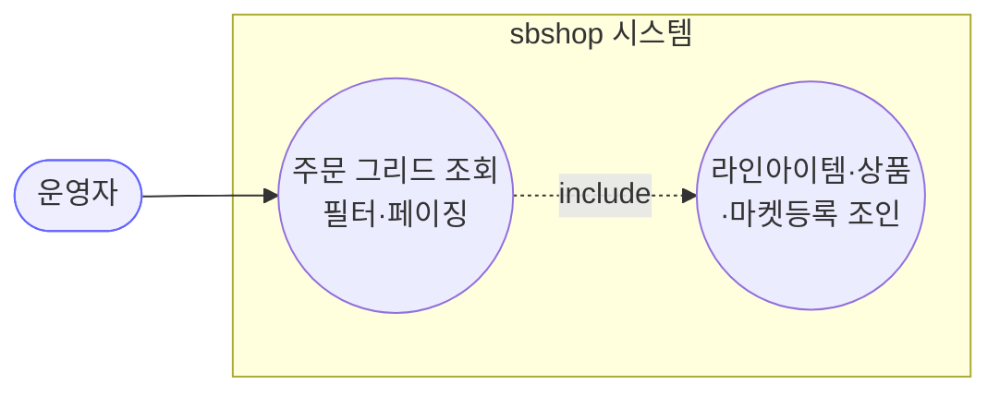
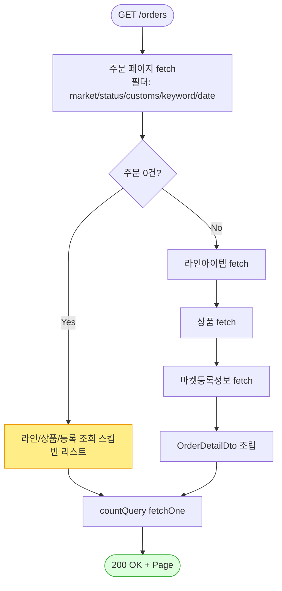

# GET /orders — 주문 그리드 조회

## 1. 개요

| 항목 | 내용 |
|------|------|
| **Method / URL** | `GET /api/v1/orders` (쿼리스트링 `OrderSearchCondition` + `Pageable`) |
| **목적** | 주문 그리드(주문 + 라인아이템 + 상품 + 마켓등록정보)를 필터·페이징하여 조회한다. |
| **핵심 상태전이** | 없음 (순수 조회, 상태 변경 없음) |
| **부수효과** | 없음 — DB 읽기 전용(`@Transactional(readOnly = true)`). 활동로그도 기록 안 함. |
| **응답** | `200 OK` + `Page<OrderDetailDto>` (도메인 엔티티 `Order`·`OrderLineItem`·`Product`·`MarketRegistration` 중첩) |

## 2. 호출 체인

```
OrderController.getOrders()                       api/.../controller/OrderController.java:60-66
  └─ OrderSearchCondition (쿼리 바인딩)           core/.../dto/OrderSearchCondition.java:11
  └─ OrderService.searchOrders()                  core/.../order/service/OrderService.java:49-53
       └─ orderRepository.searchOrderGrid()        core/.../repository/OrderRepositoryCustom.java (인터페이스)
            └─ OrderRepositoryImpl.searchOrderGrid()  infrastructure/.../order/OrderRepositoryImpl.java:41-131
                 ├─ 주문 페이지 fetch (필터: marketType/shippingStatus/customsStatus/keyword/date)  :48-61
                 ├─ 라인아이템 fetch (orderId in ...)                    :65-69
                 ├─ 상품 fetch (productId in ...)                        :77-79
                 ├─ 마켓등록정보 fetch (productId in ...)                :82-86
                 ├─ OrderDetailDto 조립                                  :94-118
                 └─ countQuery 로 총건수                                 :120-130
```

**요청 파라미터 (`OrderSearchCondition`, `OrderSearchCondition.java:11-19`)**

| 필드 | 타입 | 필수 | 비고 |
|------|------|------|------|
| `marketTypes` | List\<MarketType\> | No | `order.marketType in (...)` |
| `shippingStatuses` | List\<ShippingStatus\> | No | 라인아이템 존재 서브쿼리(EXISTS) |
| `customsStatuses` | List\<CustomsStatus\> | No | `order.customsData.customsStatus in (...)` |
| `keyword` | String | No | 주문번호·수취인·전화·주문자·통관번호·송장·상품명 대상 |
| `startDate` / `endDate` | LocalDateTime | No | **둘 다 있어야** 기간 필터 적용(`OrderRepositoryImpl.java:190`) |

## 3. 유스케이스 다이어그램



> **관찰:** 외부 마켓과 상호작용 없음. 순수 로컬 DB 조회.

## 4. 시퀀스 다이어그램

```mermaid
sequenceDiagram
    autonumber
    actor U as 운영자
    participant C as OrderController
    participant S as OrderService
    participant R as OrderRepositoryImpl
    participant P as ProductRepository
    Note over S: searchOrders 는 @Transactional(readOnly=true)

    U->>C: GET /orders?filters&page
    C->>S: searchOrders(condition, pageable)
    S->>R: searchOrderGrid(condition, pageable)
    R->>R: 주문 페이지 fetch (필터 적용)
    R->>R: 라인아이템 fetch (orderId in ...)
    R->>P: findAllById(productIds)
    R->>R: 마켓등록정보 fetch
    R->>R: OrderDetailDto 조립 + countQuery
    R-->>S: Page&lt;OrderDetailDto&gt;
    S-->>C: Page&lt;OrderDetailDto&gt;
    C-->>U: 200 OK + Page
```

## 5. 순서도 (플로우차트)



## 6. 상태 전이표

| 진입 상태 | 허용? | 결과 상태 | 부수효과 | 비고 |
|-----------|:-----:|-----------|----------|------|
| (모든 상태) | ✅ | 변화 없음 | 없음 | 조회 전용. 상태 개념 무관 |

## 7. 🔎 발견사항

### F-ORD-1 · 🟡 SMELL — 응답으로 도메인 엔티티(`Order`/`OrderLineItem`/`Product`)를 그대로 노출
> ⬜ **미해결(백로그)** — SP-5 중 그리드 DTO 내부래핑은 잔여.
- **근거:** `OrderDetailDto.java:14-23` 이 `Order`·`OrderLineItem`·`Product`·`MarketRegistration` 엔티티를 필드로 직접 담는다. `OrderController.java:61` 반환도 `Page<OrderDetailDto>`.
- **영향:** 직렬화 형태가 엔티티 내부 표현에 결합. 지연로딩·내부 필드(예: `marketSpecificData` 원본 JSON, 크레덴셜 연관) 유출 위험. 수정계열 API(F-ORD 소싱/배송)와 함께 전 API 공통 이슈.
- **제안:** 조회 응답 전용 뷰 DTO(필드 화이트리스트)로 매핑.

### F-ORD-2 · 🟠 GAP — 기간 필터가 `startDate`·`endDate` 중 하나만 오면 조용히 무시됨
> ✅ **해결됨** (커밋 `aff9814`) — 체크리스트 기준.
- **근거:** `OrderRepositoryImpl.java:189-194` `dateBetween` 은 `startDate != null && endDate != null` 일 때만 `between` 을 적용하고, 하나만 있으면 `null`(필터 없음)을 반환한다.
- **영향:** "이 날짜 이후" 같은 편측 조회 요청 시 필터가 통째로 사라져 전체 기간이 조회된다(운영자는 필터가 걸린 줄 안다). 오해 소지 있는 조용한 무시.
- **제안:** 편측 조건(`goe`/`loe`)을 각각 지원하거나, 한쪽만 온 경우 400 으로 명시 거부.

### F-ORD-3 · 🔵 NOTE — `shippingStatuses` 필터는 EXISTS 라 주문 단위로 걸림(부분 매칭)
> ⬜ **미해결(백로그)**.
- **근거:** `OrderRepositoryImpl.java:139-150` `shippingStatusIn` 은 "해당 상태 라인아이템이 하나라도 존재하는 주문" 을 반환하는 EXISTS 서브쿼리다.
- **영향:** 한 주문에 여러 라인아이템이 있으면, 필터 상태가 아닌 라인아이템도 응답에 함께 실려온다(주문 통째 반환). 그리드 UI 가 라인 단위 필터를 기대하면 표시 불일치 가능.
- **제안:** 의도된 설계(주문 단위 그리드)면 문서화. 라인 단위 필터가 필요하면 별도 처리.

### F-ORD-4 · 🔵 NOTE — 조회 API 는 활동로그를 남기지 않음
> ⬜ **미해결(백로그)**.
- **근거:** `OrderController.getOrders()` (60-66) 에만 `actionLogService.record` 호출이 없다(다른 8개 엔드포인트는 전부 기록).
- **영향:** 의도된 설계(조회는 로그 대상 아님)로 보이나, 나머지 API 와의 대칭성 관점에서 명시해 둘 가치가 있음.
- **제안:** 조회는 로그 제외가 정책이면 그대로 유지.

## 8. 테스트 커버리지 메모

- `OrderService.searchOrders` / `OrderRepositoryImpl.searchOrderGrid` 를 직접 대상으로 하는 단위·통합 테스트가 **검색되지 않음.**
- **비어있는 케이스:** ① 편측 날짜(F-ORD-2) 동작, ② `shippingStatuses` EXISTS 부분매칭(F-ORD-3), ③ 키워드 서브쿼리 조인, ④ 빈 결과 시 count 경로.
- QueryDSL 조립부라 슬라이스/`@DataJpaTest` 통합 테스트 권장.

---
*생성: 2026-07-14 · 근거 커밋: main@bd4c915*
