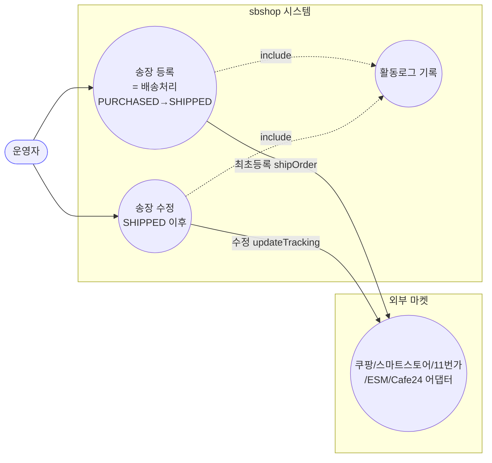
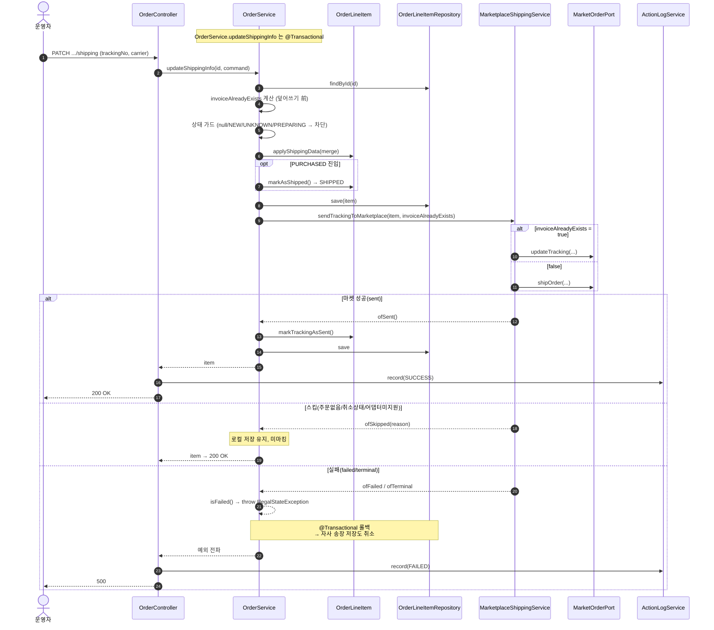
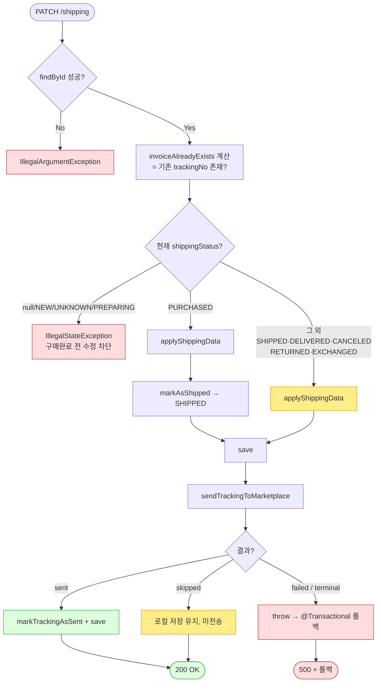

# PATCH /line-items/{lineItemId}/shipping — 라인아이템 배송(송장) 정보 수정

> **[P1 반영 2026-07-14]** F-H6 중 marketType null 부분 해결 (커밋 `6e320e0`). 응답 엔티티 노출은 SP-5/P6 잔존. F-H1·H2·H4 미해결.
> **[P2 반영 2026-07-14]** F-H1·H2 해결 — 종료상태 송장수정 400 차단, 마켓 terminal은 "동기화로 반영" 전용 메시지로 롤백 (커밋 `dfcf8b3`). 송장은 마켓이 진실원본.

## 1. 개요

| 항목 | 내용 |
|------|------|
| **Method / URL** | `PATCH /api/v1/orders/line-items/{lineItemId}/shipping` |
| **목적** | 라인아이템에 송장번호·택배사를 입력·수정하고, **마켓플레이스(쿠팡 등)에 송장을 역전송**한다. `PURCHASED` 상태면 **배송 처리**(→ `SHIPPED`)로 전이하고, 이미 `SHIPPED` 이후면 송장만 갱신한다. |
| **핵심 상태전이** | `PURCHASED` → `SHIPPED` / `SHIPPED`·이후 → 상태 유지, 송장 갱신 |
| **부수효과** | **마켓 송장 전송(등록/수정)** — 실패 시 `@Transactional` 롤백으로 자사 저장까지 되돌림 |
| **응답** | `200 OK` + `OrderLineItem` |

## 2. 호출 체인

```
OrderController.updateShippingInfo()              api/.../controller/OrderController.java:224-242
  └─ ShippingUpdateRequest.toCommand()            api/.../dto/ShippingUpdateRequest.java:12
       └─ OrderService.updateShippingInfo()       core/.../order/service/OrderService.java:294-353
            ├─ orderLineItemRepository.findById()
            ├─ invoiceAlreadyExists 사전 계산       OrderService.java:304-306  (덮어쓰기 前 필수)
            ├─ 상태 가드(null/NEW/UNKNOWN/PREPARING 차단)   OrderService.java:312-315
            ├─ ShippingUpdateCommand.toShippingData(existing)  core/.../dto/ShippingUpdateCommand.java:18 (null-skip 병합)
            ├─ OrderLineItem.applyShippingData() / markAsShipped()   domain/order/OrderLineItem.java:91/75
            ├─ orderLineItemRepository.save()
            ├─ MarketplaceShippingService.sendTrackingToMarketplace(item, invoiceAlreadyExists)  service/MarketplaceShippingService.java:62
            │       └─ port.shipOrder() | port.updateTracking()  (마켓 어댑터)
            ├─ sendResult.isFailed() → throw → @Transactional 롤백   OrderService.java:326/342
            └─ markSentIfSucceeded()                OrderService.java:544  (sent 일 때만 trackingSentToMarket=true)
       └─ ActionLogService.record(SHIPPING_UPDATE, market=null, ...)   OrderController.java:234/238
```

**요청 바디 (`ShippingUpdateRequest`)**

| 필드 | 타입 | 필수 | 비고 |
|------|------|------|------|
| `trackingNo` | String | 사실상 필수 | 강제 검증은 **없음**(F-H4) |
| `shippingCarrier` | ShippingCarrier(enum) | 사실상 필수 | 강제 검증 없음 |

## 3. 유스케이스 다이어그램



## 4. 시퀀스 다이어그램



## 5. 순서도 (플로우차트)



## 6. 상태 전이표

| 진입 상태 | 허용? | 결과 상태 | 마켓 전송 | 비고 |
|-----------|:-----:|-----------|-----------|------|
| `null`/`NEW`/`UNKNOWN`/`PREPARING` | ❌ | — | — | "구매완료 전 수정 불가" |
| `PURCHASED` | ✅ | `SHIPPED` | shipOrder or updateTracking | 정상 등록 경로 |
| `SHIPPED` | ✅ | 유지 | updateTracking(대개) | 송장 수정 |
| `DELIVERED` | ✅ | 유지 | updateTracking → **대개 terminal 거부** | F-H1·F-H2 |
| `CANCELED`/`RETURNED`/`EXCHANGED` | ✅(가드 없음) | 유지 | **skipped**(전송 불가 상태) | F-H2 — 로컬만 저장 |

> 마켓 전송 결과: **sent**(성공·마킹) / **skipped**(대상 아님·로컬 유지) / **failed**(일시 실패·롤백) / **terminal**(영구 거부·롤백).
> 판정 로직 `MarketShippingResult.isFailed() = !sent && !skipped` → **failed·terminal 을 동일 취급**(F-H1 핵심).

## 7. 🔎 발견사항

### F-H1 · 🔴 BUG(후보) — 대화형 API가 `terminal`(영구거부)을 `failed`와 동일하게 롤백 → 사용자 편집이 소실되고 재시도로도 복구 불가
- **근거:** `OrderService.java:326·342` 는 `sendResult.isFailed()` 로만 분기하고, `isFailed()`(`MarketShippingResult.java:33`)는 `!sent && !skipped` 라 **terminal 도 true**. 따라서 쿠팡 배송중/배송완료 잠금("배송진행상태가 유효하지 않습니다", `MarketplaceShippingService.java:110-113,126-133`)으로 `ofTerminal` 이 와도 예외→`@Transactional` 롤백.
- **영향:** 마켓이 이미 배송중/완료라 **송장 수정이 원천 불가**한 상황에서, 운영자가 자사 DB의 송장 오타를 고치려 해도 저장이 롤백되어 **로컬 값조차 못 남긴다.** `ofTerminal`/`isTerminal()` 을 만들어 둔 D-E6 의도(영구실패는 재시도 종결)가 이 동기 경로에서는 사장됨.
- **제안:** terminal 은 롤백 대신 **로컬 저장 유지 + 경고 반환**(마켓엔 못 보냈지만 자사 기록은 갱신)이 자연스러운지 정책 확인. 최소한 failed(일시)와 terminal(영구)의 사용자 피드백을 분리.
- **연관:** 결함 원장 D-E6, D-069 계약과 직접 맞물림 → 원장 등재 권장.

### F-H2 · 🟠 GAP — 종료 상태(CANCELED/RETURNED/EXCHANGED)에 대한 서비스단 가드 부재
- **근거:** `OrderService.java:312-315` 가드는 `null/NEW/UNKNOWN/PREPARING` 만 차단. CANCELED/RETURNED/EXCHANGED/DELIVERED 는 else 분기로 진입해 `applyShippingData`+`save` 로 **로컬 저장이 성공**한다. 마켓 전송은 `MarketplaceShippingService.java:80-85` 가 `ofSkipped` 로 걸러 미전송.
- **영향:** 취소/반품/교환된 라인아이템에 송장번호가 조용히 기록되고 API 는 200 을 반환한다(전송은 안 됐는데 성공처럼 보임). 배송 리포트/집계 왜곡 가능.
- **제안:** 종료 상태는 서비스 진입 가드에서 명시적으로 차단하거나, skipped 사유를 응답에 실어 "저장했으나 전송 안 함"을 사용자에게 노출.

### F-H3 · 🟡 SMELL — PURCHASED 분기와 else 분기가 거의 동일(중복)
- **근거:** `OrderService.java:318-333`(PURCHASED) 과 `334-350`(else) 는 `applyShippingData → save → sendTracking → isFailed 검사·throw → markSentIfSucceeded → log` 를 **통째로 중복**. 유일한 차이는 `markAsShipped()` 한 줄.
- **제안:** `markAsShipped()` 만 조건부로 두고 나머지를 단일 흐름으로 통합. 중복 제거로 F-H1 수정 시 한 곳만 고치면 됨.

### F-H4 · 🟠 GAP — `trackingNo`/`shippingCarrier` 필수 검증 부재
- **근거:** 요청·커맨드·서비스 어디에도 null/blank 검증 없음. `toShippingData` 는 null-skip(`ShippingUpdateCommand.java:20-27`)이라 빈 요청이면 **기존 값 유지한 채** `markAsShipped()` 로 SHIPPED 전이 후 마켓에 기존(혹은 null) 송장 전송 시도.
- **영향:** PURCHASED 상태에서 빈 바디 요청 시 송장 없이 SHIPPED 로 넘어가 마켓 전송이 이상 동작할 수 있음(소싱 API 는 주문번호를 명시 검증하는 것과 비대칭).
- **제안:** PURCHASED→SHIPPED 전이 시 `trackingNo` 필수 검증 추가(소싱의 `sourcingOrderNo` 가드와 대칭).

### F-H5 · 🟡 SMELL — `markSentIfSucceeded` 의 `isFailed` 분기는 도달 불가한 방어 코드
- **근거:** `OrderService.java:548-551` — 주석대로 호출부가 이미 isFailed 에서 throw 하므로 이 else-if 는 절대 실행되지 않음.
- **제안:** 죽은 분기임을 주석에 명시(현재 되어 있음)했으나, F-H1 수정으로 계약이 바뀌면 이 분기의 처리가 실제로 필요해질 수 있으니 함께 재검토.

### F-H6 · 🔵 NOTE — 응답 도메인 엔티티 직접 노출 / 활동로그 marketType null
- **근거:** `OrderController.java:225`(반환 `OrderLineItem`), `234/238`(market=null). 소싱 API 의 F-S5·F-S6 과 동일한 횡단 이슈.
- **제안:** 전 API 공통 개선 항목으로 승격 검토.

## 8. 테스트 커버리지 메모

- **존재:** `OrderServiceShippingRollbackTest`(core test) — D-069 계약(마켓 실패 시 롤백/성공 시 마킹/스킵 시 유지)을 5 케이스로 검증.
- **비어있는 케이스:**
  - **terminal vs failed 구분(F-H1)** — 현재 테스트가 terminal 을 별도로 검증하는지 확인 필요(파일 재검토 대상).
  - **종료 상태 진입(F-H2)** — CANCELED/RETURNED/EXCHANGED 에서의 동작 미검증.
  - **빈 송장 요청(F-H4)** — 미검증.
- 정책 확정(F-H1·F-H2) 후 Red 테스트 추가 → `sbshop-normalize` 사이클로 이관.

---
*생성: 2026-07-14 · 근거 커밋: main@bd4c915 · 분석 대상 파일 라인은 해당 커밋 기준*
