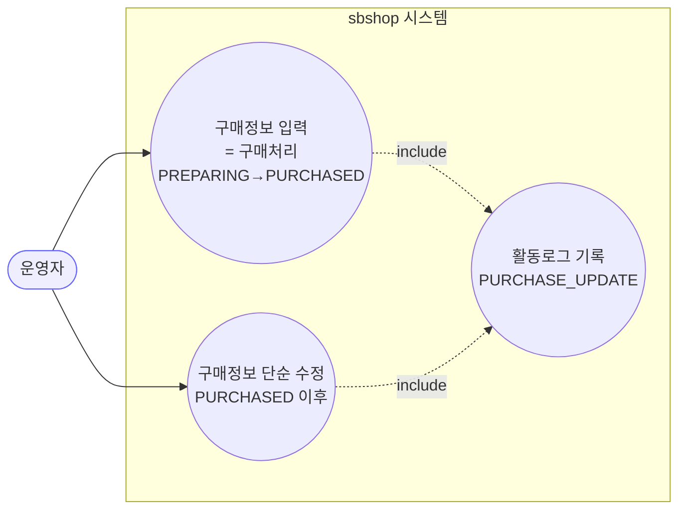
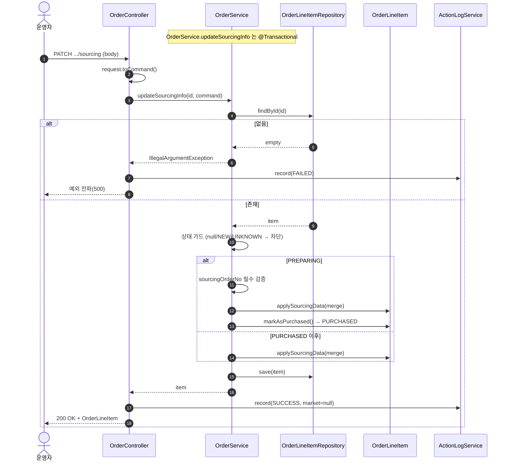
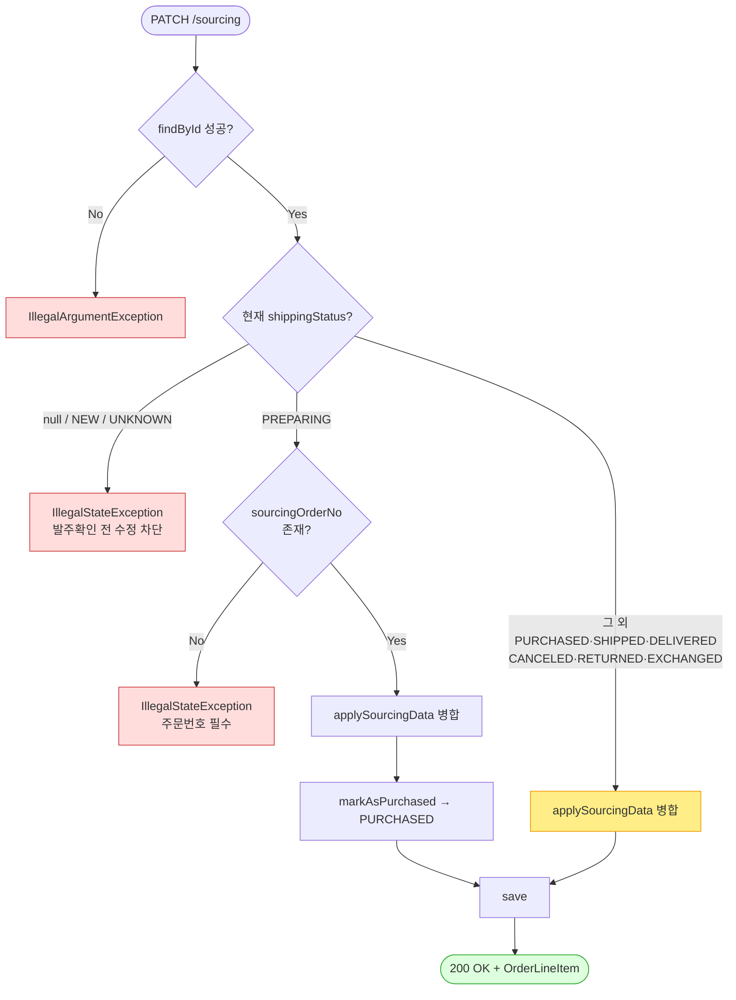

# PATCH /line-items/{lineItemId}/sourcing — 라인아이템 소싱(구매) 정보 수정

> **[P1 반영 2026-07-14]** F-S6(소싱 활동로그 marketType null) 해결 — 성공 경로 마켓 해석 기록 (커밋 `6e320e0`).
> **[P2 반영 2026-07-14]** 정책확정 — 소싱은 종료상태에서도 수정+빈문자열 클리어 허용(F-S1·S2 의도로 종결).

## 1. 개요

| 항목 | 내용 |
|------|------|
| **Method / URL** | `PATCH /api/v1/orders/line-items/{lineItemId}/sourcing` |
| **목적** | 라인아이템의 구매(소싱) 정보를 입력·수정한다. `PREPARING(구매준비)` 상태에서 호출하면 **구매 처리**(→ `PURCHASED`)로 상태를 전이하고, 이미 `PURCHASED` 이후면 소싱 필드만 갱신한다. |
| **핵심 상태전이** | `PREPARING` → `PURCHASED` (주문번호 필수) / 그 외 진행상태 → 상태 유지, 필드만 병합 |
| **부수효과** | **없음(로컬 저장만)** — 마켓/외부 시스템 전송 없음. (↔ shipping API 는 마켓 전송 있음) |
| **응답** | `200 OK` + `OrderLineItem`(도메인 엔티티 그대로) |

## 2. 호출 체인

```
OrderController.updateSourcingInfo()              api/.../controller/OrderController.java:203-221
  └─ SourcingUpdateRequest.toCommand()            api/.../dto/SourcingUpdateRequest.java:17
       └─ OrderService.updateSourcingInfo()       core/.../order/service/OrderService.java:256-292
            ├─ orderLineItemRepository.findById()
            ├─ SourcingUpdateCommand.toSourcingData(existing)   core/.../dto/SourcingUpdateCommand.java:20  (null-skip 병합)
            ├─ OrderLineItem.applySourcingData()   core/.../domain/order/OrderLineItem.java:96
            ├─ OrderLineItem.markAsPurchased()     core/.../domain/order/OrderLineItem.java:68  (PREPARING 분기에서만)
            └─ orderLineItemRepository.save()
       └─ ActionLogService.record(PURCHASE_UPDATE, market=null, ...)   OrderController.java:213/217
```

**요청 바디 (`SourcingUpdateRequest`)**

| 필드 | 타입 | 필수 | 비고 |
|------|------|------|------|
| `sourcingAccount` | String | 조건부 | — |
| `sourcingOrderNo` | String | **PREPARING→PURCHASED 시 필수** | `OrderService.java:274` 에서만 강제 |
| `sourcingAmount` | BigDecimal | No | 검증 없음(음수 허용) |
| `logisticsCost` | BigDecimal | No | 검증 없음(음수 허용) |
| `discountCode` | String | No | — |
| `sourcingVendor` | String | No | — |

## 3. 유스케이스 다이어그램



> **관찰:** 이 API 는 외부 마켓과 상호작용하지 않는다(순수 내부 상태). 동일 컨트롤러의 shipping API 와 대조적.

## 4. 시퀀스 다이어그램



## 5. 순서도 (플로우차트)



## 6. 상태 전이표

| 진입 상태 | 허용? | 결과 상태 | 부수효과 | 비고 |
|-----------|:-----:|-----------|----------|------|
| `null` / `NEW` / `UNKNOWN` | ❌ | — | — | "발주확인 전 수정 불가" 예외 |
| `PREPARING` | ✅ | `PURCHASED` | 없음 | **주문번호 필수** |
| `PURCHASED` | ✅ | `PURCHASED` | 없음 | 필드 병합만 |
| `SHIPPED` / `DELIVERED` | ✅ | 유지 | 없음 | else 분기 — **가드 없음** (F-S1 참조) |
| `CANCELED` / `RETURNED` / `EXCHANGED` | ✅ | 유지 | 없음 | else 분기 — **가드 없음** (F-S1 참조) |

## 7. 🔎 발견사항

### F-S1 · 🟠 GAP — 종료 상태(CANCELED/RETURNED/EXCHANGED)·배송단계(SHIPPED/DELIVERED)에서도 소싱 수정이 무제한 허용됨
- **근거:** `OrderService.java:268` 의 가드는 `null/NEW/UNKNOWN` 만 차단한다. 나머지 모든 상태는 `else`(283~289) 단순 수정 분기로 흘러 저장된다.
- **영향:** 이미 취소/반품/교환된, 또는 배송이 끝난 라인아이템의 구매금액·주문번호를 자유롭게 바꿀 수 있다. 정산/구매 리포트가 사후 변경에 노출된다.
- **제안:** 소싱 정보가 참고용으로 사후 수정 가능해야 하는지(의도) vs. 종료 상태는 잠가야 하는지 **정책 확인 필요.** 잠근다면 shipping 과 대칭으로 CANCELED/RETURNED/EXCHANGED 가드 추가.

### F-S2 · 🔵 NOTE — null-skip 병합으로 필드 값을 "지울" 수 없음
- **근거:** `SourcingUpdateCommand.toSourcingData()` (20~34) 는 각 필드가 `!= null` 일 때만 덮어쓴다.
- **영향:** 잘못 입력한 `discountCode`·`sourcingVendor` 등을 빈 값으로 정정하는 경로가 없다(빈 문자열 vs null 구분도 없음). PATCH 의 부분 업데이트 의미로는 자연스러우나, "삭제" 요구가 있으면 미충족.
- **제안:** 삭제 요구가 실제로 있는지 확인. 있으면 sentinel(빈 문자열=클리어) 규칙 도입 검토.

### F-S3 · 🟡 SMELL — 두 분기의 `applySourcingData + save` 중복
- **근거:** `OrderService.java:277·285` — PREPARING 분기와 else 분기가 `applySourcingData(command.toSourcingData(...))` 를 동일하게 호출하고, 차이는 `markAsPurchased()` 호출 유무뿐. `save` 도 각 분기에 중복.
- **제안:** 공통 `applySourcingData` + `save` 를 분기 밖으로 추출하고, PREPARING 여부만 조건부 `markAsPurchased()` 로 남기면 로직이 절반으로 준다.

### F-S4 · 🔵 NOTE — 금액 필드 검증 부재
- **근거:** `sourcingAmount`·`logisticsCost` 에 음수/과대값 검증 없음(요청·커맨드·도메인 어디에도).
- **제안:** 최소 `>= 0` 검증. 정산 계산에 직접 들어가면 우선순위 상향.

### F-S5 · 🟡 SMELL — 응답으로 도메인 엔티티(`OrderLineItem`) 직접 노출
- **근거:** `OrderController.java:204` 반환 타입이 `OrderLineItem`. 조회계열(`getOrders`)이 `OrderDetailDto` 를 쓰는 것과 비대칭.
- **영향:** 직렬화 형태가 도메인 변경에 결합. 지연로딩 필드·내부 표현 유출 위험.
- **제안:** 수정계열도 응답 DTO 도입 검토(전 API 공통 이슈로 승격 가능).

### F-S6 · 🔵 NOTE — 활동로그 `marketType` 항상 null
- **근거:** `OrderController.java:213/217` 이 `market=null` 로 기록. lineItem→order 로 마켓 해석이 가능함에도 생략.
- **영향:** 활동로그 마켓 필터/집계에서 소싱 수정 이벤트가 누락 분류됨.
- **제안:** 성공 시 조회한 `item`→order 로 마켓 채우기(단, 실패 경로는 조회 실패일 수 있어 null 유지 타당).

## 8. 테스트 커버리지 메모

- `OrderService.updateSourcingInfo` 를 직접 대상으로 하는 단위 테스트가 **검색되지 않음**(shipping 은 `OrderServiceShippingRollbackTest` 존재).
- **비어있는 케이스:** ① PREPARING + 주문번호 누락 → 예외, ② PREPARING → PURCHASED 전이, ③ null/NEW/UNKNOWN 차단, ④ 종료 상태(F-S1) 동작 확정.
- 정책 확정(F-S1) 후 Red 테스트부터 추가 권장.

---
*생성: 2026-07-14 · 근거 커밋: main@bd4c915 · 분석 대상 파일 라인은 해당 커밋 기준*
