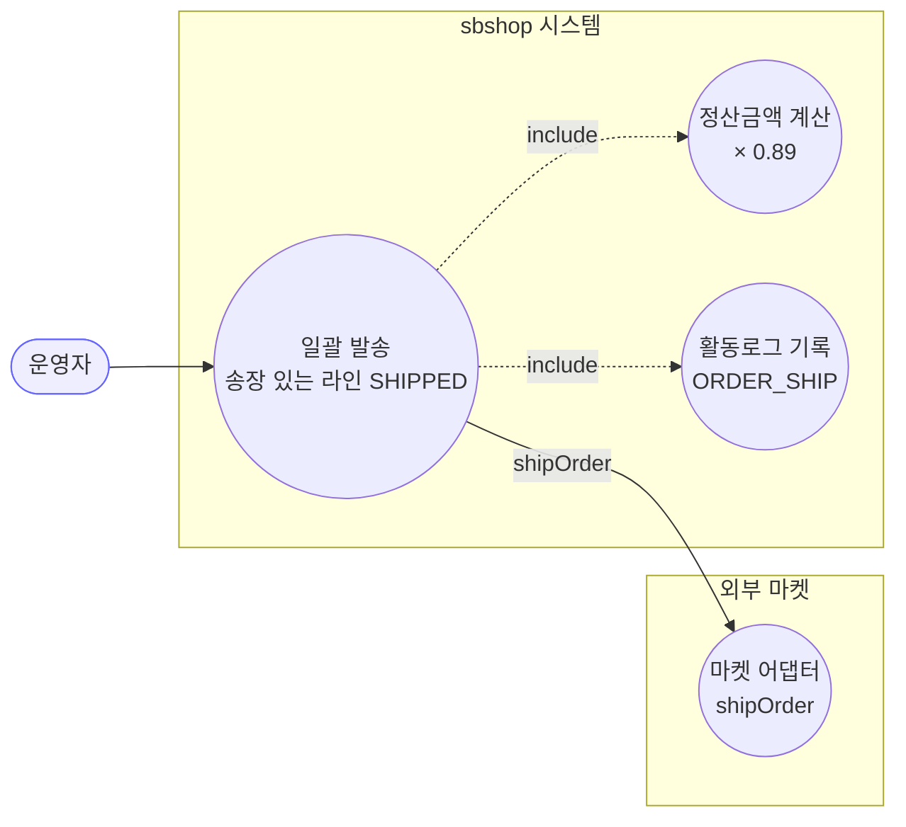
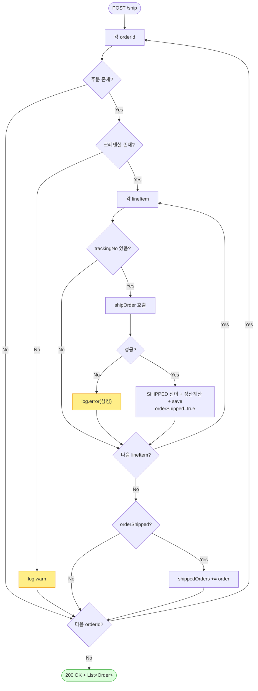

# POST /ship — 일괄 발송 처리

> **[P2 반영 2026-07-14]** F-ORD-29 해결 — 일괄발송 시 이미 SHIPPED/DELIVERED/종료 라인 재발송 스킵 (커밋 `dfcf8b3`).

## 1. 개요

| 항목 | 내용 |
|------|------|
| **Method / URL** | `POST /api/v1/orders/ship` (바디 `OrderShipRequest`) |
| **목적** | 여러 주문의 송장 있는 라인아이템을 마켓에 발송 등록(`shipOrder`)하고, 성공한 라인을 `SHIPPED` 로 전이하며 정산금액을 계산한다. |
| **핵심 상태전이** | 송장 있는 라인 → `SHIPPED` (마켓 `shipOrder` 성공한 라인만) |
| **부수효과** | 마켓 발송 API 호출 + 정산금액 계산(0.89 배). **라인별 try/catch** — 개별 실패를 삼키고 나머지 진행. 전체 단일 `@Transactional`. |
| **응답** | `200 OK` + `List<Order>`(하나라도 발송된 주문만 포함) |

## 2. 호출 체인

```
OrderController.shipOrders()                      api/.../controller/OrderController.java:247-263
  └─ OrderShipRequest.getOrderIds()               api/.../dto/OrderShipRequest.java:8
       └─ OrderShipService.bulkShipOrders()       core/.../order/service/OrderShipService.java:30-76  @Transactional
            └─ for each orderId:                   :34-74
                 ├─ orderRepository.findById() → null 이면 continue  :35-37
                 ├─ credentialRepository.findByMarketType() → null 이면 로그+continue  :39-43
                 ├─ orderLineItemRepository.findByOrderId()  :45
                 └─ for each lineItem:             :48-71
                      ├─ trackingNo null/empty → continue  :49-51
                      ├─ port.shipOrder(cred, order, item, trackingNo, carrier)  :57-58 (try)
                      ├─ applyShippingData(SHIPPED) + calculateSettlement + save  :60-66
                      ├─ (실패 시) catch → log.error, 삼킴  :68-70
                      └─ orderShipped=true → shippedOrders 추가  :67/72-73
       └─ (calculateSettlement: settlementAmount × 0.89)  OrderShipService.java:78-84
  └─ ActionLogService.record(ORDER_SHIP, market=null, SUCCESS/FAILED)  OrderController.java:255/259
```

**요청 바디 (`OrderShipRequest`, `OrderShipRequest.java:7-9`)**

| 필드 | 타입 | 필수 | 비고 |
|------|------|------|------|
| `orderIds` | List\<Long\> | 사실상 필수 | null 이면 컨트롤러에서 `reqCount=0`, 서비스 NPE 위험 (F-ORD-33) |

## 3. 유스케이스 다이어그램



## 4. 시퀀스 다이어그램

```mermaid
sequenceDiagram
    autonumber
    actor U as 운영자
    participant C as OrderController
    participant S as OrderShipService
    participant R as OrderRepository
    participant P as MarketOrderPort
    participant D as OrderLineItem
    participant L as ActionLogService
    Note over S: bulkShipOrders 는 단일 @Transactional

    U->>C: POST /ship {orderIds}
    C->>S: bulkShipOrders(orderIds)
    loop 각 orderId
        S->>R: findById(orderId)
        alt 주문/크레덴셜 없음
            S->>S: continue (스킵)
        else
            loop 각 lineItem
                alt trackingNo 없음
                    S->>S: continue
                else 송장 있음
                    S->>P: shipOrder(cred, order, item, tracking, carrier)
                    alt 성공
                        S->>D: applyShippingData(SHIPPED) + calculateSettlement
                        S->>R: save(item), orderShipped=true
                    else 실패
                        S->>S: log.error, 삼킴
                    end
                end
            end
            opt orderShipped
                S->>S: shippedOrders += order
            end
        end
    end
    S-->>C: List&lt;Order&gt;
    C->>L: record(SUCCESS, market=null)
    C-->>U: 200 OK + List&lt;Order&gt;
```

## 5. 순서도 (플로우차트)



## 6. 상태 전이표

| 진입 라인상태 | 허용? | 결과 상태 | 마켓 전송 | 비고 |
|-----------|:-----:|-----------|-----------|------|
| 송장 없음(trackingNo null/empty) | — | 미변경 | — | 라인 건너뜀(49-51) |
| 송장 있음 + `shipOrder` 성공 | ✅ | `SHIPPED` | shipOrder | **상태 무관** — 어떤 상태든 SHIPPED 로 (F-ORD-29) |
| 송장 있음 + `shipOrder` 실패 | ✅(삼킴) | 미변경 | 시도됨 | catch 후 로그만, 저장 안 함 |
| 크레덴셜 없는 마켓 | — | 미변경 | — | 주문 통째 스킵(39-43) |

## 7. 🔎 발견사항

### F-ORD-29 · 🟠 GAP — 발송 처리에 진입 상태 가드가 전혀 없음(송장만 있으면 아무 상태나 SHIPPED)
- **근거:** `OrderShipService.java:48-66` 은 `trackingNo` 존재만 확인하고 현재 `shippingStatus` 를 검사하지 않는다. `updateShippingInfo`(단건, PATCH /shipping)는 PURCHASED 만 SHIPPED 로 전이하는 명시 가드(`OrderService.java:312-318`)를 가진 것과 대조적.
- **영향:** NEW/PREPARING/CANCELED/RETURNED/이미 SHIPPED 인 라인도 송장만 있으면 마켓 `shipOrder`(최초등록)를 호출하고 SHIPPED 로 덮어쓴다. 종료 상태 재발송·이미 배송건 중복 등록으로 마켓이 거부하거나 정합 붕괴 가능.
- **제안:** PURCHASED(또는 발송 가능 상태) 가드 추가. 단건 배송 경로의 `invoiceAlreadyExists` 기반 등록/수정 분기와 정합화.

### F-ORD-30 · 🔴 BUG(후보) — 마켓 `shipOrder` 실패를 삼켜 부분 실패가 응답·활동로그에 드러나지 않음
- **근거:** `OrderShipService.java:68-70` 라인별 catch 가 `log.error` 만 하고 예외를 재던지지 않는다. 발송된 라인이 하나라도 있으면 그 주문은 `shippedOrders` 에 담겨 성공처럼 반환된다. 컨트롤러(`OrderController.java:254-257`)는 예외가 없으니 항상 `record(SUCCESS, ...)`.
- **영향:** 한 주문 내 일부 라인 발송이 실패해도 응답엔 그 주문이 "발송됨" 으로 포함되고, 활동로그는 "발송 처리 성공 (N건)"(N=성공 주문 수). 실패한 라인은 **어디에도 집계되지 않아** 운영자가 미발송 라인을 인지할 방법이 없다. confirm/cancel 배치는 최소한 `failedIds/errors` 를 집계하는데, 발송은 그조차 없다.
- **제안:** 라인별 실패를 집계해 응답 구조(성공/실패 라인)로 표면화하고, 부분 실패 시 활동로그 상태를 분기. 단건 배송의 `MarketShippingResult`(sent/skipped/failed/terminal) 계약과 통일 검토.
- **연관:** 배송 경로 F-H1(terminal 롤백)·D-069 계약과 맞물림 → 원장 등재 권장.

### F-ORD-31 · 🟠 GAP — 발송 성공 라인만 `SHIPPED` 로 저장되나, 마켓 `shipOrder` 는 성공하고 이후 정산/저장이 예외나면 전체 롤백됨
- **근거:** `bulkShipOrders` 전체가 단일 `@Transactional`(`OrderShipService.java:30`). 마켓 `shipOrder` 는 트랜잭션 밖 외부 호출인데, `calculateSettlement`/`save`(60-66) 또는 이후 다른 주문 루프에서 언체크 예외(catch 밖)가 나면 앞서 성공 저장된 모든 라인의 SHIPPED 저장이 함께 롤백된다. 그러나 마켓엔 이미 발송 등록이 나간 상태 → DB/마켓 불일치.
- **영향:** 부분 성공을 개별 커밋하지 못하는 배치 트랜잭션 경계 문제. confirm/cancel 배치가 건별 `@Transactional` 위임으로 격리한 것과 달리, 발송은 하나의 큰 트랜잭션.
- **제안:** 주문(또는 라인) 단위 트랜잭션 분리로 성공분 확정. 최소한 마켓 전송과 로컬 저장의 정합 실패 시나리오 문서화.

### F-ORD-32 · 🟡 SMELL — 정산 계산 상수 `0.89` 가 서비스에 하드코딩
- **근거:** `OrderShipService.java:81` `currentSettlement.multiply(new BigDecimal("0.89"))`. 수수료율(11%로 추정)이 상수 리터럴로 박혀 있고, 발송 시점에만 정산을 재계산.
- **영향:** 마켓별 상이한 수수료율 반영 불가. 발송 경로에서만 정산이 재계산되는 이유가 불명확.
- **제안:** 수수료율을 마켓/상품 설정으로 외부화하고 정산 계산 책임 위치 재검토.

### F-ORD-33 · 🟠 GAP — `orderIds` null 시 서비스에서 NPE 위험(컨트롤러는 대비, 서비스는 무방비)
- **근거:** `OrderController.java:252` 는 `request.getOrderIds() != null ? size : 0` 로 방어하지만, `OrderShipService.java:34` `for (Long orderId : orderIds)` 는 null 이면 즉시 NPE. 컨트롤러가 null 을 걸러내지 않고 그대로 서비스에 넘긴다.
- **영향:** 빈/누락 바디 요청 시 500(NPE). confirm/cancel 배치가 `null/empty → 400` 을 명시 처리한 것과 비대칭.
- **제안:** 컨트롤러 또는 서비스 진입부에 null/empty → 400 가드 추가.

## 8. 테스트 커버리지 메모

- `OrderShipService.bulkShipOrders` 를 직접 대상으로 하는 단위 테스트가 **검색되지 않음.**
- **비어있는 케이스:** ① 상태 가드 부재(F-ORD-29), ② 라인 실패 삼킴 시 응답·로그(F-ORD-30), ③ 부분 성공 트랜잭션 경계(F-ORD-31), ④ 크레덴셜 없는 마켓 스킵, ⑤ 정산 0.89 계산, ⑥ orderIds null(F-ORD-33).
- 정책 확정(F-ORD-29·30·31) 후 Red 테스트 권장 — 특히 F-ORD-30 은 원장 등재 후 우선 처리.

---
*생성: 2026-07-14 · 근거 커밋: main@bd4c915*
