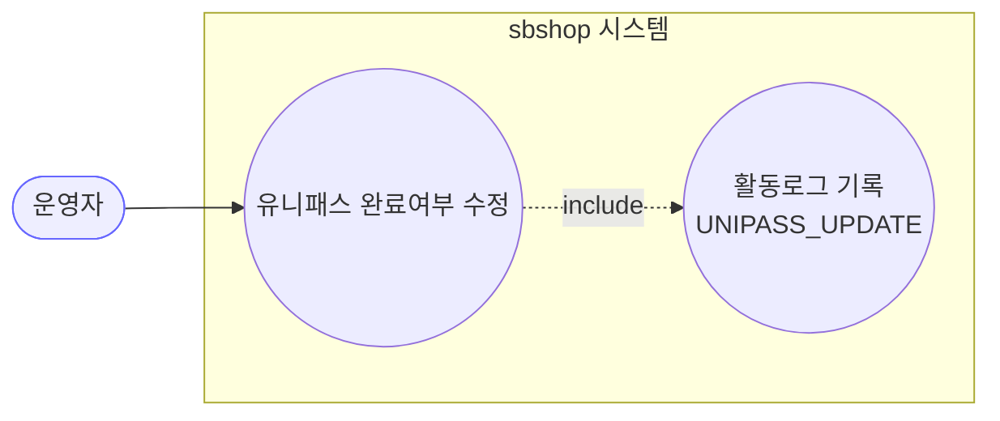
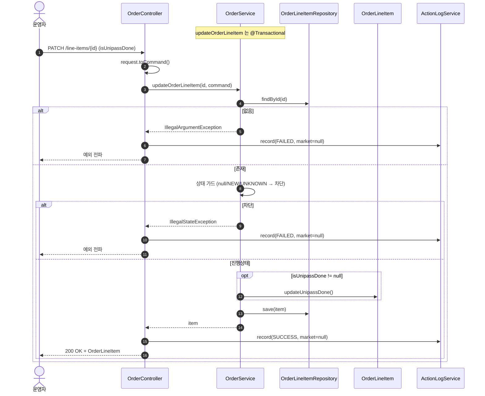

# PATCH /line-items/{lineItemId} — 유니패스 완료여부 수정

> **[P1 반영 2026-07-14]** F-ORD-27(유니패스 로그 marketType null) 해결 (커밋 `6e320e0`).

## 1. 개요

| 항목 | 내용 |
|------|------|
| **Method / URL** | `PATCH /api/v1/orders/line-items/{lineItemId}` (바디 `OrderLineItemUpdateRequest`) |
| **목적** | 라인아이템의 유니패스(통관 신고) 완료여부(`isUnipassDone`)를 운영자가 수정한다. 발주확인 전(NEW/UNKNOWN)에는 차단한다. |
| **핵심 상태전이** | 없음(배송상태 불변). `isUnipassDone` 플래그만 갱신. |
| **부수효과** | 없음(로컬 저장만). 마켓 전송 없음. |
| **응답** | `200 OK` + `OrderLineItem`(도메인 엔티티) |

## 2. 호출 체인

```
OrderController.updateOrderLineItem()             api/.../controller/OrderController.java:181-200
  └─ OrderLineItemUpdateRequest.toCommand()       api/.../dto/OrderLineItemUpdateRequest.java:11
       └─ OrderService.updateOrderLineItem()      core/.../order/service/OrderService.java:233-254  @Transactional
            ├─ orderLineItemRepository.findById()  :237  (없으면 IllegalArgumentException)
            ├─ 상태 가드(null/NEW/UNKNOWN 차단)     :241-246  (IllegalStateException)
            ├─ command.getIsUnipassDone() != null → lineItem.updateUnipassDone()  :249-251 / OrderLineItem.java:108
            └─ orderLineItemRepository.save()       :253
  └─ ActionLogService.record(UNIPASS_UPDATE, market=null, SUCCESS/FAILED)  OrderController.java:192/196
```

**요청 바디 (`OrderLineItemUpdateRequest`, `OrderLineItemUpdateRequest.java:8-15`)**

| 필드 | 타입 | 필수 | 비고 |
|------|------|------|------|
| `isUnipassDone` | Boolean | No | null 이면 미변경(부분 업데이트). true/false 만 반영 |

## 3. 유스케이스 다이어그램



> **관찰:** 외부 마켓 상호작용 없음. 순수 내부 플래그 갱신.

## 4. 시퀀스 다이어그램



## 5. 순서도 (플로우차트)

```mermaid
flowchart TD
    START([PATCH /line-items/{id}]) --> FIND{findById 성공?}
    FIND -- No --> ERR1[IllegalArgumentException]:::err
    FIND -- Yes --> ST{현재 shippingStatus?}
    ST -- null / NEW / UNKNOWN --> ERR2[IllegalStateException<br/>발주확인 전 수정 차단]:::err
    ST -- 그 외 전부 --> U{isUnipassDone != null?}
    U -- Yes --> U1[updateUnipassDone]
    U -- No --> SAVE
    U1 --> SAVE[save]
    SAVE --> OK([200 OK + OrderLineItem]):::ok

    classDef err fill:#fdd,stroke:#c33;
    classDef ok fill:#dfd,stroke:#3a3;
```

## 6. 상태 전이표

| 진입 상태 | 허용? | 결과 상태 | 부수효과 | 비고 |
|-----------|:-----:|-----------|----------|------|
| `null`/`NEW`/`UNKNOWN` | ❌ | — | — | "발주확인 전 수정 불가" |
| `PREPARING`~`DELIVERED` | ✅ | 유지 | 없음 | 플래그만 갱신 |
| `CANCELED`/`RETURNED`/`EXCHANGED` | ✅ | 유지 | 없음 | else(가드 없음) — 종료 상태에서도 수정 허용 (F-ORD-25) |

## 7. 🔎 발견사항

### F-ORD-25 · 🟠 GAP — 종료 상태(CANCELED/RETURNED/EXCHANGED)에서도 유니패스 수정이 무제한 허용됨
- **근거:** `OrderService.java:244` 가드는 `null/NEW/UNKNOWN` 만 차단. 나머지 모든 상태(종료·배송완료 포함)는 통과해 `updateUnipassDone` 이 실행된다(소싱 F-S1·배송 F-H2 와 동형 패턴).
- **영향:** 취소/반품/교환된 라인아이템의 통관 신고 완료 플래그를 사후 변경 가능. 통관 리포트가 종료 건 사후 수정에 노출.
- **제안:** 종료 상태 잠금 정책을 소싱/배송과 대칭으로 결정.

### F-ORD-26 · 🟠 GAP — `isUnipassDone` null 이면 조용히 아무것도 안 하고 200 반환
- **근거:** `OrderService.java:249-251` 는 `getIsUnipassDone() != null` 일 때만 갱신. 빈 바디(`{}`)면 아무 변경 없이 `save`(무의미) 후 200.
- **영향:** 클라이언트는 수정 성공으로 인지하나 실제 변경 없음. 활동로그엔 "유니패스 수정 성공" 이 남아 오해 소지. 삭제(null 로 되돌리기)도 불가.
- **제안:** null 요청을 400(필수)로 거부하거나, 무변경임을 응답에 표시.

### F-ORD-27 · 🔵 NOTE — 활동로그 `marketType` 항상 null (성공 경로에서도 채울 수 있음)
- **근거:** `OrderController.java:192/196` 모두 `market=null`. lineItem→orderId→order 로 마켓 해석 가능함에도 성공 경로에서도 생략(소싱 F-S6 과 동형이나, 여기선 성공 경로도 null 인 점이 더 아쉬움).
- **영향:** 유니패스 수정 이벤트가 마켓 집계에서 누락 분류.
- **제안:** 성공 시 조회한 item→order 로 마켓 채우기.

### F-ORD-28 · 🟡 SMELL — 응답 도메인 엔티티(`OrderLineItem`) 직접 노출
- **근거:** `OrderController.java:182` 반환 `OrderLineItem`. 전 수정계열 공통(F-ORD-1).
- **제안:** 응답 DTO 도입 검토.

## 8. 테스트 커버리지 메모

- `OrderService.updateOrderLineItem` 을 직접 대상으로 하는 단위 테스트가 **검색되지 않음.**
- **비어있는 케이스:** ① null/NEW/UNKNOWN 차단, ② 종료 상태 동작(F-ORD-25), ③ null 바디 무변경(F-ORD-26), ④ true/false 반영.
- 정책 확정(F-ORD-25·26) 후 Red 테스트 권장.

---
*생성: 2026-07-14 · 근거 커밋: main@bd4c915*
