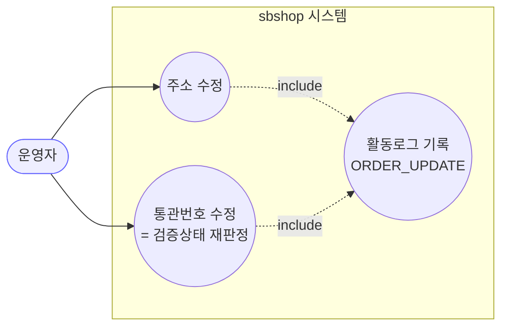
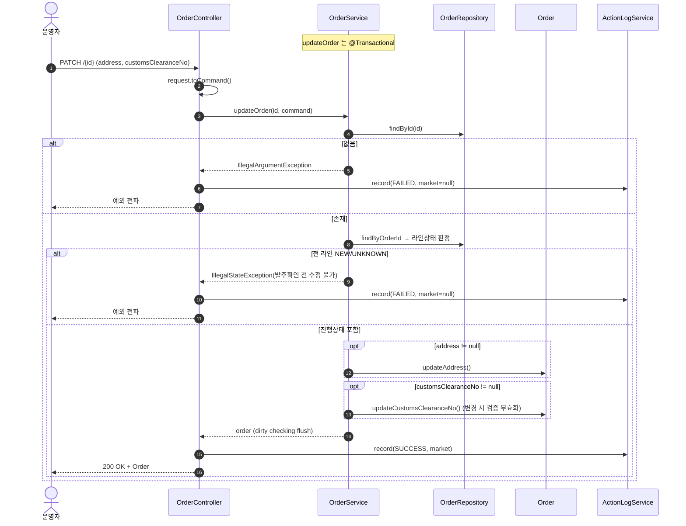

# PATCH /{id} — 주문 주소/통관번호 수정

## 1. 개요

| 항목 | 내용 |
|------|------|
| **Method / URL** | `PATCH /api/v1/orders/{id}` (바디 `OrderUpdateRequest`) |
| **목적** | 주문의 배송지 주소·개인통관고유부호를 운영자가 수기 수정한다. 발주확인 전(전 라인 NEW/UNKNOWN)에는 차단한다. |
| **핵심 상태전이** | 없음(주문 상태 불변). 통관번호가 바뀌면 통관 검증상태를 PENDING/NONE 으로 무효화(도메인 규칙 D-073). |
| **부수효과** | 없음(로컬 저장만). 마켓 전송 없음. |
| **응답** | `200 OK` + `Order`(도메인 엔티티) |

## 2. 호출 체인

```
OrderController.updateOrder()                     api/.../controller/OrderController.java:159-178
  └─ OrderUpdateRequest.toCommand()               api/.../dto/OrderUpdateRequest.java:12
       └─ OrderService.updateOrder()              core/.../order/service/OrderService.java:200-230  @Transactional
            ├─ orderRepository.findById()          :204  (없으면 IllegalArgumentException)
            ├─ 전 라인 NEW/UNKNOWN 가드            :209-217  (isAllNew && 라인 존재 → IllegalStateException)
            ├─ command.getAddress() != null → order.updateAddress()  :220-222 / Order.java:117
            └─ command.getCustomsClearanceNo() != null → order.updateCustomsClearanceNo()  :225-227 / Order.java:125-133
  └─ ActionLogService.record(ORDER_UPDATE, marketOf(updated)|null, SUCCESS/FAILED)  OrderController.java:170/174
```

**요청 바디 (`OrderUpdateRequest`, `OrderUpdateRequest.java:8-17`)**

| 필드 | 타입 | 필수 | 비고 |
|------|------|------|------|
| `address` | String | No | null 이면 미변경(부분 업데이트) |
| `customsClearanceNo` | String | No | null 이면 미변경. 값이 실제로 바뀌면 통관 검증상태 무효화 |

## 3. 유스케이스 다이어그램



> **관찰:** 외부 마켓 상호작용 없음(순수 내부 상태).

## 4. 시퀀스 다이어그램



## 5. 순서도 (플로우차트)

```mermaid
flowchart TD
    START([PATCH /{id}]) --> FIND{findById 성공?}
    FIND -- No --> ERR1[IllegalArgumentException]:::err
    FIND -- Yes --> G{"라인 존재 && 전 라인 NEW/UNKNOWN?"}
    G -- Yes --> ERR2[IllegalStateException<br/>발주확인 전 수정 차단]:::err
    G -- No --> A{address != null?}
    A -- Yes --> A1[updateAddress]
    A -- No --> B
    A1 --> B{customsClearanceNo != null?}
    B -- Yes --> B1[updateCustomsClearanceNo<br/>변경 시 검증상태 무효화]
    B -- No --> OK
    B1 --> OK([200 OK + Order]):::ok

    classDef err fill:#fdd,stroke:#c33;
    classDef ok fill:#dfd,stroke:#3a3;
```

## 6. 상태 전이표

| 진입(라인 집합) | 허용? | 결과 | 부수효과 | 비고 |
|-----------|:-----:|------|----------|------|
| 라인 없음(빈 주문) | ✅ | 수정 적용 | 없음 | `isAllNew && !isEmpty` 라 라인 없으면 가드 통과 (F-ORD-22) |
| 전 라인 `NEW`/`UNKNOWN`/`null` | ❌ | — | — | "발주확인 전 수정 불가" |
| 하나라도 진행상태(PREPARING 이상) | ✅ | 수정 적용 | 없음 | 정상 수정 경로 |

## 7. 🔎 발견사항

### F-ORD-21 · 🟡 SMELL — `OrderUpdateCommand.toCustomsData()` 는 사용되지 않는 죽은 코드
- **근거:** `OrderUpdateCommand.java:14-19` 의 `toCustomsData(existing)` 는 어디서도 호출되지 않는다. 서비스(`OrderService.java:225-227`)는 대신 도메인 메서드 `order.updateCustomsClearanceNo()` 를 직접 호출한다. (소싱/배송 커맨드의 `toXxxData` 병합 패턴을 흉내 냈으나 실제로는 미사용.)
- **영향:** 소싱/배송의 null-skip 병합과 달리 통관은 도메인 메서드가 검증상태 무효화까지 처리하므로 `toCustomsData` 는 불필요. 존재만으로 "여기서 병합한다" 는 오해 유발.
- **제안:** `toCustomsData` 삭제(또는 서비스가 이를 쓰도록 일원화). 현행은 도메인 메서드 경로가 정답이므로 커맨드 헬퍼 제거가 자연스러움.

### F-ORD-22 · 🟠 GAP — 라인아이템이 없는 주문은 발주확인 전 가드를 통과함
- **근거:** `OrderService.java:215` `if (isAllNew && !lineItems.isEmpty())`. `allMatch` 는 빈 리스트에 대해 true 지만, `!isEmpty()` 조건 때문에 라인 없는 주문은 가드를 건너뛴다.
- **영향:** 라인아이템이 아직 없는(동기화 중이거나 이상 데이터) 주문의 주소/통관번호를 발주확인 전에도 수정 가능. 가드 의도(발주 전 잠금)와 경계 케이스에서 어긋남.
- **제안:** 라인 없는 주문의 수정 허용 여부를 명시적으로 결정(허용이 의도면 주석, 아니면 빈 주문도 차단).

### F-ORD-23 · 🔵 NOTE — null-skip 병합으로 주소/통관번호를 "지울" 수 없음
- **근거:** `OrderService.java:220·225` 는 각 필드가 `!= null` 일 때만 수정. 빈 문자열과 null 구분 없음.
- **영향:** 잘못 입력한 값을 빈 값으로 정정하는 경로 없음(소싱 F-S2 와 동형). PATCH 부분 업데이트 의미로는 자연스러우나 "삭제" 요구엔 미충족.
- **제안:** 삭제 요구 실재 여부 확인.

### F-ORD-24 · 🟡 SMELL — 응답 도메인 엔티티(`Order`) 직접 노출 / 실패 로그 marketType null
- **근거:** `OrderController.java:160`(반환 `Order`), `174`(catch 에서 market=null). 전 수정계열 공통(F-ORD-1)·실패로그 공통(F-ORD-5).
- **제안:** 응답 DTO + 실패 로그 마켓 채우기 공통 개선으로 승격.

## 8. 테스트 커버리지 메모

- `OrderService.updateOrder` 를 직접 대상으로 하는 단위 테스트가 **검색되지 않음.** (통관 검증상태 무효화 규칙 D-073 은 도메인 `Order.updateCustomsClearanceNo` 단위로 별도 검증 여부 확인 필요.)
- **비어있는 케이스:** ① 전 라인 NEW/UNKNOWN 차단, ② 라인 없는 주문(F-ORD-22), ③ 통관번호 변경 시 검증상태 PENDING/NONE 전이, ④ 같은 번호 재하달 시 수기 검증 유지(D-073), ⑤ 부분 업데이트(address 만/통관만).
- 정책 확정(F-ORD-22) 후 Red 테스트 권장.

---
*생성: 2026-07-14 · 근거 커밋: main@bd4c915*
