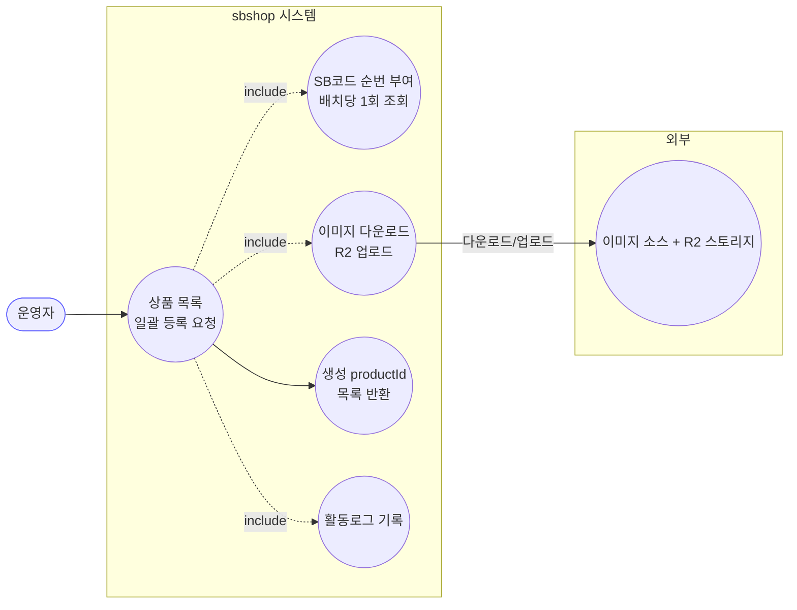
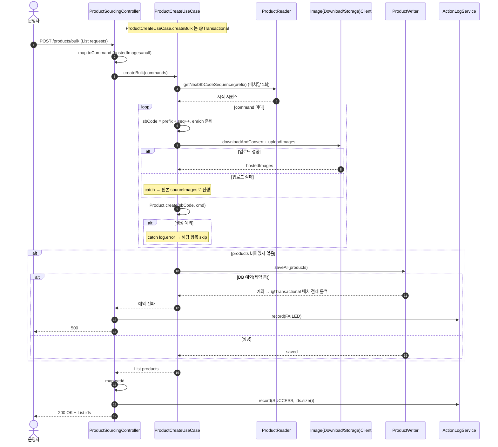
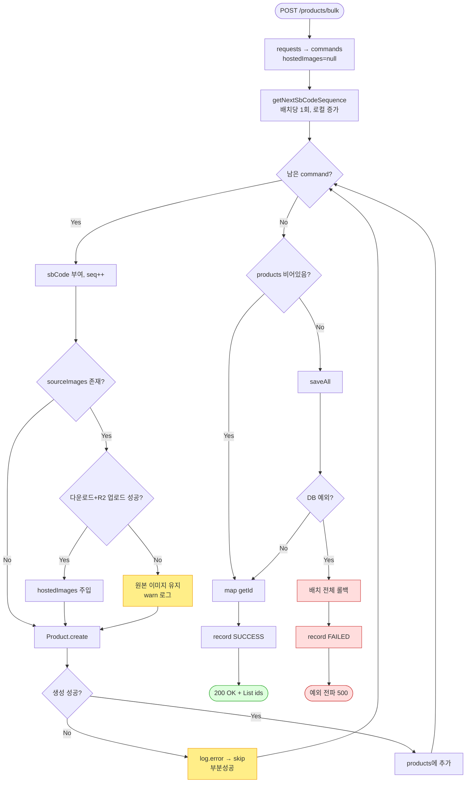

# POST /products/bulk — 상품 대량(일괄) 등록

## 1. 개요

| 항목 | 내용 |
|------|------|
| **Method / URL** | `POST /api/v1/products/bulk` |
| **목적** | 소싱된 상품정보 목록을 자사 DB에 **일괄 생성**하고, 생성된 `productId` 목록을 반환한다(후속 마켓등록 연결용). 항목별 SB코드(`{yyMMdd}IHB{seq}`)를 순번 부여한다. |
| **핵심 상태전이** | (신규 생성) → 영속 `Product` 다수. 개별 실패는 **건너뛰고 계속**(부분성공) |
| **부수효과** | **이미지 다운로드+R2 업로드**(항목별, 실패 시 원본 이미지로 진행) · DB `saveAll` · 활동로그 SUCCESS/FAILED |
| **응답** | `200 OK` + `List<Long>`(성공 생성된 productId 목록) |

## 2. 호출 체인

```
ProductSourcingController.saveProductsBulk()             api/.../controller/ProductSourcingController.java:60-79
  ├─ requests.stream().map(ProductSaveRequest::toCommand) api/.../ProductSourcingController.java:63-65
  │    └─ ProductSaveRequest.toCommand()                 api/.../dto/product/ProductSaveRequest.java:27-32  (hostedImages=null로 생성)
  └─ ProductCreateUseCase.createBulk(commands)           core/.../application/product/ProductCreateUseCase.java:30-60  @Transactional
       ├─ productReader.getNextSbCodeSequence(prefix)    core/.../component/ProductReader.java:21
       │    └─ ProductReaderImpl.getNextSbCodeSequence() infrastructure/.../product/ProductReaderImpl.java:51-60  (max+1, 배치당 1회)
       ├─ (command 반복) enrichWithHostedImages(command) core/.../ProductCreateUseCase.java:62-81
       │    ├─ imageDownloadClient.downloadAndConvert()  (외부: 소스이미지 다운로드)
       │    └─ imageStorageClient.uploadImages()         (외부: R2 업로드) — 실패 시 catch→원본 진행
       ├─ Product.create(sbCode, enrichedCommand)        core/.../domain/product/Product.java
       │    └─ try/catch: 개별 생성 실패는 log.error 후 skip  core/.../ProductCreateUseCase.java:50-52
       └─ productWriter.saveAll(products)                core/.../component/ProductWriter.java:9  (products 비어있지 않을 때만)
  ├─ .map(Product::getId) → List<Long>                   api/.../ProductSourcingController.java:68-70
  └─ actionLogService.record(PRODUCT_BULK_CREATE, ...)   api/.../ProductSourcingController.java:71-72 / 75-76
```

**요청 바디 (`List<ProductSaveRequest>`)** — 항목당 필드

| 필드 | 타입 | 필수 | 비고 |
|------|------|------|------|
| `sourceUrl` | String | — | 소스 URL |
| `costPrice` | BigDecimal | — | 원가. 검증 없음 |
| `baseName` | String | 사실상 필수 | 생성 실패 시 로그 키로 사용 |
| `originalName` / `brand` / `origin` | String | — | — |
| `weight` / `capacity` | BigDecimal | — | — |
| `measureUnit` | MeasureUnit(enum) | — | — |
| `sourceImages` | List<String> | — | R2 업로드 대상. `toCommand`에서 `hostedImages`는 항상 null로 시작 |
| `rawSourceHtml` / `rawCategory` | String | — | — |
| `isAvailable` | boolean | — | — |
| `bundleQuantity` | Integer | — | — |
| `marginRate` | BigDecimal | — | — |
| `vendor` | VendorType(enum) | — | — |

> **트랜잭션 경계:** `createBulk` 전체가 단일 `@Transactional`(`ProductCreateUseCase.java:30`). 개별 항목 생성 실패는 예외를 삼켜(50-52) 롤백을 유발하지 않으나, `saveAll`에서 제약 위반 등 예외가 나면 **배치 전체 롤백**. 이미지 업로드는 트랜잭션 안에서 수행되는 외부 I/O(F-PSRC-8).

## 3. 유스케이스 다이어그램



## 4. 시퀀스 다이어그램



## 5. 순서도 (플로우차트)



## 6. 상태 전이표

| 진입 상황 | 허용? | 결과 | 부수효과 | 비고 |
|-----------|:-----:|------|----------|------|
| 정상 목록 전건 성공 | ✅ | 200 + 전체 id | 이미지 업로드·saveAll | — |
| 일부 항목 생성 실패 | ✅(부분성공) | 200 + 성공분 id만 | 실패분은 로그만 | 어느 항목이 실패했는지 응답에 없음 (F-PSRC-6) |
| 일부 이미지 업로드 실패 | ✅ | 200 + id | 원본 이미지로 저장 | warn 로그만 (F-PSRC-8과 연관) |
| 전 항목 생성 실패 | ✅ | 200 + `[]` | saveAll 미호출 | 성공처럼 보이나 0건 (F-PSRC-6) |
| `requests` = `null` | ❌ | 500 | — | `requests.stream()` NPE (F-PSRC-7) |
| `saveAll` DB 예외 | ❌ | 500 | **배치 전체 롤백** | 이미 업로드된 R2 이미지는 롤백 안 됨(고아) (F-PSRC-8) |

## 7. 🔎 발견사항

### F-PSRC-6 · 🟠 GAP — 부분 실패 항목이 응답에 반영되지 않음 (부분성공 리포팅 부재)
- **근거:** `ProductCreateUseCase.createBulk`의 항목 루프는 생성 실패 시 `catch (Exception e) { log.error(...) }`(`ProductCreateUseCase.java:50-52`)로 삼키고 계속한다. 반환은 성공한 `products`만. 컨트롤러는 `ids.size()`만 SUCCESS 로그(`ProductSourcingController.java:72`)에 남긴다.
- **영향:** 100건 요청 중 10건이 실패해도 API는 200 + 90개 id를 반환. 호출자는 어떤 요청이 왜 누락됐는지 알 수 없고, 요청 순서와 반환 id의 대응도 보장되지 않는다(실패분만큼 밀림). 전건 실패도 200 + `[]`.
- **영향(SB코드 시퀀스):** 실패 항목에도 `seq++`가 이미 소비되어(`ProductCreateUseCase.java:42-43`) SB코드 순번에 **구멍**이 생긴다(예: IHB006 성공, IHB007 생성실패로 누락, IHB008 성공 → 007 결번). 데이터 정합상 치명적이진 않으나 순번 연속성 가정을 깬다.
- **제안:** 요청↔결과 매핑이 드러나는 결과 DTO(예: `{index, productId?, status, reason}`) 반환. 또는 최소한 요청건수 대비 성공건수 불일치를 응답에 노출.

### F-PSRC-7 · 🟠 GAP — `requests == null` 요청 시 컨트롤러 진입부에서 NPE
- **근거:** `saveProductsBulk`는 `requests.stream().map(...)`(`ProductSourcingController.java:63`)을 곧바로 호출. `requests`가 `null`이면 이 지점에서 `NullPointerException`. 이 예외는 try 블록(67) **밖**에서 발생하므로 FAILED 활동로그조차 남지 않는다.
- **영향:** 잘못된 요청이 400이 아닌 500. sourcing/iherb(F-PSRC-1)와 달리 활동로그 FAILED도 누락되어 사후 추적성이 더 낮다.
- **제안:** 컨트롤러/UseCase에서 `null`·빈 리스트 명시 검증(400). 최소한 stream 호출을 try 안으로 이동.

### F-PSRC-8 · 🟠 GAP — 이미지 다운로드·R2 업로드를 트랜잭션 안에서 수행 → 장시간 트랜잭션·고아 이미지
- **근거:** `createBulk`는 `@Transactional`(`ProductCreateUseCase.java:30`)이며, 루프 안 `enrichWithHostedImages`(45)가 항목마다 외부 `imageDownloadClient.downloadAndConvert` + `imageStorageClient.uploadImages`(67-68)를 호출한다. 즉 **외부 네트워크 I/O가 DB 트랜잭션 경계 내부**에서 항목 수만큼 순차 실행된다.
- **영향:** ① 항목이 많으면 트랜잭션이 수십 초~분 단위로 열려 DB 커넥션·락을 오래 점유. ② `saveAll`에서 예외로 롤백되면 DB는 되돌아가나 **이미 R2에 업로드된 이미지는 삭제되지 않아 고아 파일**로 남는다.
- **제안:** 이미지 업로드를 트랜잭션 밖(사전 단계)에서 수행하거나, 트랜잭션을 항목 단위로 분리. 롤백 시 업로드 이미지 정리(보상 트랜잭션) 검토.

### F-PSRC-9 · 🟡 SMELL — SB코드 순번 로컬 증가가 배치 실패/재시도 시 시퀀스 소비를 되돌리지 않음
- **근거:** `getNextSbCodeSequence`(`ProductReaderImpl.java:51-60`)는 DB의 max SB코드+1을 반환하고, `createBulk`는 이후 `seq`를 **메모리에서만** 증가(`ProductCreateUseCase.java:42-43`). 부분 실패(F-PSRC-6)나 배치 롤백(F-PSRC-8) 시 소비된 seq가 되돌아가지 않는다.
- **영향:** 결번 발생(F-PSRC-6). 롤백 시엔 저장이 안 되므로 다음 배치가 같은 시작점을 다시 잡아 큰 문제는 아니나, 부분 성공 시엔 실제 결번이 남는다. 또한 동시 배치 실행 시 `max+1`이 DB advisory lock 없이 계산되어 **경합 시 중복 SB코드** 가능성.
- **제안:** SB코드 채번을 DB 시퀀스/원자적 채번으로 이관하거나, 배치 실행에 advisory lock 적용(동시 배치 방지).

### F-PSRC-10 · 🟡 SMELL — 컨트롤러가 core 도메인 타입을 정규화되지 않은 FQCN으로 직접 참조
- **근거:** `ProductSourcingController.java:63`의 `com.sbshop.agent.core.domain.product.dto.ProductCreateCommand`, `69`의 `com.sbshop.agent.core.domain.product.Product`를 import 없이 인라인 FQCN으로 사용.
- **영향:** 가독성 저하이자, API 계층이 core 도메인 엔티티(`Product`)를 직접 다룸(응답은 id만 노출해 유출은 없으나 결합).
- **제안:** import 정리. 도메인 반환을 UseCase 계층에서 id 목록으로 축약해 API가 `Product`를 몰라도 되게 정리 검토.

### F-PSRC-11 · 🔵 NOTE — 입력 검증 부재(costPrice/marginRate 음수·빈 목록·항목 수 상한)
- **근거:** 요청·커맨드·도메인 어디에도 금액 음수/과대, 빈 목록, 배치 크기 상한 검증이 없다. `Product.create` 내부 검증 여부는 별도 확인 필요.
- **영향:** 대량 요청(수천 건)이 단일 트랜잭션+이미지 업로드(F-PSRC-8)와 결합하면 타임아웃·리소스 고갈.
- **제안:** 배치 크기 상한, 금액 `>= 0` 검증 도입.

## 8. 테스트 커버리지 메모

- **존재:**
  - `ProductSourcingBulkTest`(api test) — `saveProductsBulk`가 생성된 id 목록을 반환하는지 검증(정상 경로 1케이스).
  - `ProductCreateBulkSbCodeTest`(core test) — `getNextSbCodeSequence` 배치당 1회 호출 + SB코드 연속 부여 검증.
  - `ProductCreateUseCaseTest`(core test) — 별도 확인 대상.
- **비어있는 케이스:**
  - 부분 실패 시 성공분만 반환·결번 발생(F-PSRC-6) — 미검증.
  - `requests == null` NPE·FAILED 로그 누락(F-PSRC-7) — 미검증.
  - 이미지 업로드 실패 시 원본 진행(F-PSRC-8 부분) — 미검증(정상 경로만 확인 필요).
  - `saveAll` 예외 시 배치 롤백 계약 — 미검증.
- 정책 확정(F-PSRC-6 결과 스키마, F-PSRC-7 검증 응답) 후 Red 테스트 추가 권장.

---
*생성: 2026-07-14 · 근거 커밋: main@bd4c915*
