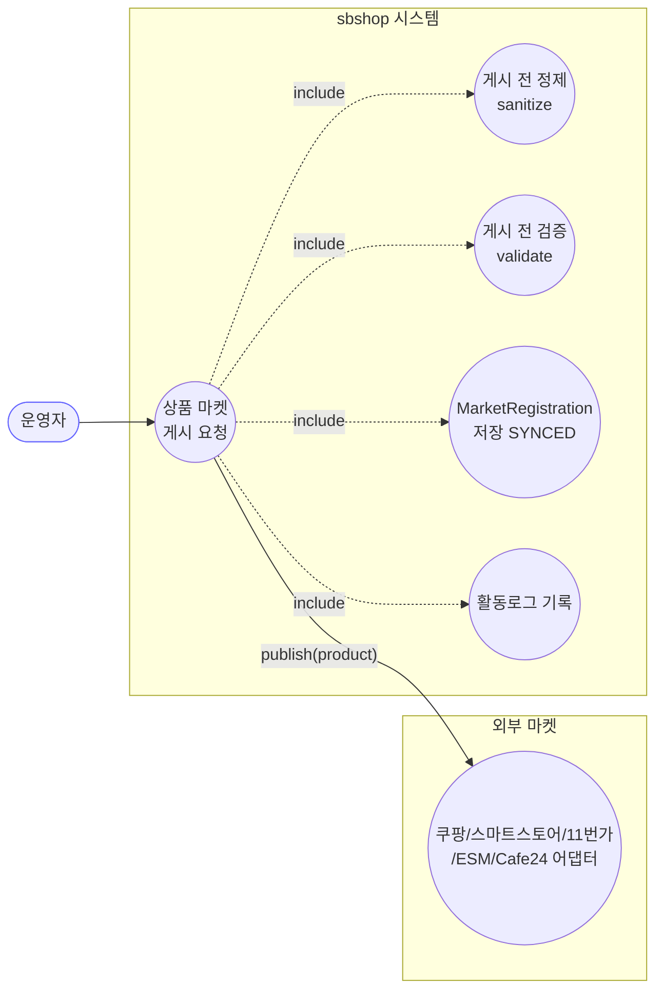
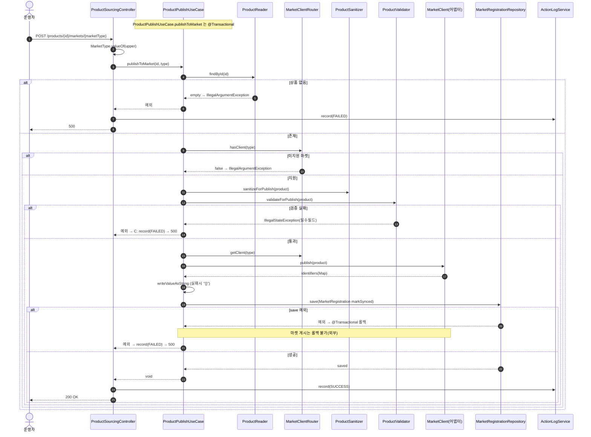
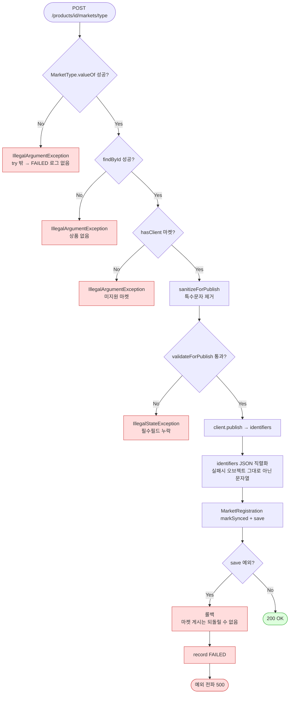

# POST /products/{id}/markets/{marketType} — 상품 마켓 게시(등록)

## 1. 개요

| 항목 | 내용 |
|------|------|
| **Method / URL** | `POST /api/v1/products/{id}/markets/{marketType}` |
| **목적** | 자사에 등록된 상품(`id`)을 지정 마켓(`marketType`: COUPANG/SMARTSTORE/…)에 **게시(등록)**하고, 반환된 마켓 식별자를 `MarketRegistration`으로 저장한다. |
| **핵심 상태전이** | `Product`(기존) → 마켓 게시 성공 시 `MarketRegistration`(SYNCED) 신규 생성 |
| **부수효과** | **마켓 어댑터 `publish()` 외부 호출** · `MarketRegistration` 저장 · 활동로그 SUCCESS/FAILED |
| **응답** | `200 OK` (본문 없음, `Void`) |

## 2. 호출 체인

```
ProductSourcingController.publishToMarket()             api/.../controller/ProductSourcingController.java:81-99
  ├─ MarketType.valueOf(marketType.toUpperCase())       api/.../ProductSourcingController.java:87  (검증 밖 — F-PSRC-12)
  └─ ProductPublishUseCase.publishToMarket(id, type)    core/.../application/product/ProductPublishUseCase.java:31-65  @Transactional
       ├─ productReader.findById(id)                     core/.../component/ProductReader.java:11
       │    └─ orElseThrow(IllegalArgumentException)     core/.../ProductPublishUseCase.java:33-34
       ├─ marketClientRouter.hasClient(marketType)       core/.../market/client/MarketClientRouter.java:27-29
       │    └─ 없으면 IllegalArgumentException           core/.../ProductPublishUseCase.java:36-38
       ├─ productSanitizer.sanitizeForPublish(product)   core/.../component/ProductSanitizer.java:9-29  (상품명/브랜드 특수문자 제거)
       ├─ productValidator.validateForPublish(product)   core/.../component/ProductValidator.java:11-40  (필수필드 검증→IllegalStateException)
       ├─ marketClientRouter.getClient(marketType)       core/.../market/client/MarketClientRouter.java:19-25
       ├─ client.publish(product)                        core/.../market/client/MarketClient.java:13  (마켓 어댑터 외부 호출)
       ├─ objectMapper.writeValueAsString(identifiers)   core/.../ProductPublishUseCase.java:47-51  (실패 시 "{}")
       ├─ MarketRegistration.builder()...markSynced()    core/.../ProductPublishUseCase.java:53-61 / domain/market/MarketRegistration.java:91
       └─ marketRegistrationRepository.save(registration) core/.../ProductPublishUseCase.java:62
  └─ actionLogService.record(PRODUCT_PUBLISH, type, ...) api/.../ProductSourcingController.java:91-92 / 95-96
```

**경로/입력 파라미터**

| 파라미터 | 타입 | 필수 | 비고 |
|----------|------|------|------|
| `id` | Long (path) | ✅ | 상품 ID. 없으면 `IllegalArgumentException` |
| `marketType` | String (path) | ✅ | `MarketType.valueOf(toUpperCase())` — 무효 값이면 try 밖에서 `IllegalArgumentException` (F-PSRC-12) |

> **트랜잭션 경계:** `publishToMarket` 전체가 단일 `@Transactional`(`ProductPublishUseCase.java:31`). 마켓 어댑터 `publish()` 성공 후 `MarketRegistration` 저장까지가 한 트랜잭션. `save` 이후 예외 시 저장은 롤백되나 **마켓에 이미 게시된 상품은 롤백 불가**(F-PSRC-14).

## 3. 유스케이스 다이어그램



## 4. 시퀀스 다이어그램



## 5. 순서도 (플로우차트)



## 6. 상태 전이표

| 진입 상황 | 허용? | 결과 | 부수효과 | 비고 |
|-----------|:-----:|------|----------|------|
| 정상(상품 존재·검증 통과·마켓 지원) | ✅ | 200 | `publish` + `MarketRegistration` SYNCED 저장 | 정상 경로 |
| `marketType` 무효 문자열 | ❌ | 500 | **활동로그 없음** | try 밖 valueOf NPE/IAE (F-PSRC-12) |
| 상품 미존재 | ❌ | 500 | FAILED 로그 | `IllegalArgumentException` |
| 미지원 마켓(enum이나 어댑터 없음) | ❌ | 500 | FAILED 로그 | `hasClient` false |
| 필수필드 검증 실패 | ❌ | 500 | FAILED 로그 | `IllegalStateException` |
| `publish` 성공 후 `save` 실패 | ❌ | 500 | **마켓 게시됨·DB 롤백** | 마켓/DB 불일치(고아 등록) (F-PSRC-14) |
| 이미 등록된 상품 재게시 | ✅(중복 저장) | 200 | 중복 `MarketRegistration` 생성 | 멱등성 없음 (F-PSRC-13) |

## 7. 🔎 발견사항

### F-PSRC-12 · 🟠 GAP — `MarketType.valueOf`가 try 밖에 있어 무효 marketType이 FAILED 로그 없이 500
- **근거:** `ProductSourcingController.java:87`의 `MarketType type = MarketType.valueOf(marketType.toUpperCase());`가 try 블록(89) **밖**에서 실행된다. 무효 문자열이면 `IllegalArgumentException`, `marketType == null`이면 `toUpperCase()` NPE. 둘 다 catch(94)에 잡히지 않아 활동로그가 남지 않는다.
- **영향:** 잘못된 경로변수가 400이 아닌 500. 게다가 sourcing/bulk와 달리 실패 활동로그조차 없어 추적성 저하.
- **제안:** `valueOf`를 try 안으로 이동하거나 사전 검증(허용 marketType 화이트리스트 → 400). NPE 방지 위해 `marketType` null/blank 검증.

### F-PSRC-13 · 🟠 GAP — 게시 멱등성 부재 — 재호출 시 `MarketRegistration` 중복 생성
- **근거:** `ProductPublishUseCase.publishToMarket`는 기존 등록 존재 여부를 확인하지 않고 항상 `MarketRegistration.builder()...`로 신규 레코드를 만들어 `save`(`ProductPublishUseCase.java:53-62`)한다. 같은 `(productId, marketType)`로 재호출하면 마켓 `publish`가 재실행되고 등록 레코드가 중복 적재된다.
- **영향:** 운영자가 실수로/재시도로 같은 상품을 두 번 게시하면 마켓에 중복 등록되거나 중복 `MarketRegistration`이 생겨 조회·집계가 왜곡된다.
- **제안:** `(productId, marketType)` 유니크 제약 또는 게시 전 기존 등록 조회 → 있으면 갱신(update) 경로로 분기. 마켓 어댑터가 재게시를 어떻게 처리하는지도 확인 필요.

### F-PSRC-14 · 🔴 BUG(후보) — 마켓 `publish` 성공 후 DB `save` 실패 시 마켓/DB 불일치(외부 게시는 롤백 불가)
- **근거:** `@Transactional`(`ProductPublishUseCase.java:31`) 안에서 외부 `client.publish(product)`(44)가 먼저 실행되고, 그 뒤 `marketRegistrationRepository.save`(62)가 온다. `save` 단계에서 예외(제약 위반·DB 장애)가 나면 트랜잭션은 롤백되지만 **마켓에는 이미 상품이 게시된 상태**로 남는다.
- **영향:** 자사 DB엔 `MarketRegistration`이 없는데 마켓엔 상품이 올라간 **불일치(고아 게시)**. 이후 재시도하면 F-PSRC-13와 결합해 마켓 중복 게시. 마켓 식별자(`identifiers`)도 유실되어 사후 매핑 불가.
- **제안:** 외부 호출(비가역)과 DB 커밋 순서·경계 재설계. 게시 결과를 먼저 안전히 기록(예: PENDING 저장 → publish → SYNCED 마킹)하는 2단계, 또는 publish를 트랜잭션 커밋 직전/후 이벤트로 분리. 실패 시 마켓 식별자 로깅으로 수동 복구 가능하게.

### F-PSRC-15 · 🟡 SMELL — 마켓 미지원 검증이 `hasClient`(38)와 `getClient`(43·router 내부)에서 이중
- **근거:** `ProductPublishUseCase.java:36-38`이 `hasClient` false 시 `IllegalArgumentException`을 던지고, 이후 `getClient`(43) 내부(`MarketClientRouter.java:19-25`)도 동일 예외를 던진다. 같은 조건을 두 곳에서 검사.
- **영향:** 기능상 무해하나 중복. sanitize/validate 사이에 게시 불가 마켓을 걸러야 하는 순서 제약이 있다면 `getClient`를 앞으로 당겨 한 곳으로 통합 가능.
- **제안:** `getClient`가 이미 미지원 시 예외를 던지므로 선행 `hasClient` 가드를 제거하거나, 반대로 라우터를 예외 없는 조회로 단일화.

### F-PSRC-16 · 🔵 NOTE — `identifiers` JSON 직렬화 실패를 `"{}"`로 삼켜 마켓 식별자 유실
- **근거:** `ProductPublishUseCase.java:47-51`은 `writeValueAsString` 실패 시 `identifiersJson = "{}"`로 대체하고 그대로 저장을 진행한다.
- **영향:** 드문 경우지만 마켓이 반환한 식별자를 잃은 채 SYNCED로 저장되어, 이후 마켓 상품과의 매핑이 불가능해진다.
- **제안:** 직렬화 실패는 예외로 승격하거나(게시 무효화), 최소한 원본 `identifiers`를 로그로 남겨 복구 가능하게.

### F-PSRC-17 · 🔵 NOTE — `MarketRegistration`의 `productId`와 `sbProductId`에 동일 값 주입
- **근거:** `ProductPublishUseCase.java:54-55`가 `.productId(productId).sbProductId(productId)`로 같은 값을 넣는다. `marketDetailedInfo`도 `"{}"` 고정.
- **영향:** 두 필드가 의미상 구분되는데 항상 동일해, `sbProductId`가 의도한 별도 식별자라면 설계 의도와 불일치 가능. 문서화 필요.
- **제안:** 두 필드의 의미 차이를 확인해 올바른 값 주입 또는 필드 통합.

## 8. 테스트 커버리지 메모

- **존재:** `ProductSourcingBulkTest`(api test)는 이 컨트롤러를 다루나 `publishToMarket`은 검증하지 않는다. `ProductManageRepublishMarketCodeTest`(core test)가 재게시/마켓코드 관련을 다루는지 별도 확인 대상.
- **비어있는 케이스:**
  - `marketType` 무효값·null → FAILED 로그 없이 500(F-PSRC-12) — 미검증.
  - 재게시 멱등성/중복 등록(F-PSRC-13) — 미검증.
  - `publish` 성공 후 `save` 실패 시 마켓/DB 불일치(F-PSRC-14) — 미검증.
  - 상품 미존재·미지원 마켓·검증 실패 각 예외 경로 — 미검증(정상 경로도 미확인).
- 정책 확정(F-PSRC-14 게시-저장 순서, F-PSRC-13 멱등성) 후 Red 테스트 추가 권장. F-PSRC-14는 결함 원장 등재 검토 대상.

---
*생성: 2026-07-14 · 근거 커밋: main@bd4c915*
