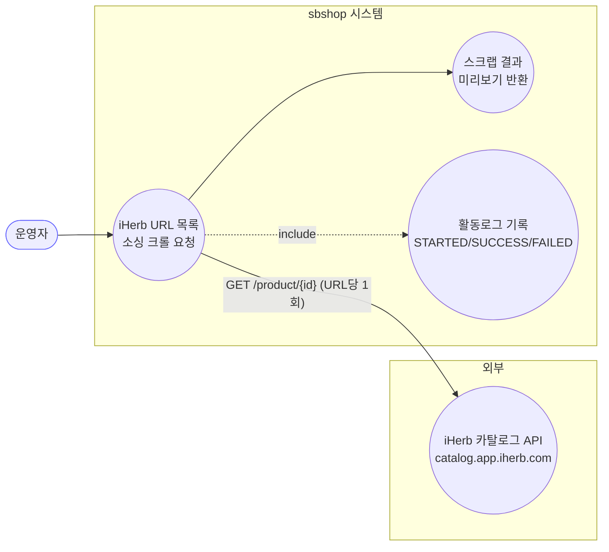
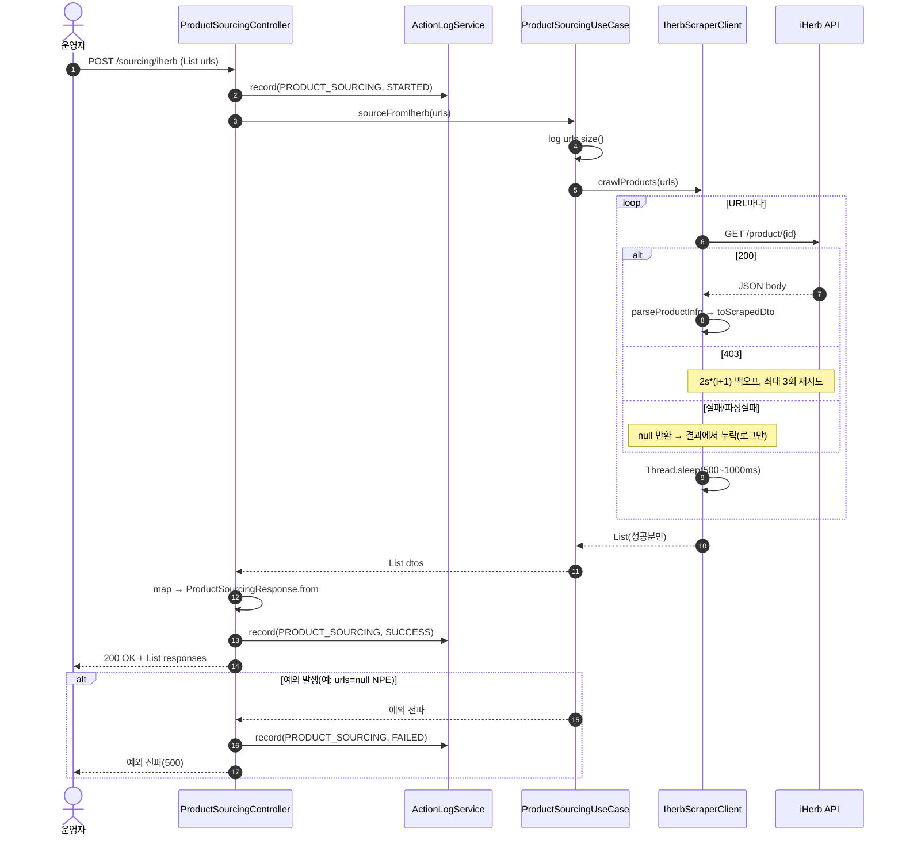
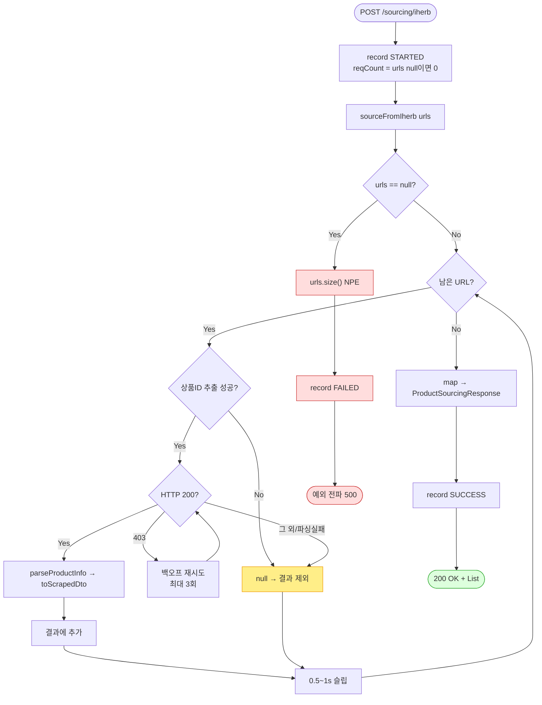

# POST /sourcing/iherb — iHerb 상품 소싱(크롤)

> **[C 반영 2026-07-15]** F-PSRC-2 해결 — 실패 URL·사유를 SourcingCrawlResult로 표면화 (커밋 `139a581`).

## 1. 개요

| 항목 | 내용 |
|------|------|
| **Method / URL** | `POST /api/v1/sourcing/iherb` |
| **목적** | iHerb 상품 URL 목록을 받아 카탈로그 API를 크롤링하고, 스크랩된 상품정보(가격·이미지·용량 등)를 미리보기 형태로 반환한다. **저장하지 않는다**(순수 조회·크롤). |
| **핵심 상태전이** | 없음 — DB 영속 없음. 크롤 결과를 응답 DTO로 변환만 함 |
| **부수효과** | **외부 HTTP 호출**(iHerb `catalog.app.iherb.com`) · 활동로그 STARTED/SUCCESS/FAILED 기록 |
| **응답** | `200 OK` + `List<ProductSourcingResponse>` (크롤 성공분만, 실패 URL은 조용히 누락) |

## 2. 호출 체인

```
ProductSourcingController.sourceFromIherb()             api/.../controller/ProductSourcingController.java:38-58
  ├─ actionLogService.record(PRODUCT_SOURCING, STARTED) api/.../ProductSourcingController.java:43-44
  └─ ProductSourcingUseCase.sourceFromIherb(urls)       core/.../application/sourcing/ProductSourcingUseCase.java:17-20
       └─ ProductInfoCrawlerPort.crawlProducts(urls)    core/.../application/product/port/ProductInfoCrawlerPort.java:9
            └─ IherbScraperClient.crawlProducts()       infrastructure/.../client/sourcing/IherbScraperClient.java:224-242
                 └─ (URL 반복) crawlProductInfoAsDto()   IherbScraperClient.java:218-222
                      └─ crawlProductInfo(url)           IherbScraperClient.java:183-216  (HTTP GET, 403 재시도 3회)
                           └─ parseProductInfo(body,url) IherbScraperClient.java:268-323  (JSON→IherbProductInfo)
                      └─ toScrapedDto(info)              IherbScraperClient.java:244-265
  ├─ ProductSourcingResponse.from(dto) (stream.map)     api/.../dto/product/ProductSourcingResponse.java:25-40
  └─ actionLogService.record(PRODUCT_SOURCING, SUCCESS) api/.../ProductSourcingController.java:50-51
```

**요청 바디**

| 필드 | 타입 | 필수 | 비고 |
|------|------|------|------|
| (루트) | `List<String>` | 사실상 필수 | iHerb 상품 URL 목록. `null` 허용(F-PSRC-1 참조) — 컨트롤러는 `null`이면 reqCount=0 로그만 남기고 UseCase로 넘겨 `urls.size()` NPE 유발 |

**외부 응답 구조 의존** — iHerb `catalog.app.iherb.com/product/{id}` JSON. 핵심 필드: `productName`·`brandName`·`listPriceAmount`·`discountPriceAmount`·`isAvailableToPurchase`·`partNumber`+`imageIndices`(cloudinary URL 조합)·`servingSize`·`unit`.

## 3. 유스케이스 다이어그램



> **관찰:** 저장이 없어 상태전이 없음. 외부 iHerb API에 **URL 개수만큼 순차 HTTP 호출**(요청 간 0.5~1초 슬립).

## 4. 시퀀스 다이어그램



## 5. 순서도 (플로우차트)



## 6. 상태 전이표

| 진입 상황 | 허용? | 결과 | 부수효과 | 비고 |
|-----------|:-----:|------|----------|------|
| `urls` = 정상 목록 | ✅ | 200 + 성공분 DTO | 외부 HTTP N회 | 실패 URL은 응답에서 조용히 누락 |
| `urls` = 빈 리스트 `[]` | ✅ | 200 + `[]` | 없음 | 크롤 루프 미실행 |
| `urls` = `null` | ❌ | 500 | STARTED만 기록 후 NPE | `UseCase.sourceFromIherb`의 `urls.size()`에서 NPE (F-PSRC-1) |
| 일부 URL 크롤 실패 | ✅(부분성공) | 200 + 성공분만 | — | 어느 URL이 실패했는지 응답으로 알 수 없음 (F-PSRC-2) |
| 전 URL 크롤 실패 | ✅ | 200 + `[]` | — | 성공처럼 보이나 결과 0건 |

## 7. 🔎 발견사항

### F-PSRC-1 · 🟠 GAP — `urls == null` 요청 시 STARTED 로그만 남기고 UseCase에서 NPE
- **근거:** 컨트롤러는 `int reqCount = urls != null ? urls.size() : 0`(`ProductSourcingController.java:42`)로 null을 방어하지만, 그대로 `productSourcingUseCase.sourceFromIherb(urls)`(46)에 넘긴다. `ProductSourcingUseCase.java:18`의 `log.info("iHerb 소싱 시작: {}개 URL", urls.size())`가 무방비로 `urls.size()`를 호출 → `NullPointerException`.
- **영향:** 잘못된 요청(`null` 바디)이 400이 아니라 500으로 반환된다. catch로 넘어가 FAILED 로그는 남지만 사용자에겐 서버 오류로 보인다.
- **제안:** 컨트롤러 진입부 또는 UseCase에서 `null`/빈 리스트를 명시 검증(400 응답) 하거나, UseCase에서 `urls == null` 시 빈 리스트로 정규화.

### F-PSRC-2 · 🟠 GAP — 부분 실패 URL이 응답에서 조용히 누락 (실패 리포팅 부재)
- **근거:** `IherbScraperClient.crawlProducts()`(224-242)는 `crawlProductInfoAsDto`가 `null`을 반환하면(ID 추출 실패·비200·파싱 실패) 결과에 넣지 않고 `log.error`만 남긴다. 컨트롤러는 성공분 개수만 SUCCESS 로그(`ProductSourcingController.java:51`)에 남긴다.
- **영향:** 5개 요청 중 2개만 성공해도 API는 200 + 2건을 반환. 호출자(프론트)는 어떤 URL이 왜 실패했는지 알 수 없어 재시도 대상 식별 불가. 전건 실패도 200 + `[]`로 성공처럼 보인다.
- **제안:** URL별 성공/실패 상태를 포함하는 결과 DTO(예: `{url, status, reason}`) 도입, 또는 최소한 요청건수 대비 성공건수 불일치를 응답/로그에 노출.

### F-PSRC-3 · 🟡 SMELL — 대량 URL 소싱이 순차·블로킹이라 장시간 요청이 스레드를 점유
- **근거:** `crawlProducts`(227-240)는 URL을 순차 반복하며 각 요청 사이 `Thread.sleep(500~1000ms)`(233), 403 시 최대 `2s+4s+6s` 백오프(`IherbScraperClient.java:208`). 이 전체가 **동기 HTTP 요청 스레드에서** 실행된다(주석 "장시간" — `ProductSourcingController.java:41`).
- **영향:** URL 50개면 최소 25~50초 + 크롤 시간 동안 톰캣 워커 스레드 1개가 묶인다. 동시 다발 요청 시 스레드 풀 고갈·클라이언트 타임아웃 위험.
- **제안:** 비동기 잡(작업ID 반환 후 폴링) 또는 배치 파이프라인으로 전환 검토. 최소한 요청당 URL 개수 상한 설정.

### F-PSRC-4 · 🔵 NOTE — `ProductInfoCrawlerPort`가 iHerb 단일 구현에 종속(추상화 무효)
- **근거:** 포트명은 범용(`ProductInfoCrawlerPort`)이나 컨트롤러 경로·활동로그·UseCase 메서드명 모두 `iherb`/`Iherb`로 고정(`sourceFromIherb`, `IherbScraperClient` 유일 구현). `toScrapedDto`는 `vendor(VendorType.IHB)` 하드코딩(`IherbScraperClient.java:263`).
- **영향:** 다른 소싱처 확장 시 포트/UseCase/컨트롤러 3계층을 모두 손봐야 함. 현재 추상화는 이름값만 함.
- **제안:** iHerb 전용임을 명시하거나, 실제로 다처 소싱 계획이 있으면 vendor를 인자화하고 라우팅 계층 도입.

### F-PSRC-5 · 🔵 NOTE — 입력 검증 전무(URL 형식·개수·중복)
- **근거:** 컨트롤러·UseCase 어디에도 URL 형식 검증 없음. 잘못된 URL은 `extractProductId`가 `null` → 조용히 누락(F-PSRC-2와 결합). 동일 URL 중복 제출 시 중복 크롤·중복 결과.
- **영향:** 무효/중복 URL이 외부 API 호출 낭비·잡음 결과를 만든다.
- **제안:** 요청 단계에서 iHerb URL 패턴 검증·중복 제거. 무효 URL은 즉시 사유와 함께 반려.

## 8. 테스트 커버리지 메모

- **존재:** `ProductSourcingBulkTest`(api test)는 이 컨트롤러를 다루나 **`saveProductsBulk`만** 검증하며, `sourceFromIherb`는 검증하지 않는다.
- **비어있는 케이스:**
  - `urls == null` NPE 경로(F-PSRC-1) — 미검증.
  - 부분 실패 시 성공분만 반환/리포팅 부재(F-PSRC-2) — 미검증.
  - `IherbScraperClient.parseProductInfo`는 package-private로 테스트 가능하게 열려 있으나, 크롤 파서 단위 테스트 존재 여부는 별도 확인 필요.
- 정책 확정(F-PSRC-1 검증 응답, F-PSRC-2 결과 스키마) 후 Red 테스트 추가 권장.

---
*생성: 2026-07-14 · 근거 커밋: main@bd4c915*
