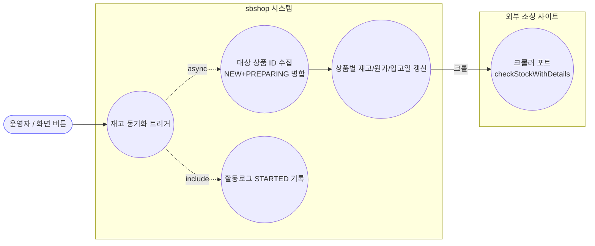
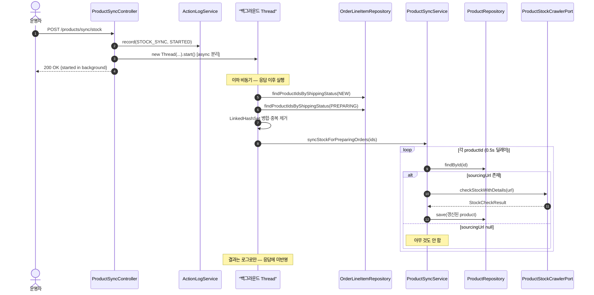
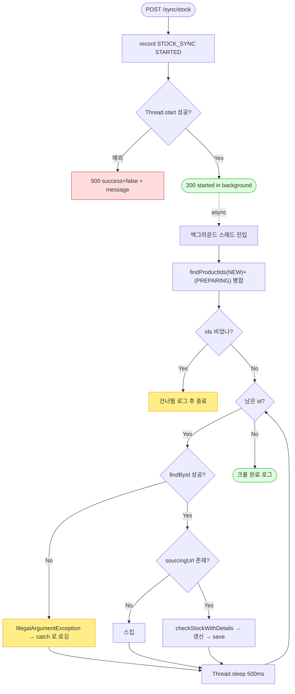

# POST /api/v1/products/sync/stock — 재고 동기화(백그라운드 크롤) 트리거

> **[P4b 반영 2026-07-15]** F-MISC-8·9·10 해결 — 원시 new Thread → 관리 @Async(syncTaskExecutor)+ActionLog 실패기록, 대상선정 서비스 이동, 응답 메시지 정정 (커밋 `bbf0e1c`).

## 1. 개요

| 항목 | 내용 |
|------|------|
| **Method / URL** | `POST /api/v1/products/sync/stock` |
| **목적** | `NEW(결제완료)`·`PREPARING(배송준비)` 상태 주문에 걸린 상품들만 대상으로 소싱 URL 재고/원가/입고예정일을 크롤링해 갱신한다. 응답 지연을 막기 위해 **새 스레드에서 비동기 실행**하고 즉시 202-성격의 200을 반환한다. (D-076) |
| **핵심 상태전이** | 상품 엔티티의 `stockStatus`·`costPrice`·`sourcingStock`·`restockDate` 갱신(주문 상태전이는 아님). |
| **부수효과** | ① 액션 로그 `STOCK_SYNC/STARTED` 기록(동기), ② **외부 소싱 사이트 크롤링**(비동기 스레드, 상품당 0.5s 딜레이), ③ 상품 DB 저장. |
| **응답** | `200 OK` + `{success:true, message:"...started in background"}` (작업 완료가 아니라 **시작** 확인) |

## 2. 호출 체인

```
ProductSyncController.syncAllProductStock()       api/.../controller/ProductSyncController.java:33-63
  ├─ actionLogService.record(STOCK_SYNC, null, STARTED, "재고 동기화 요청")   ProductSyncController.java:36-37  (동기, 응답 前)
  └─ new Thread( 람다 ).start()                    ProductSyncController.java:40-53  (★ 비동기 — 응답과 분리)
       ├─ orderLineItemRepository.findProductIdsByShippingStatus(NEW)        ProductSyncController.java:42-43
       │      └─ infra/.../OrderLineItemRepositoryImpl.findProductIdsByShippingStatus  :23-31 (QueryDSL distinct join)
       ├─ orderLineItemRepository.findProductIdsByShippingStatus(PREPARING)  ProductSyncController.java:44-45
       ├─ LinkedHashSet 병합·중복 제거              ProductSyncController.java:48-49
       └─ productSyncService.syncStockForPreparingOrders(mergedIds)          core/.../application/product/ProductSyncService.java:67-93
            └─ for each id: syncProductStock(id) + Thread.sleep(500)          ProductSyncService.java:77-82
                 └─ syncProductStock(productId)     ProductSyncService.java:23-65  (@Transactional)
                      ├─ productRepository.findById  :26  (없으면 IllegalArgumentException)
                      ├─ product.getSourcingUrl() != null 가드  :30
                      ├─ productStockCrawlerPort.checkStockWithDetails(url)   :34-35  (외부 크롤 포트)
                      ├─ updateStockStatus / updateCostPrice / updateSourcingStock  :38-44
                      ├─ restockDate 조건부 갱신(D-065 null 소거 방어)  :50-52
                      └─ productRepository.save(product)  :55
  └─ return 200 {success:true, "...started in background"}   ProductSyncController.java:56-57
```

> **응답과 크롤 작업의 경계:** 컨트롤러는 스레드 `start()` 성공만 확인하고 즉시 반환한다. 실제 크롤 성공/실패는 응답에 반영되지 않으며 로그로만 남는다.

## 3. 유스케이스 다이어그램



## 4. 시퀀스 다이어그램



## 5. 순서도 (플로우차트)



## 6. 상태 전이표

주문 상태전이가 아니라 **상품 필드 갱신 규칙**이 핵심.

| 크롤 결과 | `stockStatus` | `costPrice`/`sourcingStock` | `restockDate` | 근거 |
|-----------|---------------|-----------------------------|---------------|------|
| 정상 응답 | `result.status()` 반영 | 반영 | `IN_STOCK` 이거나 `restockDate != null` 일 때만 갱신 | `ProductSyncService.java:50-52` (D-065) |
| `restockDate == null` & `OUT_OF_STOCK` 유지 | 반영 | 반영 | **기존값 유지**(파싱 실패 방어) | `ProductSyncService.java:50` |
| `sourcingUrl == null` | 변경 없음 | 변경 없음 | 변경 없음 | `ProductSyncService.java:30` 가드 |
| 크롤 예외 | 변경 없음 | 변경 없음 | 변경 없음 | `ProductSyncService.java:60-63` try/catch → 로깅만 |

## 7. 🔎 발견사항

### F-MISC-7 · 🟠 GAP — `/internal` 아닌 공개 POST 인데 인증·중복실행 방지·동시성 제어 부재
- **근거:** `ProductSyncController.java:33` `POST /api/v1/products/sync/stock` 은 nginx 노출 API(`@CrossOrigin("*")`, `:25`)이며 인증 검사가 없다. 매 호출마다 `new Thread(...).start()`(`:40`)로 무제한 스레드 생성 — 재진입/중복 클릭 가드 없음.
- **영향:** 버튼 연타·외부 호출로 동일 크롤이 병렬 다중 실행되면 대상 소싱 사이트에 **rate-limit/IP 차단**(코드 주석이 우려하는 바로 그 위험)을 유발할 수 있고, 스레드 누수 가능. 여러 사용자가 동시에 호출해도 막을 수 없음.
- **제안:** 진행 중 플래그(원장의 advisory lock 패턴) 또는 `@Async` + 단일 실행 가드로 동시 1회만 허용. 인증/권한 필요 여부 정책 확인.

### F-MISC-8 · 🔴 BUG(후보) — 원시 `new Thread` 로 비동기 실행: 트랜잭션·예외·풀 관리 밖으로 이탈
- **근거:** `ProductSyncController.java:40-53`. 스프링 관리 밖의 raw 스레드에서 `@Transactional` 서비스(`syncProductStock`)를 호출한다. 스레드 내 예외는 컨트롤러 `try/catch`(`:58`)가 **절대 못 잡음**(catch는 `start()` 자체 예외만 커버) — 실제 크롤 실패는 서비스 내부 로그로만 흡수됨.
- **영향:** ① 실패가 사용자/응답에 전혀 전달 안 됨(응답은 항상 성공처럼 보임), ② 스레드풀 미사용으로 호출 폭주 시 OOM/스레드 고갈, ③ 배포 재시작 시 진행 중 작업 유실(추적 불가).
- **제안:** `@Async`(전용 Executor) 또는 배치 서비스로 이관하고, 진행 상태를 `SyncStatusService`/배치 요약 API처럼 조회 가능하게. 최소한 스레드명·예외 핸들러 지정.

### F-MISC-9 · 🟡 SMELL — 컨트롤러가 도메인 조회(레포지토리)·대상 선정 로직을 직접 수행
- **근거:** `ProductSyncController.java:29,42-49` — 컨트롤러가 `OrderLineItemRepository` 를 직접 주입받아 NEW/PREPARING ID 수집·중복 제거를 수행. 대상 선정은 서비스 책임인데 컨트롤러에 누출.
- **영향:** 재사용 불가(스케줄러 등 다른 트리거가 같은 로직을 못 씀), 테스트 어려움.
- **제안:** 대상 ID 수집을 `ProductSyncService`(또는 전용 메서드)로 내리고 컨트롤러는 트리거만.

### F-MISC-10 · 🔵 NOTE — 응답 메시지가 실제 대상("PREPARING")과 코드 동작(NEW+PREPARING) 불일치
- **근거:** 응답 message `"Targeted stock sync for PREPARING orders started"`(`ProductSyncController.java:57`)인데 실제 대상은 **NEW ∪ PREPARING**(`:42-45`). 서비스 메서드명도 `syncStockForPreparingOrders`.
- **영향:** 문서·로그와 실동작 괴리로 오해 소지.
- **제안:** 메시지·메서드명을 실제 대상(NEW+PREPARING)에 맞춰 정정.

### F-MISC-11 · 🔵 NOTE — 응답 타입 `ResponseEntity<?>` + `Map.of` 애드혹
- **근거:** `ProductSyncController.java:34,56` — 와일드카드 반환·즉석 Map. 다른 문서화된 API의 DTO 규율과 비대칭.
- **제안:** 명시적 응답 DTO(예: `SyncTriggerResponse{ok,message}`) 도입 검토.

## 8. 테스트 커버리지 메모

- **존재:** `ProductSyncServiceRestockDateTest`(core test) — `restockDate` null 소거 방어(D-065, `ProductSyncService.java:50-52`) 검증.
- **비어있는 케이스:**
  - 컨트롤러의 **대상 ID 병합/중복 제거**(NEW+PREPARING) 로직 미검증.
  - **비동기 실행·예외 전파**(F-MISC-8) 회귀 테스트 없음 — raw 스레드라 테스트도 어려움(리팩터 후 검증 가능).
  - `sourcingUrl == null` 스킵, 빈 id 목록 조기 종료(`ProductSyncService.java:69`) 케이스.

---
*생성: 2026-07-14 · 근거 커밋: main@bd4c915*
