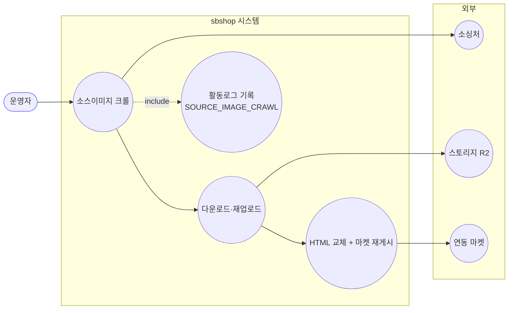
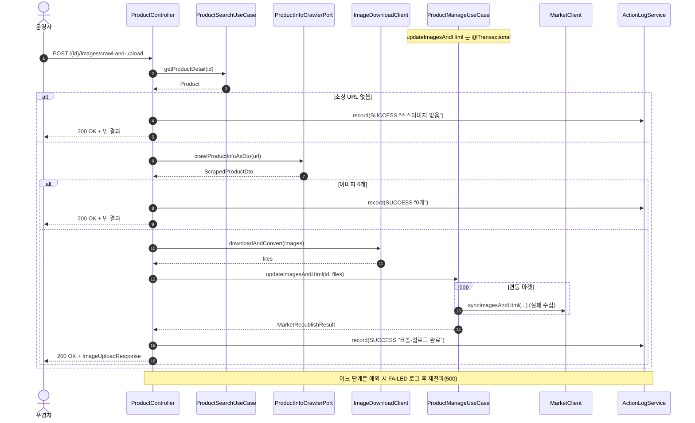
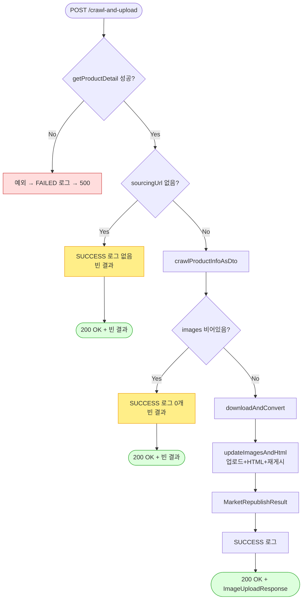

# POST /{id}/images/crawl-and-upload — 소싱 소스이미지 크롤 후 업로드·마켓 재게시

## 1. 개요

| 항목 | 내용 |
|------|------|
| **Method / URL** | `POST /api/v1/products/{id}/images/crawl-and-upload` |
| **목적** | 소싱 URL 을 크롤해 소스이미지 URL 을 수집한 뒤, 이를 다운로드·재업로드하여 자사 스토리지에 저장하고 HTML 교체 + 마켓 재게시까지 한 번에 수행한다. `GET /images/crawl`(수집만)의 쓰기 버전. |
| **핵심 상태전이** | 없음(상품 `hostedImages`·`detailHtml` 갱신) |
| **부수효과** | **외부 크롤(읽기) + 이미지 다운로드/재업로드 + 마켓 재게시** + 활동로그(P6, `SOURCE_IMAGE_CRAWL`) |
| **응답** | `200 OK` + `ImageUploadResponse` |

**경로 파라미터**

| 파라미터 | 타입 | 필수 | 비고 |
|----------|------|------|------|
| `id` | Long | ✅ | 상품 PK. 요청 바디 없음 |

## 2. 호출 체인

```
ProductController.crawlAndUpload()                 api/.../controller/ProductController.java:184-215
  └─ [try]
  │   ├─ ProductSearchUseCase.getProductDetail(id) → Product  ProductController.java:187
  │   ├─ product.getSourcingUrl()                   core/.../domain/product/Product.java:321-323
  │   ├─ [sourcingUrl null/empty] → record(SUCCESS "소스이미지 없음") + 빈 MarketRepublishResult 반환  ProductController.java:189-194
  │   ├─ ProductInfoCrawlerPort.crawlProductInfoAsDto(sourcingUrl) → ScrapedProductDto  ProductController.java:195
  │   ├─ images = null 가드 후 sourceImages  ProductController.java:196-197
  │   ├─ [images 비어있음] → record(SUCCESS "0개") + 빈 결과 반환  ProductController.java:198-203
  │   ├─ ImageDownloadClient.downloadAndConvert(images)  core/.../product/client/ImageDownloadClient.java:12  ProductController.java:204
  │   ├─ ProductManageUseCase.updateImagesAndHtml(id, files)  core/.../product/ProductManageUseCase.java:67-92  @Transactional
  │   │     (findById → uploadImages → replaceImagesBySku → update/save → republishToMarkets)
  │   └─ record(SOURCE_IMAGE_CRAWL, null, SUCCESS, buildMarketResultMessage("...크롤·업로드 완료", result))  ProductController.java:206-208
  └─ [catch] record(..., FAILED, ...); throw  ProductController.java:210-213
       └─ ImageUploadResponse.from(result)          api/.../dto/product/ImageUploadResponse.java:29-37
```

> **경로 합성:** 앞단은 `GET /images/crawl`(소싱URL→크롤→소스이미지 URL)과 동일하고, 뒷단은 `PUT /images/by-url`(downloadAndConvert→updateImagesAndHtml)과 동일한 두 파이프라인의 결합이다.

## 3. 유스케이스 다이어그램



## 4. 시퀀스 다이어그램



## 5. 순서도 (플로우차트)



## 6. 상태 전이표

| 조건 | 자사 저장 | 마켓 전송 | 활동로그 | 응답 |
|------|:---------:|-----------|----------|------|
| 소싱 URL 없음 | ❌ | ❌ | SUCCESS "소스이미지 없음" | 200 + 빈 결과 |
| 크롤 이미지 0개 | ❌ | ❌ | SUCCESS "0개" | 200 + 빈 결과 |
| 정상 | ✅ | 마켓별 synced/skipped/failed | SUCCESS "크롤·업로드 완료" | 200 + ImageUploadResponse |
| 다운/업로드/크롤 예외 | ❌(롤백/전파) | — | FAILED | 500 |

## 7. 🔎 발견사항

### F-PROD-20 · 🟡 SMELL — 세 번째 이미지 등록 경로: crawl 앞단·업로드 뒷단이 모두 중복 결합
> ✅ **해결됨** (커밋 `5549f67`) — 체크리스트 기준.
- **근거:** `ProductController.java:187-197`(크롤 앞단)은 `crawlSourceImages`(163-172)와, `204-209`(다운로드·업로드·응답)는 `uploadImagesByUrl`(143-149)과 각각 중복이다. 이 엔드포인트는 두 기존 경로를 복붙 결합한 형태.
- **영향:** 이미지 파이프라인 정책(빈입력·부분손실·중복URL) 수정 시 최대 3곳 동기화 필요. F-PROD-15(업로드 뒷단 중복)·F-PROD-19(크롤 앞단 중복)의 교집합.
- **제안:** ① "id→소스이미지 URL"(F-PROD-19) + ② "ImageUploadFile→updateImagesAndHtml→로그·응답"(F-PROD-15) 두 공통 메서드로 추출 후 이 엔드포인트가 조합만 하도록.

### F-PROD-21 · 🔵 NOTE — 빈결과(소싱없음/0개)를 `SOURCE_IMAGE_CRAWL` SUCCESS 로 기록하나 상세 액션타입 미구분
> ⬜ **미해결(백로그)**.
- **근거:** `ProductController.java:190-191`·`199-200`·`206` — 소싱없음/0개/실제업로드완료가 모두 동일 `SOURCE_IMAGE_CRAWL` actionType 으로 기록된다(구분은 message 텍스트로만).
- **영향:** 활동로그 필터/집계에서 "실제 업로드"와 "빈결과 no-op"이 같은 타입으로 섞인다.
- **제안:** 현행 유지가 무난하나, 집계 요구 있으면 상태/서브타입 분리 검토.

### F-PROD-22 · 🟠 GAP — 크롤 결과 전량을 무조건 다운로드(선별/개수 상한 없음)
> ⬜ **미해결(백로그)**.
- **근거:** `ProductController.java:196-204` — 크롤된 모든 `sourceImages`를 그대로 `downloadAndConvert`에 넘긴다. 사용자 선별 없이 전량 업로드되며 개수 상한도 없다(`GET /images/crawl`이 미리보기용으로 분리돼 있음에도 이 POST 는 미리보기 결과를 받지 않고 재크롤).
- **영향:** 소싱처가 배너·아이콘 등 부수 이미지를 다수 포함하면 원치 않는 이미지까지 자사/마켓에 반영될 수 있다. 또한 GET 크롤 결과와 POST 재크롤 결과가 시점 차로 달라질 수 있다.
- **제안:** POST 가 선택된 URL 목록을 바디로 받도록 하거나(그러면 `by-url`로 수렴), 개수 상한/필터 정책 확정.

### F-PROD-11 · 🟠 GAP — (참조) 빈 입력 처리
> ✅ **해결됨** (커밋 `c41dee3`) — 체크리스트 기준.
- **근거·제안:** [update-images.md](update-images.md) F-PROD-11. 단, 이 경로는 소싱없음/0개를 명시적 빈결과 200 으로 처리(F-PROD-21)하므로 by-url 대비 방어가 있음.

## 8. 테스트 커버리지 메모

- **존재:** `ProductControllerCrawlUploadTest`(api)
  - `crawlAndUpload_happyPath_callsDownloadAndUpdate`: 정상 경로 — 크롤 URL 을 `downloadAndConvert` 후 `updateImagesAndHtml` 호출.
  - `crawlAndUpload_emptySourceUrl_skipsUpdate`: 소싱 URL 없으면 `updateImagesAndHtml` 미호출, 200.
  - `crawlAndUpload_emptyCrawlImages_skipsUpdate`: 크롤 이미지 0개면 `updateImagesAndHtml` 미호출, 200.
- **비어있는 케이스:**
  - `crawlProductInfoAsDto` null 반환 시 빈 결과(`ProductController.java:196`) → 미검증(0개 케이스와 코드경로 분리).
  - 크롤/다운로드 예외 시 FAILED 로그 재전파 → 미검증.
  - 전량 무선별 업로드 상한(F-PROD-22) → 미검증.

---
*생성: 2026-07-14 · 근거 커밋: main@bd4c915*
